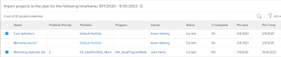

# Importer des projets dans des plans dans le [!DNL Scenario Planner]

Vous pouvez importer des projets existants dans un plan. Les projets importés sont convertis en initiatives et vous pouvez les gérer dans le cadre du plan comme vous le feriez pour gérer une nouvelle initiative. Le projet original reste lié à la nouvelle initiative.

<!--

(NOTE: add information about what happens when you import projects and where the info from projects show up;

- the hours/ FTE come from WorkPerDay

- if a task has a Duration of 0, the FTE should be 0 for that asignee but it should still come across) 

-->

## Conditions d’accès

+++ Développez pour afficher les exigences d’accès aux fonctionnalités de cet article.

<table style="table-layout:auto"> 
 <col> 
 <col> 
 <tbody> 
  <tr> 
   <td> 
[!DNL Adobe Workfront] formule*
 </td> 
   <td> <ul></li>
   <li>
Nouveau : Ultimate 
</li>
   
Le planificateur de scénario n’est pas disponible pour les nouveaux plans Workfront Select ou Workfront Prime. 

   <li>
Actuel : [!UICONTROL Business] ou de niveau supérieur
</ul>
   </td> 
  </tr> 
  <tr> 
   <td> 
[!DNL Adobe Workfront] licence*
 </td> 
   <td> 
Nouveau : Light ou supérieur
 
   
Actuel : [!UICONTROL Révision] ou version ultérieure
 </td> 
  </tr> 
  <tr> 
   <td>Produit* </td> 
   <td> <ul><li>
Pour les nouveaux plans Workfront :

 Adobe Workfront</li>

   <li>
Pour les plans Workfront actuels : 

   
Adobe Workfront
 
Planificateur de scénarios Adobe Workfront
</li></ul>

Pour plus d’informations, voir <a href="../scenario-planner/access-needed-to-use-sp.md" class="MCXref xref">Accès nécessaire pour utiliser [!DNL Scenario Planner]</a>. 
 </td> 
  </tr> 
  <tr data-mc-conditions=""> 
   <td>Niveau d’accès </td> 
   <td> 
Accès [!UICONTROL Edit] à [!DNL Scenario Planner]
 
Affichage ou accès supérieur à la console Projets.
 </td> 
  </tr> 
  <tr data-mc-conditions=""> 
   <td> 
Autorisations d’objet 
 </td> 
   <td> 
Autorisations [!UICONTROL Manage] pour un plan
 
Affichage ou autorisations supérieures des projets.

Pour plus d’informations sur la demande d’un accès supplémentaire à un plan, consultez <a href="../scenario-planner/request-access-to-plan.md" class="MCXref xref">Demander l’accès à un plan dans le [!DNL Scenario Planner]</a>.
 </td> 
  </tr> 
 </tbody> 
</table>

*Pour plus d’informations, voir [Exigences d’accès à la documentation Workfront](/help/quicksilver/administration-and-setup/add-users/access-levels-and-object-permissions/access-level-requirements-in-documentation.md).

+++

## Considérations relatives à l’importation de projets dans les plans en tant que nouvelles initiatives

* Vous devez créer des projets avant de pouvoir les importer dans un plan en tant que nouvelles initiatives.

  <!--
  
(NOTE: no caveats for project statuses yet, mentioned in the import steps as a tip) 

  -->

* Vous devez avoir au moins les autorisations d’[!UICONTROL affichage] pour les projets afin de pouvoir les importer dans un plan en tant que nouvelle initiative.
* Vous pouvez importer le même projet dans plusieurs plans.
* Les projets que vous souhaitez importer doivent comporter des dates incluses dans la période de votre plan. Vous ne pouvez pas importer de projets avec une [!UICONTROL Date d’achèvement prévue] qui est plus tôt que le début du plan ou une [!UICONTROL Date de début prévue] qui est plus tard que la fin du plan.
* Vous ne pouvez pas importer plus de 100 projets à la fois.
* Certaines informations sur le projet sont également importées dans le plan et deviennent des informations sur l’initiative. Pour plus d’informations sur les informations sur le projet importées dans le plan et qui deviennent des informations sur l’initiative, voir la section [Informations sur le projet importées dans le plan](#project-information-imported-into-the-plan) dans cet article.
* Les modifications qui se produisent sur les projets liés n’affectent pas les initiatives du plan.
* Les modifications qui surviennent sur les initiatives du plan n’affectent pas automatiquement les initatives des projets. Les modifications affectent les projets liés uniquement lorsque vous publiez l’initiative à partir du plan. Pour plus d’informations sur l’impact de la publication d&#39;initiatives sur les projets liés, voir [Mettre à jour ou créer des projets en publiant des initiatives dans le  [!DNL Scenario Planner]](../scenario-planner/publish-scenarios-update-projects.md).
* La suppression d’une initiative créée par l’importation d’un projet ne supprime pas le projet.
* La suppression d’un projet lié à une initiative ne supprime pas l’initiative.

## Informations sur le projet importées dans le plan {#project-information-imported-into-the-plan}

Lorsque vous importez un projet dans un plan, certaines informations sur le projet sont également importées dans le plan et elles deviennent des informations sur l’initiative. Le tableau suivant indique quelles informations sur le projet deviennent des informations sur l’initiative lorsque vous importez un projet dans un plan :

<!--

(NOTE: add what happens if you import a 5 year project to a 1 year plan - how does this display?) 

-->

<table style="table-layout:auto"> 
 <col> 
 <col> 
 <tbody> 
  <tr> 
   <td>Informations sur le projet</td> 
   <td>Informations sur l’initiative </td> 
  </tr> 
  <tr> 
   <td>Nom du projet</td> 
   <td>Nom de l’initiative</td> 
  </tr> 
  <tr> 
   <td>Dates prévues pour le projet</td> 
   <td> 
Les mois de début et de fin de l’initiative.
 
Si un projet démarre ou se termine au milieu d’un mois, les dates importées sont étendues pour couvrir un mois entier du plan. Par exemple, si les dates prévues du projet sont du 20 mars au 5 mai 2020, les dates de l’initiative importée sont de mars à mai 2020.
 
Si la date de début ou de fin prévue dépasse la durée du plan, une indication visuelle indique que l’initiative importée commence avant ou se termine après le plan. 
 </td> 
  </tr> 
  <tr> 
   <td>Fonctions affectées aux tâches et aux problèmes</td> 
   <td> 
Fonctions de l’initiative. 
 
Note :   
Si une personne modifie les rôles pendant la durée du projet, les rôles importés dépendent du statut de l’affectation lorsque vous importez le projet. Les scénarios suivants sont possibles :
 
     <ul> 
      <li> 
Si une personne affectée à une tâche ou à un problème a modifié son rôle après avoir marqué son affectation comme [!UICONTROL Done], [!DNL Workfront] importe dans l’initiative le rôle que la personne a rempli avant de marquer l’affectation comme [!UICONTROL Done].
 </li> 
      <li> 
Si une personne affectée à une tâche ou à un problème a modifié le rôle pendant la durée du projet, mais que son affectation à la tâche ou au problème n’est pas marquée comme [!UICONTROL Done] lorsque vous importez le projet, [!DNL Workfront] importe uniquement le rôle actuel de la personne affectée. 
 </li> 
     </ul> 
Pour plus d’informations sur le statut d’une affectation, voir « Statut de l’affectation » dans <a href="../workfront-basics/navigate-workfront/workfront-navigation/workfront-terminology-glossary.md" class="MCXref xref">Glossaire de la terminologie d’Adobe [!DNL Workfront]</a>. 
 
 </td> 
  </tr> 
  <tr> 
   <td>[!UICONTROL Planned Hours] d’un projet associées aux fonctions affectées à des tâches ou des problèmes</td> 
   <td> 
Selon que le plan est configuré pour utiliser les équivalents temps complet ou les heures, les [!UICONTROL Planned Hours] des tâches du projet deviennent soit [!UICONTROL Required FTEs] , soit [!UICONTROL Required hours] sur le plan. 
 
Pour plus d’informations sur la configuration d’un plan pour l’utilisation des équivalents temps complet ou des heures, voir <a href="../scenario-planner/create-and-edit-plans.md" class="MCXref xref">Créer et modifier des plans dans le [!DNL Scenario Planner]</a>. 
 
Tenez compte des points suivants :
 
    <ul> 
     <li> 
[!DNL Workfront] utilise les fonctions affectées aux tâches et aux problèmes ou les fonctions auxquelles les personnes affectées à des tâches ou des problèmes sont associées sur le projet et les transfère vers la nouvelle initiative en tant que fonctions obligatoires. 
 </li> 
     <li> 
Lorsque le plan est configuré pour utiliser les équivalents temps complet, les heures prévues associées aux fonctions sur les tâches et les problèmes du projet sont d’abord converties en équivalents temps complet. Cet équivalent temps complet est ensuite affecté à la fonction de l’initiative. Les heures prévues sont réparties de manière égale dans [!DNL Workfront]. Si une tâche ou un problème s’étend sur plusieurs mois, le nombre d’heures prévues pour chaque mois pendant la durée de l’initiative est converti en équivalents temps complet mensuels et transféré à chaque mois de l’initiative.
 
Example: </b>"><b>Exemple : </b>si une tâche est affectée à une fonction pour 80 heures prévues en septembre, la fonction importée affiche 0,5 équivalent temps complet pour l’initiative en septembre. 
 </li> 
     <li> 
[!DNL Workfront] calcule l’équivalent temps complet des fonctions obligatoires associées à l’initiative à l’aide de la formule suivante :
 
<code>Required Job Role FTE (initiative) = Job Role assignment Planned Hours (</code><code>from tasks and issues on the project)/ 160</code> 
 
Conseil : le [!DNL Scenario Planner] suppose qu’il y a 160 heures ouvrées par mois.
 
Par exemple, si un projet a une durée de 1 200 minutes et qu’une fonction sur le projet est associée à 600 minutes des heures prévues, son équivalent temps complet est de 0,5. Lors de l’importation du projet, l’équivalent temps complet de la fonction obligatoire pour l’initiative nouvellement créée est de 0,5 pour chaque mois de l’initiative. 
 </li> 
     <li>Lorsqu’une fonction est affectée à une tâche sur le projet sans heure prévue, l’équivalent temps complet obligatoire pour la fonction de l’initiative est défini sur zéro par défaut. <!--
       <MadCap:conditionalText data-mc-conditions="QuicksilverOrClassic.Draft mode">
         (NOTE: this used to be 1, not zero in Production) 
       </MadCap:conditionalText>
      --></li> 
     <li>Lorsqu’une fonction est affectée à une tâche sur le projet avec une [!UICONTROL Duration] nulle, l’équivalent temps complet obligatoireou les heures pour la fonction de l’initiative est zéro par défaut, même si la tâche a des heures prévues. </li> 
    </ul> </td> 
  </tr> 
 </tbody> 
</table>

## Importer des projets dans un plan

>[!IMPORTANT]
>
>Après avoir importé des projets dans un plan, ils deviennent des initiatives sur le plan. Bien que les deux éléments soient liés, ils existent en tant qu’entités indépendantes et ne s’affectent pas automatiquement lors de leur mise à jour.
>
>Les événements suivants se produisent :
>
>* Les modifications apportées au projet n’ont aucune incidence sur l’initiative une fois le projet importé dans le plan. Ces modifications incluent les modifications apportées aux affectations de fonctions.
>
>  <!--
>  
(NOTE: this might change if projects will ever affect initiatives automatically) 
>
>  -->
>
>* Les modifications apportées à l’initiative affectent les informations de la zone [!DNL Scenario Planner] sur le projet uniquement lorsque vous publiez l’initiative sur le projet correspondant. Sinon, elles n’affectent pas les informations sur les [!UICONTROL Heures prévues] relatives aux tâches et aux problèmes du projet.
>
>  Pour plus d’informations sur l’impact de la publication des initiatives sur les projets liés, voir [Mettre à jour ou créer des projets en publiant des initiatives dans le planificateur de scénarios](../scenario-planner/publish-scenarios-update-projects.md).
>

{{step1-to-scenario-planner}}

1. Cliquez sur le nom d’un plan dans lequel vous souhaitez importer des projets.
1. Cliquez sur **[!UICONTROL Nouvelle initiative]**, puis cliquez sur **[!UICONTROL Importer des projets]**.

   La boîte [!UICONTROL Importer des projets] s’affiche. Les projets dont les dates sont incluses dans la période de votre plan s’affichent dans une liste.

   

   >[!TIP]
   >
   >Les projets de tout statut d’affichent dans la liste.

   <!--
   
(NOTE: the status of the projects in the import projects UI might change; right now it's ALL statuses)

   -->

1. (Facultatif) Cliquez sur l’**[!UICONTROL icône Filtrer]** et sélectionnez un filtre disponible dans la liste pour réduire le nombre de projets sur votre liste. Par défaut, la liste des projets est filtrée par le filtre de projet actuellement sélectionné de la personne dans une liste de projets.

1. (Facultatif) Cliquez sur l’**[!UICONTROL icône Rechercher]**  et ajoutez un mot-clé affiché dans n’importe quel champ de l’écran. Les éléments contenant le mot de recherche s’affichent automatiquement dans la liste et tous les éléments sont masqués.

1. (Le cas échéant) Cliquez sur l’**[!UICONTROL icône X]** pour supprimer la recherche et afficher tous les projets.
1. Sélectionnez jusqu’à 100 projets et cliquez sur **[!UICONTROL Importer]**.

   Les projets sont importés en tant que nouvelles initiatives.

   Remarquez ce qui suit :

   * Une icône de projet  s’affiche à droite du nom de l’initiative.
   * Si la.chronologie du projet dépasse la durée du plan, la barre de l’initiative se termine par une marge pointue à gauche (lorsque la date de début est antérieure à la date du plan) ou à droite (lorsque la date de fin est supérieure à la date du plan).

     

   * Le nombre de mois et de.fonctions ont été mis à jour pour correspondre à ceux du projet.

   >[!TIP]
   >
   >Les coûts associés aux fonctions sont mis à jour au niveau de l’initiative et ne sont pas importés du projet.

1. Cliquez sur la barre représentant la nouvelle initiative pour ouvrir le panneau des détails de l’initiative à droite.

   

   Dans la zone **[!UICONTROL Durée de l’initiative]**, consultez les informations suivantes :

   <table style="table-layout:auto"> 
    <col> 
    <col> 
    <tbody> 
     <tr> 
      <td role="rowheader">[!UICONTROL Initiative Duration]</td> 
      <td>Il s’agit de la durée de l’initiative en mois. </td> 
     </tr> 
     <tr> 
      <td role="rowheader">[!UICONTROL Initiative]</td> 
      <td>Dates de début et de fin de l’initiative. </td> 
     </tr> 
     <tr> 
      <td role="rowheader">[!UICONTROL Project]</td> 
      <td> 
Dates [!UICONTROL Planned Start] et [!UICONTROL Completion dates] du projet lié.
 
Conseil : si les informations sur le [!UICONTROL Project] sont manquantes, c’est que le projet a été supprimé.
 </td> 
     </tr> 
    </tbody> 
   </table>

1. Modifier le nom de l’initiative. Par défaut, il correspond au nom du projet.
1. (Facultatif) Effectuez l’une des opérations suivantes :

   * Mettez à jour les fonctions dans la section **[!UICONTROL Fonctions requises]**.
   * Mettez à jour les **[!UICONTROL Coûts fixes]** dans la section **[!UICONTROL Coûts]**.

   * Cliquez sur **[!UICONTROL Mettre à jour les fonctions disponibles]** ou **[!UICONTROL Mettre à jour le budget disponible]** pour résoudre les conflits entre la nouvelle initiative et les autres initiatives du plan.

1. (Le cas échéant) Cliquez sur **[!UICONTROL Appliquer]** pour enregistrer les modifications apportées à votre initiative.
1. Cliquez sur **[!UICONTROL Enregistrer le plan]** pour enregistrer les modifications apportées à votre plan.
1. (Facultatif) Pour mettre à jour les modifications apportées à l’initiative dans le projet à partir duquel elle a été importée, publiez le projet à partir du plan. Pour plus d’informations sur la publication de plans, voir [Mettre à jour ou créer des projets en publiant des initiatives dans le  [!DNL Scenario Planner]](../scenario-planner/publish-scenarios-update-projects.md).
1. (Facultatif) Cliquez sur l’icône du projet pour accéder au projet lié.

   
