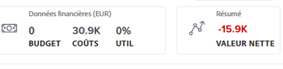

# Présentation des plans dans le [!DNL Scenario Planner]

[!DNL Scenario Planner] nécessite une licence distincte en plus de la licence [!DNL Adobe Workfront]. Pour plus d’informations sur [!DNL Workfront Scenario Planner], voir [The [!DNL Scenario Planner] overview](../scenario-planner/scenario-planner-overview.md).

En tant que chef d’entreprise, vous pouvez utiliser le [!DNL Adobe Workfront Scenario Planner] pour décrire la stratégie à court et à long terme de votre entreprise en définissant ses plans à un, trois ou cinq ans.

## Conditions d’accès

Pour utiliser le [!DNL Adobe Workfront Scenario Planner], vous devez disposer des accès suivants :

<table style="table-layout:auto"> 
 <col> 
 <col> 
 <tbody> 
  <tr> 
   <td role="rowheader"> 
<a href="https://www.workfront.com/plans?lang=fr" target="_blank">[!DNL Adobe Workfront] plan</a>*
 </td> 
   <td>[!UICONTROL Business] ou niveau supérieur</td> 
  </tr> 
  <tr> 
   <td role="rowheader"> 
Type de licence*
 </td> 
   <td> 
[!UICONTROL Révision] ou version ultérieure. Pour plus d’informations, voir <a href="../administration-and-setup/add-users/access-levels-and-object-permissions/wf-licenses.md" class="MCXref xref">[!DNL Adobe Workfront] - Présentation des licences</a>.
 </td> 
  </tr> 
  <tr> 
   <td role="rowheader">Produit</td> 
   <td> 
Vous devez acheter une licence supplémentaire pour le [!DNL Adobe Workfront Scenario Planner] afin d’accéder aux fonctionnalités décrites dans cet article.
 
Pour plus d’informations sur l’obtention du [!DNL Workfront Scenario Planner], voir <a href="../scenario-planner/access-needed-to-use-sp.md" class="MCXref xref">Accès nécessaire pour utiliser le [!DNL Scenario Planner]</a>. 
 </td> 
  </tr> 
  <tr data-mc-conditions=""> 
   <td role="rowheader">Niveau d’accès*</td> 
   <td> 
Accès à [!UICONTROL View] ou supérieur à la variable [!DNL Scenario Planner]
 
Remarque : si vous n’avez toujours pas d’accès, demandez à votre équipe d’administration Workfront s’il existe des restrictions supplémentaires à votre niveau d’accès. Pour plus d’informations sur la façon dont un administrateur ou une administratrice de Workfront peut modifier votre niveau d’accès, voir <a href="../administration-and-setup/add-users/configure-and-grant-access/create-modify-access-levels.md" class="MCXref xref">Créer ou modifier les niveaux d’accès personnalisés</a>.
 </td> 
  </tr> 
  <tr data-mc-conditions=""> 
   <td role="rowheader"> 
Autorisations d’objet
 </td> 
   <td> 
Autorisations [!UICONTROL Afficher] ou supérieures pour un forfait<!--
      <MadCap:conditionalText data-mc-conditions="QuicksilverOrClassic.Draft mode">
        (NOTE: this might change if they have permissions for initiatives/ scenarios, etc) 
      </MadCap:conditionalText>
     -->
 
Pour plus d’informations sur la demande d’un accès supplémentaire à un plan, voir <a href="../scenario-planner/request-access-to-plan.md" class="MCXref xref">Demander l’accès à un plan dans le [!DNL Scenario Planner]</a>.
 </td> 
  </tr> 
 </tbody> 
</table>

*Pour connaître le plan, le type de licence ou l’accès dont vous disposez, contactez votre administrateur [!DNL Workfront].

## Présentation des plans

<!--

(NOTE: add information about utilization percentage for job roles - per this story?? - https://hub.workfront.com/task/5eb0784900083e1f2cabb60d6e0d04d3/overview)

-->

Vous pouvez identifier chaque résultat organisationnel de haut niveau et l’ajouter en tant que plan au [!DNL Workfront Scenario Planner]. Un plan est l’élément de travail le plus important de [!DNL Scenario Planner]. Pour faciliter l&#39;exécution du plan, vous pouvez le diviser en plusieurs initiatives, afin d&#39;indiquer les étapes que chaque entité organisationnelle doit entreprendre pour l&#39;achever.

Vous pouvez ensuite associer les initiatives à de vrais projets pour indiquer comment le travail réel contribue à l’exécution du plan. Cet article fournit des informations générales sur les plans. Pour plus d’informations sur les initiatives, consultez la [présentation des initiatives dans le  [!DNL Scenario Planner]](../scenario-planner/initiatives-overview.md).

Vous pouvez définir la main d&#39;oeuvre et les ressources financières nécessaires pour terminer le travail identifié dans le plan. Vous pouvez également visualiser les ressources financières et de main d&#39;oeuvre requises par les initiatives du plan pour qu&#39;elles se terminent.

Vous pouvez estimer et revoir les informations suivantes pour chaque plan :

* Estimez le type et le nombre de rôles de tâche disponibles pour exécuter le plan.
* Estimez le budget dont votre entreprise a besoin pour terminer le plan.
* Examinez le pourcentage d’utilisation de chaque rôle de tâche par rapport aux rôles de tâche requis associés aux initiatives.
* Examinez le pourcentage d’utilisation du budget de votre plan par rapport aux coûts associés aux initiatives.
* Examinez la valeur nette du plan à tout moment.
* Les informations au niveau du plan changent lorsque vous sélectionnez différents scénarios. Chaque scénario comporte des informations sur le budget et les personnes différentes.

Pour plus d’informations sur la création de plans, consultez l’article [Créer et modifier des plans dans le  [!DNL Scenario Planner]](../scenario-planner/create-and-edit-plans.md).

Pour plus d’informations sur la création de scénarios, voir [Création et comparaison de scénarios de plan dans  [!DNL Scenario Planner]](../scenario-planner/create-and-compare-scenarios-for-a-plan.md).

## Observations relatives aux plans

Tenez compte des points suivants lors de la création de plans :

* Vous pouvez créer des plans pour une équipe, un département entier ou même toute votre entreprise. Les plans sont de grandes unités de planification qui définissent la stratégie d&#39;une entreprise à un niveau élevé.
* Le forfait le plus court peut avoir une durée d’un an. Le plan le plus long peut avoir une durée de 5 ans.
* Vous ne pouvez pas vraiment travailler sur un plan. Vous pouvez estimer à peu près si vous disposez des ressources et du budget nécessaires pour commencer à planifier le travail. Par exemple, si votre entreprise souhaite développer et acquérir un nouveau bureau dans un nouvel emplacement, les étapes requises pour y parvenir peuvent être décrites en premier dans un plan au niveau de la haute direction.
* Vous pouvez créer plusieurs scénarios d’un même plan. Lorsque votre plan initial comporte trop d’initiatives conflictuelles, vous souhaiterez créer plusieurs scénarios dans lesquels vous pourrez modifier des initiatives ou des budgets et des coûts afin de déterminer quelle est la situation idéale pour l’exécution du plan. Les initiatives peuvent entrer en conflit lorsqu&#39;elles essaient d&#39;utiliser les mêmes ressources pendant la même période. Vous pouvez ensuite comparer des scénarios afin de déterminer ce qui est le plus logique et celui que votre entreprise doit adopter, avant qu’ils ne commencent à ajouter le travail réel pour y parvenir. Pour plus d’informations sur la création de scénarios, reportez-vous à l’article [Créer et comparer des scénarios de plan dans le  [!DNL Scenario Planner]](../scenario-planner/create-and-compare-scenarios-for-a-plan.md).
* Vous pouvez ajouter plusieurs initiatives à un plan afin d’indiquer comment des unités de planification plus petites contribueront à l’achèvement du plan. Par exemple, lorsque vous prévoyez de vous étendre à un marché spécifique, vous pouvez avoir plusieurs initiatives au niveau du département qui, à terme, contribuent à l’expansion à tous les niveaux de l’organisation. Pour plus d’informations sur la création d’initiatives, consultez l’article [Créer et modifier des initiatives dans le  [!DNL Scenario Planner]](../scenario-planner/create-and-edit-initiatives.md).
* Lorsque vous créez un plan, vous êtes la seule personne à pouvoir le visualiser. Vous devez planifier avec d’autres utilisateurs et ils peuvent y accéder s’ils disposent au moins d’un accès en vue à [!DNL Scenario Planner] dans leur niveau d’accès.

## Informations sur les rôles de tâche pour les plans

Vous pouvez consulter les informations générales sur les rôles d’emploi pour les plans qui indiquent le nombre de rôles d’emploi disponibles pour le plan, ainsi que le nombre de rôles d’emploi requis pour que les initiatives se terminent. Vous pouvez afficher ces informations dans la zone [!UICONTROL Rôles de tâche] de l’en-tête du plan.

Vous pouvez afficher les éléments suivants dans la zone de rôle de tâche :

| Informations | Description |
|---|---|
| Indicateur ETR/Heures | L’indicateur ([!UICONTROL FTE]) ou ([!UICONTROL Hours]) en regard du titre &quot;[!UICONTROL Job Role]&quot; indique si le plan a été configuré pour utiliser des FTEs ou des Hours lors de sa création. Le plan, tous les scénarios et toutes les initiatives utilisent cette unité. |
| [!UICONTROL Disponible] | Nombre d’ETR ou d’heures de rôle de tâche disponibles pour le scénario actuel. |
| Requis | Le nombre d’heures ou d’heures requises par toutes les initiatives dans le scénario actuel pour qu’elles puissent être effectuées. |

Pour plus d’informations sur l’accès à un plan et sur l’affichage d’informations détaillées sur les rôles de tâche, voir [Création et modification de plans dans le  [!DNL Scenario Planner]](../scenario-planner/create-and-edit-plans.md).

## Informations financières pour les plans

Vous pouvez consulter les informations financières sur un plan, en particulier son budget prévu, la façon dont ce budget est utilisé et la valeur nette du plan. La valeur nette d&#39;un plan est basée sur la valeur nette de ses initiatives. Vous pouvez afficher ces informations dans les zones [!UICONTROL Financial] et [!UICONTROL Summary] de l&#39;en-tête du plan.

Vous pouvez afficher les éléments suivants dans les zones [!UICONTROL Financial] et [!UICONTROL Summary] du plan :

<table style="table-layout:auto"> 
 <col> 
 <col> 
 <tbody> 
  <tr> 
   <td role="rowheader"> 
[!UICONTROL Budget] 
 
 
 </td> 
   <td>Il s’agit du montant monétaire que votre société décide qu’il est disponible pour exécuter le plan. Workfront répartit le budget uniformément pour chaque mois pendant la durée du plan. Les budgets sont généralement définis sur une année, mais ils peuvent également être définis sur une période de 3 ou 5 ans. La devise entre parenthèses à gauche du titre de la zone financière indique la devise de votre système. </td> 
  </tr> 
  <tr> 
   <td role="rowheader">[!UICONTROL Coûts]</td> 
   <td> 
Il s’agit du montant total des coûts qui proviennent de toutes les initiatives du plan. Workfront calcule les Coûts du plan à l’aide de la formule suivante :
 
<code>Plan Costs = SUM(Initiative Costs)</code> 
 
Pour plus d'informations sur le calcul des coûts de l'initiative, voir <a href="../scenario-planner/create-and-edit-initiatives.md" class="MCXref xref">Créer et modifier des initiatives dans [!DNL Scenario Planner]</a>. 
 </td> 
  </tr> 
  <tr> 
   <td role="rowheader">UTIL (pourcentage d’utilisation du budget)</td> 
   <td> 
Il s’agit d’un pourcentage calculé entre les coûts associés aux initiatives et le budget défini pour le plan. 
 
[!DNL Workfront] calcule le pourcentage d’utilisation du budget pour un plan à l’aide de la formule suivante : 
 
<code>Utilization percentage = (Plan Costs* 100))/ Plan Budget</code> 
 
Les coûts sont calculés à l’aide de la formule suivante :
 
<code>Plan Costs = SUM(Initiatives People Costs, Initiatives Fixed Costs)</code> 
 
Conseil : Le pourcentage d’utilisation est arrondi et comporte une décimale. 
 </td> 
  </tr> 
  <tr> 
   <td role="rowheader"> 
Zone [!UICONTROL Net Value]  dans la zone [!UICONTROL Summary]
 
 
 </td> 
   <td> 
Il s’agit d’un calcul de toutes les valeurs nettes de toutes les initiatives du plan. 
 
Workfront calcule la valeur nette du plan à l’aide de la formule suivante : 
 
<code>Plan Net Value = SUM(Initiative Planned Benefit - People Costs)</code> 
 
Ou
 
<code>Plan Net Value = SUM(Initiative Net Value)</code> 
 
Pour plus d’informations sur les valeurs réseau des initiatives, consultez l’article <a href="../scenario-planner/initiatives-overview.md" class="MCXref xref">Présentation des initiatives dans le [!DNL Scenario Planner]</a>.
 </td> 
  </tr> 
 </tbody> 
</table>

Pour plus d’informations sur l’accès à un plan et l’affichage d’informations financières détaillées le concernant, voir [Créer et modifier des plans dans le  [!DNL Scenario Planner]](../scenario-planner/create-and-edit-plans.md).

