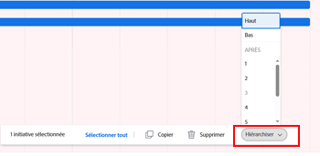

# Mettre à jour les priorités de l’initiative dans le [!DNL Scenario Planner]

Il est important de hiérarchiser les initiatives parce que celles-ci reçoivent des fonctions et des ressources budgétaires d’un plan dans l’ordre où elles sont répertoriées dans celui-ci.

Vous pouvez donner la priorité aux initiatives d’un plan que vous avez créé ou d’un plan qu’une personne a partagé avec vous.

Pour plus d’informations sur la création de plans, voir [Créer et modifier des plans dans le  [!DNL Scenario Planner]](../scenario-planner/create-and-edit-plans.md).

Pour plus d’informations sur la création d’initiatives, voir [Créer et modifier des initiatives dans le  [!DNL Scenario Planner]](../scenario-planner/create-and-edit-initiatives.md).

## Conditions d’accès

+++ Développez pour afficher les exigences d’accès aux fonctionnalités de cet article.

<table style="table-layout:auto"> 
 <col> 
 <col> 
 <tbody> 
  <tr> 
   <td> 
[!DNL Adobe Workfront] formule*
 </td> 
   <td> <ul></li>
   <li>
Nouveau : Ultimate 
</li>
   
Le planificateur de scénario n’est pas disponible pour les nouveaux plans Workfront Select ou Workfront Prime. 

   <li>
Actuel : [!UICONTROL Business] ou de niveau supérieur
</ul>
   </td> 
  </tr> 
  <tr> 
   <td> 
[!DNL Adobe Workfront] licence*
 </td> 
   <td> 
Nouveau : Light ou supérieur
 
   
Actuel : [!UICONTROL Révision] ou version ultérieure
 </td> 
  </tr> 
  <tr> 
   <td>Produit* </td> 
   <td> <ul><li>
Pour les nouveaux plans Workfront :

 Adobe Workfront</li>

   <li>
Pour les plans Workfront actuels : 

   
Adobe Workfront
 
Planificateur de scénarios Adobe Workfront
</li></ul>

Pour plus d’informations, voir <a href="../scenario-planner/access-needed-to-use-sp.md" class="MCXref xref">Accès nécessaire pour utiliser [!DNL Scenario Planner]</a>. 
 </td> 
  </tr> 
  <tr data-mc-conditions=""> 
   <td>Niveau d’accès </td> 
   <td> 
Accès [!UICONTROL Edit] à [!DNL Scenario Planner]
 </td> 
  </tr> 
  <tr data-mc-conditions=""> 
   <td> 
Autorisations d’objet 
 </td> 
   <td> 
Autorisations [!UICONTROL Manage] pour un plan
 
Pour plus d’informations sur la demande d’un accès supplémentaire à un plan, consultez <a href="../scenario-planner/request-access-to-plan.md" class="MCXref xref">Demander l’accès à un plan dans le [!DNL Scenario Planner]</a>.
 </td> 
  </tr> 
 </tbody> 
</table>

*Pour plus d’informations, voir [Exigences d’accès à la documentation Workfront](/help/quicksilver/administration-and-setup/add-users/access-levels-and-object-permissions/access-level-requirements-in-documentation.md).

+++

## Mettre à jour les priorités des initiatives

Lorsque vous modifiez la priorité des initiatives, vous modifiez l’ordre dans lequel elles sont répertoriées dans un plan.

Nous vous recommandons de placer les initiatives plus urgentes en haut d’un plan et les plus fluides (qui pourraient être prises à tout moment et uniquement si des ressources sont disponibles) en bas du plan.

>[!NOTE]
>
>[!DNL Workfront] alloue les ressources du plan aux initiatives dans l’ordre dans lequel elles sont répertoriées dans le plan.
>
>Par exemple, si le plan comporte 3 personnes disponibles chargées de l’ingénierie et que les initiatives 1 et 2 ont chacune besoin de 2 personnes pour se terminer et qu’elles sont toutes les deux planifiées pour la même période, Workfront associe 2 personnes à l’initiative 1 tandis qu’une troisième reste disponible pour l’initiative 2. Dans ce cas, l’Initiative 2 montre qu’il y a un conflit, parce qu’il lui manque une personne chargée de l’ingénierie. Parfois, changer la priorité de vos initiatives est la seule façon d’éviter les conflits dans un plan.

Pour mettre à jour la priorité de l’initiative, procédez comme suit :

{{step1-to-scenario-planner}}

Une liste des plans s’affiche.

1. Cliquez sur le nom d’un plan pour l’ouvrir, puis localisez les initiatives pour lesquelles vous souhaitez définir une priorité.
1. Cliquez sur la case à gauche d’un ou de plusieurs noms d’initiatives et effectuez l’une des opérations suivantes :

   * Cliquez sur la poignée située à gauche de l’un des noms des initiatives sélectionnées, puis faites-le glisser vers le haut ou le bas de la liste pour modifier la priorité de l’initiative.

     Workfront affiche le nombre d’initiatives sélectionnées.

     

   * Cliquez sur le bouton **[!UICONTROL Définir la priorité]** en bas du plan, puis choisissez l’une des options suivantes :

      * **[!UICONTROL En haut]** : déplace les initiatives sélectionnées en haut de la liste des initiatives. Les initiatives sélectionnées sont répertoriées en premier dans le plan.
      * **[!UICONTROL En bas]** : déplace les initiatives sélectionnées en bas de la liste des initiatives. Les initiatives sélectionnées sont répertoriées en dernier dans le plan.
      * **[!UICONTROL Sélectionner un nombre]** : déplace les initiatives sélectionnées après l’initiative que vous indiquez ici.

        

     [!DNL Workfront] place immédiatement les initiatives sélectionnées à l’endroit où vous les indiquez et le nombre de toutes les initiatives est mis à jour en conséquence.

1. Cliquez sur **[!UICONTROL Enregistrer le plan]** pour enregistrer vos modifications.
