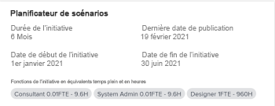

# Mettre à jour ou créer des projets en publiant des initiatives dans le [!DNL Scenario Planner]

La publication d’un scénario à partir du [!DNL Adobe Workfront Scenario Planner] permet d’obtenir les résultats suivants :

* Crée des projets à partir des initiatives du scénario et les relie entre eux.
* Met à jour les projets déjà liés à des initiatives du scénario avec des informations provenant de l’initiative liée. Les projets peuvent également être liés à des initiatives lorsque vous les importez dans un plan. Pour plus d’informations, voir [Importer des projets vers des plans dans le  [!DNL Scenario Planner]](../scenario-planner/import-projects-to-plans.md)

## Conditions d’accès

+++ Développez pour afficher les exigences d’accès aux fonctionnalités de cet article. 

<table style="table-layout:auto"> 
 <col> 
 <col> 
 <tbody> 
  <tr> 
   <td> 
[!DNL Adobe Workfront] paquet
 </td> 
   <td> 
   
Workfront Ultimate

<b>NOTE</b>

Contactez votre représentant Workfront si vous disposez d’un autre package Workfront.

   </td> 
  </tr> 
  <tr> 
   <td> 
[!DNL Adobe Workfront] licence
 </td> 
   <td> 
[!UICONTROL Light] ou version ultérieure
 
   
[!UICONTROL Review] ou niveau supérieur
 </td> 
  </tr> 
    <tr> 
   <td>Configurations des niveaux d’accès</td> 
   <td> 
Accès à [!UICONTROL Edit] pour les projets [!DNL Scenario Planner] et 
</td> 
  </tr> 
  <tr> 
   <td> 
Autorisations d’objet 
 </td> 
   <td> <ul> 
     <li>Autorisations [!UICONTROL Manage] pour le plan </li> 
     <li>Autorisations [!UICONTROL Manage] pour les projets publiés</li> 
    </ul>  </td> 
  </tr> 
 </tbody> 
</table>

Pour plus d’informations sur l’accès au planificateur de scénarios, voir [&#x200B; Accès nécessaire pour utiliser le  [!DNL Scenario Planner]](../scenario-planner/access-needed-to-use-sp.md).

Pour plus d’informations sur les exigences d’accès à Workfront, voir [Documentation sur les exigences d’accès à Workfront](/help/quicksilver/administration-and-setup/add-users/access-levels-and-object-permissions/access-level-requirements-in-documentation.md).

+++

<!--Old:

<table style="table-layout:auto"> 
 <col> 
 <col> 
 <tbody> 
  <tr> 
   <td> 
[!DNL Adobe Workfront] plan*
 </td> 
   <td> <ul></li>
   <li>
New: Ultimate 
</li>
   
The Scenario Planner is not available for the new Workfront Select or Workfront Prime plans. 

   <li>
Current: [!UICONTROL Business] or higher
</ul>
   </td> 
  </tr> 
  <tr> 
   <td> 
[!DNL Adobe Workfront] license*
 </td> 
   <td> 
New: Light or higher
 
   
Current: [!UICONTROL Review] or higher
 </td> 
  </tr> 
  <tr> 
   <td>Product* </td> 
   <td> <ul><li>
For the new Workfront plans:

 Adobe Workfront</li>

   <li>
For the current Workfront plans: 

   
Adobe Workfront
 
Adobe Workfront Scenario Planner
</li></ul>
   
   
For more information, see <a href="../scenario-planner/access-needed-to-use-sp.md" class="MCXref xref">Access needed to use the [!DNL Scenario Planner]</a>. 
 </td> 
  </tr> 
  <tr data-mc-conditions=""> 
   <td>Access level </td> 
   <td> 
[!UICONTROL Edit] access for the [!DNL Scenario Planner] and [!UICONTROL Projects]
</td> 
  </tr> 
  <tr data-mc-conditions=""> 
   <td> 
Object permissions 
 </td> 
   <td>  <ul> 
     <li>[!UICONTROL Manage] permissions for the plan </li> 
     <li>[!UICONTROL Manage] permissions for published projects</li> 
    </ul> 
For information on requesting additional access to a plan, see <a href="../scenario-planner/request-access-to-plan.md" class="MCXref xref">Request access to a plan in the [!DNL Scenario Planner]</a>.
 </td> 
  </tr> 
 </tbody> 
</table>-->

## Conditions préalables

Avant de commencer :

* Vous devez créer et enregistrer un plan avant de pouvoir publier des initiatives à partir de celui-ci.
* Le paramètre Autoriser les utilisateurs à créer des projets sans utiliser de modèle doit être activé dans la zone Préférences du projet de la configuration. Pour plus d’informations, voir [Configurer les préférences du projet à l’échelle du système](/help/quicksilver/administration-and-setup/set-up-workfront/configure-system-defaults/set-project-preferences.md).

## Considérations relatives à la publication d’initiatives dans des projets

* Vous ne pouvez publier qu’un seul scénario par plan.
* Une seule initiative ne peut être liée qu’à un seul projet.
* Un projet peut être lié à plus d’une seule initiative lorsque les initiatives appartiennent à des plans différents.

  >[!TIP]
  >
  >Lorsqu’un projet existe dans plusieurs plans et que vous publiez des informations sur le projet à partir de tous les plans, la dernière publication écrase les informations existantes du [!DNL Scenario Planner] à propos du projet.

* Si des initiatives ont été créées dans le plan en important des projets dans ce dernier, la publication de l’initiative met également à jour les projets liés avec les informations relatives à l’initiative.

  >[!TIP]
  >
  >Vous pouvez importer le même projet dans plusieurs plans. La publication peut écraser les informations relatives à une initiative dans un projet lié à plusieurs initiatives.

  Pour plus d’informations sur la création d’initiatives par l’import de projets, voir [Importer des projets dans des plans dans le  [!DNL Scenario Planner]](../scenario-planner/import-projects-to-plans.md).

* Les modifications apportées au projet ne sont pas transférées à l’initiative liée.

## Publier des initiatives

>[!IMPORTANT]
>
>Si vous apportez des modifications aux initiatives du plan, y compris si vous résolvez des conflits, vous devez republier l’initiative pour que les nouvelles informations soient visibles dans le projet. Ces informations ne s’affichent dans les projets liés aux initiatives que lorsque vous publiez l’initiative correspondante. Pour plus d’informations sur la résolution des conflits entre les initiatives, voir [Résoudre les conflits d’initiatives dans le  [!DNL Scenario Planner]](../scenario-planner/resolve-conflicts-in-sp.md).

{{step1-to-scenario-planner}}

1. (Facultatif et conditionnel) Si vous souhaitez effectuer une publication à partir d’un plan existant, cliquez sur l’icône **[!UICONTROL Filtrer]**  dans le coin supérieur droit du plan et sélectionnez l’une des options suivantes :

   <table style="table-layout:auto"> 
    <col> 
    <col> 
    <tbody> 
     <tr> 
      <td role="rowheader">[!UICONTROL All]</td> 
      <td>Affiche tous les plans que vous possédez ou qui sont partagés avec vous. Il s’agit de la valeur par défaut. </td> 
     </tr> 
     <tr> 
      <td role="rowheader">[!UICONTROL My plans]</td> 
      <td>Affiche les plans que vous avez créés.</td> 
     </tr> 
     <tr> 
      <td role="rowheader">[!UICONTROL Shared with me]</td> 
      <td> 
Affiche les plans que vous n’avez pas créés mais qui sont partagés avec vous.
 
Important : vous devez disposez des autorisations [!UICONTROL Manage] pour les plans partagés avec vous afin de pouvoir les publier. 
 </td> 
     </tr> 
    </tbody> 
   </table>

   

1. (Facultatif) Cliquez sur l’icône **[!UICONTROL Rechercher]**  et commencez à saisir le nom d’un plan pour le trouver rapidement dans la liste.
1. (Le cas échéant) Pour publier à partir d’un nouveau plan, créez un plan.

   Pour plus d’informations sur la création de plans, voir [Créer et modifier des plans dans le  [!DNL Scenario Planner]](../scenario-planner/create-and-edit-plans.md).

1. (Facultatif) Cliquez sur le nom d’un plan existant et créez de nouveaux scénarios pour ce plan.

   Pour plus d’informations sur la création de scénarios pour un plan, voir [Créer et comparer des scénarios de plan dans le  [!DNL Scenario Planner]](../scenario-planner/create-and-compare-scenarios-for-a-plan.md).

1. (Facultatif) Mettez à jour les initiatives d’un plan existant ou d’un nouveau plan, ou créez-en de nouvelles.

   Pour plus d’informations sur la création d’initiatives, voir [Créer et modifier des initiatives dans le  [!DNL Scenario Planner]](../scenario-planner/create-and-edit-initiatives.md).

1. Cliquez sur **[!UICONTROL Enregistrer le plan]**.
1. Sélectionnez le scénario que vous souhaitez publier dans le menu déroulant **[!UICONTROL Scénario initial]**, puis cliquez sur **[!UICONTROL Aller à la publication]**  dans le coin supérieur droit.

   Ou

   Cliquez sur **[!UICONTROL Comparer les scénarios]**, survolez la carte de scénario à partir de laquelle vous souhaitez effectuer la publication, puis cliquez sur **[!UICONTROL Accéder à la publication]** .

   La page [!UICONTROL Publier les initiatives] s’affiche et affiche une liste de toutes les initiatives du scénario. Si l’une des initiatives a été publiée précédemment, l’icône du projet  s’affiche après leur nom et la date de **[!UICONTROL Dernière publication]** est renseignée dans la liste.

   >[!TIP]
   >
   >Les initiatives créées par l’importation de projets affichent également l’icône de projet  à droite de leur nom

   

1. (Facultatif et conditionnel) Si vous souhaitez effectuer une publication à partir d’un plan existant, cliquez sur l’icône **[!UICONTROL Filtrer]**  dans le coin supérieur droit du plan et sélectionnez l’une des options suivantes :

   <table style="table-layout:auto"> 
    <col> 
    <col> 
    <tbody> 
     <tr> 
      <td role="rowheader">[!UICONTROL All]</td> 
      <td>Affiche toutes les initiatives du scénario sélectionné. </td> 
     </tr> 
     <tr> 
      <td role="rowheader">[!UICONTROL Published]</td> 
      <td>Affiche les initiatives que vous ou un autre utilisateur ou une autre utilisatrice avez déjà publiées. </td> 
     </tr> 
     <tr> 
      <td role="rowheader">[!UICONTROL Unpublished]</td> 
      <td> 
Affiche les initiatives non publiées. 
 </td> 
     </tr> 
    </tbody> 
   </table>

   

1. (Facultatif) Cliquez sur l’icône **[!UICONTROL Rechercher]**  et commencez à saisir le nom d’une initiative pour la trouver rapidement dans la liste.
1. Sélectionnez une ou plusieurs initiatives à publier et créez ou mettez à jour des projets à partir de celles-ci, puis cliquez sur **[!UICONTROL Publier les initiatives]**.

   Cela crée un nouveau projet à partir de chaque initiative sélectionnée ou met à jour les projets connectés existants, si les initiatives publiées étaient déjà liées à un projet.

   >[!TIP]
   >
   >Les nouveaux projets portent le même nom que les initiatives publiées.

1. (Le cas échéant) Utilisez l’une des méthodes suivantes :

   * Si vous avez publié une initiative, cliquez sur **[!UICONTROL Voir le projet associé]** pour ouvrir le projet créé ou mis à jour à partir de l’initiative.
   * Si vous avez publié plus d’une initiative, cliquez sur **[!UICONTROL Voir les projets associés]** pour ouvrir une liste des projets publiés à partir d’initiatives. [!DNL Workfront] applique par défaut le filtre de projets du [!DNL Scenario Planner] à la liste des projets. Les projets publiés le plus récemment apparaissent en tête de liste.

     

1. Accédez aux zones suivantes pour consulter les informations des initiatives du projet :

   * **Section [!UICONTROL Mises à jour]** : une mise à jour est publiée pour indiquer que le projet a été créé ou mis à jour à partir de l’initiative. La mise à jour contient le nom de l’initiative qui a créé ou mis à jour le projet et le nom lié du plan qui contient l’initiative. Vous pouvez cliquer sur le nom du plan dans la mise à jour pour ouvrir le plan dans le [!DNL Scenario Planner].

     

   * **Zone [!UICONTROL Vue d’ensemble] de la section [!UICONTROL Détails du projet]** : une nouvelle section du [!DNL Scenario Planner] est créée dans cette zone et contient des informations sur l’initiative liée.

     

     Les informations suivantes sur l’initiative sont publiées dans la zone du [!DNL Scenario Planner] de la section [!UICONTROL Détails du projet] :

     <table style="table-layout:auto"> 
      <col> 
      <col> 
      <tbody> 
       <tr> 
        <td role="rowheader">[!UICONTROL Initiative Duration] </td> 
        <td>Durée de l’initiative correspondante lorsque le projet est lié à une initiative. Ce champ n’est pas modifiable. </td> 
       </tr> 
       <tr> 
        <td role="rowheader">[!UICONTROL Last Published Date] </td> 
        <td>Date à laquelle le projet a été publié pour la dernière fois à partir d’une initiative correspondante. </td> 
       </tr> 
       <tr> 
        <td role="rowheader">[!UICONTROL Initiative Start Date] </td> 
        <td>Premier jour du mois du début de l’initiative, lorsque le projet est lié à une initiative. </td> 
       </tr> 
       <tr> 
        <td role="rowheader">[!UICONTROL Initiative End Date] </td> 
        <td>Dernier jour du mois de fin de l’initiative, lorsque le projet est lié à une initiative.  </td> 
       </tr> 
       <tr> 
        <td role="rowheader">[!UICONTROL Initiative Job Roles in FTEs and Hours] </td> 
        <td> 
Informations sur les fonctions associées et leur temps alloué à l’initiative. Cela inclut les éléments suivants :
 
         <ul> 
          <li>Nom de la fonction</li> 
          <li>Nombre d’équivalents temps complet</li> 
          <li> 
Nombre d’heures pour tous les équivalents temps complet
 
Vous pouvez estimer le nombre de fonctions nécessaires pour votre plan ou votre initiative en utilisant des heures ou des équivalents temps complet.
 
Pour plus d’informations, voir <a href="../scenario-planner/create-and-edit-plans.md" class="MCXref xref">Créer et modifier des plans dans le planificateur de scénarios</a>. 
 </li> 
         </ul> 
      
<b>CONSEIL</b>

     Si le nombre de fonctions est différent pour chaque mois de l’initiative, ce champ affiche le nombre maximum de fonctions nécessaires à l’initiative. Par exemple, si vous avez besoin d’une seule personne consultante pour janvier et de deux pour février, la colonne affiche 2 équivalents temps complet et le nombre d’heures correspondant à 2 équivalents temps complet pour tous les mois.
 </td>
     </tr> 
      </tbody> 
     </table>

     >[!NOTE]
     >
     >Tous les utilisateurs et utilisatrices disposant de l’accès [!UICONTROL Afficher] peuvent voir la section [!DNL Scenario Planner] dans la zone [!UICONTROL Vue d’ensemble]. Vous pouvez vérifier si cette zone s’affiche dans la section [!UICONTROL Détails] à l’aide d’un modèle de mise en page. Si aucun modèle de mise en page n’est associé aux utilisateurs et utilisatrices, cette zone s’affiche par défaut.
     >
     >   
     >   
     >   * Pour plus d’informations sur l’ajout ou la suppression de zones dans la section [!UICONTROL Détails] à l’aide d’un modèle de mise en page, voir [Personnaliser la vue [!UICONTROL Détails] à l’aide d’un modèle de mise en page](../administration-and-setup/customize-workfront/use-layout-templates/customize-details-view-layout-template.md).
     >   * Pour plus d’informations sur l’affichage des informations dans la zone [!UICONTROL Vue d’ensemble] des [!UICONTROL Détails du projet], voir [[!UICONTROL Gérer] les informations dans la zone [!UICONTROL Vue d’ensemble] du projet](../manage-work/projects/manage-projects/understand-project-overview-area.md).
     >   
     >

   * **Panneau [!UICONTROL Affectation des rôles] dans l’[!UICONTROL Équilibreur de charge de travail] ou la liste des tâches du projet** : des informations relatives à l’affectation des rôles dans l’initiative s’affichent dans cette zone, en plus des affectations de rôles dans le projet.

     Pour plus d’informations, voir [Vue d’ensemble de la réconciliation des affectations de ressources entre les projets et les initiatives](../scenario-planner/overview-reconcile-allocations-between-projects-initiatives.md).

     

     Toute modification des dates ou des ressources du projet n’affecte pas l’initiative correspondante ni aucune des zones du projet contenant des informations sur l’initiative.

   * **Zone [!UICONTROL Établissement du budget de ressources] du [!UICONTROL Business case] du projet** : une nouvelle option de gestion des ressources du projet à l’aide des informations du [!DNL Scenario Planner] est ajoutée dans la zone [!UICONTROL Établissement du budget de ressources] du [!UICONTROL Business case] du projet.

     Pour plus d’informations, voir [Budgétisation des ressources dans le [!UICONTROL Business case] à l’aide du  [!DNL Scenario Planner]](../manage-work/projects/define-a-business-case/budget-resources-in-business-case-use-scenario-planner.md).

     

1. (Facultatif) Consultez les informations suivantes concernant le [!DNL Scenario Planner] après avoir publié un scénario :

   * Le scénario publié devient le premier scénario lorsque vous publiez des initiatives à partir de celui-ci.
   * Vous ne pouvez pas publier à partir d’un autre scénario après avoir publié un scénario au moins une fois.
   * L’option [!UICONTROL Aller à Publier] est supprimée de tous les autres scénarios dès qu’au moins une initiative a été publiée à partir d’un scénario.
   * Un indicateur vert s’affiche à côté des icônes du projet des initiatives publiées dans le plan.

     

   * Un indicateur vert « Publié » s’affiche en haut du scénario et sur la carte du scénario, et le champ « Publié » est renseigné sur la carte du scénario, indiquant le nombre d’initiatives du scénario qui ont été publiées.

     

     >[!TIP]
     >
     >Si tous les projets publiés à partir des initiatives du scénario sont supprimés, l’indication que le scénario a été publié est supprimée. Pour plus d’informations, voir [Supprimer des projets](../manage-work/projects/manage-projects/delete-projects.md).

1. (Facultatif) Mettre à jour les informations sur l’initiative et répéter le processus décrit ci-dessus pour republier l’initiative et mettre à jour les informations des initiatives pour le projet lié.

   Pour plus d’informations sur la modification d’initiatives, voir [Créer et modifier des initiatives dans le  [!DNL Scenario Planner]](../scenario-planner/create-and-edit-initiatives.md).

