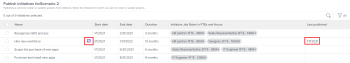
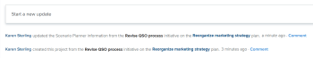

# Mettez à jour ou créez des projets en publiant des initiatives dans le [!DNL Scenario Planner]

Publication d’un scénario à partir du [!DNL Adobe Workfront Scenario Planner] effectue les opérations suivantes :

* Crée des projets à partir des initiatives du scénario et les relie.
* Met à jour les projets déjà liés aux initiatives sur le scénario avec les informations de l’initiative liée. Les projets peuvent également être liés à des initiatives lorsque vous les importez dans un plan. Pour plus d’informations, voir [Importation de projets dans des plans dans [!DNL Scenario Planner]](../scenario-planner/import-projects-to-plans.md)

## Exigences d’accès

Vous devez disposer des éléments suivants :

<table style="table-layout:auto"> 
 <col> 
 <col> 
 <tbody> 
  <tr> 
   <td> 
[!DNL Adobe Workfront] plan*
 </td> 
   <td>[!UICONTROL Business] ou version ultérieure</td> 
  </tr> 
  <tr> 
   <td> 
[!DNL Adobe Workfront] license*
 </td> 
   <td> 
[!UICONTROL Review] ou version ultérieure
 </td> 
  </tr> 
  <tr> 
   <td>Produit </td> 
   <td> 
Vous devez acheter une licence supplémentaire pour la variable [!DNL Adobe Workfront Scenario Planner] pour accéder aux fonctionnalités décrites dans cet article.
 
Pour plus d’informations sur l’obtention de [!DNL Workfront Scenario Planner], voir <a href="../scenario-planner/access-needed-to-use-sp.md" class="MCXref xref">Accès nécessaire pour utiliser la variable [!DNL Scenario Planner]</a>. 
 </td> 
  </tr> 
  <tr data-mc-conditions=""> 
   <td> 

 
Niveau d’accès*
 </td> 
   <td> 
    <ul> 
    <li>Accès à [!UICONTROL Modifier] pour [!DNL Scenario Planner] et projets</li></ul>

<b>NOTE</b>

Si vous n’avez toujours pas accès à , demandez à votre [!DNL Workfront] s’ils définissent des restrictions supplémentaires au niveau de votre accès. Pour plus d’informations sur la manière dont une [!DNL Workfront] l’administrateur peut modifier votre niveau d’accès, voir <a href="../administration-and-setup/add-users/configure-and-grant-access/create-modify-access-levels.md" class="MCXref xref">Création ou modification de niveaux d’accès personnalisés</a>.
 </td>
</tr> 
  <tr data-mc-conditions=""> 
   <td> 
Autorisations d’objet
 </td> 
   <td> 
    <ul> 
     <li>Autorisations [!UICONTROL Gérer] pour le plan </li> 
     <li>Autorisations [!UICONTROL Gérer] pour les projets publiés</li> 
    </ul> 
Pour plus d’informations sur la demande d’un accès supplémentaire aux projets, voir <a href="../workfront-basics/grant-and-request-access-to-objects/request-access.md" class="MCXref xref">Demande d’accès aux objets </a>.
 
Pour plus d’informations sur la demande d’un accès supplémentaire à un plan, voir <a href="../scenario-planner/request-access-to-plan.md" class="MCXref xref">Demandez l’accès à un plan dans la [!DNL Scenario Planner]</a>.
 </td> 
  </tr> 
 </tbody> 
</table>

&#42;Pour connaître le plan, le type de licence ou l’accès dont vous disposez, contactez votre [!DNL Workfront] administrateur.

Pour plus d’informations sur l’accès au [!DNL Workfront Scenario Planner], voir [Accès nécessaire pour utiliser la variable [!DNL Scenario Planner]](../scenario-planner/access-needed-to-use-sp.md).

## Conditions préalables

Avant de commencer :

* Vous devez créer et enregistrer un plan avant de pouvoir publier des initiatives à partir de ce plan.
* L’option Autoriser les utilisateurs à créer des projets sans utiliser de paramètre de modèle doit être activée dans la zone Préférences du projet de la configuration. Pour plus d’informations, voir [Configuration des préférences de projet à l’échelle du système](/help/quicksilver/administration-and-setup/set-up-workfront/configure-system-defaults/set-project-preferences.md).

## Observations relatives à la publication d’initiatives dans des projets

* Vous ne pouvez publier qu’un seul scénario à partir d’un plan.
* Une initiative ne peut être liée qu’à un seul projet.
* Un projet peut être lié à plusieurs initiatives lorsque les initiatives appartiennent à différents plans.

  >[!TIP]
  >
  >Lorsqu’un projet existe sur plusieurs plans et que vous publiez des informations sur le projet à partir de tous les plans, la dernière publication remplace les plans existants. [!DNL Scenario Planner] informations sur le projet.

* Si des initiatives ont été créées sur le plan en important des projets dans le plan, la publication de l&#39;initiative met également à jour les projets liés avec l&#39;information de l&#39;initiative.

  >[!TIP]
  >
  >Vous pouvez importer le même projet dans plusieurs plans. La publication peut remplacer les informations d’initiative sur un projet lié à plusieurs initiatives.

  Pour plus d’informations sur la création d’initiatives par importation de projets, voir [Importation de projets dans des plans dans [!DNL Scenario Planner]](../scenario-planner/import-projects-to-plans.md).

* Les modifications apportées au projet ne sont pas transférées à l’initiative liée.

## Publier des initiatives

>[!IMPORTANT]
>
>Si vous apportez des modifications aux initiatives du plan, y compris la résolution de conflits, vous devez republier l’initiative pour que les nouvelles informations soient visibles sur le projet. Ces informations s’affichent sur les projets liés aux initiatives uniquement lorsque vous publiez l’initiative correspondante. Pour plus d’informations sur la résolution des conflits entre les initiatives, voir [Résoudre les conflits d’initiative dans les [!DNL Scenario Planner]](../scenario-planner/resolve-conflicts-in-sp.md)

1. Cliquez sur le bouton **[!UICONTROL Menu Principal]** icon  dans le coin supérieur droit de Workfront, puis cliquez sur **[!UICONTROL Scénarios]**
1. (Facultatif et conditionnel) Si vous souhaitez publier à partir d’un plan existant, cliquez sur le bouton **[!UICONTROL Filtrer]** icon  dans le coin supérieur droit du plan, sélectionnez l’une des options suivantes :

   <table style="table-layout:auto"> 
    <col> 
    <col> 
    <tbody> 
     <tr> 
      <td role="rowheader">[!UICONTROL Toutes]</td> 
      <td>Affiche tous les plans que vous possédez ou que vous partagez. Il s’agit du paramètre par défaut. </td> 
     </tr> 
     <tr> 
      <td role="rowheader">[!UICONTROL Mes plans]</td> 
      <td>Affiche les plans que vous avez créés.</td> 
     </tr> 
     <tr> 
      <td role="rowheader">[!UICONTROL Partagé avec moi]</td> 
      <td> 
Affiche les plans que vous n’avez pas créés mais que vous avez partagés avec vous.
 
Important : Pour pouvoir les publier, vous devez disposer des autorisations [!UICONTROL Gérer] pour les plans partagés avec vous. 
 </td> 
     </tr> 
    </tbody> 
   </table>

   

1. (Facultatif) Cliquez sur le **[!UICONTROL Rechercher]** icon  et commencez à saisir le nom d&#39;un plan pour le trouver rapidement dans la liste.
1. (Conditionnel) Pour publier à partir d’un nouveau plan, créez un plan.

   Pour plus d’informations sur la création de plans, voir [Créez et modifiez des plans dans le [!DNL Scenario Planner]](../scenario-planner/create-and-edit-plans.md) .

1. (Facultatif) Cliquez sur le nom d’un plan existant et créez de nouveaux scénarios pour le plan.

   Pour plus d’informations sur la création de scénarios pour un plan, voir [Créez et comparez des scénarios de plan dans la section [!DNL Scenario Planner]](../scenario-planner/create-and-compare-scenarios-for-a-plan.md).

1. (Facultatif) Mettez à jour les initiatives d’un plan existant ou d’un nouveau plan ou créez-en un.

   Pour plus d’informations sur la création d’initiatives, voir [Créez et modifiez des initiatives dans le [!DNL Scenario Planner]](../scenario-planner/create-and-edit-initiatives.md).

1. Cliquez sur **[!UICONTROL Enregistrer le plan]**.
1. Sélectionnez le scénario que vous souhaitez publier à partir du **[!UICONTROL Scénario initial]** , puis cliquez sur **[!UICONTROL Aller à Publier]**  dans le coin supérieur droit.

   Ou

   Cliquez sur **[!UICONTROL Comparaison de scénarios]**, passez la souris sur la carte de scénario à partir de laquelle vous souhaitez publier, puis cliquez sur **[!UICONTROL Aller à Publier]** .

   La variable [!UICONTROL Publier les initiatives] s’affiche, affichant une liste de toutes les initiatives du scénario. Si l’une des initiatives a été précédemment publiée, l’icône du projet  s’affiche après leur nom et la variable **[!UICONTROL Dernière publication]** date est renseignée dans la liste.

   >[!TIP]
   >
   >Les initiatives créées par l’importation de projets affichent également l’icône du projet.  à droite de leur nom

   

1. (Facultatif et conditionnel) Si vous souhaitez publier à partir d’un plan existant, cliquez sur le bouton **[!UICONTROL Filtrer]** icon  dans le coin supérieur droit du plan, sélectionnez l’une des options suivantes :

   <table style="table-layout:auto"> 
    <col> 
    <col> 
    <tbody> 
     <tr> 
      <td role="rowheader">[!UICONTROL Toutes]</td> 
      <td>Affiche toutes les initiatives du scénario sélectionné. </td> 
     </tr> 
     <tr> 
      <td role="rowheader">[!UICONTROL Publié]</td> 
      <td>Affiche les initiatives que vous ou un autre utilisateur avez publiées précédemment. </td> 
     </tr> 
     <tr> 
      <td role="rowheader">[!UICONTROL Annuler la publication]</td> 
      <td> 
Affiche les initiatives non publiées. 
 </td> 
     </tr> 
    </tbody> 
   </table>

   

1. (Facultatif) Cliquez sur le **[!UICONTROL Rechercher]** icon  et commencez à saisir le nom d’une initiative pour la trouver rapidement dans la liste.
1. Sélectionnez une ou plusieurs initiatives à partir desquelles publier et créer ou mettre à jour des projets, puis cliquez sur **[!UICONTROL Publier les initiatives]**.

   Cela crée un nouveau projet à partir de chaque initiative sélectionnée ou met à jour les projets connectés existants, si les initiatives publiées étaient déjà liées à un projet.

   >[!TIP]
   >
   >Les nouveaux projets portent le même nom que les initiatives publiées.

1. (Conditionnel) Effectuez l’une des opérations suivantes :

   * Si vous avez publié une initiative, cliquez sur **[!UICONTROL Voir le projet associé]** pour ouvrir le projet créé ou mis à jour à partir de l’initiative.
   * Si vous avez publié plusieurs initiatives, cliquez sur **[!UICONTROL Voir les projets associés]** pour ouvrir une liste de projets publiés à partir d&#39;initiatives. [!DNL Workfront] applique la variable [!DNL Scenario Planner] Par défaut, les projets sont filtrés sur la liste des projets. Les projets publiés le plus récemment s’affichent en haut de la liste.

     

1. Accédez aux sections suivantes pour afficher les informations d’initiative sur le projet :

   * **La variable [!UICONTROL Mises à jour] section**: une mise à jour publie pour indiquer que le projet a été créé ou mis à jour à partir de l’initiative. La mise à jour contient le nom de l’initiative qui a créé ou mis à jour le projet et le nom associé du plan qui contient l’initiative. Vous pouvez cliquer sur le nom du plan dans la mise à jour pour ouvrir le plan dans la [!DNL Scenario Planner].

     

   * **La variable [!UICONTROL Présentation] de la zone [!UICONTROL Détails du projet] section**: nouveau [!DNL Scenario Planner] est créée dans cette zone qui contient les informations de l’initiative liée.

     

     Les informations suivantes sont publiées dans la section [!DNL Scenario Planner] de la zone [!UICONTROL Détails du projet] section :

     <table style="table-layout:auto"> 
      <col> 
      <col> 
      <tbody> 
       <tr> 
        <td role="rowheader">[!UICONTROL Durée de l’initiative] </td> 
        <td>Durée de l’initiative correspondante lorsque le projet est lié à une initiative. Ce champ n’est pas modifiable. </td> 
       </tr> 
       <tr> 
        <td role="rowheader">[!UICONTROL Date de dernière publication] </td> 
        <td>Date à laquelle le projet a été publié pour la dernière fois à partir d’une initiative correspondante. </td> 
       </tr> 
       <tr> 
        <td role="rowheader">[!UICONTROL Date de début de l’initiative] </td> 
        <td>Premier jour du mois de début de l’initiative, lorsque le projet est lié à une initiative. </td> 
       </tr> 
       <tr> 
        <td role="rowheader">[!UICONTROL Date de fin de l’initiative] </td> 
        <td>Dernier jour du mois de fin de l’initiative, lorsque le projet est lié à une initiative.  </td> 
       </tr> 
       <tr> 
        <td role="rowheader">[!UICONTROL Rôles de tâche de l’initiative dans les FTEs et heures] </td> 
        <td> 
Informations sur les rôles d’emploi associés et leur attribution de temps pour l’initiative. Cela inclut :
 
         <ul> 
          <li>Nom du rôle de tâche</li> 
          <li>Nombre d’ETR</li> 
          <li> 
Nombre d’heures pour tous les ETR
 
Vous pouvez estimer le nombre de rôles d’emploi nécessaires à votre plan ou à votre initiative à l’aide d’heures ou d’EPT.
 
Pour plus d’informations, voir <a href="../scenario-planner/create-and-edit-plans.md" class="MCXref xref">Créer et modifier des plans dans le planificateur de scénarios</a>. 
 </li> 
         </ul> 
      
<b>CONSEIL</b>

     Si le nombre de rôles d’emploi est différent pour chaque mois de l’initiative, ce champ affiche le nombre maximal de rôles requis pour l’initiative. Par exemple, si vous avez besoin d’un consultant pour janvier et d’un consultant pour février, la colonne affiche 2ETR et le nombre d’heures correspondant pour 2 ETR pour tous les mois.
 </td>
     </tr> 
      </tbody> 
     </table>

     >[!NOTE]
     >
     >Tous les utilisateurs avec [!UICONTROL Affichage] l’accès au projet peut afficher la variable [!DNL Scenario Planner] dans la section [!UICONTROL Présentation] zone. Vous pouvez contrôler si cette zone s’affiche dans la variable [!UICONTROL Détails] en utilisant un modèle de mise en page. Si aucun modèle de mise en page n’est associé aux utilisateurs, cette zone s’affiche par défaut.
     >
     >   
     >   
     >   * Pour plus d’informations sur l’ajout ou la suppression de zones dans [!UICONTROL Détails] à l’aide d’un modèle de mise en page, voir [Personnalisez le [!UICONTROL Détails] affichage à l’aide d’un modèle de mise en page](../administration-and-setup/customize-workfront/use-layout-templates/customize-details-view-layout-template.md).
     >   * Pour plus d’informations sur l’affichage des informations dans le [!UICONTROL Présentation] de la zone [!UICONTROL Détails du projet], voir [[!UICONTROL Gérer] informations du projet [!UICONTROL Présentation] area](../manage-work/projects/manage-projects/understand-project-overview-area.md).
     >   
     >

   * **La variable [!UICONTROL Attribution des rôles] dans le panneau [!UICONTROL Équilibreur de charge de travail] ou la liste des tâches du projet ;**: des informations sur l’affectation des rôles de l’initiative sont renseignées dans ce domaine, en plus de l’affectation des rôles sur le projet.

     Pour plus d’informations, voir [Présentation de la réconciliation des allocations de ressources entre les projets et les initiatives](../scenario-planner/overview-reconcile-allocations-between-projects-initiatives.md).

     

     Toute modification apportée aux dates ou aux ressources du projet n’affecte pas l’initiative correspondante ni les zones du projet qui contiennent les informations sur l’initiative.

   * **La variable [!UICONTROL Budget des ressources] de la zone [!UICONTROL Analyse de cas] du projet**: nouvelle option de gestion des ressources de projet à l’aide de [!DNL Scenario Planner] des informations sont ajoutées dans la variable [!UICONTROL Budget des ressources] de la zone [!UICONTROL Analyse de cas] du projet.

     Pour plus d’informations, voir [Ressources budgétaires dans la variable [!UICONTROL Analyse de cas] en utilisant la variable [!DNL Scenario Planner]](../manage-work/projects/define-a-business-case/budget-resources-in-business-case-use-scenario-planner.md).

     

1. (Facultatif) Consultez les informations suivantes dans la section [!DNL Scenario Planner] après avoir publié un scénario :

   * Le scénario publié devient le premier scénario une fois que vous avez publié des initiatives à partir de celui-ci.
   * Vous ne pouvez pas publier à partir d’un autre scénario après avoir publié un scénario au moins une fois.
   * La variable [!UICONTROL Aller à Publier] est supprimée de tous les autres scénarios une fois qu’au moins une initiative a été publiée à partir d’un scénario.
   * Un indicateur vert s’affiche en regard des icônes de projet des initiatives publiées dans le plan.

     

   * Un indicateur vert &quot;Publié&quot; s’affiche en haut du scénario et sur la carte du scénario ; le champ Publié est renseigné sur la carte du scénario pour indiquer le nombre d’initiatives du scénario qui ont été publiées.

     

     >[!TIP]
     >
     >Si tous les projets publiés à partir des initiatives du scénario sont supprimés, l’indication que le scénario a été publié est supprimée. Pour plus d’informations, voir [Suppression de projets](../manage-work/projects/manage-projects/delete-projects.md).

1. (Facultatif) Mettez à jour les informations sur l’initiative et répétez le processus décrit ci-dessus pour republier l’initiative et mettre à jour les informations de l’initiative sur le projet lié.

   Pour plus d’informations sur la modification des initiatives, voir [Créez et modifiez des initiatives dans le [!DNL Scenario Planner]](../scenario-planner/create-and-edit-initiatives.md).

