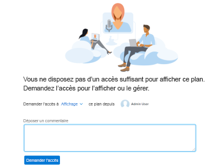

# Demande d’autorisations pour un plan dans l’[!DNL Scenario Planner]

<!--Audited: 11/2025-->

Vous pouvez demander des autorisations pour un plan dans le [!DNL Adobe Workfront Scenario Planner] lorsque le lien vers le plan est partagé avec vous.

## Conditions d’accès

+++ Développez pour afficher les exigences d’accès aux fonctionnalités de cet article. 

<table style="table-layout:auto"> 
 <col> 
 <col> 
 <tbody> 
  <tr> 
   <td> 
[!DNL Adobe Workfront] paquet
 </td> 
   <td> 
   
Workfront Ultimate

<b>NOTE</b>

Contactez votre représentant Workfront si vous disposez d’un autre package Workfront.

   </td> 
  </tr> 
  <tr> 
   <td> 
[!DNL Adobe Workfront] licence
 </td> 
   <td> 
[!UICONTROL Light] ou version ultérieure
 
   
[!UICONTROL Review] ou niveau supérieur
 </td> 
  </tr> 
    <tr> 
   <td>Configurations des niveaux d’accès</td> 
   <td> 
[!UICONTROL View] ou un accès supérieur à [!DNL Scenario Planner]
 </td> 
  </tr> 
 </tbody> 
</table>

Pour plus d’informations sur l’accès au planificateur de scénarios, voir [ Accès nécessaire pour utiliser le  [!DNL Scenario Planner]](../scenario-planner/access-needed-to-use-sp.md).

Pour plus d’informations sur les exigences d’accès à Workfront, voir [Documentation sur les exigences d’accès à Workfront](/help/quicksilver/administration-and-setup/add-users/access-levels-and-object-permissions/access-level-requirements-in-documentation.md).

+++

<!--Old:
<table style="table-layout:auto"> 
 <col> 
 <col> 
 <tbody> 
  <tr> 
   <td> 
[!DNL Adobe Workfront] plan*
 </td> 
   <td> <ul></li>
   <li>
New: Ultimate 
</li>
   
The Scenario Planner is not available for the new Workfront Select or Workfront Prime plans. 

   <li>
Current: [!UICONTROL Business] or higher
</ul>
   </td> 
  </tr> 
  <tr> 
   <td> 
[!DNL Adobe Workfront] license*
 </td> 
   <td> 
New: Light or higher
 
   
Current: [!UICONTROL Review] or higher
 </td> 
  </tr> 
  <tr> 
   <td>Product* </td> 
   <td> <ul><li>
For the new Workfront plans:

 Adobe Workfront</li>

   <li>
For the current Workfront plans: 

   
Adobe Workfront
 
Adobe Workfront Scenario Planner
</li></ul>
   
   
For more information, see <a href="../scenario-planner/access-needed-to-use-sp.md" class="MCXref xref">Access needed to use the [!DNL Scenario Planner]</a>. 
 </td> 
  </tr> 
  <tr data-mc-conditions=""> 
   <td>Access level </td> 
   <td>  
[!UICONTROL View] or higher access to the [!DNL Scenario Planner]
  </td> 
  </tr>
 </tbody> 
</table>-->

## Conditions préalables

Avant de pouvoir demander l’accès à un plan sur le [!DNL Scenario Planner], vous devez disposer des éléments suivants :

* Un lien vers le plan.

>[!NOTE]
>
>Si vous n’avez pas de droits de niveau d’accès au [!DNL Scenario Planner] et que vous essayez d’accéder à un plan à partir d’un lien, vous ne pouvez pas demander l’accès au plan. Au lieu de cela, un écran s’affiche et vous invite à contacter l’administrateur ou l’administratrice de [!DNL Workfront].

## Demander des autorisations pour les plans dans le [!DNL Workfront Scenario Planner]

Si vous n’avez pas encore d’autorisations pour un plan et que vous y accédez à partir d’un lien partagé avec vous, un écran s’affiche pour vous informer que vous n’avez pas les autorisations nécessaires pour consulter le plan. Vous recevez une invitation à demander des autorisations au créateur ou à la créatrice du plan.

>[!TIP]
>
>Vous ne pouvez demander des autorisations qu’auprès de la personne propriétaire ou créatrice d’un plan. Vous ne pouvez pas demander des autorisations à d’autres utilisateurs ou utilisatrices qui ont également accès au plan.

Pour demander des autorisations :

1. Cliquez sur un lien vers un plan.

   

1. Dans le menu déroulant **[!UICONTROL Demander l’accès à]**, indiquez le niveau d’autorisation que vous souhaitez obtenir. Sélectionnez l’une des options suivantes :

   * [!UICONTROL Afficher]
   * [!UICONTROL Gérer]

   Vous ne pouvez pas demander une autorisation supérieure à votre niveau d’accès au [!DNL Scenario Planner]. Par exemple, vous ne pouvez pas demander d’autorisations [!UICONTROL Gérer] si vous disposez de l’accès Afficher au [!DNL Scenario Planner].

   Pour plus d’informations sur les différents niveaux d’autorisations, voir [Partager un plan dans le  [!DNL Scenario Planner]](../scenario-planner/share-a-plan.md).

   Pour plus d’informations sur la façon dont un administrateur ou une administratrice de Workfront peut gérer l’accès au [!DNL Scenario Planner], voir [Accorder l’accès à [!DNL Scenario Planner]](../administration-and-setup/add-users/configure-and-grant-access/grant-access-sp.md).

1. (Facultatif) Saisissez un commentaire ou une demande dans la zone **[!UICONTROL Laisser un commentaire]**, puis cliquez sur **[!UICONTROL Demander l’accès]**.

   Ce qui suit se produit :

   * [!DNL Workfront] envoie une notification par e-mail au ou à la propriétaire du plan afin qu’il ou elle accorde les autorisations demandées.\
     

   * Une fois que le ou la propriétaire du plan a accordé les autorisations demandées, vous recevez un e-mail indiquant que les autorisations ont été accordées si votre administrateur ou administratrice de [!DNL Workfront] a activé la notification Partage d’objet avec l’utilisateur ou l’utilisatrice dans votre système et si vous avez activé la notification par e-mail [!UICONTROL Quelqu’un partage un objet avec moi] dans votre profil.

     

   * Vous pouvez également accorder des autorisations à des plans à partir de la zone [!UICONTROL Accueil] et de l’application mobile [!DNL Workfront].

   Pour plus d’informations sur l’activation des notifications système, voir [Configurer les notifications d’événements pour tous les utilisateurs et toutes les utilisatrices du système](../administration-and-setup/manage-workfront/emails/configure-event-notifications-for-everyone-in-the-system.md).

   Pour plus d’informations sur l’activation des notifications dans votre profil, voir [Notifications : informations diverses](../workfront-basics/using-notifications/notifications-misc-information.md).
