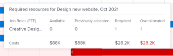
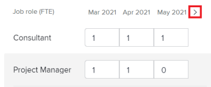

# Résoudre les conflits d’initiative dans le [!DNL Scenario Planner]

Lorsque des initiatives entrent en conflit les unes avec les autres, elles se disputent les mêmes ressources. Les ressources disponibles pour un scénario ne suffisent pas pour couvrir toutes les ressources requises par toutes les initiatives du scénario.

Cela peut se produire dans l’un des cas suivants :

* Le nombre de rôles requis pour l’initiative est supérieur au nombre de rôles prévu dans le budget du plan.
* Les coûts de l&#39;initiative sont supérieurs au budget disponible pour le plan.

## Conditions d’accès

+++ Développez pour afficher les exigences d’accès aux fonctionnalités de cet article.

<table style="table-layout:auto"> 
 <col> 
 <col> 
 <tbody> 
  <tr> 
   <td> 
[!DNL Adobe Workfront] forfait*
 </td> 
   <td> 
Actuel : [!UICONTROL Entreprise] ou version ultérieure

   
Nouveau : Ultimate 

   </td> 
  </tr> 
  <tr> 
   <td> 
[!DNL Adobe Workfront] licence*
 </td> 
   <td> 
Nouveau : Léger ou supérieur
 
   
Actuel : [!UICONTROL Révision] ou version ultérieure
 </td> 
  </tr> 
  <tr> 
   <td>Produit* </td> 
   <td> 
   
Pour les plans Workfront actuels : 

   
Vous devez acheter une licence supplémentaire pour le [!DNL Adobe Workfront Scenario Planner] afin d’accéder aux fonctionnalités décrites dans cet article.
 
Pour plus d’informations sur l’accès et les autorisations pour [!DNL Workfront Scenario Planner], voir <a href="../scenario-planner/access-needed-to-use-sp.md" class="MCXref xref">Accès nécessaire pour utiliser le [!DNL Scenario Planner]</a>. 
 </td> 
  </tr> 
  <tr data-mc-conditions=""> 
   <td>Niveau d’accès </td> 
   <td> 
Accès à l’accès à la fonction [!UICONTROL Modifier] [!DNL Scenario Planner]
 </td> 
  </tr> 
  <tr data-mc-conditions=""> 
   <td> 
Autorisations d’objet 
 </td> 
   <td> 
Autorisations [!UICONTROL Gérer] pour un plan
 
Pour plus d’informations sur la demande d’un accès supplémentaire à un plan, voir <a href="../scenario-planner/request-access-to-plan.md" class="MCXref xref">Demander l’accès à un plan dans le [!DNL Scenario Planner]</a>.
 </td> 
  </tr> 
 </tbody> 
</table>

*Pour plus d’informations, voir [Exigences d’accès à la documentation Workfront](/help/quicksilver/administration-and-setup/add-users/access-levels-and-object-permissions/access-level-requirements-in-documentation.md).

+++

## Résolution des conflits - Aperçu

* Un conflit est également compris comme une surallocation des rôles d&#39;emploi ou du budget d&#39;un scénario.
* Lorsque [!DNL Workfront] détecte un conflit, la barre correspondant au mois du conflit pendant la durée de l’initiative s’affiche en rouge. Cela peut se produire dans l’un des cas suivants :

   * Le nombre de rôles d&#39;emploi requis chaque mois pour une initiative est supérieur au nombre de rôles prévu dans le budget du plan, une fois que toutes les initiatives précédentes ont utilisé les ressources prévues dans le budget du plan.
   * Les coûts mensuels de l&#39;initiative sont plus élevés que le budget disponible pour le plan après que toutes les initiatives précédentes ont utilisé le budget du plan pour couvrir leurs coûts.

>[!TIP]
>
>Par défaut, le [!DNL Scenario Planner] suppose que vous avez budgété 0 rôle de tâche et 0 $ ou l’équivalent de 0 $ dans la devise de votre système pour un scénario, sauf indication contraire. Le nombre de rôles de tâche indique le nombre d’EPT (équivalents temps plein) ou d’heures budgétisées pour le rôle de tâche.
>
>Pour tous les calculs dans le planificateur de scénario, Workfront utilise la valeur suivante : 1 ETR = 8 Heures.
>
>Pour plus d’informations sur la mise à jour des rôles disponibles pour un plan et un budget, voir [Création et modification de plans dans le  [!DNL Scenario Planner]](../scenario-planner/create-and-edit-plans.md).

* Vous pouvez résoudre un conflit en effectuant l’une des opérations suivantes :

   * L’ajout automatique des ressources requises manquantes à partir des initiatives du scénario. Cet article décrit comment résoudre les conflits à l’aide de cette option.
   * Ajustement du rôle de tâche et des ressources de budget pour le scénario, en modifiant le plan. Pour plus d’informations, voir [Création et modification de plans dans  [!DNL Scenario Planner]](../scenario-planner/create-and-edit-plans.md).

## Résoudre les conflits entre les initiatives

1. Accédez à un plan pour lequel vous souhaitez résoudre les conflits.

   Pour plus d’informations sur la création de plans, voir [Création et modification de plans dans le  [!DNL Scenario Planner]](../scenario-planner/create-and-edit-plans.md).

   Pour plus d’informations sur la création d’initiatives, consultez la section [Créer et modifier des initiatives dans le [!DNL Scenario Planner]](../scenario-planner/create-and-edit-initiatives.md).

1. (Facultatif) Dans le menu déroulant **[!DNL Initial scenario]**, sélectionnez le scénario que vous souhaitez consulter.

   >[!TIP]
   >
   >Un plan peut avoir plusieurs scénarios. Lorsque vous observez les conflits du plan, [!DNL Workfront] fait référence aux ressources actuellement disponibles dans le scénario sélectionné et à celles requises dans les initiatives de ce scénario. Pour plus d’informations sur les scénarios, voir [Création et comparaison de scénarios de plan dans le [!DNL Scenario Planner]](../scenario-planner/create-and-compare-scenarios-for-a-plan.md).

1. Assurez-vous que l’option **[!UICONTROL Afficher les conflits]** est activée. Cette option est activée par défaut.

   

   La première initiative en conflit affiche les mois en conflit en rouge et une icône d’avertissement s’affiche en regard du nom de l’initiative.

   L&#39;arrière-plan de toutes les initiatives commençant par le premier conflit s&#39;affiche en rouge sur le graphique du plan.

   Lorsqu’une initiative présente un conflit, cela signifie que le nombre de postes pour au moins un rôle spécifique, les coûts engendrés, ou les deux, dépassent le nombre de postes ou le budget défini pour le plan pour un mois spécifique.

   

1. Pour en savoir plus sur les conflits qui peuvent exister, effectuez l’une des opérations suivantes :

   * Passez la souris sur l’icône d’avertissement en regard du nom de l’initiative pour déterminer si vous avez un rôle d’emploi ou un conflit de budget.

     

     Selon que vous avez suralloué des rôles de tâche ou surestimé des coûts pour votre initiative, vous pouvez voir l’une des options suivantes lorsque vous passez la souris sur l’icône d’avertissement :

      * Afficher les détails de conflit de fonction
      * Afficher les détails de conflit budgétaire
      * Afficher les détails du rôle et du budget de la tâche

   * Lorsque vous affichez le plan par mois, passez la souris sur un mois dans la chronologie du plan pour afficher les ressources nécessaires pour ce mois et si les conflits du mois sont liés aux personnes ou aux coûts.

     

     Consultez les informations mensuelles suivantes au niveau du plan :

      * Nombre de rôles de tâche disponibles, obligatoires et suralloués pour le mois pour toutes les initiatives prévues pour ce mois-ci.
      * les coûts disponibles, obligatoires et suralloués pour le mois pour toutes les initiatives prévues pour ce mois ;

        >[!TIP]
        >
        >Les coûts [!UICONTROL disponibles] correspondent au budget du scénario pour ce mois.

   * Passez la souris sur la barre rouge d’une initiative pendant un mois pour afficher la boîte d’informations supplémentaire sur le conflit qui se produit ce mois-ci.

     

     Vérifiez les champs suivants dans la boîte d’informations supplémentaires au niveau de l’initiative :

     <table style="table-layout:auto"> 
      <col> 
      <col> 
      <tbody> 
       <tr> 
        <td role="rowheader">Mois au moment du conflit</td> 
        <td>S’affiche dans le titre de la zone d’informations supplémentaires.</td> 
       </tr> 
       <tr> 
        <td role="rowheader">Nom de l’initiative</td> 
        <td>S’affiche dans le titre de la zone d’informations supplémentaires.</td> 
       </tr> 
       <tr> 
        <td role="rowheader">[!UICONTROL Rôles de tâche]</td> 
        <td> 
Les rôles d’emploi associés à cette initiative qui sont surchargés pour le mois sélectionné. Les colonnes suivantes affichent des informations pour chaque rôle de tâche requis pour le mois sélectionné et qui entre en conflit avec le nombre de rôles de tâche disponibles pour ce mois :
 
         <ul> 
          <li> 
<strong>[!UICONTROL Disponible]</strong> : nombre de chaque rôle de tâche disponible dans le scénario pour le mois sélectionné.
 </li> 
          <li> 
<strong>[!UICONTROL Obligatoire]</strong> : nombre de chaque rôle de tâche requis pour l’initiative pour le mois sélectionné.
 </li> 
          <li> 
<strong>[!UICONTROL Suralloué] :</strong> La différence entre le nombre requis pour l’initiative et le nombre disponible dans le scénario. 
 </li> 
         </ul> 
Conseil : Parfois, le nombre de rôles [!UICONTROL Disponible] correspond ou est supérieur au nombre de rôles [!UICONTROL Obligatoire], mais [!DNL Scenario Planner] affiche toujours une surallocation. Cela signifie qu’il existe des initiatives de haut rang qui ont déjà utilisé les rôles d’emploi disponibles dans le plan pour le même mois. 
 </td> 
       </tr> 
       <tr> 
        <td role="rowheader">Coûts</td> 
        <td> 
Les coûts de l'initiative pour le mois sélectionné. Les colonnes suivantes affichent les informations relatives aux coûts nécessaires et au budget disponible pour le mois sélectionné :
 
         <ul> 
          <li> 
<strong>[!UICONTROL Disponible]</strong> : budget disponible dans le plan pour le mois sélectionné.
 </li> 
          <li> 
<strong>[!UICONTROL Obligatoire]</strong> : coûts associés à cette initiative pour le mois sélectionné.
 </li> 
          <li> 
<strong>[!UICONTROL Suralloué] :</strong> La différence entre les coûts de l’initiative et le budget disponible dans le plan. 
 </li> 
         </ul> 
Conseil : Parfois, les coûts [!UICONTROL Disponible] correspondent ou sont supérieurs au coût [!UICONTROL Obligatoire] de l’initiative pour le mois sélectionné et le [!DNL Scenario Planner] affiche toujours une surallocation des coûts. Cela signifie qu'il existe des initiatives de haut rang qui utilisent déjà le budget disponible sur le plan pour le même mois. 
 </td> 
       </tr> 
      </tbody> 
     </table>

1. Pour ouvrir le panneau Détails de l’initiative, effectuez l’une des opérations suivantes et afficher plus d’informations sur l’emplacement des conflits, ainsi que pour les résoudre :

   * Cliquez sur l’icône d’avertissement en regard du nom de l’initiative.
   * Cliquez sur la barre d&#39;une initiative.
   * Cliquez sur l&#39;icône **[!UICONTROL Plus]**  à droite du nom de l&#39;initiative, puis cliquez sur **[!UICONTROL Modifier]**.

     Le panneau Détails de l’initiative s’affiche à droite.

     Lorsque vous n’avez pas suffisamment de personnes ou de budget pour votre initiative, une icône d’avertissement rouge s’affiche en regard des sections suivantes :

   * [!UICONTROL Rôles de tâche requis]
   * [!UICONTROL Coûts]

1. (Conditionnel) Pour les initiatives qui ont des conflits de rôles de tâche, accédez à la section **[!UICONTROL Rôles de tâche requis]** pour afficher tous les rôles de tâche requis pour votre initiative. Identifiez les rôles de tâche qui peuvent être surchargés. Examinez le nombre d’heures d’EPT nécessaires pour chaque rôle d’emploi pour chaque mois de l’initiative. La zone comportant le nombre d’heures ou d’ETR pour les mois avec des surallocations s’affiche dans une silhouette rouge.

   

1. (Facultatif) Cliquez sur la flèche pointant vers la droite située en regard des mois dans la chronologie de l’initiative pour afficher les mois supplémentaires qui présentent des conflits de rôles.

   

1. (Facultatif) Cliquez sur **[!UICONTROL Afficher les détails]** sous le rôle de tâche qui affiche un conflit pour voir où les conflits apparaissent et pour mettre en évidence les mois en conflit dans la zone de graphique du plan. Des informations supplémentaires s’affichent pour chaque rôle de tâche.

   Les champs suivants s’affichent pour chaque rôle de tâche :

   <table style="table-layout:auto"> 
    <col> 
    <col> 
    <tbody> 
     <tr> 
      <td role="rowheader">[!UICONTROL Disponible]</td> 
      <td> 
Le nombre de rôles de tâche disponibles dans le plan pour chaque mois. 
 </td> 
     </tr> 
     <tr> 
      <td role="rowheader">[!UICONTROL Antérieurement alloué]</td> 
      <td>Le nombre de rôles d’emploi déjà alloué du budget du plan aux initiatives de haut rang pour un mois donné. </td> 
     </tr> 
     <tr> 
      <td role="rowheader">[!UICONTROL Suralloué]</td> 
      <td> 
La différence entre le nombre de rôles d'emploi requis à l'initiative et le nombre disponible dans le plan après des initiatives de haut rang utilisait également certains des rôles. Workfront calcule le nombre de rôles de tâche [!UICONTROL Suralloué] à l’aide de la formule suivante :
 
<code>Overallocated roles = (Roles Previously Allocated to higher initiatives + Required roles for current initiative) - Monthly available roles from the plan</code> 
 </td> 
     </tr> 
    </tbody> 
   </table>

   >[!TIP]
   >
   >Sur le graphique du plan, les mois au cours desquels les rôles d&#39;emploi sont attribués affichent le nom et le nombre de rôles nécessaires pour chaque initiative où ils sont nécessaires. Vous devez sélectionner la vue [!UICONTROL Month] pour afficher le nom des rôles de tâche.

   

1. Pour résoudre des conflits de rôle de tâche, effectuez l’une des opérations suivantes :

   * Réglez manuellement le nombre de rôles de tâche pour chaque mois de l’initiative sur un nombre inférieur.
   * Passez la souris sur le nom du rôle de tâche et cliquez sur l’icône **[!UICONTROL delete]**  pour supprimer le rôle de tâche de l’initiative.
   * Sélectionnez **[!UICONTROL Ajouter des rôles aux ressources disponibles du scénario]**, puis cliquez sur **[!UICONTROL Appliquer]**.

     Cela ajoute le nombre manquant d’heures ou d’éditeur de rôle de tâche au champ [!UICONTROL Available] du scénario.

     >[!NOTE]
     >
     >Les rôles que vous ajoutez pour résoudre les conflits modifient les rôles de tâche [!UICONTROL Available] pour le scénario sélectionné et non pour tous les scénarios du plan.

     Une flèche verte pointant vers le haut  s’affiche pour le mois dans la chronologie du plan pour indiquer que davantage de ressources ont été ajoutées au plan ce mois-là. Vous devez sélectionner la vue [!UICONTROL Month] pour afficher cet indicateur.

   * (Conditionnel) Fermez le panneau Détails et donnez à l’initiative une priorité plus élevée pour recevoir d’abord les ressources budgétaires du plan, si possible. Pour plus d’informations sur la mise à jour de la priorité des initiatives, voir [Mise à jour des priorités des initiatives dans le planificateur de scénario](../scenario-planner/prioritize-initiatives.md).

1. (Facultatif) Cliquez sur **[!UICONTROL Masquer les détails]** pour fermer la boîte de détails supplémentaire, puis cliquez sur **[!UICONTROL Appliquer]** pour enregistrer les modifications que vous apportez aux rôles de tâche.

1. (Conditionnel) Pour les initiatives présentant des conflits de coûts, accédez à la section **[!UICONTROL Coûts]** du panneau Détails de l’initiative afin d’examiner les coûts pour chaque mois de la durée de l’initiative. Identifiez les mois qui pourraient ne pas avoir assez d&#39;argent dans le budget du plan pour couvrir les coûts de l&#39;initiative sélectionnée. La boîte avec le budget disponible insuffisant s&#39;affiche dans une silhouette rouge.
1. (Facultatif) Cliquez sur la flèche pointant vers la droite située en regard des mois dans la chronologie de l’initiative pour afficher les mois supplémentaires dont le budget est insuffisant pour couvrir les coûts.

   

1. (Facultatif) Cliquez sur **[!UICONTROL Afficher les détails]** sous les informations de coût pour voir où le conflit apparaît et pour mettre en évidence les mois en conflit sur le graphique du plan. Les champs supplémentaires suivants s&#39;affichent pour chaque type de coût :

   <table style="table-layout:auto"> 
    <col> 
    <col> 
    <tbody> 
     <tr> 
      <td role="rowheader">[!UICONTROL Disponible]</td> 
      <td> 
Les coûts disponibles sur le budget du plan pour chaque mois. 
 </td> 
     </tr> 
     <tr> 
      <td role="rowheader">[!UICONTROL Antérieurement alloué]</td> 
      <td>La somme d'argent déjà allouée du budget du plan aux initiatives de haut rang. </td> 
     </tr> 
     <tr> 
      <td role="rowheader">[!UICONTROL Suralloué]</td> 
      <td> 
La différence mensuelle entre les coûts nécessaires à l'initiative et le montant de l'argent disponible sur le budget du plan après que des initiatives de haut rang ont également utilisé une partie du budget disponible. [!DNL Workfront] calcule le nombre de coûts suralloués en utilisant la formule suivante :
 
<code>Overallocated costs = (Costs Previously Allocated to higher initiatives + Required costs for the current initiative) - Monthly available budget from the plan</code> 
 
[!DNL Workfront] calcule les coûts requis pour l’initiative actuelle pour chaque mois à l’aide de la formule suivante :
 
<code>Required initiative costs = Initiative Fixed Costs + Initiative People Costs</code> 
 </td> 
     </tr> 
    </tbody> 
   </table>

   >[!TIP]
   >
   >Sur le graphique du plan, les mois où les coûts sont insuffisants affichent le nom et le nombre de rôles encore nécessaires pour l&#39;initiative. Vous devez sélectionner la vue Mois pour visualiser les montants de coût.

   

   >[!NOTE]
   >
   >Si vous avez désactivé le paramètre [!UICONTROL Inclure le coût des personnes] pour la zone [!UICONTROL Budget] du plan lors de la création du plan, la ligne [!UICONTROL Coût des personnes] ne s’affiche pour aucune initiative dans aucun scénario. Dans ce cas, Workfront ne prend pas les coûts des personnes dans les calculs pour déterminer les conflits de coûts. Pour plus d’informations sur la création d’un plan, voir [Création et modification de plans dans le  [!DNL Scenario Planner]](../scenario-planner/create-and-edit-plans.md).

1. Pour résoudre les conflits de coûts, effectuez l’une des opérations suivantes :

   * Réglez manuellement le nombre de [!UICONTROL Coûts fixes] pour chaque mois de l’initiative sur un nombre inférieur.
   * Dans la section **[!UICONTROL Rôles de tâche requis]** , ajustez manuellement le nombre de rôles de tâche pour le mois avec un budget &quot;Coûts du personnel&quot;, si possible. Cela réduit le nombre de coûts de personnes.

     >[!TIP]
     >
     >Vous ne pouvez pas ajuster manuellement les coûts des personnes.

   * Sélectionnez **[!UICONTROL Ajouter un montant au budget du scénario]**, puis cliquez sur **[!UICONTROL Appliquer]**.

     Cela ajoute le montant insuffisant au budget du scénario pour les mois où il était absent, ce qui met également à jour le budget global du scénario.

     >[!NOTE]
     >
     >Le montant que vous ajoutez pour résoudre les conflits de coûts modifie le budget pour le scénario sélectionné et non pour tous les scénarios du plan.

   * (Conditionnel) Fermez le panneau Détails et donnez à l’initiative une priorité plus élevée pour recevoir d’abord les ressources budgétaires du plan, si possible. Pour plus d’informations sur la mise à jour de la priorité des initiatives, voir [Mise à jour des priorités des initiatives dans le  [!DNL Scenario Planner]](../scenario-planner/prioritize-initiatives.md).

1. Cliquez sur **[!UICONTROL Appliquer]** lorsque vous apportez des modifications à la section Coûts.
1. Cliquez sur **[!UICONTROL Enregistrer le plan]** pour enregistrer vos modifications.

