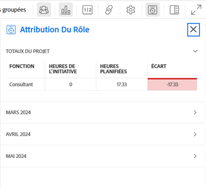

# Afficher l’affectation des rôles pour les projets et les initiatives dans l’[!UICONTROL équilbreur de charge de travail]

<!--Audited: 07/2024-->

Une fois que vous avez connecté les projets et les initiatives, vous pouvez gérer l’affectation de leurs ressources en parallèle pour vous assurer qu’elles correspondent. Cela permet d’éviter de les suraffecter ou de les sous-utiliser.

Cet article décrit comment vous pouvez réconcilier les ressources en utilisant le panneau [!UICONTROL Affectation des rôles] dans l’[!UICONTROL équilibreur de charge de travail] d’un projet.

Pour des informations générales sur la réconciliation des ressources entre les projets et les initiatives, y compris les conditions préalables, voir [Vue d’ensemble de la réconciliation des affectations de ressources entre les projets et les initiatives](../scenario-planner/overview-reconcile-allocations-between-projects-initiatives.md).

## Conditions d’accès

+++ Développez pour afficher les exigences d’accès aux fonctionnalités de cet article.

<table style="table-layout:auto"> 
 <col> 
 <col> 
 <tbody> 
  <tr> 
   <td> 
[!DNL Adobe Workfront] formule*
 </td> 
   <td> <ul></li>
   <li>
Nouveau : Ultimate 
</li>
   
Le planificateur de scénario n’est pas disponible pour les nouveaux plans Workfront Select ou Workfront Prime. 

   <li>
Actuel : [!UICONTROL Business] ou de niveau supérieur
</ul>
   </td> 
  </tr> 
  <tr> 
   <td> 
[!DNL Adobe Workfront] licence*
 </td> 
   <td> 
Nouveau : Light ou supérieur
 
   
Actuel : [!UICONTROL Révision] ou version ultérieure
 </td> 
  </tr> 
  <tr> 
   <td>Produit* </td> 
   <td> <ul><li>
Pour les nouveaux plans Workfront :

 Adobe Workfront</li>

   <li>
Pour les plans Workfront actuels : 

   
Adobe Workfront
 
Planificateur de scénarios Adobe Workfront
</li></ul>

Pour plus d’informations, voir <a href="../scenario-planner/access-needed-to-use-sp.md" class="MCXref xref">Accès nécessaire pour utiliser [!DNL Scenario Planner]</a>. 
 </td> 
  </tr> 
  <tr data-mc-conditions=""> 
   <td>Niveau d’accès </td> 
   <td> 
Affichage ou accès supérieur à la console Projets.
 </td> 
  </tr> 
  <tr data-mc-conditions=""> 
   <td> 
Autorisations d’objet 
 </td> 
   <td> 
 Autorisation d’affichage ou supérieure d’un projet.
 </td> 
  </tr> 
 </tbody> 
</table>

*Pour plus d’informations, voir [Exigences d’accès à la documentation Workfront](/help/quicksilver/administration-and-setup/add-users/access-levels-and-object-permissions/access-level-requirements-in-documentation.md).

+++

## Afficher l’affectation des rôles pour les projets et les initiatives dans l’[!UICONTROL équilibreur de charge de travail]

Si votre entreprise a acheté une licence [!DNL Workfront Scenario Planner], vous pouvez réconcilier les affectations de ressources entre l’initiative et le projet associé dans l’[!UICONTROL équilibreur de charge de travail] au niveau du projet.

1. (Le cas échéant) Connecter un projet à une initiative en utilisant l’une des méthodes décrites dans les articles suivants :

   * [Importer des projets vers des plans dans le  [!DNL Adobe Workfront Scenario Planner]](import-projects-to-plans.md).
   * [Mettre à jour ou créer des projets en publiant des initiatives sur le  [!DNL Adobe Workfront Scenario Planner]](publish-scenarios-update-projects.md).

   >[!IMPORTANT]
   >
   >Si vous modifiez les ressources de l’initiative, vous devez republier le scénario auquel elle appartient pour que les dernières informations sur les ressources de l’initiative soient mises à jour dans le projet.

1. Accédez au projet pour lequel vous souhaitez revoir l’affectation des fonctions pour le projet et l’initiative associée.
1. Cliquez sur [!UICONTROL Équilibreur de charge de travail] dans le panneau de gauche.

   Vous devrez peut-être cliquer sur **[!UICONTROL Planification]**, puis sur **[!UICONTROL Passer à l’équilibreur de charge]**.

1. Utilisez l’une des méthodes suivantes :

   * Cliquez sur **[!UICONTROL Mois]** pour afficher l’équilibreur de charge de travail par mois, puis sur le menu déroulant à côté d’un mois dans le journal , et enfin sur **[!UICONTROL Plus]**.
   * Cliquez sur l’icône **[!UICONTROL Afficher l’affectation des rôles]**  dans le coin supérieur droit de la barre d’outils.

   Le panneau [!UICONTROL Affectation des rôles] s’affiche.

   

   >[!CAUTION]
   >
   >Bien que vous puissiez afficher le panneau [!UICONTROL Affectation des rôles] même si votre organisation n’a pas acheté de licence [!DNL Workfront Scenario Planner], vous ne pouvez pas afficher d’informations sur les fonctions des initiatives.

   <!--
   
(NOTE: ensure this step stays 5 to match the mention of it in the section below)

   -->

1. Examinez les informations suivantes dans la zone **[!UICONTROL Totaux du projet]** du panneau Affectation des rôles :

   <table style="table-layout:auto"> 
    <col> 
    <col> 
    <tbody> 
     <tr> 
      <td role="rowheader">[!UICONTROL Job Role]</td> 
      <td> 
Les noms des fonctions associées à l’un des éléments suivants :
 
       <ul> 
        <li> 
tâches du projet
 </li> 
        <li> 
problèmes du projet
 </li> 
        <li> 
initiative liée au projet
 </li> 
       </ul> </td> 
     </tr> 
     <tr> 
      <td role="rowheader">[!UICONTROL Initiative Hours]</td> 
      <td>Le nombre d’heures requises associées à chaque fonction dans le cadre de l’initiative pour la durée totale de l’initiative. </td> 
     </tr> 
     <tr> 
      <td role="rowheader">[!UICONTROL Planned Hours]</td> 
      <td>Nombre d’heures prévues associées à chaque fonction dans les tâches ou les problèmes du projet pour la durée totale du projet. </td> 
     </tr> 
     <tr> 
      <td role="rowheader">[!UICONTROL Variance]</td> 
      <td> 
Différence entre les heures nécessaires à l’initiative et le nombre d’heures prévues associées au travail sur le projet. [!DNL Workfront] calcule la [!UICONTROL Variance] à l’aide de cette formule :
 
<code>Role Allocation Variance = Initiative Hours - Planned Hours</code> 
 
Lorsque les ressources sont prévues pour un nombre d’heures supérieur à celui requis par l’initiative, la [!UICONTROL Variance] est négative et s’affiche en rouge. Cela signifie que vos ressources sont surallouées. 
 </td> 
     </tr> 
    </tbody> 
   </table>

   >[!TIP]
   >
   >Les heures prévues du projet ne s’affichent pas dans les scénarios suivants :
   >
   >   
   >   
   >   * Lorsque des tâches ou des problèmes ne sont pas affectés à des fonctions ou à des utilisateurs et utilisatrices auxquels une fonction est associée.
   >   * Lorsque les tâches ou les problèmes ont une [!UICONTROL durée] de zéro.
   >   
   >

1. (Facultatif) Si la colonne [!UICONTROL Variance] indique que vos ressources sont surallouées, procédez à l’un des ajustements suivants :

   * Diminuez le nombre d’heures prévues pour une fonction présentant trop d’affectations ou ajoutez plus de ressources aux tâches et distribuez plus d’heures prévues aux nouvelles ressources. Vous pouvez mettre à jour les affectations ou le nombre d’heures prévues sur les tâches ou les problèmes lors de leur modification. Pour plus d’informations, voir les articles suivants :

      * [Modifier des tâches](../manage-work/tasks/manage-tasks/edit-tasks.md)
      * [Modifier des problèmes](../manage-work/issues/manage-issues/edit-issues.md)

     >[!NOTE]
     >
     >Vous devez disposer d’un accès et d’autorisations supplémentaires pour modifier les tâches et les problèmes.

   * Augmentez le nombre d’heures requises pour la fonction présentant trop d’affectations sur l’initiative. Pour plus d’informations, voir [Créer et modifier des initiatives dans le  [!DNL Adobe Workfront Scenario Planner]](create-and-edit-initiatives.md).

     >[!NOTE]
     >
     >Vous devez disposer d’un accès et d’autorisations supplémentaires pour modifier les plans.

1. (Facultatif) Cliquez sur l’icône de liste déroulante pour développer l’un des mois dans le panneau [!UICONTROL Allocation des rôles] ou dans la chronologie de l’[!UICONTROL équilibreur de charge de travail].

   

   Le même type d’informations que celles affichées dans la zone [!UICONTROL Totaux des projets] s’affiche également pour chaque mois.

   >[!TIP]
   >
   >Les mois répertoriés dans le panneau [!UICONTROL Allocation des rôles] sont les mois de la chronologie affichée à l’écran dans l’[!UICONTROL équilibreur de charge de travail]. Faites défiler la chronologie vers l’arrière ou vers l’avant pour voir les mois supplémentaires.

   <!--
   <li value="8" data-mc-conditions="QuicksilverOrClassic.Draft mode"> 
 
 </li>
   -->

