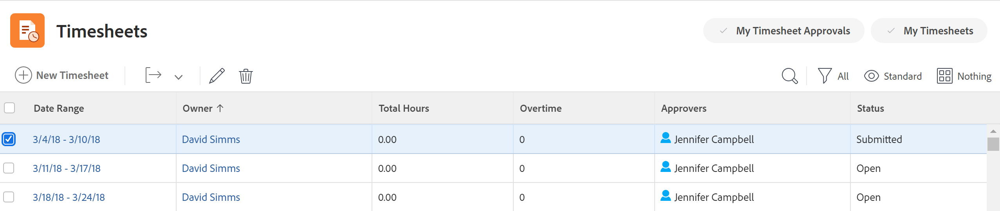

# Suppression de feuilles de temps dans Adobe Workfront

Les modifications apportées à un profil de feuille de temps ne sont pas effectives immédiatement pour les feuilles de temps existantes, comme expliqué dans la section [Création, modification et affectation de profils de feuille de temps](../../timesheets/create-and-manage-timesheets/create-timesheet-profiles.md). Pour rendre les modifications visibles sur les feuilles de temps existantes, vous devez supprimer les feuilles de temps qui ont été générées et en générer de nouvelles. Cela s’applique uniquement aux feuilles de temps générées en associant des profils de feuille de temps aux utilisateurs.

>[!NOTE]
>
>Les feuilles de temps créées manuellement ne peuvent pas être recréées en régénérant les feuilles de temps, sauf si les utilisateurs ont été associés à un profil de feuille de temps depuis la création manuelle de la feuille de temps. La suppression d’une feuille de temps créée manuellement peut entraîner une perte de données. Pour plus d’informations sur la création d’une seule feuille de temps, voir [Création d’une feuille de temps à usage unique](../../timesheets/create-and-manage-timesheets/create-tmshts.md).

Les administrateurs Adobe Workfront ou les administrateurs de groupe peuvent générer des feuilles de temps pour tous les membres du système. Pour plus d’informations sur la génération manuelle de feuilles de temps, voir :

* [Génération manuelle de feuilles de temps](../../timesheets/create-and-manage-timesheets/manually-generate-timesheets.md)
* [Création et gestion des profils de feuille de temps d’un groupe](../../administration-and-setup/manage-groups/work-with-group-objects/create-and-modify-a-groups-timesheet-profiles.md)

>[!IMPORTANT]
>
>* Vous ne pouvez pas récupérer une feuille de temps supprimée.
>* Nous vous recommandons de ne pas supprimer les feuilles de temps antérieures, car elles ne sont pas générées automatiquement en fonction des profils de la feuille de temps. Vous pouvez supprimer les feuilles de temps actuelles et futures et les générer manuellement si vous souhaitez que les modifications apportées aux profils de votre feuille de temps soient immédiatement visibles dans les nouvelles feuilles de temps.
>* Lorsque vous supprimez des feuilles de temps, les heures consignées par rapport aux tâches, problèmes et projets ne sont pas supprimées. Seules les Heures générales sont supprimées avec la feuille de temps. Dans un éditeur de texte distinct, notez les heures générales associées à la feuille de temps. Une fois la feuille de temps supprimée, vous pouvez la consigner dans la nouvelle feuille de temps.
>

## Exigences d’accès

Les étapes de cet article doivent être les suivantes :

<table style="table-layout:auto"> 
 <col> 
 <col> 
 <tbody> 
  <tr> 
   <td role="rowheader">Formule Adobe Workfront</td> 
   <td> 
Tous
 </td> 
  </tr> 
  <tr> 
   <td role="rowheader">Licence Adobe Workfront</td> 
   <td> 
Plan 
 </td> 
  </tr> 
  <tr> 
   <td role="rowheader">Paramétrages du niveau d'accès*</td> 
   <td> 
Vous devez disposer d’un accès administratif aux feuilles de calcul. 
 
Pour plus d’informations, voir <a href="../../administration-and-setup/add-users/configure-and-grant-access/grant-users-admin-access-certain-areas.md" class="MCXref xref">Octroi aux utilisateurs un accès administratif à certaines zones</a>.
 
Si vous n’avez toujours pas accès à , demandez à votre administrateur Workfront s’il définit des restrictions supplémentaires à votre niveau d’accès. Pour plus d’informations sur la façon dont un administrateur Workfront peut modifier votre niveau d’accès, voir <a href="../../administration-and-setup/add-users/configure-and-grant-access/create-modify-access-levels.md" class="MCXref xref">Création ou modification de niveaux d’accès personnalisés</a>.
 </td> 
  </tr> 
 </tbody> 
</table>

*Pour connaître le plan, le type de licence ou l’accès dont vous disposez, contactez votre administrateur Workfront.

## Suppression de feuilles de temps dans une liste

1. Cliquez sur le bouton **Menu Principal** icon  dans le coin supérieur droit d’Adobe Workfront.

1. Cliquez sur **Feuilles de temps**. Le **Tous** est sélectionné par défaut et affiche toutes les feuilles de temps auxquelles vous avez accès.

   

1. (Facultatif) Pour mettre à jour le filtre dans la liste des feuilles de temps, effectuez l’une des opérations suivantes :

   * Sélectionner **Mes approbations de la feuille de temps** dans le coin supérieur droit de la page pour afficher uniquement les feuilles de temps que vous approuvez

      Ou

      Sélectionner **Mes feuilles de calcul** pour afficher uniquement vos feuilles de temps.

      Cela applique les filtres Mes approbations de feuille de temps ou Ma feuille de temps à la liste des feuilles de temps.

      

   * Cliquez sur l’icône Filtrer  pour appliquer un autre filtre ou en créer un nouveau. Pour plus d’informations sur la création ou la mise à jour de filtres, voir [Création ou modification de filtres dans Adobe Workfront](../../reports-and-dashboards/reports/reporting-elements/create-filters.md).
   >[!NOTE]
   Les options Mes approbations de feuille de temps et Mes feuilles de temps ne s’affichent pas en haut de la liste de feuille de temps ni dans la liste des filtres si votre administrateur Workfront ou un administrateur de groupe a supprimé les filtres Mes approbations de feuille de temps et Mes feuilles de temps des commandes de liste de la zone Configuration ou de votre modèle de mise en page. Pour plus d’informations, voir les articles suivants :
   * [Personnalisation des filtres, des vues et des groupes à l’aide d’un modèle de mise en page](../../administration-and-setup/customize-workfront/use-layout-templates/customize-fvg-list-controls-layout-template.md)

1. (Facultatif) Cliquez sur le **Affichage**  ou **Regroupement**  pour appliquer une autre vue ou un autre groupement ou en créer une nouvelle.

   Pour plus d’informations sur la création de filtres, de vues ou de regroupements, consultez les articles suivants :

   * [Création ou modification de filtres dans Adobe Workfront](../../reports-and-dashboards/reports/reporting-elements/create-filters.md)
   * [Création ou modification de vues dans Adobe Workfront](../../reports-and-dashboards/reports/reporting-elements/create-edit-views.md)
   * [Création de groupes dans Adobe Workfront](../../reports-and-dashboards/reports/reporting-elements/create-groupings.md)

1. Sélectionnez une ou plusieurs feuilles de temps à supprimer, puis cliquez sur le bouton **Supprimer**   en haut de la liste des feuilles de temps.

1. Cliquez sur **Supprimer**.

   Les feuilles de temps sélectionnées sont supprimées et ne peuvent pas être récupérées.

   Pour générer de nouvelles feuilles de temps, assurez-vous que les utilisateurs sont associés à un profil de feuille de temps et demandez à l’administrateur Workfront ou à un administrateur de groupe de générer de nouvelles feuilles de temps.

   Pour plus d’informations, voir :

   * [Création, modification et affectation de profils de feuille de temps](../../timesheets/create-and-manage-timesheets/create-timesheet-profiles.md)
   * [Génération manuelle de feuilles de temps](../../timesheets/create-and-manage-timesheets/manually-generate-timesheets.md)
   * [Création et gestion des profils de feuille de temps d’un groupe](../../administration-and-setup/manage-groups/work-with-group-objects/create-and-modify-a-groups-timesheet-profiles.md)

## Suppression d’une feuille de temps de la page de feuille de temps

1. Cliquez sur le bouton [!UICONTROL **Menu Principal**] icon  dans le coin supérieur droit d’Adobe Workfront.
1. Cliquez sur la feuille de temps à supprimer pour l’ouvrir.
1. Cliquez sur le bouton [!UICONTROL **Plus**] icon  à droite du nom de la feuille de temps, puis cliquez sur **Supprimer**.

   
1. Cliquez sur [!UICONTROL **Supprimer**] pour confirmer.

   La feuille de temps est supprimée et ne peut pas être récupérée.
