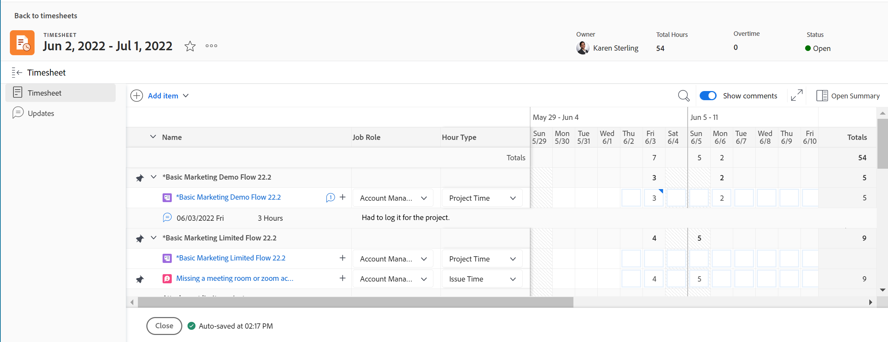
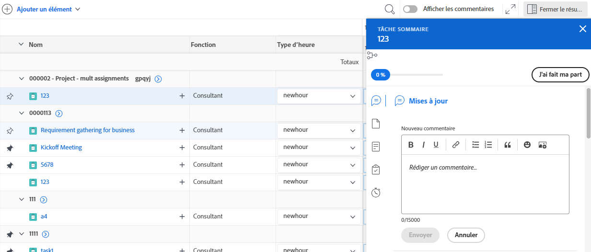
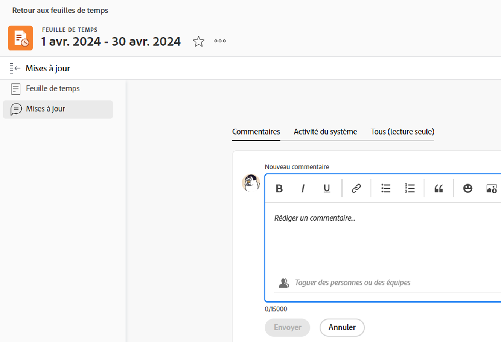
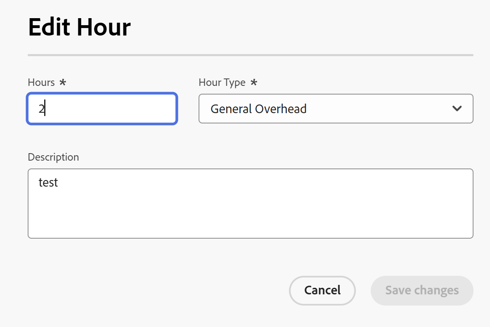

# Enregistrer des heures

{{highlighted-preview}}

<!--Audited: 5/2025-->

<!--remove all preview and production references if any-->
<!--update screen shots for the general hour entries and the mixed selection of hours at production, if they fixed the bugs -->

Vous pouvez consigner les heures passées sur un élément de travail dans Adobe Workfront pour refléter le fruit de vos efforts. Vous pouvez également consigner les heures qui ne sont pas liées au travail, comme les vacances, les congés maladie ou le temps passé en réunion. Les heures que vous consignez s’affichent dans votre feuille de temps.

Pour plus d’informations sur les types d’heures que vous pouvez consigner dans Workfront, voir [Gérer les types d’heures](../../administration-and-setup/set-up-workfront/configure-timesheets-schedules/hour-types.md).

## Conditions d’accès

+++ Développez pour afficher les exigences d’accès aux fonctionnalités de cet article.

<table style="table-layout:auto"> 
 <col> 
 <col> 
 <tbody> 
  <tr> 
   <td>Package Adobe Workfront</td> 
   <td> 
Tous
 </td> 
  </tr> 
  <tr> 
   <td role="rowheader">Licence Adobe Workfront</td> 
   <td> 
   <ul><li>
Léger ou supérieur pour enregistrer des heures sur une tâche, un événement un projet ou des heures générales sur une feuille de temps
</li>
   <li>
Standard pour enregistrer des heures sur des projets
</li></ul>

Ou : 

<ul><li>
Autorisations Réviser ou supérieures pour consigner les heures générales dans une feuille de temps.
</li>
   <li>
Travail ou supérieur pour consigner les heures liées à un projet, à une tâche ou à un problème
</li></ul> </td> 
  </tr> 
  <tr> 
   <td>Configurations du niveau d’accès</td> 
   <td> 
Accès à la modification pour le type d’élément de travail pour lequel vous consignez les heures. 
 
Par exemple, pour consigner les heures consacrées à un problème, vous avez besoin d’un accès en modification aux problèmes.
 </td>
  </tr> 
  <tr> 
   <td>Autorisations d’objet</td>
   <td> 
Autorisations Contribuer ou supérieures pour l’élément de travail pour lequel vous consignez les heures, avec les autorisations permettant de consigner les heures.
 </td>
  </tr> 
 </tbody> 
</table>

Pour plus d’informations, voir [Conditions d’accès requises dans la documentation Workfront](/help/quicksilver/administration-and-setup/add-users/access-levels-and-object-permissions/access-level-requirements-in-documentation.md).

+++

## Points à prendre en compte lors de la consignation des heures dans Workfront

* Vous pouvez consigner les heures consacrées à des projets, des tâches ou des problèmes, ou vous pouvez consigner les heures directement dans votre feuille de temps.

  Pour plus d’informations sur la création de feuilles de temps, voir [Créer une feuille de temps à usage unique](../../timesheets/create-and-manage-timesheets/create-tmshts.md).

* Toutes les heures consignées à l’aide d’outils autres que la feuille de temps apparaissent dans celle-ci pour la période correspondante.
* Les tâches et les problèmes d’un projet qui n’est pas actif ne sont pas préremplis dans les feuilles de temps.
* Les heures consignées dans la feuille de temps sont immédiatement appliquées à la tâche, au problème ou au projet.
* Les feuilles de temps comprennent le total des heures pour toutes les dates consignées. Les week-ends sont toujours inclus, même lorsque les calculs de chronologie ont été configurés pour les exclure (comme décrit dans la section [Configurer les préférences du projet à l’échelle du système](../../administration-and-setup/set-up-workfront/configure-system-defaults/set-project-preferences.md)).
* Le nombre maximal d’éléments affichés dans une feuille de temps est de 45. Si plus de 45 éléments coïncident avec la période de la feuille de temps, seuls les éléments les plus récemment mis à jour s’affichent.
* Les entrées d’heures correspondant aux enregistrements de facturation sont grisées et ne peuvent pas être modifiées dans la feuille de temps. Pour plus d’informations, voir [Créer des enregistrements de facturation](../../manage-work/projects/project-finances/create-billing-records.md).
* Les tâches personnelles ne s’affichent pas par défaut sur la feuille de temps. Les tâches personnelles ne s’affichent dans la feuille de temps que lorsque leurs heures ont été consignées. Après avoir consigné les heures passées sur une tâche personnelle, vous pouvez épingler la tâche sur la feuille de temps. Celle-ci restera sur la feuille de temps aussi longtemps qu’elle sera épinglée. Pour plus d’informations, voir [Création d’éléments de travail et de projets à partir de la zone Accueil](../../workfront-basics/using-home/using-the-home-area/create-work-items-in-home.md).

## Enregistrer des heures {#log-time-section}

Vous pouvez consigner les heures dans les zones suivantes de Workfront :

* [Feuille de temps](#timesheet)
* [Accueil](#home)
* [Projet, tâche ou problème](#project-task-or-issue)
* [Panneau Résumé](#summary-panel)
* [Panneaux](#boards)
* [Application mobile](#mobile-app)

### Feuille de temps {#timesheet}

#### Consigner les heures sur une feuille de temps {#log-time-on-a-timesheet}

Vous pouvez consigner les heures consacrées aux éléments suivants sur la feuille de temps :

* Tâches, problèmes et projets préremplis qui s’affichent automatiquement, en fonction de la manière dont votre administrateur ou administratrice Workfront définit les préférences de la feuille de temps. Pour plus d’informations sur la manière dont les feuilles de temps sont préremplies, voir [Configurer les préférences en matière de feuilles de temps et d’heures](../../administration-and-setup/set-up-workfront/configure-timesheets-schedules/timesheet-and-hour-preferences.md).

  Seuls les problèmes et les tâches qui vous ont été affectés sont préremplis dans votre feuille de temps. Les problèmes et les tâches attribués à vos équipes ou à vos fonctions n’apparaissent pas automatiquement sur votre feuille de temps.

  En cliquant sur Travailler sur ce projet sur un élément assigné à vos équipes, l’élément vous est affecté et s’affiche dans votre feuille de temps.

* Tâches, problèmes ou projets que vous ajoutez manuellement.
* Tâches, problèmes ou projets pour lesquels vous avez déjà consigné des heures ailleurs dans Workfront.
* Durée générale (vacances, formation, durée supplémentaire).

>[!NOTE]
>
>Les personnes chargées de la révision qui sont affectées à un profil de feuille de temps peuvent voir la zone des feuilles de temps et consigner les heures générales. Cependant, elles ne peuvent pas consigner d’heures sur les tâches ou les problèmes qui leur sont assignés et qui apparaissent sur la feuille de temps.

Pour consigner les heures sur une feuille de temps, procédez comme suit :

{{step1-click-main-menu}}

1. Cliquez sur [!UICONTROL **Feuilles de temps**]. Votre feuille de temps actuelle s’affiche par défaut.
   

1. (Facultatif) Cliquez sur l’icône **full-screen**  pour afficher la feuille de temps en mode plein écran, puis sur l’icône **exit-full-screen**  pour revenir à la feuille de temps.

   <!-- drafted for the resize columns in timesheet story: 1. (optional) Click on the separator lines between weeks or between the time frame area and the work item area to resize the columns of the timesheet.-->

1. (Facultatif) Pour ajouter un projet, une tâche ou un problème à la feuille de temps, cliquez sur le menu déroulant **Ajouter un élément** dans le coin supérieur gauche de la feuille de temps, puis sur **Ajouter des projets**, **Ajouter des tâches** ou **Ajouter des problèmes**.

   Une liste de projets, de tâches ou de problèmes s’affiche.

   <!--drafted for full screen mode for add projects story - align it with the rest of the steps when you enable this:: 1. (Optional) Click the **full-screen** icon  to display the list of objects in full-screen mode.-->

1. (Facultatif) Cliquez sur l’icône de recherche  pour rechercher à l’aide d’un mot-clé un élément spécifique à ajouter à la feuille de temps.

1. (Facultatif) Développez les menus déroulants Filtre, Vue ou Regroupement pour effectuer et personnaliser une action de menu correspondante et pour afficher les informations sur l’élément que vous souhaitez.

1. Sélectionnez un ou plusieurs éléments dans la liste, puis cliquez sur **Ajouter**.

   Si vous avez ajouté moins de 50 éléments en une seule fois, ceux-ci sont ajoutés à la feuille de temps. Les tâches et les problèmes sont répertoriés sous le nom du projet.

   >[!NOTE]
   >
   >Lorsque vous ajoutez des tâches ou des problèmes à la feuille de temps, le projet est également ajouté.

1. (Le cas échéant) Si vous ajoutez 50 éléments ou plus en une seule fois, un message de confirmation indiquant le nombre d’éléments ajoutés à votre feuille de temps s’affiche.

   Cliquez sur **Ajouter tout** pour ajouter tous les éléments
Ou
Cliquez sur **Annuler** pour arrêter l’ajout des éléments sélectionnés, puis sur **Annuler** pour fermer la liste des éléments.

   Les tâches et les problèmes sont répertoriés sous le nom du projet.

   >[!NOTE]
   >
   >Les éléments que vous ajoutez manuellement à la feuille de temps sont épinglés et resteront sur les feuilles de temps actuelles et futures jusqu’à ce que vous les désépingliez manuellement pour les supprimer. Pour plus d’informations sur le désépinglage d’éléments en vue de les supprimer de la feuille de temps, passez à l’étape 10.

   <!--(ensure this stays accurate)-->

1. (Facultatif) Cliquez sur les icônes **Réduire**  ou **Développer**  en regard du nom du projet pour afficher ou masquer la liste des tâches et des problèmes du projet.

   >[!TIP]
   >
   >   À l’aide d’un clavier AZERTY standard et après avoir cliqué sur le nom d’un projet dans la feuille de temps, appuyez sur les touches suivantes pour réduire ou développer le projet :
   >   * Pour développer le projet et afficher ses éléments de travail :
   >     * Maj+Alt+Touche Haut pour les ordinateurs Windows
   >     * Maj+Option+Touche Haut pour les ordinateurs Mac
   >   * Pour réduire le projet et masquer ses éléments de travail :
   >     * Maj+Alt+Touche Bas pour les ordinateurs Windows
   >     * Maj+Option+Touche Bas pour les ordinateurs Mac

1. (Facultatif) Pour épingler manuellement un élément qui s’affiche automatiquement sur la feuille de temps, survolez le nom de l’élément, puis cliquez sur l’icône **épingler** .

   >[!TIP]
   >
   >   À l’aide d’un clavier AZERTY standard et après avoir cliqué sur un élément de la feuille de temps, appuyez sur les touches suivantes pour épingler un élément :
   >   * Option+P pour les ordinateurs Windows et Mac

1. (Facultatif) Cliquez sur l’icône de recherche  et commencez à saisir un mot-clé pour trouver un projet, une tâche ou un problème sur la feuille de temps.

1. (Le cas échéant) Si l’administrateur ou l’administratrice Workfront ou de groupe a activé le paramètre **Affecter manuellement des fonctions aux entrées d’heure**, sélectionnez une fonction dans le menu déroulant. La fonction qui vous a été affectée pour l’élément de travail s’affiche par défaut. Si aucun rôle ne vous est attribué sur l’objet, votre rôle principal s’affiche par défaut. Pour plus d’informations sur ce paramètre, consultez l’article [Configurer les préférences en matière de feuilles de temps et d’heures](../../administration-and-setup/set-up-workfront/configure-timesheets-schedules/timesheet-and-hour-preferences.md).

   

1. (Facultatif) Cliquez sur l’icône **+** pour ajouter une autre ligne, puis sélectionnez un nouveau type d’heure dans le menu déroulant de la colonne [!UICONTROL Type d’heure] pour consigner les heures d’un type d’heure différent.

   

   >[!TIP]
   >
   >   Selon votre système d’exploitation ou navigateur et à l’aide d’un clavier AZERTY standard, appuyez sur les touches suivantes pour ajouter une ligne supplémentaire :
   >   * Ctrl+Option+Touche « + » pour les ordinateurs Windows
   >   * Cmd+Option+Touche « + » pour les ordinateurs Mac

   Les types d’heures sont disponibles en fonction de ce qui a été défini au niveau du système, du projet et de l’utilisateur, comme décrit dans la section [ Définir les types d’heures et la disponibilité ](define-hour-types-and-availability.md).

   Le type d’heure ne peut pas être modifié après la clôture d’une feuille de temps.

   >[!TIP]
   >
   >Si vous avez précédemment consigné des heures et que le type d’heure que vous avez sélectionné est maintenant désactivé, toute la ligne correspondant aux heures consignées est grisée. La sélection d’un autre type d’heure et l’actualisation de la page suppriment l’option de type d’heure désactivée de la liste déroulante, de sorte que vous ne pouvez pas ajouter d’heures supplémentaires à ce type d’heure.
   >
   >Pensez à ajouter une nouvelle ligne pour l’élément de travail pour lequel vous souhaitez consigner des heures supplémentaires et à sélectionner un nouveau type d’heure, si vous souhaitez conserver le type d’heure désactivé associé aux heures consignées précédemment.

1. Cliquez sur l’icône **supprimer**  en regard de la fonction pour la supprimer. Toutes les heures consignées pour la fonction sont également supprimées.

   >[!TIP]
   >
   >   À l’aide d’un clavier standard et selon votre système d’exploitation ou navigateur, utilisez le raccourci suivant pour supprimer une ligne :
   >   * Ctrl+Option+ Touche « - » pour les ordinateurs Windows
   >   * Cmd+Option+ Touche « - » pour les ordinateurs Mac

1. Indiquez les heures que vous souhaitez consigner chaque jour dans la section Chronologie de la feuille de temps, puis cliquez à l’extérieur de la case de l’heure pour consigner la saisie de l’heure. Les heures sont sauvegardées automatiquement. La ligne pour laquelle vous consignez des heures est mise en surbrillance en bleu clair et la zone de saisie des heures est mise en surbrillance en bleu foncé.

   

   Vous pouvez consigner le temps en heures ou en jours. Ce paramètre est configuré par les utilisateurs et les utilisatrices disposant d’une licence de plan ou par l’administration système, comme décrit dans la section [Configurer si le temps est enregistré en heures ou en jours](../../timesheets/config-timesheet-prefs/config-time-logged-hrs-days.md).

   >[!IMPORTANT]
   >
   >Vous devez enregistrer la feuille de temps manuellement si l’un des scénarios suivants se produit :
   >
   >* La fonction associée à l’heure que vous avez précédemment consignée a changé et le paramètre **Affecter manuellement des fonctions aux entrées d’heures** a été désactivé. L’enregistrement des heures pour de nouvelles dates l’associera à une fonction différente.
   >   
   >   Si le rôle a changé et que le paramètre **Affecter manuellement des fonctions aux entrées d’heures** est activé, vous pouvez consigner les heures ou mettre à jour le rôle et vos modifications seront sauvegardées automatiquement.
   >
   >* La fonction affectée à une tâche ou à un problème est différente de la fonction que le ou la propriétaire de la feuille de temps consigne<!--or assigned to them_ this last  piece came from a Support note but but sure what role it's referring to. Leaving it out for now.-->.
   >
   >La feuille de temps enregistrera à nouveau les heures automatiquement lorsqu’il n’y aura plus d’entrées conflictuelles entre les deux rôles.
   >

1. (Facultatif) Indiquez la quantité d’heures supplémentaires dans le champ Heures supp. de l’en-tête de la feuille de temps.

   >[!TIP]
   >
   >Vous ne pouvez pas consigner un nombre d’heures supplémentaires supérieur au total actuel des heures sur la feuille de temps. Par exemple, si vous avez enregistré 7 heures sur la feuille de temps jusqu’à présent, vous ne pouvez pas enregistrer 8 heures supplémentaires.

1. (Facultatif) Cliquez sur **Commentaires** pour ajouter un commentaire sur l’entrée de l’heure.

   

   >[!TIP]
   >
   >   Si vous utilisez un clavier standard, après avoir cliqué sur la zone de saisie des heures, effectuez le raccourci suivant pour ouvrir la zone de commentaire :
   >   * Maj+F2 sous Windows et Mac.

1. Cliquez sur **Terminé** pour enregistrer le commentaire.

   >[!TIP]
   >
   >   Si vous utilisez un clavier standard, à l’intérieur de la zone de commentaires, effectuez le raccourci suivant pour enregistrer le commentaire :
   >   * Ctrl+Entrée sous Windows.
   >   * Cmd+Retour sous MacOS.

1. (Facultatif) Cliquez sur **Afficher les commentaires** dans la barre d’outils pour afficher les commentaires des entrées des heures sous l’élément de travail.

   

   >[!TIP]
   >
   >   Toutes les modifications apportées à la feuille de temps sont automatiquement enregistrées.

1. (Facultatif) Cliquez sur la ligne d’une tâche ou d’un problème, puis sur **Ouvrir le résumé** dans le coin supérieur droit de la feuille de temps pour ajouter une mise à jour ou pour mettre à jour les informations sur la tâche ou le problème. Le panneau Résumé s’ouvre à droite.

   

   Votre mise à jour s’affiche dans la zone Mises à jour de l’élément de travail associé à l’heure consignée.

   >[!TIP]
   >
   >Vous ne pouvez pas commenter les entrées des heures pour les projets ou les heures générales.

1. Cliquez sur [!UICONTROL **Fermer le résumé**] pour fermer le panneau de résumé et revenir à la feuille de temps.

1. (Facultatif) Cliquez sur [!UICONTROL **Mises à jour**] dans le panneau de gauche, puis ajoutez une mise à jour à la feuille de temps. Pour plus d’informations sur les mises à jour de Workfront, consultez l’article [Mettre à jour le travail](../../workfront-basics/updating-work-items-and-viewing-updates/update-work.md).

   

1. (Facultatif) Retournez à la zone **feuille de temps** pour fermer ou soumettre votre feuille de temps.

   * **Fermer** : fermez la feuille de temps lorsque vous avez fini de la mettre à jour. Cette option n’est disponible que si votre feuille de temps n’est pas associée à un approbateur ou à une approbatrice.

   * **Soumettre à approbation :** cette option n’est disponible que si un approbateur ou une approbatrice est affecté à la feuille de temps. Enregistrez vos modifications et soumettez-les pour approbation. Si une approbation n’a pas encore été accordée, vous pouvez ouvrir la feuille de temps après l’avoir fermée en cliquant sur **Rappeler**. Pour plus d’informations, voir [Soumettre une feuille de temps à l’approbation](../../timesheets/create-and-manage-timesheets/submit-timesheet-for-approval.md).

   * **Rejeter** : cette option s’affiche lorsque vous êtes un approbateur ou une approbatrice de feuilles de temps et que la feuille de temps vous a été soumise pour approbation. En cliquant sur cette option, le statut de la feuille de temps devient Rejeté et celle-ci reste ouverte.

   * **Approuver** : cette option s’affiche lorsque vous êtes un approbateur ou une approbatrice de feuilles de temps et que la feuille de temps vous a été soumise pour approbation. En cliquant sur cette option, le statut de la feuille de temps devient Approuvé et celle-ci est fermée.

   >[!TIP]
   >
   >Les options Rejeter et Approuver s’affichent également sur votre feuille de temps lorsque vous êtes administrateur ou administratrice système et que la feuille de temps est associée à un approbateur ou une approbatrice.

1. (Le cas échéant) Si vous avez fermé ou soumis votre feuille de temps pour approbation, cliquez sur l’une des options suivantes :

   * **Rouvrir** : cette option est disponible pour les feuilles de temps que vous avez déjà fermées et qui n’ont pas d’approbateur ou d’approbatrice, ou pour les feuilles de temps qui ont déjà été approuvées. Rouvrir la feuille de temps pour modifier les entrées d’heures.
   * **Rappeler** : cette option est disponible pour les feuilles de temps qui ont été soumises pour approbation mais qui n’ont pas encore été approuvées ou rejetées. Cliquez sur **Rappeler** pour rouvrir la feuille de temps et modifier les entrées d’heures.

#### Supprimer un élément de la feuille de temps

Vous pouvez supprimer une entrée d’heure ou un élément (projet, tâche ou problème) d’une feuille de temps.

Pour supprimer une entrée d’heure d’une feuille de temps :

1. Accédez à la feuille de temps et recherchez l’entrée d’heure que vous souhaitez supprimer.
1. Remplacez les heures saisies par 0
Ou
Supprimez les heures et remplacez-les par 0, puis appuyez sur Entrée.

   Les heures sont supprimées et la feuille de temps est sauvegardée automatiquement.

Vous pouvez supprimer un élément (projet, tâche ou problème) de la feuille de temps en le détachant, si vous n’avez pas encore consigné d’heures pour cet élément et si vous l’avez ajouté manuellement (comme décrit dans les étapes 4 à 8 de la section [Consigner des heures sur une feuille de temps](#log-time-on-a-timesheet) de cet article). <!--ensure this stays accurate-->

Vous ne pouvez pas supprimer les éléments qui sont inclus automatiquement dans la feuille de temps selon les préférences de feuille de temps de votre système Workfront ou du groupe qui est configuré pour préremplir les feuilles de temps (comme décrit dans [Configurer les préférences en matière de feuilles de temps et d’heures](../../administration-and-setup/set-up-workfront/configure-timesheets-schedules/timesheet-and-hour-preferences.md)). Les éléments cessent de préremplir la feuille de temps lorsque leurs dates sont en dehors de la période de la feuille de temps.

Pour supprimer de la feuille de temps un élément qui a été ajouté manuellement :

1. Assurez-vous qu’aucune heure n’est consignée pour l’élément.
1. Cliquez sur l’icône **Détacher**  en regard de l’élément pour détacher l’élément de la feuille de temps.

   >[!TIP]
   >
   >   Lorsque vous utilisez un clavier AZERTY standard, après avoir cliqué sur un élément de la feuille de temps, appuyez sur les touches suivantes pour détacher un élément :
   > * Option+P pour les ordinateurs Windows et Mac

   L’élément est supprimé de la feuille de temps lorsque vous actualisez la page.

### Page d’accueil {#home}

Vous pouvez consigner les heures consacrées à un projet spécifique dans la page d’accueil.

Pour obtenir des informations générales sur l&#39;utilisation de la zone d&#39;Accueil, voir [Utiliser la zone d&#39;Accueil](../../workfront-basics/using-home/using-the-home-area/use-the-home-area.md).

<!--#### Log time on a work item from the new Home area-->

Vous pouvez consigner les heures consacrées aux tâches et aux problèmes dans un widget à l’aide du panneau Résumé de la zone Accueil. Pour plus d’informations, voir la section [Panneau Résumé](#summary-panel) de cet article.

En outre, pour consigner les heures consacrées à un élément dans le widget Mon travail :

1. Accédez à la zone **Accueil**.
1. Ajoutez le widget **Mon travail** à votre page d’accueil.
1. (Facultatif) Sélectionnez une tâche, un événement ou une demande dans une liste, puis cliquez sur **Y travailler**.
1. Pointez sur la tâche ou le problème pour lequel vous souhaitez consigner des heures, puis cliquez sur l’icône **Consigner des heures**  à droite des informations relatives à la tâche.

   La zone **Consigner le temps** s’affiche.

   

1. Indiquez les informations suivantes :

   * **Type d&#39;heure** : sélectionnez un type d&#39;heure dans le menu déroulant, s&#39;il est différent de celui affiché par défaut.

     En fonction des types d&#39;heures configurés dans votre système, les options peuvent varier. Pour plus d&#39;informations sur la configuration des types d&#39;heures, voir [Définir les types d&#39;heures et la disponibilité](../../timesheets/create-and-manage-timesheets/define-hour-types-and-availability.md).

   * **Fonction** : (conditionnel) si votre administrateur ou administratrice Workfront ou de groupes a activé le paramètre **Affecter manuellement des fonctions aux entrées d&#39;heure**, sélectionnez une **Fonction** dans le menu déroulant. Le rôle spécifié lors de votre affectation à l’objet s’affiche par défaut. Si aucun rôle ne vous est attribué sur l’objet, votre rôle principal s’affiche par défaut. Pour plus d&#39;informations sur ce paramètre, voir l&#39;article [Configurer les préférences en matière de feuilles de temps et d&#39;heures](../../administration-and-setup/set-up-workfront/configure-timesheets-schedules/timesheet-and-hour-preferences.md).

   * Dans le calendrier hebdomadaire, saisissez le nombre d&#39;heures pour le projet, la tâche ou l&#39;événement.

1. Cliquez sur **Consigner des heures**.

   L’heure consignée s’affiche dans la section Heures de l’objet et dans votre feuille de temps.

   Le champ **Total des heures** de la zone Consigner le temps affiche toutes les heures consignées pour le projet, la tâche ou l’événement par tous les utilisateurs.

<!--#### Log time on a work item from the legacy Home area

1. In the **Work List** area, select the item where you want to log time.
1. In the right panel, click **Log Time**.  
  
     

1. In the **Enter Hours** drop-down menu, select the appropriate hour type.  
   Hour types are available depending on what has been defined at the system, project, and user levels, as described in [Define hour types and availability](../../timesheets/create-and-manage-timesheets/define-hour-types-and-availability.md).
1. (Conditional) If your Workfront or group administrator has enabled the **Assign job roles to hour entries manually** setting, select a job role from the drop-down menu. The role specified when you are assigned to the work item displays by default. If you are not assigned a role on the object, your Primary Role displays as the default. For more information on this setting, see the article [Configure timesheet and hour preferences](../../administration-and-setup/set-up-workfront/configure-timesheets-schedules/timesheet-and-hour-preferences.md).
1. Specify the time you want to log, then click **Log Time**.

   The logged time displays in the object's Hours section, nad in your timesheet. -->

### Projet, tâche ou problème {#project-task-or-issue}

Vous pouvez consigner les heures passées sur un projet, une tâche ou un problème dans les sections suivantes :

* [Section Mises à jour](#updates-section)
* [Section Heures](#hours-section)

#### Met à jour la section{#updates-section}

Pour consigner les heures dans la section Mises à jour d&#39;un projet, d&#39;une tâche ou d&#39;un problème, vous devez disposer des éléments suivants :

* L’accès et les autorisations appropriés, comme décrit dans la section [Exigences d’accès](#access-requirements) de cet article. Si votre niveau d&#39;accès est Léger et que vous consignez du temps sur un projet, vous devez également disposer d&#39;autorisations de niveau Contributeur ou supérieur pour le projet auquel vous avez accès pour consigner les heures. Pour plus d’informations sur l’octroi d’autorisations sur les projets, voir [Partager un projet](/help/quicksilver/workfront-basics/grant-and-request-access-to-objects/share-a-project.md).

* Votre administrateur ou administratrice de Workfront doit activer le paramètre Consigner les heures directement sur les projets sous [!UICONTROL **Feuille de temps et heures**]> [!UICONTROL **Préférences**] dans la zone Système, si vous souhaitez consigner les heures directement dans un projet.

  Pour plus d&#39;informations sur la possibilité pour les utilisateurs et utilisatrices de consigner les heures directement dans des projets, consultez [Configurer les préférences en matière de feuilles de temps et d&#39;heures](../../administration-and-setup/set-up-workfront/configure-timesheets-schedules/timesheet-and-hour-preferences.md).

Pour consigner les heures dans la section Mises à jour d&#39;un projet, d&#39;une tâche ou d&#39;un problème :

1. Accédez à un projet, une tâche ou un problème.
1. Dans le panneau de gauche, sélectionnez **Mises à jour**.
1. Cliquez sur **Consigner les heures**. <!-- did Anna B change the casing for this button? If yes and if she changed it for the other areas, update screen shot too-->

   La boîte de dialogue Consigner des heures s&#39;affiche.

   >[!TIP]
   >
   >   Si les préférences de votre profil sont définies sur la consignation des heures en jours, la zone Saisir les jours s&#39;affiche.
   >   
   >   Le nombre d&#39;heures comprises dans une journée est indiqué dans le coin supérieur droit de la zone Saisir les jours.

   

1. Indiquez les informations suivantes :

   * **Type d&#39;heure** : sélectionnez un type d&#39;heure dans le menu déroulant, s&#39;il est différent de celui affiché par défaut.

     En fonction des types d&#39;heures configurés dans votre système, les options peuvent varier. Pour plus d&#39;informations sur la configuration des types d&#39;heures, voir [Définir les types d&#39;heures et la disponibilité](../../timesheets/create-and-manage-timesheets/define-hour-types-and-availability.md).

   * **Fonction** : (conditionnel) si votre administrateur ou administratrice Workfront ou de groupes a activé le paramètre **Affecter manuellement des fonctions aux entrées d&#39;heure**, sélectionnez une **Fonction** dans le menu déroulant. Le rôle spécifié lors de votre affectation à l’objet s’affiche par défaut. Si aucun rôle ne vous est attribué sur l’objet, votre rôle principal s’affiche par défaut. Pour plus d&#39;informations sur ce paramètre, voir l&#39;article [Configurer les préférences en matière de feuilles de temps et d&#39;heures](../../administration-and-setup/set-up-workfront/configure-timesheets-schedules/timesheet-and-hour-preferences.md).

   * Dans le calendrier hebdomadaire, saisissez le nombre d&#39;heures pour le projet, la tâche ou l&#39;événement.

1. Cliquez sur **Consigner des heures**.

   L’heure consignée s’affiche dans la section Heures de l’objet et dans votre feuille de temps.

   Le champ **Total des heures** de la zone Consigner le temps affiche toutes les heures consignées pour le projet, la tâche ou l’événement par tous les utilisateurs.

#### Section Heures{#hours-section}

Vous devez être un administrateur ou une administratrice Workfront pour consigner les heures consacrées aux projets, aux tâches et aux problèmes dans la section Heures.

Ou

Vous devez disposer de tous les éléments suivants :

* Une licence Standard ou Plan avec un accès administratif aux Feuilles de temps et heures, ou une licence light avec un accès en modification aux projets. Pour plus d’informations sur l’octroi d’un accès administratif aux feuilles de temps et heures, voir [Octroi aux utilisateurs d’un accès administratif à certaines zones](../../administration-and-setup/add-users/configure-and-grant-access/grant-users-admin-access-certain-areas.md). L’accès administratif aux feuilles de temps et heures n’est pas disponible pour les licences light.
* L&#39;autorisation Contribuer ou une autorisation supérieure pour le projet avec accès à la consignation des heures. Pour plus d&#39;informations sur l&#39;octroi d&#39;autorisations sur les projets, voir [Partager un projet dans Adobe Workfront](../../workfront-basics/grant-and-request-access-to-objects/share-a-project.md).
* Votre administrateur ou administratrice de Workfront doit activer le paramètre Consigner les heures directement sur les projets dans la section Feuille de temps et heures > Préférences de la zone Configuration, si vous souhaitez consigner les heures directement sur un projet. **** Pour plus d&#39;informations sur la possibilité pour les utilisateurs et utilisatrices de consigner des heures directement dans des projets, voir [Configurer les préférences en matière de feuilles de temps et d&#39;heures](../../administration-and-setup/set-up-workfront/configure-timesheets-schedules/timesheet-and-hour-preferences.md).

Pour consigner les heures dans la section Heures d&#39;un projet, d&#39;une tâche ou d&#39;un problème :

1. Accédez à un projet, une tâche ou un problème.
1. Dans le panneau de gauche, cliquez sur **Heures**.
1. Cliquez sur **Consigner les heures**.

   La zone **Consigner le temps** s’affiche.

   

1. Indiquez les informations suivantes :

   * **Propriétaire :** votre nom s&#39;affiche par défaut dans ce champ.\
     Si vous consignez les heures pour un autre utilisateur ou une autre utilisatrice, indiquez son nom.

   * **Type d&#39;heure** : sélectionnez un type d&#39;heure dans le menu déroulant, s&#39;il est différent de celui affiché par défaut.

     Selon les types d’heures configurés sur votre système, les options proposées ici peuvent varier.

     Pour plus d&#39;informations sur la configuration des types d&#39;heures, voir [Définir les types d&#39;heures et la disponibilité](../../timesheets/create-and-manage-timesheets/define-hour-types-and-availability.md).

   * **Fonction** : (conditionnel) si votre administrateur ou administratrice Workfront ou de groupes a activé le paramètre **Affecter manuellement des fonctions aux entrées d&#39;heure**, sélectionnez une **Fonction** dans le menu déroulant. Le rôle spécifié lors de votre affectation à l’objet s’affiche par défaut. Si aucun rôle ne vous est attribué sur l’objet, votre rôle principal s’affiche par défaut. Pour plus d&#39;informations sur ce paramètre, voir l&#39;article [Configurer les préférences en matière de feuilles de temps et d&#39;heures](../../administration-and-setup/set-up-workfront/configure-timesheets-schedules/timesheet-and-hour-preferences.md).
   * **Calendrier hebdomadaire** : saisissez le nombre d’heures consacrées au projet, à la tâche ou à l’événement.
   * **Note** : ajoutez une note pour expliquer à quoi servent les heures. Elle est enregistrée sous la forme d&#39;une note **heure** ou d&#39;une description **heure**.

1. Cliquez sur **Consigner des heures**.

   L’heure consignée s’affiche dans la section Heures de l’objet et dans votre feuille de temps.

   Le champ **Total des heures** de la zone Consigner le temps affiche toutes les heures consignées pour le projet, la tâche ou l’événement par tous les utilisateurs.

### Panneau Résumé

Vous pouvez consigner les heures consacrées aux tâches et aux problèmes dans le panneau Résumé.
Pour plus d’informations, voir [Vue d’ensemble du panneau Résumé](../../workfront-basics/the-new-workfront-experience/summary-overview.md).

### Panneaux {#boards}

Vous pouvez consigner les heures dans les cartes connectées sur un panorama Workfront. Il s’agit du même processus que la consignation des heures dans une tâche ou un problème. Les heures consignées sur la carte sont enregistrées dans la tâche ou le problème connectés.
Pour plus d’informations, voir [Utiliser des cartes connectées sur des panoramas](/help/quicksilver/agile/get-started-with-boards/connected-cards.md).

### Application mobile {#mobile-app}

Vous pouvez consigner les heures à partir de l’application mobile Workfront.
Pour plus d’informations, voir [Adobe Workfront pour Android](/help/quicksilver/workfront-basics/mobile-apps/using-the-workfront-mobile-app/workfront-for-android.md) ou [Adobe Workfront pour iOS](/help/quicksilver/workfront-basics/mobile-apps/using-the-workfront-mobile-app/workfront-for-ios.md).

## Modifier les heures consignées dans les listes et les rapports

>[!CAUTION]
>
>* Vous ne pouvez pas modifier les entrées d&#39;heures qui appartiennent à une feuille de temps fermée. Vous devez d’abord rouvrir la feuille de temps, puis modifier les informations de saisie des heures.
>* Lorsque vous modifiez le type d&#39;heures d&#39;un type qui n&#39;est pas comptabilisé comme revenu à un autre type qui est comptabilisé comme revenu, les finances du projet sont également modifiées. Le fait de passer d&#39;un type qui compte comme revenu à un type qui ne compte pas comme revenu met également à jour les finances du projet.
>
>Pour plus d’informations, voir [Gérer les types d’heures](/help/quicksilver/administration-and-setup/set-up-workfront/configure-timesheets-schedules/hour-types.md).
>

Vous pouvez modifier les heures consignées dans les zones suivantes :

* Toutes les zones où vous avez ajouté des heures, y compris les feuilles de temps ouvertes
* Listes d&#39;heures et rapports.

Vous pouvez modifier les éléments suivants d’une entrée d’heure lorsque vous modifiez une entrée d’heure dans une liste ou un rapport :

* Nombre d&#39;heures
* Type d’heure
* Fonction associée à la saisie d&#39;heure
* Description de la saisie d&#39;heures

Selon le type d’entrées d’heures que vous modifiez, les champs suivants peuvent être modifiés dans une liste ou un rapport d’heures :

* Lorsque vous modifiez des heures spécifiques à un projet :

   * Le nombre d&#39;heures
   * Type d&#39;heures. Vous pouvez modifier le Type d&#39;heures uniquement pour qu&#39;il soit spécifique au projet.
   * Affectation de fonction. Vous ne pouvez modifier l’affectation de fonction que si elle a été activée dans la configuration. Pour plus d’informations, voir [Configurer les préférences de feuille de temps et d’heure](/help/quicksilver/administration-and-setup/set-up-workfront/configure-timesheets-schedules/timesheet-and-hour-preferences.md)
   * Description de la saisie d&#39;heures.

  

* Lorsque vous modifiez des heures générales :

   * Nombre d’heures.
   * Type d&#39;heures. Vous ne pouvez modifier le Type d&#39;heures qu&#39;en types généraux.
   * Description de la saisie d&#39;heures.

>[!TIP]
>
> Vous ne pouvez pas modifier l&#39;affectation de fonction d&#39;heure, car les heures générales ne peuvent pas être associées à des rôles.

<!--update the screen shot at production - we should not see the job role field for general hours-->

* Lorsque vous modifiez un mélange d’heures générales et d’heures spécifiques à un projet, en bloc :

   * Nombre d’heures.
   * Description de la saisie d&#39;heures.

>[!TIP]
>
>* Vous ne pouvez pas modifier le type d&#39;heures, car les types d&#39;heures généraux ne peuvent pas être modifiés en types spécifiques à un projet et les types d&#39;heures spécifiques à un projet ne peuvent pas être modifiés en types généraux.
>* Vous ne pouvez pas modifier l&#39;affectation de fonction, car les heures générales ne peuvent pas être associées à des rôles.

<!--update the screen shot at production - we should not see the job role and the hour type fields for mixed hour types-->

Pour modifier les types d&#39;heures dans un rapport ou une liste d&#39;heures :

1. Accédez à la liste ou au rapport d’une heure.
1. Cliquez sur la case à gauche d’une ou de plusieurs entrées d’heure pour les sélectionner.
1. Cliquez sur le **** icône Modifier en haut de la liste.

   La boîte de dialogue **Modifier l’heure** ou **Modifier les heures** s’ouvre.
1. Mettez à jour l’un des champs disponibles suivants :

   * Heures. Champ obligatoire.
   * Type d&#39;heures. Champ obligatoire.
   * Fonction
   * Description

   >[!TIP]
   >
   >   Tous les champs ne sont pas disponibles, selon le type d’heure associé aux entrées d’heures sélectionnées.

1. Cliquez sur **Enregistrer les modifications**.

   Les informations sur la saisie des heures sont mises à jour.
Si vous avez sélectionné plusieurs entrées d&#39;heures et modifié le champ Heures, le même nombre d&#39;heures est attribué à toutes les entrées d&#39;heures sélectionnées. Les heures d’origine sont remplacées par la nouvelle valeur pour toutes les entrées d’heures sélectionnées.

