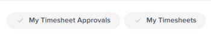
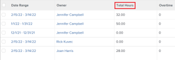

# Afficher le nombre total d’heures sur la feuille de temps

<!--Audited: 8/2024-->

Vous pouvez afficher le nombre total d’heures sur votre feuille de temps. Le nombre total d’heures de la feuille de temps inclut les heures consignées pour les projets, les tâches, les problèmes et toutes les heures générales.

Le nombre total d’heures correspond aux heures envoyées par le biais de la feuille de temps, de la zone Mises à jour ou de la zone Heures pour les projets, tâches ou problèmes.

## Conditions d’accès

+++ Développez pour afficher les exigences d’accès aux fonctionnalités de cet article. 

<table style="table-layout:auto"> 
 <col> 
 <col> 
 <tbody> 
  <tr> 
   <td>Package Adobe Workfront</td> 
   <td> 
Tous
 </td> 
  </tr> 
  <tr> 
   <td>Licence Adobe Workfront</td> 
   <td> 
Léger ou supérieur 

   
Révision ou supérieur
 </td> 
  </tr> 
  <tr> 
   <td>Configuration du niveau d’accès</td> 
   <td> 
Afficher ou un accès supérieur aux tâches et aux événements
 </td> 
  </tr> 
  <tr> 
   <td>Autorisations d’objet</td> 
   <td> 
Autorisations Affichage ou supérieures pour les tâches et problèmes
 </td> 
  </tr> 
 </tbody> 
</table>

Pour plus d’informations, voir [Conditions d’accès requises dans la documentation Workfront](/help/quicksilver/administration-and-setup/add-users/access-levels-and-object-permissions/access-level-requirements-in-documentation.md).

+++

## Afficher le nombre total d’heures d’une feuille de temps dans l’en-tête de la feuille de temps

Vous pouvez afficher le nombre total d’heures d’une feuille de temps dans l’en-tête de la feuille de temps.

## Afficher le nombre total d’heures de votre feuille de temps dans une liste de feuilles de temps

{{step1-to-timesheets}}

La zone **Feuilles de temps** s’ouvre.

1. (Facultatif) Pour mettre à jour le filtre dans la liste des feuilles de temps, effectuez l’une des opérations suivantes :

   * Sélectionnez **Mes approbations de feuille de temps** dans le coin supérieur droit de la page pour afficher uniquement les feuilles de temps que vous approuvez.

     Ou

     Sélectionnez **Mes feuilles de temps** pour afficher uniquement vos feuilles de temps.

     Cela applique les filtres Mes approbations de feuille de temps ou Mes feuilles de temps à la liste des feuilles de temps.

     

   * Cliquez sur l’icône Filtrer  pour appliquer un autre filtre ou en créer un nouveau. Pour plus d’informations sur la création ou la mise à jour de filtres, voir [Créer ou modifier des filtres dans Adobe Workfront](../../reports-and-dashboards/reports/reporting-elements/create-filters.md).

   >[!NOTE]
   >
   >Les options Mes approbations de feuille de temps et Mes feuilles de temps ne s’affichent pas en haut de la liste de feuille de temps ni dans la liste des filtres si votre administrateur ou administratrice Workfront ou un administrateur ou une administratrice de groupes a supprimé les filtres Mes approbations de feuille de temps et Mes feuilles de temps des contrôles de liste de la zone Configuration ou de votre modèle de mise en page. Pour plus d’informations, voir les articles suivants :
   >
   >   
   >   
   >   * [Personnaliser des filtres, des vues et des regroupements à l’aide d’un modèle de mise en page](../../administration-and-setup/customize-workfront/use-layout-templates/customize-fvg-list-controls-layout-template.md)
   >   
   >

1. (Facultatif) Cliquez sur les icônes **Vue**  ou **Regroupement**  pour appliquer une autre vue ou un autre regroupement ou en créer de nouveaux.

   Pour plus d’informations sur la création de filtres, de vues ou de regroupements, voir les articles suivants :

   * [Créer ou modifier des filtres dans Adobe Workfront](../../reports-and-dashboards/reports/reporting-elements/create-filters.md)
   * [Créer ou modifier des vues dans Adobe Workfront](../../reports-and-dashboards/reports/reporting-elements/create-edit-views.md)
   * [Créer des regroupements dans Adobe Workfront](../../reports-and-dashboards/reports/reporting-elements/create-groupings.md)

1. Le nombre total d’heures pour chaque feuille de temps s’affiche dans la colonne **Nombre total d’heures**.

   

   >[!TIP]
   >
   >Lorsque vous utilisez la vue Standard pour obtenir une liste de feuilles de temps, la colonne Total des heures s&#39;affiche en rouge si le temps enregistré pour les éléments de la feuille de temps dépasse le nombre d&#39;heures indiqué dans le bloc de temps correspondant à la feuille de temps. Pour plus d’informations, voir le champ « Total des heures » dans [Glossaire terminologique d’Adobe Workfront](../../workfront-basics/navigate-workfront/workfront-navigation/workfront-terminology-glossary.md).
