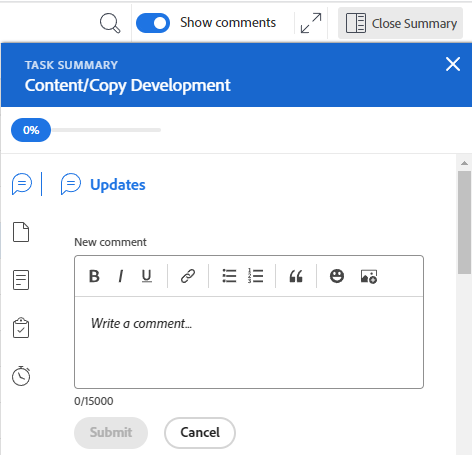

# Vue d’ensemble de la disposition des feuilles de temps

<!-- Audited: 12/2023 -->

<!--The highlighted information on this page refers to functionality not yet generally available. It is available only in the Preview environment for all customers or in Production for customers who enabled fast releases. 

For information about fast releases, see [Enable or disable fast releases for your organization](/help/quicksilver/administration-and-setup/set-up-workfront/configure-system-defaults/enable-fast-release-process.md).

For information about the current release schedule, see [Second Quarter 2024 release overview](/help/quicksilver/product-announcements/product-releases/24-q2-release-activity/24-q2-release-overview.md).-->

Cet article décrit la disposition des feuilles de temps dans Adobe Workfront, ce qui vous permettra de mieux comprendre comment personnaliser et utiliser les feuilles de temps pour enregistrer les heures.

Les préférences relatives aux feuilles de temps et aux heures contrôlent ce qui apparaît sur une feuille de temps. Cet article donne une vue d’ensemble de toutes les options disponibles. Pour plus d’informations sur la sélection des options, voir [Configurer les préférences relatives aux feuilles de temps et aux heures](../../administration-and-setup/set-up-workfront/configure-timesheets-schedules/timesheet-and-hour-preferences.md).

Pour plus d’informations sur l’enregistrement des heures sur une feuille de temps, voir [Enregistrer des heures](../../timesheets/create-and-manage-timesheets/log-time.md).

Une feuille de temps comprend les éléments suivants :

* [En-tête de la feuille de temps](#timesheet-header)
* [Panneau de gauche](#the-left-panel)
* [Éléments de travail](#work-items)
* [Barre d&#39;outils](#toolbar)
* [Pied de page de la feuille de temps](#timesheet-footer)
* [Fonction](#job-role)
* [Type d’heure](#hour-type)
* [Zone de mise à jour dans le panneau de gauche](#updates-area-in-the-left-panel)
* [Panneau Résumé](#summary-panel)
* [Zone de saisie de la période et des heures](#time-frame-and-hour-entry-area)
* [Commentaires sur la saisie d’heures](#hour-entry-comments)
* [Heures](#hours)
* [Totaux](#totals)

## En-tête de la feuille de temps

L’en-tête de la feuille de temps comprend les informations suivantes :

* La période de la feuille de temps.
* La zone Actions qui comprend les éléments suivants :
   * Une icône en forme d’étoile pour ajouter les feuilles de temps à votre liste de favoris.
   * L’icône Plus contient une option Supprimer qui vous permet de supprimer la feuille de temps.
* Le nom du ou de la propriétaire de la feuille de temps.
* Le nombre d’heures totales correspond aux heures enregistrées pour les éléments affichés dans la feuille de temps.
* Le nombre d’heures supplémentaires. Il s’agit d’une entrée manuelle qui n’est visible que lorsque le paramètre **Heures supp.** est activé sur une feuille de temps. Pour plus d’informations, voir [Modifier les informations de la feuille de temps](../create-and-manage-timesheets/edit-timesheets.md).

>[!TIP]
>
>Vous ne pouvez pas consigner un nombre d’heures supplémentaires supérieur au total actuel des heures sur la feuille de temps. Par exemple, si vous avez enregistré 7 heures sur la feuille de temps jusqu’à présent, vous ne pouvez pas enregistrer 8 heures supplémentaires.

* Le statut de la feuille de temps.

## Panneau de gauche

Vous pouvez accéder aux sections suivantes dans le panneau de gauche :

* **Feuille de temps** : affiche la feuille de temps actuelle.
* **Mises à jour** : affiche les commentaires et les mises à jour du système pour la feuille de temps. Pour plus d’informations, voir la section [Zone Mises à jour dans le panneau de gauche](#updates-area-in-the-left-panel) dans cet article.

## Éléments de travail

Les éléments de travail sont les projets, les tâches et les problèmes pour lesquels vous souhaitez enregistrer des heures. En cliquant sur la flèche pointant vers le bas dans la ligne d’en-tête, vous réduisez les projets ainsi que les tâches et les problèmes répertoriés en dessous. En cliquant sur la flèche pointant vers le bas à côté du nom d’un projet, vous réduisez les éléments de travail de ce projet.

Les tâches, les problèmes et les projets pour lesquels les heures sont enregistrées en dehors de la feuille de temps ou les éléments prévus pendant la durée de la feuille de temps apparaissent automatiquement ici.

## Barre d&#39;outils

La barre d’outils comprend les options suivantes :

* Le bouton **Ajouter un élément** vous permet d’ajouter des projets, des tâches ou des problèmes.
* L’icône de filtre rapide pour rechercher des tâches ou des problèmes dans la feuille de temps.
* Le paramètre **Afficher les commentaires** vous permet d’afficher ou de masquer les commentaires d’heures consignés pour les entrées d’heures relatives à un projet, une tâche ou un problème.
* L’icône plein écran permet d’afficher la feuille de temps en mode plein écran.
* Le bouton **Ouvrir le résumé** (ou **Fermer le résumé**) permet d’ouvrir ou de fermer le panneau Résumé afin d’obtenir des informations supplémentaires sur les tâches ou les problèmes. Ce bouton n’est pas disponible pour les projets.

Pour plus d’informations, voir [Consigner des heures](../create-and-manage-timesheets/log-time.md).

## Pied de page de la feuille de temps

Vous pouvez cliquer sur les boutons **Soumettre pour approbation**, **Fermer**, **Approuver**, et **Rejeter** dans cette zone pour fermer ou rejeter l’approbation d’une feuille de temps.

Cette zone contient également des informations sur le dernier enregistrement de la feuille de temps. Toutes les modifications apportées aux informations de la feuille de temps sont automatiquement enregistrées.

## Fonction

Vous pouvez sélectionner une autre fonction à associer aux entrées d’heures. Votre administrateur ou administratrice de Workfront doit activer manuellement le paramètre **Attribuer des fonctions à des entrées d’heures**. La fonction spécifiée lors de votre affectation à la tâche ou au problème s’affiche par défaut. Si aucune fonction ne vous a été attribuée pour la tâche ou le problème, votre rôle principal s’affiche par défaut. Pour plus d’informations, voir [Configurer les préférences de feuilles de temps et d’heures](../../administration-and-setup/set-up-workfront/configure-timesheets-schedules/timesheet-and-hour-preferences.md).

Vous pouvez enregistrer plusieurs entrées d’heures pour le même élément de travail pour différents rôles. Pour plus d’informations, voir [Consigner des heures](../create-and-manage-timesheets/log-time.md).

## Type d’heure

Vous pouvez sélectionner différents types d’heures à associer à vos entrées d’heures sur chaque élément. Ce champ ne s’affiche que lorsque l’administrateur ou l’administratrice de Workfront l’active pour votre environnement. Pour plus d’informations, voir [Configurer les préférences de feuilles de temps et d’heures](../../administration-and-setup/set-up-workfront/configure-timesheets-schedules/timesheet-and-hour-preferences.md).

Vous pouvez consigner plusieurs entrées d’heures pour le même élément de travail pour différents types d’heures. Pour plus d’informations, voir [Consigner des heures](../create-and-manage-timesheets/log-time.md).

## Zone de mise à jour dans le panneau de gauche

Vous pouvez ajouter des commentaires sur une feuille de temps pour communiquer avec vos approbateurs et approbatrices de feuilles de temps ou d’autres utilisateurs et utilisatrices dans la section Mises à jour du panneau de gauche de la feuille de temps.

Les commentaires éventuels sur la feuille de temps s’affichent dans cette zone.

## Panneau Résumé

Vous pouvez accéder au panneau Résumé pour les tâches et les problèmes affichés dans une feuille de temps. De là, vous pouvez commenter sur les tâches et les problèmes, ou mettre à jour leurs informations. Pour plus d’informations, voir [Vue d’ensemble du résumé](../../workfront-basics/the-new-workfront-experience/summary-overview.md).

Les commentaires que vous ajoutez pour les éléments de travail dans le panneau Résumé de la feuille de temps s’affichent dans la zone Mises à jour de la tâche ou du problème. Le panneau Résumé n’est pas disponible pour les projets.

## Zone de saisie de la période et des heures

La période de la feuille de temps s’affiche à droite des éléments de travail.

Vous pouvez créer des feuilles de temps pour une, deux ou quatre semaines.

La période s’affiche par incréments d’une semaine complète. Les jours en dehors de la période spécifiée pour la feuille de temps sont grisés. Vous ne pouvez pas consigner des heures pour des jours en dehors de la période de la feuille de temps.

Pour plus d’informations, voir [Créer une feuille de temps à usage unique](../create-and-manage-timesheets/create-tmshts.md) ou [Créer, modifier et attribuer des profils de feuille de temps](../create-and-manage-timesheets/create-timesheet-profiles.md).

<!--drafted for the resize columns in timesheets story - make this blurb a TIP when the story is released: 
You can resize the columns that display different weeks, the time frame, or the work item areas by dragging and dropping the vertical lines that separate them.-->

## Commentaires sur la saisie d’heures

Vous pouvez ajouter un commentaire pour chaque entrée d’heure que vous ajoutez à votre feuille de temps.

Les commentaires que vous saisissez dans la zone de commentaire de la saisie des heures s’affichent dans la feuille de temps, sous chaque élément de travail où vous avez consigné le temps lorsque le paramètre **Afficher les commentaires** est activé dans la barre d’outils.

## Heures

La feuille de temps fournit des champs de saisie pour chaque élément de travail et chaque jour de la plage de la feuille de temps afin de consigner le temps passé à travailler sur l’élément en question. Lorsque vous consignez une heure, l’élément pour lequel vous consignez le temps est surligné en bleu clair et la case de l’heure est soulignée en bleu foncé.

## Totaux

Examinez la somme de toutes les heures saisies sur la feuille de temps, résumée par jour (dans l’en-tête de la feuille de temps) ainsi que par objet (dans la dernière colonne).
