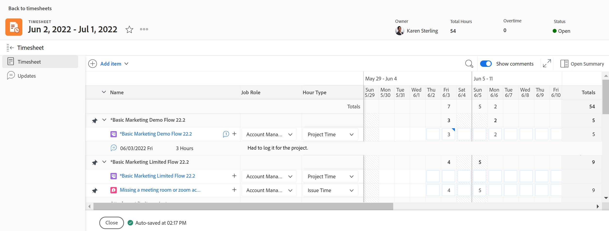

# Vue d’ensemble de la disposition de la feuille de temps

<!-- Audited: 12/2023 -->

Les informations mises en surbrillance sur cette page font référence à des fonctionnalités qui ne sont pas encore disponibles dans l’ensemble. Il est disponible uniquement dans l’environnement Aperçu pour tous les clients ou dans Production pour les clients qui ont activé les versions rapides. 

Pour plus d’informations sur les versions rapides, voir [Activation ou désactivation de versions rapides pour votre entreprise](/help/quicksilver/administration-and-setup/set-up-workfront/configure-system-defaults/enable-fast-release-process.md).

Pour plus d’informations sur le calendrier de publication actuel, voir [Présentation de la version du deuxième trimestre 2024](/help/quicksilver/product-announcements/product-releases/24-q2-release-activity/24-q2-release-overview.md).

Cet article décrit la disposition des feuilles de temps dans Adobe Workfront, ce qui vous permet de mieux comprendre comment personnaliser et utiliser les feuilles de temps pour consigner les heures.

Les préférences de feuille de temps et d’heures déterminent ce qui s’affiche sur une feuille de temps. Cet article présente une vue d’ensemble de toutes les options disponibles. Pour plus d’informations sur la sélection des options, consultez [Configuration des préférences de feuilles de temps et d’heures](../../administration-and-setup/set-up-workfront/configure-timesheets-schedules/timesheet-and-hour-preferences.md).

Pour plus d’informations sur la consignation des heures sur une feuille de temps, consultez [Consignation des heures](../../timesheets/create-and-manage-timesheets/log-time.md).

Les zones d’une feuille de temps sont les suivantes :

* [En-tête de la feuille de temps](#timesheet-header)
* [Panneau de gauche](#the-left-panel)
* [Éléments de travail](#work-items)
* [Barre d&#39;outils](#toolbar)
* [Pied de page de la feuille de temps](#timesheet-footer)
* [Fonction](#job-role)
* [Type d’heure](#hour-type)
* [Zone Mises à jour dans le panneau de gauche](#updates-area-in-the-left-panel)
* [Panneau Résumé](#summary-panel)
* [Zone Période et saisie d’heures](#time-frame-and-hour-entry-area)
* [Commentaires sur la saisie d’heures](#hour-entry-comments)
* [Heures](#hours)
* [Totaux](#totals)

## En-tête de la feuille de temps

L’en-tête de la feuille de temps comprend les informations suivantes :

* Période de la feuille de temps.
* Zone Actions qui comprend les éléments suivants :
   * Icône en forme d’étoile permettant d’ajouter les feuilles de temps à votre liste de Favoris.
   * Icône Plus avec une option Supprimer permettant de supprimer la feuille de temps.
* Nom de la personne propriétaire de la feuille de temps.
* Nombre total d’heures consignées pour les éléments affichés dans la feuille de temps.
* Nombre d’heures supplémentaires. Il s’agit d’une saisie manuelle qui n’est visible que lorsque le paramètre **Heures supp.** est activé sur une feuille de temps. Pour plus d’informations, consultez [Modifier les informations de la feuille de temps](../create-and-manage-timesheets/edit-timesheets.md).

>[!TIP]
>
>Vous ne pouvez pas consigner un nombre d’heures supplémentaires supérieur au nombre total actuel d’heures sur la feuille de temps. Par exemple, si jusqu’à présent, vous avez consigné 7 heures sur la feuille de temps, vous ne pouvez pas consigner 8 heures supplémentaires.

* Statut de la feuille de temps.

## Panneau de gauche

Vous pouvez accéder aux sections suivantes dans le panneau de gauche :

* **Feuille de temps** : affiche la feuille de temps réelle.
* **Mises à jour** : affiche les commentaires et les mises à jour système de la feuille de temps. Pour plus d’informations, consultez la section [Zone Mises à jour dans le panneau de gauche](#updates-area-in-the-left-panel) dans cet article.

## Éléments de travail

Les éléments de travail sont les projets, les tâches et les problèmes pour lesquels vous souhaitez enregistrer des heures. Cliquez sur la flèche pointant vers le bas dans la ligne d’en-tête pour réduire les projets, les tâches et problèmes répertoriés en dessous. Cliquez sur la flèche pointant vers le bas située en regard du nom d’un projet pour réduire les éléments de travail de ce projet.

Les tâches, les problèmes et les projets pour lesquels les heures sont enregistrées en dehors de la feuille de temps ou les éléments planifiés pendant la période de la feuille de temps apparaissent automatiquement ici.

## Barre d&#39;outils

La barre d’outils comprend les options suivantes :

* Bouton **Ajouter un élément** qui vous permet d’ajouter des projets, des tâches ou des problèmes.
* Icône de filtre rapide permettant de rechercher des tâches ou des problèmes dans la feuille de temps.
* Paramètre **Afficher les commentaires** qui vous permet d’afficher ou de masquer les commentaires sur les heures consignées pour les saisies d’heures de projet, de tâche ou de problème.
* Icône de plein écran permettant d’afficher la feuille de temps en mode Plein écran.
* Bouton **Ouvrir le résumé** (ou **Fermer le résumé**) permettant d’ouvrir ou de fermer le panneau Résumé afin d’afficher des informations supplémentaires sur les tâches ou les problèmes. Ce bouton n’est pas disponible pour les projets.

Pour plus d’informations, consultez [Consigner des heures](../create-and-manage-timesheets/log-time.md).

## Pied de page de la feuille de temps

Vous pouvez cliquer sur les boutons **Soumettre à approbation**, **Fermer**, **Approuver** et **Rejeter** dans cette zone pour fermer ou refuser la validation d’une feuille de temps.

Cette zone contient également des informations sur le dernier enregistrement de la feuille de temps. Toutes les modifications que vous apportez aux informations de la feuille de temps sont automatiquement enregistrées.

## Fonction

Vous pouvez sélectionner une autre fonction à associer aux saisies d’heures. Votre administrateur ou votre administratrice Workfront doit activer le paramètre **Affecter manuellement des fonctions à des saisies d’heures**. La fonction spécifiée lorsqu’on vous affecte la tâche ou le problème s’affiche par défaut. Si aucune fonction ne vous est affectée sur la tâche ou le problème, votre rôle principal s’affiche par défaut. Pour plus d’informations, consultez [Configurer les préférences de feuilles de temps et d’heures](../../administration-and-setup/set-up-workfront/configure-timesheets-schedules/timesheet-and-hour-preferences.md).

Vous pouvez enregistrer plusieurs saisies d’heures pour le même élément de travail pour différents rôles. Pour plus d’informations, consultez [Consigner des heures](../create-and-manage-timesheets/log-time.md).

## Type d’heure

Vous pouvez sélectionner différents types d’heures à associer à vos saisies d’heures pour chaque élément. Ce champ ne s’affiche que lorsque l’administrateur ou l’administratrice Workfront l’active pour votre environnement. Pour plus d’informations, consultez [Configurer les préférences de feuilles de temps et d’heures](../../administration-and-setup/set-up-workfront/configure-timesheets-schedules/timesheet-and-hour-preferences.md).

Vous pouvez consigner plusieurs saisies d’heures pour le même élément de travail pour différents types d’heures. Pour plus d’informations, consultez [Consigner des heures](../create-and-manage-timesheets/log-time.md).

## Zone Mises à jour dans le panneau de gauche

Vous pouvez faire des commentaires sur une feuille de temps pour communiquer avec les approbateurs et approbatrices de votre feuille de temps ou d’autres utilisateurs et utilisatrices dans la section Mises à jour du panneau gauche de la feuille de temps.

Tous les commentaires ajoutés à la feuille de temps s’affichent dans cette zone.

## Panneau Résumé

Vous pouvez accéder au panneau Résumé des tâches ou des problèmes affichés dans une feuille de temps. À partir de là, vous pouvez commenter les tâches et les problèmes ou mettre à jour leurs informations. Pour plus d’informations, consultez [Vue d’ensemble du résumé](../../workfront-basics/the-new-workfront-experience/summary-overview.md).

Les commentaires que vous saisissez pour les éléments de travail dans le panneau Résumé de la feuille de temps s’affichent dans la zone Mises à jour de la tâche ou du problème. Le panneau Résumé n’est pas disponible pour les projets.

## Zone Période et saisie d’heures

La période de la feuille de temps s’affiche à droite des éléments de travail.

Vous pouvez créer des feuilles de temps pour une, deux ou quatre semaines.

La période s’affiche par incréments de semaine complète. Les jours en dehors de la période de la feuille de temps spécifiée sont grisés. Vous ne pouvez pas consigner d’heures pour des jours en dehors de la période de la feuille de temps.

Pour plus d’informations, consultez [Créer une feuille de temps à usage unique](../create-and-manage-timesheets/create-tmshts.md) ou [Créer, modifier et attribuer des profils de feuille de temps](../create-and-manage-timesheets/create-timesheet-profiles.md).

<!--drafted for the resize columns in timesheets story - make this blurb a TIP when the story is released: 
You can resize the columns that display different weeks, the time frame, or the work item areas by dragging and dropping the vertical lines that separate them.-->

## Commentaires sur la saisie d’heures

Vous pouvez ajouter un commentaire pour chaque saisie d’heures que vous ajoutez à votre feuille de temps.

Les commentaires que vous saisissez dans la zone de commentaire de saisie d’heures s’affichent dans la feuille de temps, sous chaque élément de travail où vous avez consigné les heures lorsque le paramètre **Afficher les commentaires** est activé dans la barre d’outils.

## Heures

La feuille de temps fournit des champs d’entrée pour chaque élément de travail et jour de la plage de la feuille de temps afin de consigner le temps passé sur l’élément. À mesure que vous consignez les heures, l’élément concerné est mis en surbrillance en bleu clair et la zone des heures est encadrée en bleu foncé.

## Totaux

Vérifiez la somme de toutes les heures saisies sur la feuille de temps, résumée par jour (dans l’en-tête de la feuille de temps) et par objet (dans la dernière colonne).
