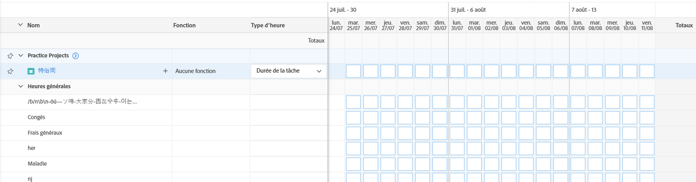

# Présentation de la disposition de la feuille de temps

{{highlighted-preview}}

<!-- Audited: 12/2023 -->

Cet article décrit la mise en page des feuilles de temps dans Adobe Workfront, ce qui vous permet de mieux comprendre comment personnaliser et utiliser les feuilles de temps pour enregistrer le temps.

Les préférences de la feuille de temps et de l’heure contrôlent ce qui s’affiche sur une feuille de temps. Cet article présente un aperçu de toutes les options disponibles. Pour plus d’informations sur la sélection des options, voir [Configuration des préférences de feuille de temps et d’heure](../../administration-and-setup/set-up-workfront/configure-timesheets-schedules/timesheet-and-hour-preferences.md).

Pour plus d’informations sur la façon de consigner le temps sur une feuille de temps, voir [Temps de connexion](../../timesheets/create-and-manage-timesheets/log-time.md).

Voici les zones d’une feuille de temps :

* [En-tête de la feuille de calcul](#timesheet-header)
* [Panneau de gauche](#the-left-panel)
* [Éléments de travail](#work-items)
* [Barre d&#39;outils](#toolbar)
* [Pied de page de feuille de calcul](#timesheet-footer)
* [Rôle de tâche](#job-role)
* [Type d’heure](#hour-type)
* [Zone Mises à jour dans le panneau de gauche](#updates-area-in-the-left-panel)
* [Panneau Résumé](#summary-panel)
* [Période et zone d’entrée horaire](#time-frame-and-hour-entry-area)
* [Commentaires sur l’entrée horaire](#hour-entry-comments)
* [Heures](#hours)
* [Totaux](#totals)

## En-tête de la feuille de calcul

L’en-tête de la feuille de temps comprend les informations suivantes :

* Période de la feuille de temps.
* La zone Actions qui comprend les éléments suivants :
   * Icône étoile permettant d’ajouter les feuilles de temps à votre liste de Favoris.
   * Icône Plus avec option Supprimer permettant de supprimer la feuille de temps.
* Nom du propriétaire de la feuille de temps.
* Nombre total d’heures consignées pour les éléments affichés dans la feuille de temps.
* Nombre d’heures supplémentaires. Il s’agit d’une entrée manuelle qui n’est visible que lorsque la variable **Overtime** est activé sur une feuille de temps. Pour plus d’informations, voir [Modifier les informations de la feuille de temps](../create-and-manage-timesheets/edit-timesheets.md).

>[!TIP]
>
>Vous ne pouvez pas consigner un nombre d’heures supplémentaires supérieur au nombre total actuel d’heures sur la feuille de temps. Par exemple, si vous vous êtes connecté 7 heures sur la feuille de temps jusqu’à présent, vous ne pouvez pas consigner 8 heures supplémentaires.

* État de la feuille de temps.

## Panneau de gauche

Vous pouvez accéder aux sections suivantes dans le panneau de gauche :

* **Feuille de calcul**: affiche la feuille de temps réelle.
* **Mises à jour**: affiche les commentaires et les mises à jour système de la feuille de temps. Pour plus d’informations, voir [Zone Mises à jour dans le panneau de gauche](#updates-area-in-the-left-panel) dans cet article.

## Éléments de travail

Les tâches sont les projets, les tâches et les problèmes pour lesquels vous souhaitez consigner le temps. Cliquez sur la flèche pointant vers le bas dans la ligne d’en-tête pour réduire les projets et les tâches et problèmes répertoriés en dessous. Cliquez sur la flèche pointant vers le bas située en regard du nom d’un projet pour réduire les tâches de ce projet.

Les tâches, les problèmes et les projets dans lesquels le temps est enregistré en dehors de la feuille de temps ou les éléments planifiés pendant la période de la feuille de temps apparaissent automatiquement ici.

## Barre d&#39;outils

La barre d’outils comprend les options suivantes :

* La variable **Ajouter un élément** qui vous permet d’ajouter des projets, des tâches ou des problèmes.
* Icône de filtre rapide permettant de rechercher des tâches ou des problèmes dans la feuille de temps.
* La variable **Afficher les commentaires** qui vous permet d’afficher ou de masquer les commentaires d’heure consignés pour le projet, la tâche ou les entrées d’heure de publication.
* Icône Plein écran permettant d’afficher la feuille de temps en mode Plein écran.
* La variable **Résumé ouvert** (ou **Fermer le résumé**) pour ouvrir ou fermer le panneau Résumé afin d’afficher des informations supplémentaires sur les tâches ou les problèmes. Ce bouton n’est pas disponible pour les projets.

Pour plus d’informations, voir [Temps de connexion](../create-and-manage-timesheets/log-time.md).

## Pied de page de feuille de calcul

Vous pouvez cliquer sur le bouton **Envoyer pour approbation**, **Fermer**, **Approuver**, et **Rejeter** pour fermer ou refuser la validation d&#39;une feuille de temps.

Cette zone contient également des informations sur le moment où la feuille de temps a été enregistrée pour la dernière fois. Toutes les modifications que vous apportez aux informations de la feuille de temps sont automatiquement enregistrées.

## Fonction

Vous pouvez sélectionner un autre rôle de tâche à associer aux entrées d’heure. Votre administrateur Workfront doit activer la fonction **Affectation de rôles de tâche aux entrées d’heure** manuellement. Le rôle de tâche spécifié lorsque vous êtes affecté à la tâche ou au problème s’affiche par défaut. Si aucun rôle de tâche n’est attribué à la tâche ou au problème, votre rôle de Principal s’affiche comme valeur par défaut. Pour plus d’informations, voir [Configuration des préférences de feuille de temps et d’heure](../../administration-and-setup/set-up-workfront/configure-timesheets-schedules/timesheet-and-hour-preferences.md).

Vous pouvez consigner plusieurs entrées d’heure pour le même élément de travail pour différents rôles. Pour plus d’informations, voir [Temps de connexion](../create-and-manage-timesheets/log-time.md).

## Type d’heure

Vous pouvez sélectionner différents types d’heure à associer à vos entrées d’heure pour chaque élément. Ce champ s’affiche uniquement lorsque l’administrateur Workfront l’active pour votre environnement. Pour plus d’informations, voir [Configuration des préférences de feuille de temps et d’heure](../../administration-and-setup/set-up-workfront/configure-timesheets-schedules/timesheet-and-hour-preferences.md).

Vous pouvez consigner plusieurs entrées d’heure pour le même élément de travail pour différents types d’heure. Pour plus d’informations, voir [Temps de connexion](../create-and-manage-timesheets/log-time.md).

## Zone Mises à jour dans le panneau de gauche

Exemple dans l&#39;environnement Aperçu :

Exemple dans l’environnement de production :

Vous pouvez faire des commentaires sur une feuille de temps pour communiquer avec les approbateurs de votre feuille de temps ou d’autres utilisateurs dans la section Mises à jour du panneau gauche de la feuille de temps.

Tous les commentaires apportés à la feuille de temps s’affichent dans cette zone.

## Panneau Résumé

Vous pouvez accéder au panneau Résumé pour les tâches ou les problèmes affichés dans une feuille de temps. À partir de là, vous pouvez commenter les tâches et les problèmes ou mettre à jour leurs informations. Pour plus d’informations, voir [Aperçu du résumé](../../workfront-basics/the-new-workfront-experience/summary-overview.md).

Les commentaires que vous saisissez pour les tâches dans le panneau Résumé de la feuille de temps s’affichent dans la zone Mises à jour de la tâche ou du problème. Le panneau Résumé n’est pas disponible pour les projets.

## Période et zone d’entrée horaire

La période de la feuille de temps s’affiche à droite des tâches.

Vous pouvez créer des feuilles de temps pour une, deux ou quatre semaines.

La période s’affiche par incréments de semaine complète. Les jours en dehors de la période de la feuille de temps spécifiée sont grisés. Vous ne pouvez pas consigner l’heure des jours situés en dehors de la période de la feuille de temps.

Pour plus d’informations, voir [Création d’une feuille de temps à usage unique](../create-and-manage-timesheets/create-tmshts.md) ou [Création, modification et affectation de profils de feuille de temps](../create-and-manage-timesheets/create-timesheet-profiles.md).

<!--drafted for the resize columns in timesheets story - make this blurb a TIP when the story is released: 
You can resize the columns that display different weeks, the time frame, or the work item areas by dragging and dropping the vertical lines that separate them.-->

## Commentaires sur l’entrée horaire

Vous pouvez ajouter un commentaire pour chaque entrée d’heure que vous ajoutez à votre feuille de temps.

Les commentaires que vous saisissez dans la zone de commentaire de saisie d’heure s’affichent dans la feuille de temps, sous chaque élément de travail où vous avez consigné l’heure à laquelle la fonction **Afficher les commentaires** est activé dans la barre d’outils.

## Heures

La feuille de temps fournit des champs d’entrée pour chaque élément de travail et jour de la période afin d’enregistrer le temps passé sur l’élément. Pendant que vous enregistrez le temps, l’élément que vous enregistrez pour les temps de surbrillance en bleu clair et la zone d’heure est encadré en bleu foncé.

## Totaux

Examinez la somme de toutes les heures saisies sur la feuille de temps, résumée par jour (dans l’en-tête de la feuille de temps) et par objet (dans la dernière colonne).
