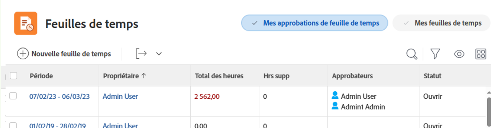

# Présentation des feuilles de calcul

Vous pouvez utiliser des feuilles de temps pour effectuer le suivi du temps que vous passez au travail, à l’intérieur et à l’extérieur, dans Adobe Workfront.

Vous pouvez consigner le temps du projet sur les tâches, telles que les projets, les tâches et les problèmes. La durée de connexion aux tâches, problèmes et projets s’affiche automatiquement dans votre feuille de temps.

Vous pouvez également consigner le temps qui n’est pas consacré au projet pour des éléments qui ne sont pas liés au travail, tels que des réunions, des formations ou du temps qui s’écoule du bureau directement sur votre feuille de temps sous Heures générales.

Pour plus d’informations sur la façon de se connecter à Workfront, voir [Temps de connexion](../../timesheets/create-and-manage-timesheets/log-time.md).

>[!TIP]
>
>Si vous êtes administrateur Workfront ou de groupe, vous pouvez créer des feuilles de temps et les associer à vos utilisateurs. Pour plus d’informations sur la création de feuilles de temps, voir [Créer et gérer des feuilles de temps : index des articles](../create-and-manage-timesheets/create-and-manage-timesheets.md).

## Comprendre le temps du projet par rapport au temps hors projet

Les feuilles de temps offrent aux utilisateurs un moyen simple de suivre le temps nécessaire au travail en projet et hors projet :

* **Heure du projet :** Directement de la tâche ou du projet dans lequel vous souhaitez effectuer le suivi de l’heure.

  Les heures enregistrées pour les tâches, les problèmes et les projets au moyen d’une feuille de temps sont associées aux tâches respectives afin de fournir une représentation exacte de l’effort passé sur les projets et les tâches. Sans saisie précise de l’heure, vos données peuvent ne pas être exactes à des fins de facturation.

  En outre, lorsqu’une ressource enregistre des heures directement sur des tâches, des problèmes et des projets apparaissent automatiquement lorsque l’utilisateur accède à la feuille de temps. Cela suppose que la période de la feuille de temps couvre les dates auxquelles les heures ont été enregistrées.

* **Durée hors projet :** Directement sur la feuille de temps utilisateur. Pour plus d’informations sur le suivi du temps dans Workfront, voir   [Temps de connexion](../../timesheets/create-and-manage-timesheets/log-time.md).

  Sur une feuille de temps, vous pouvez enregistrer les heures de vacances, les heures de malade, les heures passées en transit, les heures passées à réparer ou à entretenir l’équipement, ou les types d’heures de surcharge générale que vous souhaitez créer.

## Accès aux feuilles de temps dans la zone Fiches de temps

La zone de la feuille de temps est disponible par défaut pour tous les utilisateurs. Les administrateurs de Workfront peuvent le modifier dans le modèle de mise en page, si nécessaire. Pour plus d’informations, voir [Personnalisation du menu principal à l’aide d’un modèle de mise en page](/help/quicksilver/administration-and-setup/customize-workfront/use-layout-templates/customize-main-menu.md).

Pour accéder à une feuille de temps :

{{step1-to-timesheets}}

Toutes vos feuilles de temps ainsi que vos feuilles de temps vous permettent d’afficher par défaut. Pour plus d’informations sur la disposition de la feuille de temps dans Adobe Workfront, voir [Présentation de la disposition de la feuille de temps](../../timesheets/timesheets/timesheet-layout.md).

1. Cliquez sur l’une des options suivantes dans le coin supérieur droit pour afficher vos feuilles de calcul :

   * **Mes feuilles de calcul** pour afficher uniquement vos feuilles de temps.

   

   * **Mes approbations de la feuille de temps** pour afficher uniquement les feuilles de temps que vous approuvez.

     

1. (Facultatif) Mettez à jour la vue, le filtre et le regroupement en haut de la liste des feuilles de temps. Pour plus d’informations, voir [Éléments de reporting : filtres, vues et regroupements](../../reports-and-dashboards/reports/reporting-elements/reporting-elements-overview.md).

1. Cliquez sur le bouton **Période** d’une feuille de temps pour l’ouvrir.

   Chaque feuille de temps affiche toutes les tâches, problèmes et projets pour lesquels vous avez effectué des connexions. Une feuille de temps affiche également jusqu’à 45 tâches, problèmes ou projets qui vous sont affectés avec des dates comprises dans la période de la feuille de temps, mais pour lesquelles vous n’avez peut-être pas encore consigné l’heure.

   Pour plus d’informations, voir [Configuration des préférences de feuille de temps et d’heure](../../administration-and-setup/set-up-workfront/configure-timesheets-schedules/timesheet-and-hour-preferences.md).
