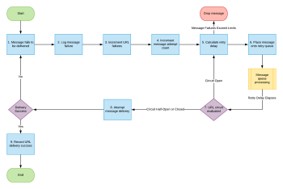

# Reprises pour les abonnements aux événements

Lors de l’implémentation d’un système de diffusion de messages, quelques avertissements doivent être pris en compte afin de garantir la stabilité, la cohérence et une bonne expérience client. L’un des inconvénients d’un système de diffusion des messages est de s’assurer que les messages arrivent à destination avec succès et de savoir quoi faire lorsqu’ils ne sont pas reçus.

Certaines intégrations peuvent accepter un échec de diffusion, puis abandonner le message et passer au suivant.  Dans d’autres intégrations, l’échec de diffusion d’un message ne peut pas être ignoré. Par exemple, une intégration financière peut tenter de diffuser un message, mais recevoir à la place un code de statut HTTP 404, indiquant que le serveur n’a pas trouvé le point d’entrée sur lequel le message devait être diffusé. Dans de tels cas, un message manquant pourrait signifier qu’une personne ne sera pas payée pour ses heures ou qu’une entreprise dépassera le budget des ressources sous contrat.

## Stratégie Adobe Workfront pour les reprises d’abonnement aux événements

Dans la mesure où les clientes et clients tirent parti de la plateforme Workfront comme une composante essentielle de leur travail intellectuel quotidien, la structure d’abonnement à un événement Workfront fournit un mécanisme permettant d’assurer la diffusion de chaque message dans la mesure du possible.

Les messages sortants déclenchés par un événement et qui ne parviennent pas à être diffusés aux points d’entrée clients sont renvoyés jusqu’à ce que la diffusion soit réussie pendant une période maximale de 48 heures. Pendant cette période, les reprises sont réduites progressivement jusqu’à ce que la diffusion soit réussie ou jusqu’à ce que 48 heures se soient écoulées.

Les clientes et clients doivent s’assurer que tous les points d’entrée qui consomment des messages sortants provenant des abonnements à Workfront Event sont configurés pour renvoyer un message de réponse de 200 niveaux à Workfront en cas de diffusion réussie.

## Gérer l’échec des messages sortants déclenchés par un événément

L’organigramme suivant présente la stratégie de rediffusion des messages avec les abonnements à des événements Workfront :

Les explications suivantes correspondent aux étapes décrites dans l’organigramme :

1. La diffusion du message échoue.
1. Les informations sur l’échec de diffusion du message sont consignées.

   Tous les échecs de diffusion d’un message sont consignés afin de permettre le débogage et de déterminer la cause première d’un échec donné ou d’une série d’échecs donnée.

1. Échecs de l’URL incrémentés.
1. Le nombre de tentatives de messages est incrémenté.
1. Calculez le délai jusqu’à ce que la diffusion de ce message soit retentée.
1. Le message est placé dans la file d’attente des reprises de message.

   Comme illustré dans l’organigramme précédent, la file d’attente des messages utilisée pour le traitement des reprises de diffusion des messages est distincte de celle qui traite la tentative de diffusion initiale pour chaque message. Cela permet au flux de messages en temps quasi réel de continuer sans être entravé par l’échec d’un sous-ensemble de messages.

1. Le statut du circuit d’URL est évalué. L’une des opérations suivantes est exécutée :

   * Si le circuit est ouvert et que les diffusions ne sont pas autorisées à ce stade, redémarrez le processus à l’étape 5.
   * Si le circuit est à moitié ouvert, cela signifie que notre circuit est actuellement ouvert, mais qu’il s’est écoulé suffisamment de temps pour effectuer le test de l’URL et vérifier si le problème de diffusion vers celle-ci a été résolu.
   * Si les limites des rediffusion du message ont été atteintes (48 heures après une nouvelle tentative), le message est abandonné.

1. Si le circuit d’URL est fermé et autorise les diffusions, essayez de diffuser le message. Si cette diffusion échoue, le message redémarre à l’étape 1.

1. Si le circuit d’URL est fermé et autorise les diffusions, essayez de diffuser le message. Si cette diffusion échoue, le message redémarre à l’étape 1.

   <!--
   <li value="10" data-mc-conditions="QuicksilverOrClassic.Draft mode">Workfront disables Event Subscriptions when both of the following criteria are met:
   <ul>
   <!--
   <li data-mc-conditions="QuicksilverOrClassic.Draft mode">The Event Subscription has failed 1000 delivery attempts consecutively</li>
   <li data-mc-conditions="QuicksilverOrClassic.Draft mode">48 hours have passed since the last successful delivery</li>
   </ul></li>
   -->
