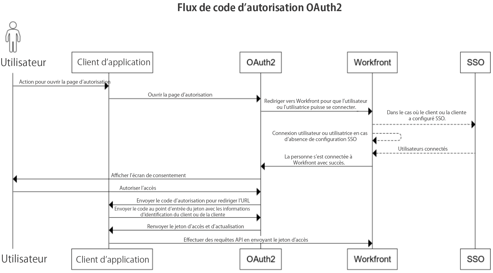

# Configurer et utiliser les applications OAuth 2 personnalisées de votre organisation à l’aide du flux de codes d’autorisation

Pour intégrer Workfront et permettre à votre application cliente de communiquer avec Workfront au nom de l’utilisateur ou de l’utilisatrice, vous devez :

* Créer une application OAuth2
* Configurer l’application tierce
* Établir un lien vers la page Autoriser pour vos utilisateurs et utilisatrices
* Configurer le flux de code d’autorisation : les utilisateurs et utilisatrices se connectent à l’instance Workfront et acceptent que l’application cliente puisse se connecter à Workfront en leur nom. Par conséquent, vous obtenez un code d’autorisation que vous échangerez contre des jetons d’accès et d’actualisation.
* Configurer le flux d’actualisation du jeton : dans ce flux, vous utilisez le jeton d’actualisation pour obtenir un nouveau jeton d’accès lorsque l’ancien a expiré.

## Créer une application OAuth2

Pour plus d’informations sur la création de l’application OAuth2, consultez la section [Créer une application OAuth2 à l’aide des informations d’identification de l’utilisateur ou de l’utilisatrice (flux de code d’autorisation)](../../administration-and-setup/configure-integrations/create-oauth-application.md#create3) de l’article [Créer des applications OAuth2 pour les intégrations Workfront](../../administration-and-setup/configure-integrations/create-oauth-application.md).

>[!NOTE]
>
>Vous pouvez avoir jusqu’à dix applications OAuth2 à la fois.

## Établir un lien vers la page Autoriser pour vos utilisateurs et utilisatrices

Vos utilisateurs et utilisatrices doivent se connecter pour autoriser cette intégration dans leur propre compte. La page à autoriser a un format spécifique, décrit ici. Utilisez ces informations pour déterminer l’adresse de la page d’autorisation de l’application et indiquez à vos utilisateurs et utilisatrices cette adresse ou un lien vers celle-ci.

* URL complète du domaine de votre organisation. Exemple :

  ```
  https://myorganization.my.workfront.com
  ```


* `client_id` : ID client généré lors de la création de l’application OAuth2 dans Workfront.

* `redirect_uri` : cette URL doit être identique à l’URL de redirection que vous avez saisie dans Workfront lors de la création de l’application OAuth2. Vos utilisateurs et utilisatrices seront redirigés vers cette page une fois qu’ils auront autorisé l’application pour leur compte.

* `response_type` : doit avoir la valeur `code`.

L’URL de la page d’autorisation est donc :

```
https://<URL of your organization's domain>/integrations/oauth2/authorize?client_id=<Your ClientID>&redirect_uri=<Your redirect URL>&response_type=code
```

>[!NOTE]
>
>Il est recommandé de créer un bouton ou tout autre lien sur lequel vos utilisateurs et utilisatrices pourront cliquer pour accéder à cette page.

## Configurer l’application tierce

L’application tierce peut nécessiter une configuration. Le tableau suivant contient des informations sur les champs qui peuvent s’avérer nécessaires lors de la configuration de l’application tierce.

<table style="table-layout:auto"> 
 <col> 
 <col> 
 <tbody> 
  <tr> 
   <td role="rowheader">URI d’autorisation</td> 
   <td> <p><code>https://&lt;the full URL of your organization's domain&gt;/integrations/oauth2/authorize</code> </p> <p class="example" data-mc-autonum="<b>Example: </b>"><span class="autonumber"><span><b>Exemple : </b></span></span><code> https://myorganization.my.workfront.com/integrations/oauth2/authorize</code> </p> </td> 
  </tr> 
  <tr> 
   <td role="rowheader">URL du jeton</td> 
   <td> <p><code>https://&lt;the full URL of your organization's domain&gt;/integrations/oauth2/api/v1/token</code> </p> <p class="example" data-mc-autonum="<b>Example: </b>"><span class="autonumber"><span><b>Exemple : </b></span></span><code>https://myorganization.my.workfront.com/integrations/oauth2/api/v1/token</code> </p> </td> 
  </tr> 
  <tr> 
   <td role="rowheader">Étendues</td> 
   <td>Il n’est pas nécessaire de spécifier des étendues. </td> 
  </tr> 
 </tbody> 
</table>

## Configurer le flux de code d’autorisation



Pour que vos utilisateurs et utilisatrices se connectent avec OAuth2, procédez comme suit :

1. Lorsque la personne ouvre la page d’autorisation, elle est redirigée vers la page de connexion de Workfront pour se connecter. Si la personne dispose d’une configuration SSO, la page de connexion du fournisseur d’identités s’ouvre.

   Si la personne est déjà connectée à Workfront dans ce même navigateur ou si elle se connecte correctement à Workfront, elle est redirigée vers l’écran de consentement :

   

1. Si la personne Autorise l’accès, la page redirige vers l’URL `redirect_url`. L’URL de redirection doit inclure les paramètres de requête suivants :

* `code` : code d’autorisation nécessaire pour obtenir le jeton d’accès/d’actualisation
* `domain` : domaine de votre entreprise. Exemple : dans `myorganization.my.workfront.com`, le domaine est `myorganization`
* `lane` : le chemin de la demande. Exemple : dans `myorganization.preview.workfront.com`, le chemin est `preview`.

  >[!IMPORTANT]
  >
  >Le `code` est valide uniquement pendant 2 minutes. Par conséquent, vous devez obtenir les jetons d’actualisation et d’accès dans le délai imparti.

1. Lorsque vous disposez d’un code, vous pouvez demander des jetons d’actualisation et d’accès en envoyant le code avec les informations d’identification de l’application cliente au point d’entrée `/integrations/oauth2/api/v1/token`.

   L’URL complète de la demande de jeton est

   ```
   https://<URL of your organization's domain></span>/integrations/oauth2/api/v1/token
   ```

   **Exemples :** exemple d’appel CURL au point d’entrée de jeton :

   Exemple 1

   ```
      curl --location --request POST '**<workfront host>**/integrations/oauth2/api/v1/token' \
      --header 'Authorization: Basic **<base64(client_id:client_secret)>**' \
      --header 'Content-Type: application/json' \
      --data-raw '{
      "code": "**<code>**",
      "grant_type": "**authorization_code**",
      "redirect_uri": "**<redirect_url>**"
      }'
   ```

   Exemple 2

   ```
      curl --location --request POST '**<workfront host>**/integrations/oauth2/api/v1/token' \
      --header 'Content-Type: application/x-www-form-urlencoded' \
      --data-urlencode 'grant_type=**authorization_code**' \
      --data-urlencode 'redirect_uri=**<redirect_url>**' \
      --data-urlencode 'code=**<code>**' \
      --data-urlencode 'client_id=**<client_id>**' \
      --data-urlencode 'client_secret=**<client_secret>**'  
   ```


   >[!IMPORTANT]
   >
   > Le secret client a été généré lors de l’enregistrement de l’application dans Workfront. Vous devez le stocker dans un emplacement sécurisé, car il ne peut pas être récupéré s’il est perdu.

   Lorsque tous les paramètres transmis sont corrects, le point d’entrée de jeton renvoie la payload suivante :

   ```
   {
      "token_type": "sessionID",
      "access_token": "string", // the value of sessionID
      "refresh_token": "string",
      "expires_in": 0,
      "wid": "string"
   }
   ```

   Le jeton d’accès est le même que ```sessionID```, et il expire de la même manière que ```sessionID```.

   >[!IMPORTANT]
   >
   > Stockez le jeton d’actualisation à un emplacement sécurisé. Vous en aurez besoin pour obtenir un nouveau jeton d’actualisation une fois l’ancien expiré. Workfront ne stocke pas votre jeton d’actualisation.

1. Désormais, lorsque vous disposez d’un jeton d’accès, vous pouvez effectuer des appels API vers Workfront.

   ```
   curl --request GET 'https://<workfront host>/attask/api/v14.0/proj/search \
   --header 'sessionID: <access_token>'
   ```

## Configurer le jeton d’accès d’actualisation


Pour actualiser access_token, nous devons à nouveau effectuer un appel « POST » vers le point d’entrée du jeton. Cette fois, nous envoyons des données de formulaire différentes comme suit :

```
curl --location --request POST '<workfront host>/integrations/oauth2/api/v1/token' \
--header 'Authorization: Basic <base64(client_id:client_secret)>' \
--header 'Content-Type: application/json' \
--data-raw '{
   "grant_type": "refresh_token",
   "refresh_token": "<refresh_token>"
}'

###### OR

curl --location --request POST '<workfront host>/integrations/oauth2/api/v1/token' \
--header 'Content-Type: application/x-www-form-urlencoded' \
--data-urlencode 'grant_type=refresh_token' \
--data-urlencode 'redirect_uri=<redirect_url>' \
--data-urlencode 'refresh_token=<refresh_token>' \
--data-urlencode 'client_id=<client_id>' \
--data-urlencode 'client_secret=<client_secret>'
```

Le résultat suivant sera renvoyé :

```
{
  "token_type": "sessionID",
  "access_token": "string", // the value of sessionID
  "refresh_token": "string",
  "expires_in": 0,
  "wid": "string"
}
```

Et encore une fois, le jeton d’accès est `sessionID` qui peut être utilisé pour envoyer une requête API à Workfront.
