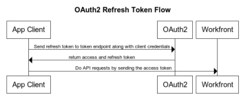

# Configurer et utiliser les applications OAuth 2 personnalisées de votre organisation à l’aide du flux de codes d’autorisation

Pour intégrer Workfront et permettre à votre application cliente de communiquer avec Workfront au nom de l’utilisateur, vous devez :

* Création d’une application OAuth2
* Configuration de l’application tierce
* Lien vers la page Autoriser pour vos utilisateurs
* Configuration du flux du code d’autorisation : les utilisateurs se connectent à l’instance Workfront et acceptent que l’application cliente puisse se connecter à Workfront en leur nom. Par conséquent, vous obtenez un code d’autorisation que vous allez exchange avec les jetons d’accès et d’actualisation.
* Configurer Actualiser le flux de jeton : dans ce flux, vous utilisez le jeton d’actualisation pour obtenir un nouveau jeton d’accès lorsque l’ancien a expiré.

## Création d’une application OAuth2

Pour plus d’informations sur la création de l’application OAuth2, voir [Création d’une application OAuth2 à l’aide des informations d’identification de l’utilisateur (flux de code d’autorisation)](../../administration-and-setup/configure-integrations/create-oauth-application.md#create3) in [Création d’applications OAuth2 pour les intégrations Workfront](../../administration-and-setup/configure-integrations/create-oauth-application.md)

>[!NOTE]
>
>Vous pouvez avoir jusqu’à dix applications OAuth2 à la fois.

## Lien vers la page Autoriser pour vos utilisateurs

Vos utilisateurs doivent se connecter pour autoriser cette intégration dans leur propre compte. La page à autoriser a un format spécifique, décrit ici. Utilisez ces informations pour déterminer l’adresse de la page d’autorisation de l’application et indiquez à vos utilisateurs cette adresse ou un lien vers celle-ci.

* URL complète du domaine de votre organisation. Exemple :

  ```
  https://myorganization.my.workfront.com
  ```


* `client_id`: ID client généré lors de la création de l’application OAuth2 dans Workfront.

* `redirect_uri`: URL de redirection que vous avez saisie lors de la création de l’application. Vos utilisateurs seront redirigés vers cette page une fois qu’ils auront autorisé l’application pour leur compte.

* `response_type`: doit avoir la valeur `code`.

L’URL de la page d’autorisation est donc :

```
https://<URL of your organization's domain>/integrations/oauth2/authorize?client_id=<Your ClientID>&redirect_uri=<Your redirect URL>&response_type=code
```

>[!NOTE]
>
>Il est recommandé de créer un bouton ou tout autre lien sur lequel vos utilisateurs pourront cliquer pour accéder à cette page.

## Configuration de l’application tierce

L’application tierce peut nécessiter une configuration. Le tableau suivant contient des informations sur les champs qui peuvent s’avérer nécessaires lors de la configuration de l’application tierce.

<table style="table-layout:auto"> 
 <col> 
 <col> 
 <tbody> 
  <tr> 
   <td role="rowheader">URI d’autorisation</td> 
   <td> <p><code>https://&lt;the full URL of your organization's domain&gt;/integrations/oauth2/authorize</code> </p> <p class="example" data-mc-autonum="<b>Example: </b>"><span class="autonumber"><span><b>Exemple : </b></span></span><code> https://myorganization.my.workfront.com/integrations/oauth2/authorize</code> </p> </td> 
  </tr> 
  <tr> 
   <td role="rowheader">URL du jeton</td> 
   <td> <p><code>https://&lt;the full URL of your organization's domain&gt;/integrations/oauth2/api/v1/token</code> </p> <p class="example" data-mc-autonum="<b>Example: </b>"><span class="autonumber"><span><b>Exemple : </b></span></span><code>https://myorganization.my.workfront.com/integrations/oauth2/api/v1/token</code> </p> </td> 
  </tr> 
  <tr> 
   <td role="rowheader">Portées</td> 
   <td>Il n’est pas nécessaire de spécifier des portées. </td> 
  </tr> 
 </tbody> 
</table>

## Configuration du flux du code d’autorisation


Pour connecter vos utilisateurs avec OAuth2, procédez comme suit :

1. Lorsque l’utilisateur ouvre la page d’autorisation, il la redirige vers la page de connexion de Workfront, de sorte qu’il puisse se connecter à Workfront. Si l’utilisateur dispose d’une configuration SSO, la page de connexion du fournisseur d’identité s’ouvre.

   Si l’utilisateur est déjà connecté à Workfront dans ce même navigateur ou s’il se connecte correctement à Workfront, il est redirigé vers l’écran de consentement :

   

1. Si l’utilisateur Autorise l’accès, la page est redirigée vers la fonction `redirect_url`. La redirection doit inclure les paramètres de requête suivants :

* `code`: code d’autorisation requis pour obtenir le jeton d’accès/d’actualisation.
* `domain`: domaine de votre entreprise. Exemple : in `myorganization.my.workfront.com`, le domaine est `myorganization`.
* `lane`: voie de la requête. Exemple : in `myorganization.preview.workfront.com`, la voie est `preview`.

  >[!IMPORTANT]
  >
  >La variable `code` est valide uniquement pendant 2 minutes. Par conséquent, vous devez obtenir les jetons d’actualisation et d’accès dans le délai imparti.

1. Lorsque vous disposez d’un code, vous pouvez demander une actualisation et accéder aux jetons en envoyant le code avec les informations d’identification de l’application cliente au `/integrations/oauth2/api/v1/token` point de terminaison .

   L’URL complète de la demande de jeton est

   ```
   https://<URL of your organization's domain></span>/integrations/oauth2/api/v1/token
   ```

   **Exemples :**  Exemple d’appel CURL au point de terminaison de jeton :

   Exemple 1

   ```
      curl --location --request POST '**<workfront host>**/integrations/oauth2/api/v1/token' \
      --header 'Authorization: Basic **<base64(client_id:client_secret)>**' \
      --header 'Content-Type: application/json' \
      --data-raw '{
      "code": "**<code>**",
      "grant_type": "**authorization_code**",
      "redirect_uri": "**<redirect_url>**"
      }'
   ```

   Exemple 2

   ```
      curl --location --request POST '**<workfront host>**/integrations/oauth2/api/v1/token' \
      --header 'Content-Type: application/x-www-form-urlencoded' \
      --data-urlencode 'grant_type=**authorization_code**' \
      --data-urlencode 'redirect_uri=**<redirect_url>**' \
      --data-urlencode 'code=**<code>**' \
      --data-urlencode 'client_id=**<client_id>**' \
      --data-urlencode 'client_secret=**<client_secret>**'  
   ```


   >[!IMPORTANT]
   >
   > Le secret client a été généré lors de l’enregistrement de l’application dans Workfront. Vous devez le stocker dans un emplacement sécurisé, car il ne peut pas être récupéré s’il est perdu.

   Lorsque tous les paramètres transmis sont corrects, le point de terminaison de jeton renvoie la charge utile suivante :

   ```
   {
      "token_type": "sessionID",
      "access_token": "string", // the value of sessionID
      "refresh_token": "string",
      "expires_in": 0,
      "wid": "string"
   }
   ```

   Le jeton d’accès est le même que ```sessionID```, et il expire de la même manière que ```sessionID```

   >[!IMPORTANT]
   >
   > Stockez le jeton d’actualisation à un emplacement sécurisé. Vous en aurez besoin pour obtenir un nouveau jeton d’actualisation une fois l’ancien expiré. Workfront ne stocke pas votre jeton d’actualisation.

1. Désormais, lorsque vous disposez d’un jeton d’accès, vous pouvez effectuer des appels API vers Workfront.

   ```
   curl --request GET 'https://<workfront host>/attask/api/v14.0/proj/search \
   --header 'sessionID: <access_token>'
   ```

## Configuration du jeton d’accès d’actualisation



Pour actualiser access_token, nous devons à nouveau effectuer un appel &quot;POST&quot; vers le point de terminaison du jeton. Cette fois, nous envoyons des données de formulaire différentes comme suit :

```
curl --location --request POST '<workfront host>/integrations/oauth2/api/v1/token' \
--header 'Authorization: Basic <base64(client_id:client_secret)>' \
--header 'Content-Type: application/json' \
--data-raw '{
   "grant_type": "refresh_token",
   "refresh_token": "<refresh_token>"
}'

###### OR

curl --location --request POST '<workfront host>/integrations/oauth2/api/v1/token' \
--header 'Content-Type: application/x-www-form-urlencoded' \
--data-urlencode 'grant_type=refresh_token' \
--data-urlencode 'redirect_uri=<redirect_url>' \
--data-urlencode 'refresh_token=<refresh_token>' \
--data-urlencode 'client_id=<client_id>' \
--data-urlencode 'client_secret=<client_secret>'
```

Il renvoie le résultat suivant :

```
{
  "token_type": "sessionID",
  "access_token": "string", // the value of sessionID
  "refresh_token": "string",
  "expires_in": 0,
  "wid": "string"
}
```

Et encore une fois, le jeton d’accès est `sessionID` qui peut être utilisé pour envoyer une requête API à Workfront.
