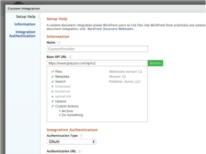

# Vue d’ensemble des webhooks

Adobe Workfront Document Webhooks définit un ensemble de points d’entrée d’API par le biais desquels Workfront effectue des appels API autorisés à un fournisseur de documents externe. Cela permet à n’importe qui de créer un plug-in d’intergiciel pour n’importe quel fournisseur de stockage de documents.

L’expérience utilisateur des intégrations basées sur les webhooks sera similaire à celle des intégrations de documents existantes telles que Google Drive, Box et Dropbox. Par exemple, un utilisateur ou une utilisatrice de Workfront pourra effectuer les actions suivantes :

* Naviguer dans la structure des dossiers du fournisseur de documents externes
* Rechercher des fichiers
* Lier des fichiers à Workfront
* Charger des fichiers vers le fournisseur de documents externes
* Afficher une miniature du document

**Implémentation de référence**

Pour accélérer le développement d’une nouvelle implémentation de webhooks, Workfront fournit des exemples d’implémentation de référence. Ces exemples se trouvent à l’adresse [https://github.com/Workfront/webhooks-app](https://github.com/Workfront/webhooks-app). Les exemples sont basés sur Java et permettent à Workfront de connecter des documents sur un système de fichiers réseau.

>[!NOTE]
>
>Les ressources sur GitHub ne sont que des exemples et ne permettent pas d’exécuter une implémentation.

## Versions

* Version 1.0 (Date de publication - mai 2015) : spécification initiale

* Version 1.1 (Date de publication - juin 2015). Mise à jour de /uploadInit - Ajout de documentId et documentVersionId

* Version 1.2 (Date de publication - octobre 2015) : ajout de /createFolder

* Versions à venir (Date de publication - à déterminer) :

   * Ajout de /delete
   * Ajout de /rename
   * Ajout de /serviceInfo
   * Ajout de /customAction
   * Ajout de pagination et parentId à /search
