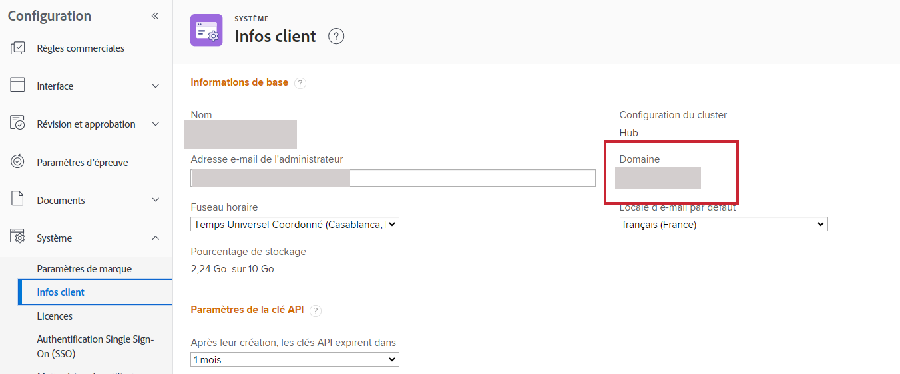

# Format de domaine pour les appels API Adobe Workfront

Lorsque vous effectuez un appel API vers l’API Workfront, vous utilisez le domaine de votre entreprise dans l’appel. Le format de cette URL de domaine varie selon que votre entreprise a été intégrée ou non à Adobe Unified Shell.

Pour savoir si votre entreprise se trouve sur Adobe Unified Shell, examinez l’URL qui s’affiche lorsque vous consultez une page Workfront.

| L’URL Workfront commence par : | URL des appels API : |
|---|---|
| `<yourdomain>.my.workfront.com` | `<yourdomain>.my.workfront.com` |
| `experience.adobe.com` | `<yourdomain>.my.workfront.adobe.com` |

## Conditions d’accès

+++ Développez pour afficher les exigences d’accès aux fonctionnalités de cet article.

<table style="table-layout:auto"> 
 <col> 
 <col> 
 <tbody> 
  <tr> 
   <td role="rowheader">Package Adobe Workfront</td> 
   <td> 
Tous 
 </td> 
  </tr> 
  <tr> 
   <td role="rowheader">Licence Adobe Workfront</td> 
   <td>
Standard

   
Plan
</td> 
  </tr> 
  <tr> 
   <td role="rowheader">Configurations des niveaux d’accès</td> 
   <td> 
Vous devez être un administrateur Workfront
 </td> 
  </tr> 
 </tbody> 
</table>

Pour plus d’informations, voir [Conditions d’accès requises dans la documentation Workfront](/help/quicksilver/administration-and-setup/add-users/access-levels-and-object-permissions/access-level-requirements-in-documentation.md).

+++

Pour localiser votre domaine :

1. Cliquez sur l’icône **[!UICONTROL Menu principal]**  dans le coin supérieur droit d’Adobe Workfront, ou (si disponible), cliquez sur l’icône **[!UICONTROL Menu principal]**  dans le coin supérieur gauche, puis sur **[!UICONTROL Configuration]** .
1. Sélectionnez **Système**, puis **Infos client**.

   Votre domaine est répertorié à droite de l’écran.

   

