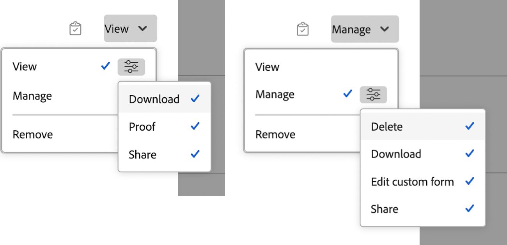

# Partager un document

Les informations mises en surbrillance sur cette page font référence à des fonctionnalités qui ne sont pas encore disponibles de manière générale. Cette option n’est disponible que dans l’environnement de prévisualisation de sandbox.

Votre équipe d’administration Adobe Workfront accorde aux utilisateurs et utilisatrices l’accès en affichage ou en modification des documents lorsqu’elle attribue des niveaux d’accès, comme expliqué dans la section [Accorder l’accès aux documents](../../administration-and-setup/add-users/configure-and-grant-access/grant-access-documents.md).

Le niveau d’accès que l’équipe d’administration Workfront accorde aux utilisateurs et utilisatrices leur permet de consulter ou de modifier des documents. En outre, d’autres utilisateurs et utilisatrices peuvent également accorder à d’autres des autorisations pour consulter ou gérer des documents spécifiques qu’ils ont eux-mêmes chargés ou qu’ils peuvent partager.

Les autorisations sont spécifiques à un élément dans Workfront et définissent les actions que vous pouvez effectuer sur cet élément. Pour plus d’informations sur les autorisations relatives aux objets, voir [Vue d’ensemble du partage des autorisations sur les objets](../../workfront-basics/grant-and-request-access-to-objects/sharing-permissions-on-objects-overview.md).

L’utilisateur ou utilisatrice qui charge un document dans Workfront dispose par défaut d’autorisations de gestion.

Pour plus d’informations sur le partage d’un dossier de documents entier, voir [Partager un dossier de documents](../../workfront-basics/grant-and-request-access-to-objects/share-a-document-folder.md).

## Remarques sur le partage de documents

Outre les considérations ci-dessous, voir également [Vue d’ensemble du partage des autorisations sur les objets](../../workfront-basics/grant-and-request-access-to-objects/sharing-permissions-on-objects-overview.md).

>[!NOTE]
>
>Une équipe d’administration Workfront peut ajouter ou supprimer des autorisations à tous les éléments du système, pour toutes les personnes, sans être la personne propriétaire de ces éléments.

* Le partage d’un document est similaire au partage de tout autre objet dans Workfront. Pour plus d’informations sur le partage de documents dans Workfront, voir [Partager un objet](../../workfront-basics/grant-and-request-access-to-objects/share-an-object.md).
* Vous pouvez accorder les autorisations suivantes aux documents :

   * Afficher
   * Gérer

  Dans l’aperçu :
  

* Vous pouvez également partager un document publiquement ou à l’échelle du système.

  >[!CAUTION]
  >
  >Nous avisons la prudence lors du partage d’un objet contenant des informations confidentielles avec des utilisateurs et utilisatrices externes. Cette fonction leur permet d’afficher des informations sans être un utilisateur ou une utilisatrice Workfront ou une personne membre de votre organisation.

* Vous pouvez partager un document avec une personne qui n’a pas de compte Workfront, en ajoutant son adresse e-mail dans le champ Accorder l’accès au document à.
* Lorsque vous partagez un document, les utilisateurs et utilisatrices ont le même accès à toutes les versions et toutes les épreuves du document.\
  Pour plus d’informations sur la relecture dans Workfront, voir la section [Relecture](../../review-and-approve-work/proofing/proofing.md).

* Vous pouvez hériter des autorisations sur les documents à partir des objets auxquels ils sont associés. Votre équipe d’administration Workfront peut limiter l’héritage des autorisations pour les documents de votre niveau d’accès.

  Pour plus d’informations sur la limitation des autorisations héritées sur les documents, voir [Créer ou modifier des niveaux d’accès personnalisés](../../administration-and-setup/add-users/configure-and-grant-access/create-modify-access-levels.md).

  Vous pouvez supprimer manuellement les autorisations héritées sur les documents. Pour plus d’informations, voir [Supprimer les autorisations des objets](../../workfront-basics/grant-and-request-access-to-objects/remove-permissions-from-objects.md)

* Un document joint n’hérite des autorisations que de l’objet auquel il a été joint. Si vous créez un dossier sur l’objet et que vous déplacez le document dans le dossier, il hérite des autorisations du dossier. En revanche, si vous créez un dossier sur un objet parent ou grand-parent et que vous déplacez le document dans ce dossier, il n’hérite pas des autorisations de ce dossier.

## Autorisations de documents

Le tableau suivant indique les autorisations que vous pouvez accorder aux utilisateurs et utilisatrices lorsqu’ils sont autorisés à consulter ou à gérer des documents :

<table border="2" cellspacing="15" cellpadding="1"> 
 <col> 
 <col> 
 <col> 
 <thead> 
  <tr> 
   <th> 
<strong>Action</strong> 
 </th> 
   <th> 
<strong>Gérer</strong> 
 </th> 
   <th> 
<strong>Afficher</strong> 
 </th> 
  </tr> 
 </thead> 
 <tbody> 
  <tr> 
   <td scope="row">Créer</td> 
   <td>✓</td> 
   <td> </td> 
  </tr> 
  <tr> 
   <td scope="row">Modifier les détails du document</td> 
   <td>✓</td> 
   <td> </td> 
  </tr> 
  <tr> 
   <td scope="row">Supprimer*</td> 
   <td>✓</td> 
   <td> </td> 
  </tr> 
  <tr> 
   <td scope="row">Téléchargement</td> 
   <td>✓</td> 
   <td>✓</td> 
  </tr> 
  <tr> 
   <td scope="row">Passage en caisse</td> 
   <td>✓</td> 
   <td> </td> 
  </tr> 
  <tr> 
   <td scope="row">Ajouter des approbateurs et approbatrices</td> 
   <td>✓</td> 
   <td> </td> 
  </tr> 
  <tr> 
   <td scope="row">Approuver le document</td> 
   <td>✓</td> 
   <td>✓</td> 
  </tr> 
  <tr> 
   <td scope="row">Joindre un formulaire personnalisé</td> 
   <td>✓</td> 
   <td> </td> 
  </tr> 
  <tr> 
   <td scope="row">Modifier les champs personnalisés</td> 
   <td>✓</td> 
   <td> </td> 
  </tr> 
  <tr> 
   <td scope="row">Déplacer vers (objet)</td> 
   <td>✓</td> 
   <td> </td> 
  </tr> 
  <tr> 
   <td scope="row">Envoyer à (intégration)</td> 
   <td>✓</td> 
   <td> </td> 
  </tr> 
  <tr> 
   <td scope="row">Mises à jour / commentaires</td> 
   <td>✓</td> 
   <td>✓</td> 
  </tr> 
  <tr> 
   <td scope="row">Charger une nouvelle version</td> 
   <td>✓</td> 
   <td> </td> 
  </tr> 
  <tr> 
   <td scope="row">Supprimer la version</td> 
   <td>✓</td> 
   <td> </td> 
  </tr> 
  <tr> 
   <td scope="row">Afficher un ou plusieurs documents</td> 
   <td>✓</td> 
   <td>✓</td> 
  </tr> 
  <tr> 
   <td scope="row">Aperçu</td> 
   <td>✓</td> 
   <td>✓</td> 
  </tr> 
  <tr> 
   <td scope="row">Épreuve**</td> 
   <td>✓</td> 
   <td>✓</td> 
  </tr> 
  <tr> 
   <td scope="row">Générer une épreuve**</td> 
   <td>✓</td> 
   <td> </td> 
  </tr> 
  <tr> 
   <td scope="row">Supprimer une épreuve**</td> 
   <td>✓</td> 
   <td> </td> 
  </tr> 
  <tr> 
   <td scope="row">Partager*</td> 
   <td>✓</td> 
   <td>✓</td> 
  </tr> 
  <tr> 
   <td scope="row">Partager à l’échelle du système*</td> 
   <td>✓</td> 
   <td> </td> 
  </tr> 
  <tr> 
   <td scope="row">Partager les documents publiquement*</td> 
   <td>✓</td> 
   <td> </td> 
  </tr> 
  <tr> 
   <td scope="row">Partager avec une adresse e-mail externe</td> 
   <td> </td> 
   <td>✓</td> 
  </tr> 
  <tr> 
   <td scope="row">Ajouter/Supprimer</td> 
   <td>✓</td> 
   <td>✓</td> 
  </tr> 
  <tr> 
   <td scope="row">Renommer</td> 
   <td>✓</td> 
   <td> </td> 
  </tr> 
  <tr> 
   <td scope="row">Lier (avec intégration)</td> 
   <td>✓</td> 
   <td>✓</td> 
  </tr> 
  <tr> 
   <td scope="row">Annuler le lien (avec intégration)</td> 
   <td>✓</td> 
   <td> </td> 
  </tr> 
 </tbody> 
</table>

&#42; L’action est partagée par les documents et les dossiers de documents.

&#42;&#42; Vous devez disposer d’une licence de relecture distincte associée à votre compte Workfront pour pouvoir relire des documents. Contactez votre personne gestionnaire de compte pour obtenir une licence de relecture. Pour plus d’informations sur la relecture dans Workfront, voir [Relecture](../../review-and-approve-work/proofing/proofing.md).
