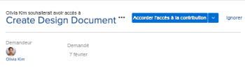

# Autoriser l’accès aux objets de la zone d’accueil

Les utilisateurs et utilisatrices peuvent demander l’accès aux objets dans Adobe Workfront. Pour plus d’informations sur la demande d’accès, voir [Demander l’accès aux objets](../../workfront-basics/grant-and-request-access-to-objects/request-access.md).

Si vous êtes la ou le propriétaire d’un objet, vous pouvez accorder ou refuser l’accès aux éléments de votre zone d’accueil.

## Conditions d’accès

<!--drafted for P&P:

<table style="table-layout:auto"> 
 <col> 
 <col> 
 <tbody> 
  <tr> 
   <td role="rowheader">Adobe Workfront plan*</td> 
   <td> 
Any
 </td> 
  </tr> 
  <tr> 
   <td role="rowheader">Adobe Workfront license*</td> 
   <td> 
Current license: Standard
 
   Or
   
Legacy license: Work or higher

   </td> 
  </tr> 
  <tr> 
   <td role="rowheader">Access level configurations*</td> 
   <td> 
View access or higher to projects, tasks, issues, or documents
 
<b>NOTE</b>
   
   If you still don't have access, ask your Workfront administrator if they set additional restrictions in your access level. For information on how a Workfront administrator can modify your access level, see <a href="../../administration-and-setup/add-users/configure-and-grant-access/create-modify-access-levels.md" class="MCXref xref">Create or modify custom access levels</a>.
 </td> 
  </tr> 
  <tr> 
   <td role="rowheader">Object permissions</td> 
   <td> 
View permissions or higher to projects, tasks, issues, or documents
 
For information on requesting additional access, see <a href="../../workfront-basics/grant-and-request-access-to-objects/request-access.md" class="MCXref xref">Request access to objects </a>.
 </td> 
  </tr> 
 </tbody> 
</table>

-->

Vous devez disposer des accès suivants pour effectuer les étapes décrites dans cet article :

<table style="table-layout:auto"> 
 <col> 
 <col> 
 <tbody> 
  <tr> 
   <td role="rowheader">Formule Adobe Workfront*</td> 
   <td> 
Tous
 </td> 
  </tr> 
  <tr> 
   <td role="rowheader">Licence Adobe Workfront*</td> 
   <td> 
Travail ou supérieur
 </td> 
  </tr> 
  <tr> 
   <td role="rowheader">Configurations du niveau d’accès*</td> 
   <td> 
Accès en affichage ou d’un niveau supérieur aux projets, tâches, problèmes ou documents
 
<b>NOTE</b>

Si vous n’avez toujours pas accès, demandez à votre administrateur ou administratrice Workfront si votre niveau d’accès est soumis à des restrictions supplémentaires. Pour plus d’informations sur la façon dont l’administration Workfront peut modifier votre niveau d’accès, consultez la section <a href="../../administration-and-setup/add-users/configure-and-grant-access/create-modify-access-levels.md" class="MCXref xref">Créer ou modifier des niveaux d’accès personnalisés</a>.
 </td>
</tr> 
  <tr> 
   <td role="rowheader">Autorisations d’objet</td> 
   <td> 
Accès en affichage ou supérieur aux projets, tâches, problèmes ou documents
 
Pour plus d’informations sur la demande d’accès supplémentaire, voir <a href="../../workfront-basics/grant-and-request-access-to-objects/request-access.md" class="MCXref xref">Demander l’accès aux objets</a>.
 </td> 
  </tr> 
 </tbody> 
</table>

&#42;Pour connaître le forfait, le type de licence ou l’accès dont vous disposez, contactez votre administrateur ou administratrice Workfront.

## Autoriser l’accès aux objets de la zone d’accueil

1. Cliquez sur l’icône **Accueil**  dans le coin supérieur gauche d’Adobe Workfront.

   >[!NOTE]
   >
   >Votre administrateur ou administratrice Workfront peut apporter les modifications suivantes à l’icône Accueil de votre environnement :
   >
   >* La remplacer par une image personnalisée pour illustrer votre entreprise. Dans ce cas, l’icône sera différente de celle présentée dans cet article.
   >* Remplacer la page à laquelle elle est liée par une autre page. Dans ce cas, cliquez sur **Menu Principal**  dans le coin supérieur droit de la page, puis sur **Accueil**.

1. (Le cas échéant) Dans la zone d’accueil héritée, procédez comme suit :

   1. Dans la **Liste de travail**, sélectionnez la demande d’accès à gérer dans la section **Approbations**.

   

   La demande s’affiche à droite de la liste de travail.

   1. Dans le coin supérieur droit, cliquez sur le bouton Accorder l’accès.\
      Selon le type d’accès demandé, le nom du bouton change. Par exemple, si le demandeur ou la demandeuse demande l’accès en affichage, le bouton indique : **Accorder l’accès en affichage**.\
      

   1. (Facultatif) Pour accorder un niveau d’accès différent de celui demandé, cliquez sur la flèche en regard du bouton d’autorisation d’accès et sélectionnez le nouvel accès, puis cliquez sur **Accorder > Niveau d’autorisation > Accès >**.\
      Un message s’affiche pour confirmer que l’accès a été accordé.

   1. (Facultatif) Cliquez sur **Ignorer** pour refuser l’accès.\
      Un message s’affiche pour confirmer que l’accès a été ignoré.

1. (Le cas échéant) Dans la nouvelle zone d’accueil, procédez comme suit :

   1. Accédez au widget **Ma validation** et recherchez la demande d’accès plus poussé, puis cliquez sur **Accorder l’accès**.

      

   1. (Facultatif) Pour accorder un niveau d’accès différent de celui demandé, cliquez sur le menu déroulant à gauche du bouton Accorder l’accès et sélectionnez le nouvel accès, puis cliquez sur **Accorder l’accès**.

      La demande d’accès est accordée et disparaît de la liste des demandes d’approbation.

   1. (Facultatif) Cliquez sur **Ignorer** pour refuser l’accès. La demande d’accès n’est pas accordée et la demande disparaît de la liste des demandes d’approbation.

## Configurer des notifications par e-mail pour les demandes

Vous pouvez configurer la réception de notifications par e-mail pour les demandes d’accès. Votre administrateur ou administratrice Workfront peut désactiver cette fonctionnalité (comme décrit dans [Configurer les notifications d’événement pour tout le monde dans le système](../../administration-and-setup/manage-workfront/emails/configure-event-notifications-for-everyone-in-the-system.md)).

1. Cliquez sur l’icône **Menu Principal**  dans le coin supérieur droit d’Adobe Workfront, puis sur **Configuration** .

1. Cliquez sur **Préférences** ou faites défiler l’écran jusqu’à la section Préférences.
1. Dans la liste déroulante **M’envoyer un e-mail quand**, sélectionnez ou désélectionnez **Quelqu’un me demande l’accès**, selon que vous souhaitez recevoir des notifications par e-mail lorsqu’un autre utilisateur ou une autre utilisatrice vous demande l’accès.

1. Cliquez sur **Enregistrer les modifications**.
