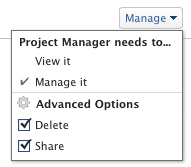

# Partager des rapports, des tableaux de bord et des calendriers

Votre administrateur Adobe Workfront permet aux utilisateurs d’afficher ou de modifier des rapports, des tableaux de bord et des calendriers lorsqu’ils attribuent des niveaux d’accès. Pour plus d’informations sur l’octroi de l’accès aux rapports, aux tableaux de bord et aux calendriers, voir [Octroi de l’accès aux rapports, aux tableaux de bord et aux calendriers](../../administration-and-setup/add-users/configure-and-grant-access/grant-access-reports-dashboards-calendars.md).

Outre le niveau d’accès qui est accordé aux utilisateurs, vous pouvez leur accorder des autorisations pour Afficher ou gérer des rapports, des tableaux de bord ou des calendriers spécifiques que vous avez accès à Partager. Pour plus d’informations sur l’octroi d’autorisations de partage aux utilisateurs sur les objets, voir [Présentation des autorisations de partage sur les objets](../../workfront-basics/grant-and-request-access-to-objects/sharing-permissions-on-objects-overview.md).

Les autorisations sont spécifiques à un élément dans Workfront et définissent les actions que vous pouvez effectuer sur cet élément.

Pour plus d’informations sur ce que les utilisateurs de chaque niveau d’accès peuvent faire avec des problèmes, reportez-vous à la section [Rapports](../../administration-and-setup/add-users/access-levels-and-object-permissions/functionality-available-for-each-object-type.md#reports) de l’article [Fonctionnalité disponible pour chaque type d’objet](../../administration-and-setup/add-users/access-levels-and-object-permissions/functionality-available-for-each-object-type.md).

## Observations relatives au partage d’un rapport, d’un tableau de bord ou d’un calendrier

Outre les considérations ci-dessous, reportez-vous également à la section [Présentation des autorisations de partage sur les objets](../../workfront-basics/grant-and-request-access-to-objects/sharing-permissions-on-objects-overview.md).

>[!NOTE]
>
>Un administrateur Workfront peut ajouter ou supprimer des autorisations à n’importe quel élément du système, pour tous les utilisateurs, sans en être le propriétaire.

* Par défaut, le créateur d’un rapport, d’un tableau de bord ou d’un calendrier dispose des autorisations de type Gérer .
* Le partage de rapports, de tableaux de bord et de calendriers est similaire au partage de tout autre objet dans Workfront.

  Pour plus d’informations sur le partage d’objets dans Workfront, voir [Partage d’un objet](../../workfront-basics/grant-and-request-access-to-objects/share-an-object.md).

  Consultez également les articles suivants pour savoir comment partager des rapports, des tableaux de bord et des calendriers :

   * [Partager un rapport dans Adobe Workfront](../../reports-and-dashboards/reports/creating-and-managing-reports/share-report.md)
   * [Partager un tableau de bord](../../reports-and-dashboards/dashboards/creating-and-managing-dashboards/share-dashboard.md)
   * [Partager un rapport de calendrier](../../reports-and-dashboards/reports/calendars/share-a-calendar-report.md)

* Vous pouvez partager des rapports et des tableaux de bord individuellement ou en bloc.

  Vous ne pouvez partager des calendriers qu’unitairement. Vous ne pouvez pas les partager en bloc.

* Vous ne pouvez pas partager de rapports système intégrés. Vous ne pouvez partager que des rapports personnalisés.

  Pour plus d’informations sur l’enregistrement d’un rapport système en tant que nouveau rapport personnalisé, voir [Création d’une copie d’un rapport](../../reports-and-dashboards/reports/creating-and-managing-reports/create-copy-report.md).

* Vous pouvez accorder les autorisations suivantes aux rapports, tableaux de bord et calendriers :

   * Afficher

     

   * Gérer

     

* Lorsque vous partagez un tableau de bord, les utilisateurs disposent par défaut des autorisations Afficher pour tous les rapports, calendriers et pages externes du tableau de bord.
* Les utilisateurs disposant d’une licence de demande ne peuvent pas afficher de rapport à l’échelle du système. Un rapport doit être partagé avec les Demandeurs individuellement s’ils doivent le visualiser.
* Si un rapport comporte une invite que vous partagez publiquement, les utilisateurs qui y accèdent doivent être connectés à Workfront pour pouvoir exécuter le rapport à l’aide de l’invite. S’ils ne peuvent pas se connecter à Workfront, le rapport s’affiche sans l’invite qui lui est appliquée.\
  Pour plus d’informations sur les limites du partage de rapports avec des invites, reportez-vous à la section [Limites du partage des rapports demandés](../../reports-and-dashboards/reports/creating-and-managing-reports/add-prompt-report.md#limitations-of-running-public-prompted-reports) de l’article [Ajout d’une invite à un rapport](../../reports-and-dashboards/reports/creating-and-managing-reports/add-prompt-report.md).

* Vous pouvez supprimer les autorisations héritées d’un rapport ou d’un calendrier.

  Pour plus d’informations sur la suppression des autorisations héritées des objets, voir [Suppression des autorisations des objets](../../workfront-basics/grant-and-request-access-to-objects/remove-permissions-from-objects.md).

* Vous pouvez également partager un rapport ou un calendrier à l’échelle du système ou du public.

  Vous ne pouvez pas partager un tableau de bord publiquement, mais vous pouvez le partager à l’échelle du système.

  >[!CAUTION]
  >
  >Nous vous recommandons d’être prudent lors du partage d’un objet contenant des informations confidentielles avec des utilisateurs externes. Cela leur permet d’afficher des informations sans être un utilisateur Workfront ou un membre de votre entreprise.
