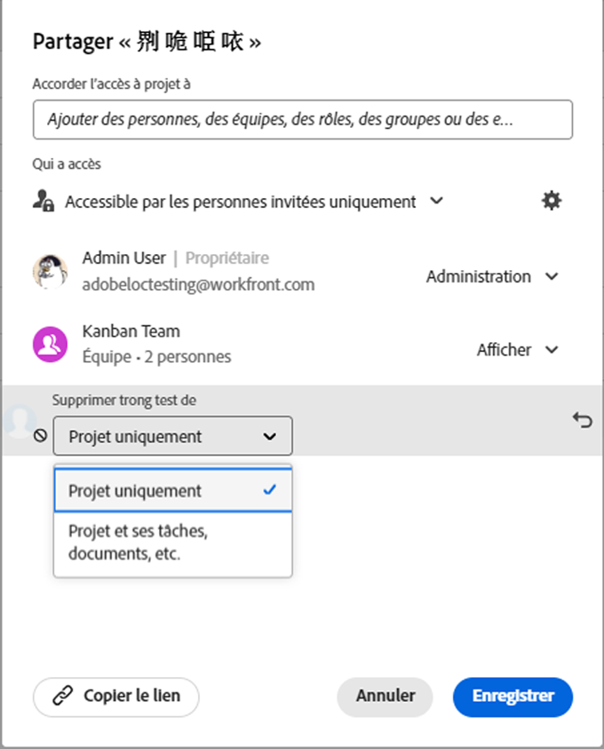

# Supprimer les autorisations des objets

<!--Audited: 01/2024-->

Vous pouvez supprimer les autorisations d’autres utilisateurs et utilisatrices sur les objets pour lequel vous disposez d’autorisations de partage. La suppression des autorisations des objets est identique pour tous les objets qui peuvent être partagés.

Les mêmes remarques que pour le partage d’objets s’appliquent à la suppression des autorisations sur les objets. Pour plus d’informations, voir la section [Considérations sur le partage d’objets](../../workfront-basics/grant-and-request-access-to-objects/sharing-permissions-on-objects-overview.md#consider) dans l’article [Vue d’ensemble du partage des autorisations sur les objets](../../workfront-basics/grant-and-request-access-to-objects/sharing-permissions-on-objects-overview.md).

## Conditions d’accès

+++ Développez pour afficher les exigences d’accès aux fonctionnalités de cet article. 

<table style="table-layout:auto"> 
 <col> 
 <col> 
 <tbody> 
  <tr> 
   <td role="rowheader">Package Adobe Workfront</td> 
   <td> 
Tous 
 </td> 
  </tr> 
  <tr> 
   <td role="rowheader">Licence Adobe Workfront</td> 
   <td> 
Contributeur ou version ultérieure
 
   
Requête ou supérieure

   
<strong>Remarque </strong> : certains objets nécessitent un accès supérieur à celui de la demande.

   </td> 
  </tr> 
  <tr> 
   <td role="rowheader">Configurations des niveaux d’accès</td> 
   <td> 
Accès Affichage ou supérieur aux objets que vous souhaitez partager.
 </td> 
  </tr> 
  <tr> 
   <td role="rowheader">Autorisations d’objet</td> 
   <td> 
Autorisations d’affichage ou supérieures pour les objets que vous souhaitez partager.
 
Autorisations de gestion pour supprimer les autorisations héritées sur les objets
  </td> 
  </tr>
 </tbody> 
</table>

Pour plus de détails sur les informations contenues dans ce tableau, consultez [Conditions d’accès préalables dans la documentation Workfront](/help/quicksilver/administration-and-setup/add-users/access-levels-and-object-permissions/access-level-requirements-in-documentation.md).

+++

## Supprimer des entités de la liste de partage d’un objet {#remove-entities-from-the-sharing-list-of-an-object}

Vous pouvez supprimer des entités (utilisateurs et utilisatrices, fonctions, équipes, groupes, entreprises) de la liste de partage d’un objet. Cela supprime leurs autorisations sur l’objet.

1. Accédez à l’objet pour lequel vous souhaitez supprimer les autorisations.

   Pour plus d’informations sur les objets qui peuvent être partagés, voir [Vue d’ensemble des autorisations de partage sur les objets](../../workfront-basics/grant-and-request-access-to-objects/sharing-permissions-on-objects-overview.md).

1. (Le cas échéant) Pour les programmes, les portfolios et les documents, procédez comme suit :

   1. Cliquez sur l’icône **Plus**  en regard du nom de l’objet, puis cliquez sur **Partage** ou **Partager.**

      

   1. Cliquez sur la croix (**x**) en regard du nom d’une personne, d’une équipe, d’un groupe, d’une entreprise ou d’une fonction pour supprimer l’élément de la zone d’accès à l’objet.

      

   1. Dans le menu déroulant **[Nom d’utilisateur] l’accès au Workfront sera supprimé de ce**, choisissez si vous souhaitez que leur accès soit supprimé uniquement de l’objet que vous avez sélectionné ou de tous les objets enfants qui y sont associés.

1. (Le cas échéant) Pour les projets, les tâches et les problèmes, procédez comme suit :

   1. Cliquez sur **Partager** à droite du nom de l’objet.

      
   1. Recherchez la personne, le rôle, l’équipe, le groupe ou l’entreprise que vous souhaitez supprimer de l’objet.
   1. Cliquez sur **Supprimer**.
Dans le menu déroulant **Supprimer &lt; Nom d’utilisateur ou d’utilisatrice > de**, choisissez si vous souhaitez que son accès soit supprimé uniquement pour l’objet que vous avez sélectionné ou pour tous les objets enfant qui lui sont associés.

      

   Les scénarios suivants sont possibles :

   * Si vous ne supprimez l’entité que de l’objet, cette entité perd ses autorisations sur l’objet, ainsi que les autorisations dont elle a hérité pour les objets enfants. Si elle a déjà obtenu des autorisations pour les éléments enfants individuellement, elle conserve les mêmes autorisations pour tous les objets enfants associés lorsque vous sélectionnez cette option.
   * Si vous supprimer l’entité de l’objet et de tous les objets enfants, cette entité perd ses autorisations sur l’objet ainsi que sur tous les objets enfants, même si elle avait auparavant obtenu des autorisations individuelles sur chaque objet enfant.

1. Cliquer sur **Enregistrer**.

<!--
## Remove permissions from several objects in bulk

You can remove entities (users, job roles, teams, groups, companies) from several objects at a time when you bulk select them in a list.

>[!NOTE]
>
>You cannot view what access entities have for all the objects selected when you select them in bulk. You must know which entity you want to remove from the sharing of the objects selected before removing their permissions.

1. Go to the list of objects that you want to share.

   For information about which objects can be shared, see [Overview of sharing permissions on objects](../../workfront-basics/grant-and-request-access-to-objects/sharing-permissions-on-objects-overview.md).

1. Select several objects in the list, then click the **Share** icon at the top of the list. 
1. Type the name of the user, role, team, group, or company for which you want to remove the access in the **Edit `<Object Name>` access to** field. 
1. From the access drop-down menu, select **No Access**.

   

1. In the `<User Name>`'s Workfront access will be removed from this drop-down menu, select whether you want their access to be removed just from the objects that you have selected, or from all other children objects associated with it.  
   The following scenarios exist:

   * If you remove the entity only from the object, that entity loses their permissions on the object, and their inherited permissions to the children objects. If they were previously granted permissions to the children items individually, they retain the same permissions on all children objects associated with it when you select this option.  
   * If you remove the entity from the object and all the children objects, that entity loses their permissions to the object as well as all children objects, even when they were previously given individual permission on each child object.

   **Example:** Select whether to remove permissions to just the tasks you selected in a list, or to the issues and documents attached to the tasks as well.

   

1. (Optional) To change permissions in bulk for several objects, select another level of sharing for the selected entity.

   For example, if they have Manage permissions, select Contribute or View instead. 

1. Click **Save**.

-->

## Supprimer des autorisations héritées

Les autorisations héritées peuvent être supprimées des objets, ce qui permet aux propriétaires d’identifier spécifiquement qui aura accès aux objets enfants, quel que soit l’accès d’un utilisateur à un objet parent.

>[!IMPORTANT]
>
>Seules les personnes disposant de l’autorisation de gestion peuvent supprimer les autorisations héritées.

Pour supprimer des autorisations héritées :

1. Accédez à un objet pour lequel vous avez des autorisations de gestion. Par exemple, rendez-vous sur une tâche.
1. Accédez à la zone d’accès de l’objet comme décrit dans la section [Supprimer des entités de la liste de partage d’un objet](#remove-entities-from-the-sharing-list-of-an-object) de cet article.
1. Sélectionnez **Désactiver** en regard de **Autorisation héritée** pour la désactiver.

   Cela permet de s’assurer qu’aucune personne disposant des autorisations sur l’objet parent (par exemple, le projet) n’a de droits sur cette tâche par défaut. Vous devez répertorier des entités individuelles dans la liste de partage de la tâche pour accorder des autorisations sur la tâche.

   >[!TIP]
   >
   >Vous ne pouvez pas supprimer des entités individuelles de la liste des autorisations héritées. Vous ne pouvez désactiver les autorisations héritées que pour toutes les entités répertoriées.

1. Cliquer sur **Enregistrer**.

## Rendre un objet privé

Si vous avez partagé un objet à l’échelle du système ou si vous l’avez partagé avec des utilisateurs et utilisatrices externes en le rendant public, vous pouvez le rendre à nouveau privé en supprimant les autorisations à l’échelle du système ou les autorisations publiques.

Pour plus d’informations sur la mise à disposition d’un objet à l’échelle du système ou publiquement, voir [Partager un objet](../../workfront-basics/grant-and-request-access-to-objects/share-an-object.md).

Pour rendre un objet privé :

1. Accédez à l’objet que vous souhaitez rendre privé.\
   Par exemple, rendez-vous sur un rapport.
1. Cliquez sur **Actions de rapport**, puis sur **Partage**.

   

1. Cliquez sur l’icône d’engrenage, puis décochez la case **Rendre ceci public pour les utilisateurs externes**.
1. Dans le menu déroulant **Qui a accès**, cliquez sur **Seules les personnes invitées peuvent y accéder** pour arrêter de le partager avec tous les utilisateurs de Workfront.
1. Cliquer sur **Enregistrer**.
