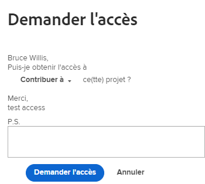
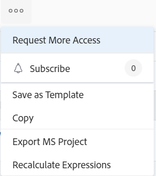

# Demande d’accès aux objets

La visibilité des objets dans Adobe Workfront dépend de l’accès à ce type d’objet et des autorisations accordées à celui-ci.

>[!NOTE]
>
>Cet article décrit comment vous pouvez demander des autorisations pour tous les objets, à l’exception des plans du planificateur de scénario Adobe Workfront. Pour plus d’informations sur la demande d’accès aux plans, voir [Demande d’accès à un plan dans le planificateur de scénarios](../../scenario-planner/request-access-to-plan.md). Cela nécessite une licence supplémentaire.

Votre administrateur Workfront configure votre accès à un type d’objet de votre niveau d’accès. Pour plus d’informations, voir [Fonctionnement des niveaux d’accès et des autorisations](../../administration-and-setup/add-users/access-levels-and-object-permissions/how-access-levels-permissions-work-together.md).

Si vous avez besoin d’autorisations pour des objets spécifiques dans Workfront, vous pouvez demander l’accès à ces objets. Plutôt que d’envoyer un courrier électronique à l’administrateur Workfront ou au propriétaire de l’objet pour expliquer vos besoins, vous pouvez demander un accès (ou des autorisations) supplémentaire dans Workfront.

Vous pouvez demander un accès initial aux objets si quelqu’un partage avec vous un lien vers l’objet ou vous pouvez demander un accès supplémentaire aux objets que vous affichez au moins.

Par exemple, vous disposez peut-être des autorisations Afficher pour un projet, mais vous devez ajouter des tâches à ce projet. Dans ce cas, vous pouvez demander des autorisations de contribution au projet.

## Exigences d’accès

<!--drafted for P&P:

<table style="table-layout:auto"> 
 <col> 
 <col> 
 <tbody> 
  <tr> 
   <td role="rowheader">Adobe Workfront plan*</td> 
   <td> 
Any 
 </td> 
  </tr> 
  <tr> 
   <td role="rowheader">Adobe Workfront license*</td> 
   <td> 
Current license: Standard
 
   Or
   
Legacy license: Work or higher
 
   </td> 
  </tr> 
  <tr> 
   <td role="rowheader">Access level configurations*</td> 
   <td> 
View access or higher to the objects you request permissions to
 
<b>NOTE</b> 
   
   If you still don't have access, ask your Workfront administrator if they set additional restrictions in your access level. For information on how a Workfront administrator can modify your access level, see <a href="../../administration-and-setup/add-users/configure-and-grant-access/create-modify-access-levels.md" class="MCXref xref">Create or modify custom access levels</a>.
 </td> 
  </tr> 
 </tbody> 
</table>

-->

Pour partager des objets, vous devez disposer des éléments suivants :

<table style="table-layout:auto"> 
 <col> 
 <col> 
 <tbody> 
  <tr> 
   <td role="rowheader">Formule Adobe Workfront*</td> 
   <td> 
Quelconque 
 </td> 
  </tr> 
  <tr> 
   <td role="rowheader">Licence Adobe Workfront*</td> 
   <td> 
Travail ou plus élevé
 </td> 
  </tr> 
  <tr> 
   <td role="rowheader">Paramétrages du niveau d'accès*</td> 
   <td> 
Afficher l’accès ou une version ultérieure aux objets pour lesquels vous demandez des autorisations
 
<b>NOTE</b>

Si vous n’avez toujours pas accès à , demandez à votre administrateur Workfront s’il définit des restrictions supplémentaires à votre niveau d’accès. Pour plus d’informations sur la façon dont un administrateur Workfront peut modifier votre niveau d’accès, voir <a href="../../administration-and-setup/add-users/configure-and-grant-access/create-modify-access-levels.md" class="MCXref xref">Création ou modification de niveaux d’accès personnalisés</a>.
 </td>
</tr> 
 </tbody> 
</table>

&#42;Pour connaître le plan, le type de licence ou l’accès dont vous disposez, contactez votre administrateur Workfront.

## Présentation des règles de partage standard

Les règles de partage standard suivantes prennent effet automatiquement, car elles sont configurées en tant qu’options par défaut dans votre système Workfront.

* Les utilisateurs affectés à une tâche ou à un problème disposent d’un accès Contribution .
* Les gestionnaires de projet, de Portfolio et de programme disposent de l’accès Gérer sur les objets qu’ils détiennent.
* Les utilisateurs inclus dans une conversation disposent d’un accès en vue sur l’objet sur lequel la conversation se produit.
* Les utilisateurs affectés en tant qu’approbateurs disposent d’un accès en mode sur l’objet en attente d’approbation.
* Lors du partage d’un tableau de bord, tous les rapports de ce dernier sont également partagés avec le même accès pour les mêmes utilisateurs.
* Les propriétaires d’objets ne peuvent pas étendre l’accès à un objet au-delà de leur accès à cet objet, comme défini par l’administrateur.

## Demander l&#39;accès

Vous pouvez demander un accès initial aux objets auxquels vous n’avez actuellement pas accès ou demander un accès supplémentaire aux objets auxquels vous n’avez qu’un accès limité.

* [Demande d’accès initial](#request-initial-access)
* [Demande d’accès supplémentaire](#request-additional-access)

### Demande d’accès initial  {#request-initial-access}

Si vous n’avez pas encore accès à un objet et que vous accédez à cet objet à partir d’un lien, un écran s’affiche pour vous informer que vous n’avez pas accès à l’affichage des informations.

Pour demander l’accès initial à un objet :

1. Cliquez sur **Demande d’accès**.\
   La variable **Demande d’accès** s’affiche.

1. (Conditionnel) Si plusieurs utilisateurs disposent de l’accès approprié pour vous accorder un accès supplémentaire, une flèche déroulante s’affiche en regard du nom de l’utilisateur.
1. Sélectionnez dans la liste déroulante l’utilisateur qui doit recevoir votre demande d’accès.\
   Seuls 10 utilisateurs sont affichés dans la liste déroulante. La liste est triée par ordre alphabétique.\
   Pour plus d’informations sur l’ordre des utilisateurs répertoriés dans ce menu déroulant, voir  [Hiérarchie des menus déroulants &quot;Demander l’accès&quot; et &quot;Demander plus d’accès&quot;](#hierarchy-of-the-request-access-and-request-more-access-drop-down-menus).

1. Dans la liste déroulante, sélectionnez le type d’accès que vous demandez.
1. (Facultatif) Dans la variable **P.S.** , indiquez une note à l’utilisateur concernant les raisons pour lesquelles vous avez besoin d’un accès supplémentaire.

   

Si vous ne disposez pas des droits de niveau d’accès à un objet et que vous tentez d’y accéder à partir d’un lien, un écran s’affiche pour vous informer de contacter l’administrateur Workfront.

Par exemple, si vous ne disposez pas d’un accès au portefeuille, mais que vous recevez un lien vers un portfolio, le message suivant s’affiche :\

### Demande d’accès supplémentaire {#request-additional-access}

Pour demander un accès supplémentaire à un objet auquel vous avez déjà un accès limité :

1. Accédez à l’objet pour lequel vous souhaitez demander un accès supplémentaire.

1. Cliquez sur le bouton **Plus** à droite du nom du projet, puis cliquez sur **Demander plus d’accès**.

   

1. (Conditionnel) Si plusieurs utilisateurs disposent de l’accès approprié pour vous accorder un accès supplémentaire, une flèche déroulante s’affiche en regard du nom de l’utilisateur.
1. Sélectionnez dans la liste déroulante l’utilisateur qui doit recevoir votre demande d’accès.\
   Seuls 10 utilisateurs sont affichés dans la liste déroulante. La liste est triée par ordre alphabétique.\
   Pour plus d’informations sur l’ordre des utilisateurs répertoriés dans ce menu déroulant, voir  [Hiérarchie des menus déroulants &quot;Demander l’accès&quot; et &quot;Demander plus d’accès&quot;](#hierarchy-of-the-request-access-and-request-more-access-drop-down-menus).

1. Dans la liste déroulante, sélectionnez le niveau d’accès que vous demandez.
1. (Facultatif) Dans la variable **P.S.** , indiquez une note expliquant pourquoi vous avez besoin d’un accès supplémentaire.
1. Cliquez sur **Demande d’accès**.\
   

## Hiérarchie des menus déroulants &quot;Demander l’accès&quot; et &quot;Demander plus d’accès&quot; {#hierarchy-of-the-request-access-and-request-more-access-drop-down-menus}

* [Présentation de la hiérarchie des utilisateurs répertoriés dans les menus déroulants Demander l’accès et Demander plus d’accès](#understand-the-hierarchy-of-users-listed-in-the-request-access-and-request-more-access-drop-down-menus)
* [Comprendre le propriétaire d’un objet](#understand-the-owner-of-an-object)

### Présentation de la hiérarchie des utilisateurs répertoriés dans les menus déroulants Demander l’accès et Demander plus d’accès {#understand-the-hierarchy-of-users-listed-in-the-request-access-and-request-more-access-drop-down-menus}

Lors de la remplissage des listes &quot;Demander l’accès&quot; ou &quot;Demander un accès plus important&quot; sur des objets, Workfront sélectionne une liste de dix utilisateurs au maximum qui remplissent différents rôles dans le partage de l’objet, comme décrit ci-dessous. Ces utilisateurs peuvent accorder l’accès à l’objet à l’utilisateur qui le demande.\
La liste qui en résulte est alors triée par nom dans l’ordre alphabétique croissant.\
Workfront affiche jusqu’à 10 utilisateurs dans les listes &quot;Demander l’accès&quot; et &quot;Demander plus d’accès&quot;.

L’ordre des utilisateurs dans les menus déroulants &quot;Demander l’accès&quot; ou &quot;Demander plus d’accès&quot; est dicté par les règles suivantes :

* Le premier utilisateur de la liste est l’objet &quot;propriétaire&quot;, comme décrit dans la section [Comprendre le propriétaire d’un objet](#understand-the-owner-of-an-object).
* Ensuite, la liste est remplie avec les utilisateurs avec lesquels l’objet est partagé individuellement. Ils sont répertoriés par ordre alphabétique.
* La liste est ensuite complétée par des utilisateurs qui obtiennent l’accès requis en partageant avec leurs équipes, groupes ou entreprises. Ils sont répertoriés par ordre alphabétique.
* Si la liste est vide, les administrateurs Workfront sont ajoutés afin qu’il y ait toujours quelqu’un à qui demander l’accès. Ils sont répertoriés par ordre alphabétique.
* Chacun des utilisateurs de la liste doit disposer de l’accès requis à l’objet et de l’accès requis pour partager l’objet.

### Comprendre le propriétaire d’un objet {#understand-the-owner-of-an-object}

Le propriétaire d’un objet est défini comme suit :

<table style="table-layout:auto"> 
 <col> 
 <col> 
 <thead> 
  <tr> 
   <th><strong>Objet</strong> </th> 
   <th><strong>Définition du propriétaire de l’objet</strong> </th> 
  </tr> 
 </thead> 
 <tbody> 
  <tr> 
   <td>Projets</td> 
   <td>Le propriétaire est le propriétaire du projet ou, s’il lui manque ou s’il ne dispose pas de l’accès nécessaire, le propriétaire du portefeuille parent. 
Il se peut qu’ils ne soient pas la même personne que le créateur du projet. 
</td> 
  </tr> 
  <tr> 
   <td>Tâches</td> 
   <td>Le propriétaire est le cessionnaire Principal ou, s’il manque ou s’il ne dispose pas de l’accès nécessaire, le propriétaire du projet sur lequel réside la tâche, comme défini ci-dessus. 
Il se peut qu’ils ne soient pas la même personne que le créateur de la tâche. 
</td> 
  </tr> 
  <tr> 
   <td>Problèmes</td> 
   <td> 
Le propriétaire est le contact Principal du problème ou, s’il manque ou s’il ne dispose pas d’un accès nécessaire, le propriétaire du projet sur lequel réside le problème, comme défini ci-dessus. 
 
Ils peuvent ne pas être la même personne que le créateur du problème. 
 </td> 
  </tr> 
  <tr> 
   <td>Portefeuilles</td> 
   <td>Le propriétaire est le propriétaire du Portfolio. 
Il se peut qu'ils ne soient pas la même personne que le créateur du portfolio. 
</td> 
  </tr> 
  <tr> 
   <td>Documents</td> 
   <td>Le propriétaire est le propriétaire du document (l’utilisateur qui a téléchargé le document) ou, s’il est absent ou s’il ne dispose pas d’un accès nécessaire, le propriétaire de l’objet sur lequel réside le document.</td> 
  </tr> 
  <tr> 
   <td>Rapports et tableaux de bord</td> 
   <td>Le propriétaire est le créateur ou le rapport ou le tableau de bord. </td> 
  </tr> 
  <tr> 
   <td>Calendriers</td> 
   <td>Le propriétaire est le créateur du calendrier. Par défaut, un calendrier est attribué à tous les utilisateurs. Ils sont considérés comme le propriétaire de ce calendrier. </td> 
  </tr> 
  <tr> 
   <td>Filtres, vues et regroupements</td> 
   <td>Le propriétaire d’un filtre, d’une vue ou d’un regroupement est le créateur. </td> 
  </tr> 
  <tr data-mc-conditions="QuicksilverOrClassic.Quicksilver"> 
   <td>Formules </td> 
   <td> 
Le propriétaire est le créateur du plan. 
 
Cela nécessite une licence supplémentaire. 
 
Pour plus d’informations sur le planificateur de scénario Workfront, voir <a href="../../scenario-planner/scenario-planner-overview.md" class="MCXref xref">Présentation du planificateur de scénarios</a>.
 </td> 
  </tr> 
  <tr data-mc-conditions="QuicksilverOrClassic.Quicksilver"> 
   <td>Objectifs</td> 
   <td> 
Le propriétaire est l’utilisateur désigné comme propriétaire. Il se peut qu'ils ne soient pas la même personne que le créateur du but. 
 
Cela nécessite une licence supplémentaire. 
 
Pour plus d’informations sur les objectifs de Workfront, voir <a href="../../workfront-goals/goal-management/wf-goals-overview.md" class="MCXref xref">Présentation des objectifs d’Adobe Workfront</a>. 
 </td> 
  </tr> 
 </tbody> 
</table>

