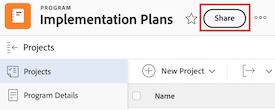

# Partager un programme

Votre équipe d’administration Adobe Workfront peut vous accorder l’accès à l’affichage ou à la modification des programmes lors de l’attribution de votre niveau d’accès. Vous devez disposer d’une licence de plan pour avoir accès à l’édition d’un programme. Pour plus d’informations, voir [Accorder l’accès aux programmes](../../administration-and-setup/add-users/configure-and-grant-access/grant-access-programs.md).

En plus du niveau d’accès qui vous est accordé, vous pouvez également recevoir des autorisations pour afficher ou gérer des programmes spécifiques de la part de personnes qui peuvent les partager avec vous. Pour plus d’informations sur les niveaux d’accès et les autorisations, voir [Comment les niveaux d’accès et les autorisations fonctionnent ensemble](../../administration-and-setup/add-users/access-levels-and-object-permissions/how-access-levels-permissions-work-together.md).

Les autorisations sont spécifiques à chaque élément de Workfront et définissent les actions que les personnes peuvent entreprendre sur cet élément.

## Conditions d’accès

+++ Développez pour afficher les exigences d’accès aux fonctionnalités de cet article. 

<table style="table-layout:auto"> 
 <col> 
 <col> 
 <tbody> 
  <tr> 
   <td role="rowheader">Package Adobe Workfront</td> 
   <td> 
Tous
 </td> 
  </tr> 
  <tr> 
   <td role="rowheader">Licence Adobe Workfront</td> 
   <td> 
Standard
 
   
Travail ou supérieur
 
   </td> 
  </tr> 
  <tr> 
   <td role="rowheader">Configurations des niveaux d’accès</td> 
   <td> 
Accès Affichage ou supérieur aux objets que vous souhaitez partager.
 </td> 
  </tr> 
  <tr> 
   <td role="rowheader">Autorisations d’objet</td> 
   <td> 
Autorisations d’affichage ou supérieures pour les objets que vous souhaitez partager.
</td> 
  </tr> 
 </tbody> 
</table>

Pour plus de détails sur les informations contenues dans ce tableau, consultez [Conditions d’accès préalables dans la documentation Workfront](/help/quicksilver/administration-and-setup/add-users/access-levels-and-object-permissions/access-level-requirements-in-documentation.md).

+++

## Considérations sur le partage d’un programme

Outre les considérations ci-dessous, voir également [Vue d’ensemble des autorisations de partage sur les objets](../../workfront-basics/grant-and-request-access-to-objects/sharing-permissions-on-objects-overview.md).

>[!NOTE]
>
>Une équipe d’administration Workfront peut ajouter ou supprimer des autorisations à tous les éléments du système, pour toutes les personnes, sans être la personne propriétaire de ces éléments.

* La personne créatrice d’un programme dispose par défaut des autorisations « Gérer ».

* Vous pouvez partager des programmes individuellement ou plusieurs d’entre eux à la fois.

  Pour plus d’informations sur le partage d’éléments dans Workfront, voir [Partager un objet](../../workfront-basics/grant-and-request-access-to-objects/share-an-object.md).

* Vous pouvez uniquement accorder des autorisations Afficher ou Gérer sur les programmes :

* Lorsque vous partagez un programme, les personnes héritent par défaut des mêmes autorisations pour tous les objets enfant associés au programme.

  Pour plus d’informations sur la hiérarchie des objets dans Workfront, voir [Comprendre les objets dans Adobe Workfront](../../workfront-basics/navigate-workfront/workfront-navigation/understand-objects.md).

* Vous pouvez supprimer les autorisations héritées du programme. Pour plus d’informations sur la suppression des autorisations des objets , voir   [Supprimer des autorisations des objets](../../workfront-basics/grant-and-request-access-to-objects/remove-permissions-from-objects.md).

## Partager un programme

{{step1-to-programs}}

1. Sur la page **Programmes**, sélectionnez le programme que vous souhaitez partager. La page du programme s’ouvre.

1. À droite du nom du programme, cliquez sur **Partager**. La boîte de dialogue **Partager [Nom du programme]** s’ouvre.

   

1. Dans le champ **Accorder l’accès au programme à**, commencez à saisir le nom de l’utilisateur, de l’équipe, du rôle, du groupe ou de la société avec lequel vous souhaitez partager le programme, puis cliquez sur le nom lorsqu’il apparaît dans la liste déroulante.

   >[!TIP]
   >
   >Vous pouvez uniquement partager un programme avec des utilisateurs actifs, des équipes, des rôles ou des entreprises.

1. (Facultatif) Sélectionnez le menu déroulant **Qui a accès** et sélectionnez le niveau d’accès du programme :

   * **Seuls les utilisateurs invités peuvent y accéder :** seuls les utilisateurs invités au programme peuvent y accéder (par défaut).
   * **Tout le monde peut voir le programme** : tous les utilisateurs du système peuvent voir le programme sans invitation.

1. Cliquez sur la liste déroulante située à droite du nom de l’utilisateur et sélectionnez son niveau d’autorisation pour ce programme :

   * **Afficher** : l’utilisateur peut consulter et partager le programme.
   * **Gérer** : l’utilisateur dispose d’un accès complet au programme sans droits d’administration, qui sont accordés au niveau d’accès (inclut également toutes les autorisations d’affichage).

1. (Facultatif) Cliquez sur l’icône des options avancées en regard du niveau d’autorisation que vous avez accordé pour configurer des autorisations spécifiques sur le programme.

   

1. (Facultatif) Pour désactiver les autorisations héritées pour les objets enfants du programme, cliquez sur **Désactiver** en ligne avec **Autorisations héritées**.

1. (Facultatif) Pour partager rapidement le programme à l’aide d’un lien, cliquez sur **Copier le lien** puis transférez-le au destinataire.

1. Cliquer sur **Enregistrer**.

## Partage de programmes en bloc

{{step1-to-programs}}

1. Sur la page **Programmes**, cochez la case à gauche de chaque programme à partager, puis cliquez sur l’icône **Partager**  en haut de la page. La boîte de dialogue modale de partage s’ouvre.

   

1. Dans le champ **Accorder l’accès au programme à**, commencez à saisir le nom de l’utilisateur, de l’équipe, du rôle, du groupe ou de la société avec lequel vous souhaitez partager les programmes, puis cliquez sur le nom lorsqu’il apparaît dans la liste déroulante.

   >[!TIP]
   >
   >Vous pouvez uniquement partager des programmes avec des utilisateurs actifs, des équipes, des rôles ou des entreprises.

1. (Facultatif) Sélectionnez le menu déroulant **Qui a accès** et sélectionnez le niveau d’accès du programme :

   * **Seules les personnes invitées peuvent y accéder :** seuls les utilisateurs invités aux programmes peuvent y accéder (par défaut).
   * **Tout le monde peut afficher dans le système** : tous les utilisateurs du système peuvent afficher les programmes sans invitation.

1. Cliquez sur la liste déroulante située à droite du nom de l’utilisateur et sélectionnez son niveau d’autorisation pour les programmes :

   * **Afficher** : l’utilisateur peut consulter et partager les programmes.
   * **Gérer** : l’utilisateur dispose d’un accès complet aux programmes sans droits d’administration, qui sont accordés au niveau d’accès (inclut également toutes les autorisations d’affichage).

1. (Facultatif) Cliquez sur l’icône des options avancées en regard du niveau d’autorisation que vous avez accordé pour configurer des autorisations spécifiques sur les programmes.

   

1. Cliquer sur **Enregistrer**.

## Autorisations du programme

Le tableau suivant indique les autorisations que vous pouvez accorder aux personnes lorsqu’elles sont autorisées à afficher ou à gérer un programme :

| **Actions** | **Gérer** | **Afficher** |
|---|---|---|
| Modifier les détails du programme | ✓ |   |
| Afficher un programme | ✓ | ✓ |
| Supprimer un programme | ✓ |   |
| Joindre un formulaire personnalisé | ✓ |   |
| Modifier un champ personnalisé | ✓ |   |
| Ajouter ou supprimer un projet&#42; | ✓ |   |
| Approuver un projet | ✓ |   |
| Ajouter un dossier de documents&#42; | ✓ | ✓ |
| Ajouter un document | ✓ | ✓ |
| Ajouter des mises à jour/commentaires | ✓ | ✓ |
| Partager | ✓ | ✓ |
| Partager sur le système |   | ✓ |

* Ces autorisations sont contrôlées par le niveau d’accès et les autorisations sur d’autres objets, comme les projets.

