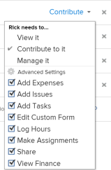

# Partager un projet dans Adobe Workfront

<!-- Audited: 1/2024 -->

Votre administrateur ou administratrice Adobe Workfront peut vous accorder l’accès à l’affichage ou à la modification de projets lors de l’affectation de votre niveau d’accès. Pour plus d’informations, voir [Accorder l’accès aux projets](../../administration-and-setup/add-users/configure-and-grant-access/grant-access-projects.md).

Outre le niveau d’accès qui est accordé aux personnes, vous pouvez leur accorder des autorisations d’affichage, de contribution ou de gestion de projets spécifiques pour lesquels vous avez accès au partage.

Les autorisations sont spécifiques à un élément dans Workfront et définissent les actions que vous pouvez effectuer sur cet élément.

## Observations relatives au partage de projets

Outre les considérations ci-dessous, voir [Vue d’ensemble des autorisations de partage sur les objets](../../workfront-basics/grant-and-request-access-to-objects/sharing-permissions-on-objects-overview.md).

* Par défaut, le créateur ou la créatrice d’un projet dispose des autorisations nécessaires pour gérer le projet et est également propriétaire du projet. Si le projet est attribué à une autre personne propriétaire, cette personne dispose également des autorisations nécessaires pour gérer le projet. Lorsque le créateur ou créatrice (ou propriétaire) du projet partage le projet avec d’autres personnes, certaines autorisations leur sont accordées pour contrôler ce que ces personnes peuvent faire lorsqu’elles travaillent sur le projet.

  Cependant, si la personne propriétaire d’un projet ne dispose pas d’une licence Planificateur, elle n’a pas un accès complet à la gestion du projet. Seule une personne disposant d’une licence Plan peut disposer des autorisations nécessaires pour gérer un projet. Pour plus d’informations, voir [Fonctionnement des niveaux d’accès et des autorisations](../../administration-and-setup/add-users/access-levels-and-object-permissions/how-access-levels-permissions-work-together.md).

* Vous pouvez partager des projets individuellement ou partager plusieurs d’entre eux à la fois. Le partage de projets est identique au partage d’autres objets. Pour plus d’informations sur le partage d’éléments dans Workfront, voir [Partager un objet](../../workfront-basics/grant-and-request-access-to-objects/share-an-object.md).
* Vous pouvez accorder les autorisations suivantes à un projet :

   * Afficher
   * Gérer
   * Contribuer

       

* Lorsque vous partagez un projet, toutes les tâches, tous les problèmes et tous les documents héritent des mêmes autorisations, sauf indication contraire.

  Pour plus d’informations sur la gestion de l’accès aux tâches et aux problèmes du projet en fonction des autorisations d’une personne sur le projet, voir la section  dans l’article [Modifier des projets](../../manage-work/projects/manage-projects/edit-projects.md).

  L’administrateur ou l’administratrice Workfront peut indiquer si les documents doivent hériter des autorisations des objets supérieurs dans le niveau d’accès de l’utilisateur ou de l’utilisatrice. Pour plus d’informations sur la restriction des autorisations héritées sur les documents, voir [Créer ou modifier des niveaux d’accès personnalisés](../../administration-and-setup/add-users/configure-and-grant-access/create-modify-access-levels.md).

* Vous pouvez supprimer les autorisations héritées d’un projet afin que les objets enfants ne les héritent pas. Pour plus d’informations sur la suppression des autorisations héritées des objets, voir [Supprimer des autorisations des objets](../../workfront-basics/grant-and-request-access-to-objects/remove-permissions-from-objects.md).

## Méthodes pour partager un projet {#ways-to-share-a-project}

Vous pouvez partager un projet de l’une des façons suivantes :

* Manuellement, effectuez l’une des opérations suivantes :

   * Ajouter des personnes à l’équipe du projet. Lorsque vous ajoutez des personnes à l’équipe du projet, elles obtiennent automatiquement les autorisations d’affichage du projet.\
     Pour plus d’informations sur l’ajout de personnes à une équipe de projet, voir la section « Ajouter des personnes à une équipe de projet » dans [Vue d’ensemble de l’équipe du projet](../../manage-work/projects/planning-a-project/project-team-overview.md).
   * Partage individuel ou en passe des projets lors de l’utilisation de l’option **Partage**.

     Le partage d’un projet est similaire au partage de tous les autres objets dans Adobe Workfront.

     Pour plus d’informations sur le partage d’objets dans Workfront, voir [Partager un objet](../../workfront-basics/grant-and-request-access-to-objects/share-an-object.md).

* Automatiquement, en effectuant l’une des opérations suivantes :

   * Placer un projet dans un **Portfolio** ou **Programme** qui est déjà partagé avec d’autres. Les personnes disposent des mêmes autorisations pour le projet que pour le portfolio ou le programme.\
     Pour plus d’informations sur l’ajout d’un projet à un **Portfolio**, voir [Ajouter des projets à un portfolio](../../manage-work/portfolios/create-and-manage-portfolios/add-projects-to-portfolios.md).\
     Pour plus d’informations sur l’ajout d’un projet à un **Programme**, voir [Ajouter un projet à un programme](../../manage-work/portfolios/create-and-manage-programs/add-project-to-program.md).

     Pour plus d’informations sur l’affichage des autorisations héritées sur un objet, voir [Afficher les autorisations héritées sur les objets](../../workfront-basics/grant-and-request-access-to-objects/view-inherited-permissions-on-objects.md).

   * Ajouter des entités au partage de projet sur un modèle utilisé pour créer le projet. Pour plus d’informations sur le partage de projets à partir de modèles, voir [Partager un modèle](../../workfront-basics/grant-and-request-access-to-objects/share-a-template.md).
   * Définir le modèle d’accès à un projet.

     Pour définir le modèle d’accès à un projet, voir [Partager un objet](../../workfront-basics/grant-and-request-access-to-objects/share-an-object.md).

     >[!TIP]
     >
     >Lors de l’ajout ou de l’enregistrement d’un modèle, vous pouvez effacer les règles de partage de modéle de projet.

   * Modifiez un projet et définissez le paramètre **Lorsqu’une personne a accès à ce projet**.Pour plus d’informations, voir [Modifier des projets](../../manage-work/projects/manage-projects/edit-projects.md).

<!--

(NOTE: drafted because I created new article and linked it above) 

To view what users have inherited the access on the project from a portfolio or a program, do the following:

<ol style="list-style-type: lower-alpha;">
<li value="1">Go to a project whose sharing permissions you want to view. </li>
<li value="2"> Click the <strong>More</strong> menu , then click <strong>Sharing</strong>. </li>
<li value="3"> 
Expand the <strong>Inherited Permissions</strong> list. 
 
This list displays the names of users that have access to either the portfolio or the program that the project belongs to and also have permissions to the project. 
  </li>
</ol>

-->

<!--
<ol data-mc-conditions="QuicksilverOrClassic.Draft mode">
<li value="1">Go to a project whose sharing permissions you want for all projects you create from scratch. (NOTE: drafted because linked above)&nbsp;</li>
<li value="2"> Click the More menu, then click <strong>Sharing</strong>. </li>
<li value="3"> 
In the Project Access box that displays, near the upper-right corner, click the gear icon , then click <strong>Set as my project access template</strong>.
 
The entities that are granted permissions on the selected project have the same permissions for all the projects you create from scratch in the future.
 
 The project access template overrides the sharing defaults granted to you by the Workfront administrator in your Access Level. For more information about specifying sharing defaults for projects in the Access Level, see <a href="../../administration-and-setup/add-users/configure-and-grant-access/grant-access-projects.md" class="MCXref xref">Grant access to projects</a>.
 </li>
<li value="4">Click <strong>Save</strong>.</li>
</ol>
-->

## Restrictions relatives aux différents types de licence

* Les utilisateurs et les utilisatrices disposant d’une licence Travail ne disposent pas des autorisations nécessaires pour gérer des projets. Pour les personnes chargées du travail, l’autorisation de partage la plus élevée est Contribuer.
* Les utilisateurs et les utilisatrices disposant d’une licence Demande peuvent afficher les informations d’un projet, mais leur accès au projet est limité.
* Une exception concernant la modification du statut d’un projet se produit lorsqu’une personne disposant des autorisations Afficher ou Contribuer est également incluse dans un processus d’approbation. Celle-ci peut approuver le projet, ce qui modifie le statut du projet, mais le statut est le statut prédéfini d’approbation ou de rejet.
* Pour pouvoir copier un projet, un utilisateur ou une utilisatrice doit également disposer de l’accès à la création de projets dans son niveau d’accès.

<!--

<h2>Configure default permissions for a project</h2>

(NOTE: drafted because I added one more way to automatically share the project above in the bullet list and linked it to Edit Projects) 

As a project owner, you can configure the default permissions for View, Manage, and Contribute access that are used when sharing&nbsp;the project with others. When users share a project, the default permissions are used. Users can then adjust the default permissions when sharing the project, as described in <a title="Project Permissions" href="#ways-to-share-a-project" class="MCXref xref">Ways to share a project</a>. 

To configure the default permissions that are included with each access level:

<ol>
<li value="1">Go to the project where you want to set the default permissions.</li>
<li value="2"> 
Click the More menu , then click <strong>Edit</strong>. 
 
 
 </li>
<li value="3">Click <strong>Access</strong> in the list on the left.</li>
<li value="4"> 
In the <strong>When someone is given access to this PROJECT</strong> section, select permissions that you want to be available when users are given access to the project via sharing.
 
Ensure that any permissions that you want to include in the selected access level are selected and deselect any permissions that you do not want to include in the selected permissions level.
 
To view which permissions are available for each level, see&nbsp;<a title="Project Permissions" href="#Understanding_Project_Permissions" class="MCXref xref">Share a project in Adobe Workfront</a>.
 <note type="note">
The
<strong>Delete</strong> access in the
<strong>Manage</strong> permission level determines whether users can&nbsp;delete the project itself. Users with
<strong>Manage</strong> access to the project can delete tasks and issues within the project regardless of whether this option is selected, if they have
<strong>Manage</strong> permissions to the tasks and issues.&nbsp;
</note> </li>
<li value="5">Click <strong>Save Changes</strong>.</li>
</ol>

-->

## Options d’autorisation pour un projet

Le tableau suivant répertorie les autorisations que les utilisateurs et les utilisatrices peuvent accorder lors du partage d’un projet. Pour plus d’informations sur l’accès dont disposent les utilisateurs et les utilisatrices en fonction de leur licence, voir [Accorder l’accès aux projets](../../administration-and-setup/add-users/configure-and-grant-access/grant-access-projects.md).

<table border="1" cellspacing="15" cellpadding="1"> 
 <col> 
 <col> 
 <col> 
 <col> 
 <thead> 
  <tr> 
   <th> 
<strong>Actions</strong> 
 </th> 
   <th> 
<strong>Gérer</strong> 
 </th> 
   <th> 
<strong>Contribuer</strong> 
 </th> 
   <th> 
<strong>Afficher</strong> 
 </th> 
  </tr> 
 </thead> 
 <tbody> 
  <tr> 
   <td> 
Ajouter un formulaire personnalisé
 </td> 
   <td> 
✓
 </td> 
   <td> 
 
 </td> 
   <td> 
 
 </td> 
  </tr> 
  <tr> 
   <td> 
Mettre à jour les champs personnalisés
 </td> 
   <td> 
✓
 </td> 
   <td> 
✓
 </td> 
   <td> 
 
 </td> 
  </tr> 
  <tr> 
   <td> 
Ajouter un processus d’approbation
 </td> 
   <td> 
✓
 </td> 
   <td> 
 
 </td> 
   <td> 
 
 </td> 
  </tr> 
  <tr> 
   <td> 
Approuver un projet
 </td> 
   <td> 
✓
 </td> 
   <td> 
✓
 </td> 
   <td> 
✓
 </td> 
  </tr> 
  <tr> 
   <td> 
Approuver les heures
 </td> 
   <td> 
✓
 </td> 
   <td> 
✓
 </td> 
   <td> 
 
 </td> 
  </tr> 
  <tr> 
   <td> 
Créer un projet
 </td> 
   <td> 
✓
 </td> 
   <td> 
 
 </td> 
   <td> 
 
 </td> 
  </tr> 
  <tr> 
   <td> 
Ajouter un ou plusieurs documents
 </td> 
   <td> 
✓
 </td> 
   <td> 
✓
 </td> 
   <td> 
✓
 </td> 
  </tr> 
  <tr> 
   <td> 
Ajouter un ou plusieurs problèmes
 </td> 
   <td> 
✓
 </td> 
   <td> 
✓
 </td> 
   <td> 
✓
 </td> 
  </tr> 
  <tr> 
   <td> 
Ajouter une ou plusieurs tâches
 </td> 
   <td> 
✓
 </td> 
   <td> 
✓
 </td> 
   <td> 
 
 </td> 
  </tr> 
  <tr> 
   <td> 
Copier le projet
 </td> 
   <td> 
 
 </td> 
   <td> 
✓
 </td> 
   <td> 
 
 </td> 
  </tr> 
  <tr> 
   <td> 
Supprimer projet
 </td> 
   <td> 
✓
 </td> 
   <td> 
 
 </td> 
   <td> 
 
 </td> 
  </tr> 
  <tr> 
   <td> 
Modifier les dates prévues
 </td> 
   <td> 
✓
 </td> 
   <td> 
 
 </td> 
   <td> 
 
 </td> 
  </tr> 
  <tr> 
   <td> 
Partager le projet
 </td> 
   <td> 
✓
 </td> 
   <td> 
✓
 </td> 
   <td> 
✓
 </td> 
  </tr> 
  <tr> 
   <td> 
Partager sur le système
 </td> 
   <td> 
 
 </td> 
   <td> 
 
 </td> 
   <td> 
✓
 </td> 
  </tr> 
  <tr> 
   <td> 
Afficher projet
 </td> 
   <td> 
✓
 </td> 
   <td> 
✓
 </td> 
   <td> 
✓
 </td> 
  </tr> 
  <tr> 
   <td> 
Mises à jour / commentaires
 </td> 
   <td> 
✓
 </td> 
   <td> 
✓
 </td> 
   <td> 
✓
 </td> 
  </tr> 
  <tr> 
   <td> 
Modifier le statut
 </td> 
   <td> 
✓
 </td> 
   <td> 
 
 </td> 
   <td> 
 
 </td> 
  </tr> 
  <tr> 
   <td> 
Consigner les heures
 </td> 
   <td> 
✓
 </td> 
   <td> 
✓
 </td> 
   <td> 
 
 </td> 
  </tr> 
  <tr> 
   <td> 
Modifier les affectations
 </td> 
   <td> 
✓
 </td> 
   <td> 
✓
 </td> 
   <td> 
 
 </td> 
  </tr> 
  <tr> 
   <td> 
Gérer la ligne de base
 </td> 
   <td> 
✓
 </td> 
   <td> 
 
 </td> 
   <td> 
 
 </td> 
  </tr> 
  <tr> 
   <td> 
Gérer les risques*
 </td> 
   <td> 
✓
 </td> 
   <td> 
 
 </td> 
   <td> 
 
 </td> 
  </tr> 
  <tr> 
   <td> 
Gérer les finances*
 </td> 
   <td> 
✓
 </td> 
   <td> 
 
 </td> 
   <td> 
 
 </td> 
  </tr> 
  <tr> 
   <td> 
Ajouter/modifier les dépenses*
 </td> 
   <td> 
✓
 </td> 
   <td> 
✓
 </td> 
   <td> 
 
 </td> 
  </tr> 
  <tr> 
   <td> 
Afficher les finances*
 </td> 
   <td> 
✓
 </td> 
   <td> 
✓
 </td> 
   <td> 
✓
 </td> 
  </tr> 
  <tr> 
   <td> 
Joindre modèle
 </td> 
   <td> 
✓
 </td> 
   <td> 
 
 </td> 
   <td> 
 
 </td> 
  </tr> 
  <tr> 
   <td> 
Enregistrer en tant que modèle
 </td> 
   <td> 
✓
 </td> 
   <td> 
✓
 </td> 
   <td> 
✓
 </td> 
  </tr> 
  <tr> 
   <td> 
Ajouter/modifier un business case
 </td> 
   <td> 
✓
 </td> 
   <td> 
 
 </td> 
   <td> 
 
 </td> 
  </tr> 
  <tr> 
   <td> 
Modifier les détails du projet
 </td> 
   <td> 
✓
 </td> 
   <td> 
 
 </td> 
   <td> 
 
 </td> 
  </tr> 
  <tr> 
   <td> 
Modifier le personnel
 </td> 
   <td> 
✓
 </td> 
   <td> 
 
 </td> 
   <td> 
 
 </td> 
  </tr> 
  <tr> 
   <td> 
Exporter vers MS Project
 </td> 
   <td> 
✓
 </td> 
   <td> 
✓
 </td> 
   <td> 
✓
 </td> 
  </tr> 
  <tr> 
   <td> 
Recalculer les finances / la chronologie*
 </td> 
   <td> 
✓
 </td> 
   <td> 
 
 </td> 
   <td> 
 
 </td> 
  </tr> 
  <tr> 
   <td> 
Définir les propriétés de file d’attente
 </td> 
   <td> 
✓
 </td> 
   <td> 
 
 </td> 
   <td> 
 
 </td> 
  </tr> 
  <tr> 
   <td> 
Modifier le projet en masse dans une liste
 </td> 
   <td> 
✓
 </td> 
   <td> </td> 
   <td> </td> 
  </tr> 
 </tbody> 
</table>

&#42;Les personnes n’ayant pas accès aux données financières ne peuvent pas gérer les risques et les finances des projets, même si elles disposent de l’accès Éditer pour les projets. Pour plus d’informations sur l’accès aux données financières, voir [Accorder l’accès aux données financières](../../administration-and-setup/add-users/configure-and-grant-access/grant-access-financial.md).
