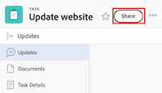

# Partager une tâche

La personne chargée de votre administration Adobe Workfront peut vous accorder l’accès en affichage ou en modification aux tâche lorsqu’elle attribue des niveaux d’accès. Pour plus d’informations sur l’octroi de l’accès aux tâches, voir [Accorder un accès aux tâches](../../administration-and-setup/add-users/configure-and-grant-access/grant-access-tasks.md).

En plus du niveau d’accès qui est accordé aux personnes, vous pouvez leur accorder des autorisations d’affichage, de contribution ou de gestion de tâches spécifiques que vous pouvez partager.

Les autorisations sont spécifiques à un élément dans Workfront et définissent les actions que vous pouvez effectuer sur cet élément.

## Conditions d’accès

+++ Développez pour afficher les exigences d’accès aux fonctionnalités de cet article. 

<table style="table-layout:auto"> 
 <col> 
 <col> 
 <tbody> 
  <tr> 
   <td role="rowheader">Package Adobe Workfront</td> 
   <td> 
Tous
 </td> 
  </tr> 
  <tr> 
   <td role="rowheader">Licence Adobe Workfront</td> 
   <td> 
Standard
 
   
Travail ou supérieur
 
   </td> 
  </tr> 
  <tr> 
   <td role="rowheader">Configurations des niveaux d’accès</td> 
   <td> 
Accès Affichage ou supérieur aux objets que vous souhaitez partager.
 </td> 
  </tr> 
  <tr> 
   <td role="rowheader">Autorisations d’objet</td> 
   <td> 
Autorisations d’affichage ou supérieures pour les objets que vous souhaitez partager.
</td> 
  </tr> 
 </tbody> 
</table>

Pour plus de détails sur les informations contenues dans ce tableau, consultez [Conditions d’accès préalables dans la documentation Workfront](/help/quicksilver/administration-and-setup/add-users/access-levels-and-object-permissions/access-level-requirements-in-documentation.md).

+++

## Remarques concernant le partage d’une tâche

Outre les considérations ci-dessous, voir [Vue d’ensemble des autorisations de partage sur les objets](../../workfront-basics/grant-and-request-access-to-objects/sharing-permissions-on-objects-overview.md).

* Le créateur d’une tâche dispose par défaut des autorisations de niveau Gérer pour celle-ci.
* Vous pouvez partager des tâches individuellement ou partager plusieurs tâches à la fois, en masse.\
  Le partage de tâches est identique au partage d’autres objets. Pour plus d’informations sur le partage d’éléments dans Workfront, voir [Partager un objet](../../workfront-basics/grant-and-request-access-to-objects/share-an-object.md).

* Vous pouvez accorder les autorisations suivantes à une tâche :

   * Afficher
   * Gérer
   * Contribuer
* Lorsque vous partagez une tâche, les utilisateurs héritent par défaut des mêmes autorisations sur tous les objets enfants associés à la tâche. Par exemple, elles héritent des mêmes autorisations sur les tâches, problèmes et documents enfant associés à la tâche.\
  Pour plus d’informations sur la hiérarchie des objets dans Workfront, voir   [Comprendre les objets dans Adobe Workfront](../../workfront-basics/navigate-workfront/workfront-navigation/understand-objects.md).

  L’administrateur ou l’administratrice Workfront peut indiquer si les documents doivent hériter des autorisations des objets supérieurs dans le niveau d’accès de l’utilisateur ou de l’utilisatrice. Pour plus d’informations sur la restriction des autorisations héritées sur les documents, voir [Créer ou modifier des niveaux d’accès personnalisés](../../administration-and-setup/add-users/configure-and-grant-access/create-modify-access-levels.md).

* Vous pouvez supprimer les autorisations héritées d’une tâche.\
  Pour plus d’informations sur la suppression des autorisations héritées des objets , voir   [Supprimer des autorisations des objets](../../workfront-basics/grant-and-request-access-to-objects/remove-permissions-from-objects.md).

## Méthodes de partage d’une tâche

Vous pouvez partager une tâche de l’une des manières suivantes :

* Manuellement, individuellement ou en bloc.

* Automatiquement, en procédant comme suit :

   * Spécifiez les autorisations sur l’un des objets parent de la tâche : projet, programme ou portfolio. Les tâches héritent des autorisations de leurs objets parent. Pour plus d’informations sur l’affichage des autorisations héritées sur les objets, voir [Afficher les autorisations héritées sur les objets](../../workfront-basics/grant-and-request-access-to-objects/view-inherited-permissions-on-objects.md).
   * Ajoutez des entités au partage de projet sur un modèle utilisé pour créer le projet sur lequel la tâche est effectuée. Pour plus d’informations sur le partage de projets à partir de modèles, voir [Partager un modèle](../../workfront-basics/grant-and-request-access-to-objects/share-a-template.md).

   * Spécifiez les autorisations sur toutes les tâches d’un projet lorsque vous modifiez le projet.  Pour plus d’informations sur la gestion de l’accès aux tâches du projet en fonction des autorisations d’un utilisateur pour le projet, consultez la section [&#128279;](../../manage-work/projects/manage-projects/edit-projects.md#access) de l’article [Modifier des projets](../../manage-work/projects/manage-projects/edit-projects.md).

  >[!TIP]
  >
  >Si vous ne spécifiez pas les autorisations de tâche que vous souhaitez accorder aux utilisateurs lorsqu&#39;ils sont affectés aux tâches du projet, ils reçoivent par défaut les mêmes autorisations que celles dont ils disposent sur le projet.

## Partager une tâche

1. Accédez à la tâche que vous souhaitez partager.

1. À droite du nom de la tâche, cliquez sur **Partager**. La boîte de dialogue **Partager [Nom de la tâche]** s’ouvre.

   

1. Dans le champ **Accorder l’accès à la tâche à**, commencez à saisir le nom de l’utilisateur, de l’équipe, du rôle, du groupe ou de la société avec lequel vous souhaitez partager la tâche, puis cliquez sur le nom lorsqu’il apparaît dans la liste déroulante.

   >[!TIP]
   >
   >Vous pouvez uniquement partager une tâche avec des utilisateurs actifs, des équipes, des rôles ou des entreprises.

1. (Facultatif) Sélectionnez le menu déroulant **Qui a accès** et sélectionnez le niveau d’accès de la tâche :

   * **Seules les personnes invitées peuvent y accéder :** seuls les utilisateurs invités à la tâche peuvent y accéder (par défaut).
   * **Tout le monde peut afficher dans le système** : tous les utilisateurs du système peuvent afficher la tâche sans invitation.

1. Cliquez sur la liste déroulante située à droite du nom de l’utilisateur et sélectionnez son niveau d’autorisation pour cette tâche :

   * **Affichage** : l’utilisateur peut réviser et partager la tâche.
   * **Contribuer** : l’utilisateur peut effectuer des mises à jour, consigner des informations, apporter des modifications mineures et partager la tâche (inclut également toutes les autorisations d’affichage).
   * **Gérer** : l’utilisateur dispose d’un accès complet à la tâche sans droits d’administration, qui sont accordés au niveau d’accès (inclut également toutes les autorisations Afficher et Contribuer).

1. (Facultatif) Cliquez sur l’icône d’options avancées en regard du niveau d’autorisation que vous avez accordé pour configurer des autorisations spécifiques sur la tâche.

   

1. (Facultatif) Pour désactiver les autorisations héritées pour les objets enfants de la tâche, cliquez sur **Désactiver** en ligne avec **Autorisations héritées**.

1. (Facultatif) Pour partager rapidement la tâche à l’aide d’un lien, cliquez sur **Copier le lien** puis transférez-la au destinataire.

1. Cliquer sur **Enregistrer**.

## Partage de tâches en bloc

1. Accédez au projet contenant les tâches que vous souhaitez partager.

1. Dans l’onglet **Tâches** de la page du projet, sélectionnez la case à gauche de chaque tâche à partager, puis cliquez sur l’icône **Partager**  en haut de la page. La boîte de dialogue modale de partage s’ouvre.

   

1. Dans le champ **Accorder l’accès à la tâche à**, commencez à saisir le nom de l’utilisateur, de l’équipe, du rôle, du groupe ou de la société avec lequel vous souhaitez partager les tâches, puis cliquez sur le nom lorsqu’il apparaît dans la liste déroulante.

   >[!TIP]
   >
   >Vous pouvez uniquement partager des tâches avec des utilisateurs actifs, des équipes, des rôles ou des entreprises.

1. (Facultatif) Sélectionnez le menu déroulant **Qui a accès** et sélectionnez le niveau d’accès des tâches :

   * **Seules les personnes invitées peuvent y accéder :** seuls les utilisateurs invités aux tâches peuvent y accéder (par défaut).
   * **Tout le monde peut afficher dans le système** : tous les utilisateurs du système peuvent afficher les tâches sans invitation.

1. Cliquez sur la liste déroulante située à droite du nom de l’utilisateur et sélectionnez son niveau d’autorisation pour les tâches :

   * **Affichage** : l’utilisateur peut réviser et partager les tâches.
   * **Contribuer** : l’utilisateur peut effectuer des mises à jour, consigner des informations, apporter des modifications mineures et partager les tâches (inclut également toutes les autorisations d’affichage).
   * **Gérer** : l’utilisateur dispose d’un accès complet aux tâches sans droits d’administration, qui sont accordés au niveau d’accès (inclut également toutes les autorisations Afficher et Contribuer).

1. (Facultatif) Cliquez sur l’icône des options avancées en regard du niveau d’autorisation que vous avez accordé pour configurer des autorisations spécifiques sur les tâches.

   

1. Cliquer sur **Enregistrer**.

## Autorisations sur la tâche

Le tableau suivant affiche les autorisations que vous pouvez accorder aux personnes lorsque vous leur permettez d’afficher, de contribuer ou de gérer une tâche :

<table border="2" cellspacing="15" cellpadding="1"> 
 <col> 
 <col> 
 <col> 
 <col> 
 <thead> 
  <tr> 
   <th><strong>Action</strong> </th> 
   <th><strong>Gérer</strong> </th> 
   <th><strong>Contribuer</strong> </th> 
   <th><strong>Afficher</strong> </th> 
  </tr> 
 </thead> 
 <tbody> 
  <tr> 
   <td scope="row">Ajouter une ou plusieurs tâches</td> 
   <td>✓</td> 
   <td>✓</td> 
   <td>  </td> 
  </tr> 
  <tr> 
   <td scope="row">Ajouter des tâches antérieures</td> 
   <td>✓</td> 
   <td>  </td> 
   <td>  </td> 
  </tr> 
  <tr> 
   <td scope="row">Ajouter un ou plusieurs problèmes</td> 
   <td>✓</td> 
   <td>✓</td> 
   <td>✓</td> 
  </tr> 
  <tr> 
   <td scope="row">Supprimer tâche</td> 
   <td>✓</td> 
   <td>  </td> 
   <td>  </td> 
  </tr> 
  <tr> 
   <td scope="row"> 
Modifier la tâche générale 
 </td> 
   <td>✓</td> 
   <td>✓</td> 
   <td>  </td> 
  </tr> 
  <tr> 
   <td scope="row">Modifier le statut de la tâche</td> 
   <td>✓</td> 
   <td>✓</td> 
   <td>  </td> 
  </tr> 
  <tr> 
   <td scope="row">Modifier la contrainte de tâche</td> 
   <td>✓</td> 
   <td>  </td> 
   <td>  </td> 
  </tr> 
  <tr> 
   <td scope="row">Afficher tâche</td> 
   <td>✓</td> 
   <td>✓</td> 
   <td>✓</td> 
  </tr> 
  <tr> 
   <td scope="row">Ajouter un ou plusieurs documents</td> 
   <td>✓</td> 
   <td>✓</td> 
   <td>✓</td> 
  </tr> 
  <tr> 
   <td scope="row">Copier la tâche*</td> 
   <td>✓</td> 
   <td>✓</td> 
   <td>✓</td> 
  </tr> 
  <tr> 
   <td scope="row">Déplacer la tâche*</td> 
   <td>✓</td> 
   <td>  </td> 
   <td>  </td> 
  </tr> 
  <tr> 
   <td scope="row">Consigner les heures</td> 
   <td>✓</td> 
   <td>✓</td> 
   <td>  </td> 
  </tr> 
  <tr> 
   <td scope="row">Modifier les dates prévues</td> 
   <td>✓</td> 
   <td>  </td> 
   <td>  </td> 
  </tr> 
  <tr> 
   <td scope="row">Accepter l’affectation</td> 
   <td>✓</td> 
   <td>✓</td> 
   <td>  </td> 
  </tr> 
  <tr> 
   <td scope="row">Créer une affectation</td> 
   <td>✓</td> 
   <td>✓</td> 
   <td>  </td> 
  </tr> 
  <tr> 
   <td scope="row">Joindre un formulaire personnalisé</td> 
   <td>✓</td> 
   <td>  </td> 
   <td>  </td> 
  </tr> 
  <tr> 
   <td scope="row">Modifier les champs personnalisés</td> 
   <td>✓</td> 
   <td>✓</td> 
   <td>  </td> 
  </tr> 
  <tr> 
   <td scope="row">Créer un processus d’approbation</td> 
   <td>✓</td> 
   <td>  </td> 
   <td>  </td> 
  </tr> 
  <tr> 
   <td scope="row">Approuver une tâche</td> 
   <td>✓</td> 
   <td>✓</td> 
   <td>✓</td> 
  </tr> 
  <tr> 
   <td scope="row">Modifier les finances*</td> 
   <td>✓</td> 
   <td>  </td> 
   <td>  </td> 
  </tr> 
  <tr> 
   <td scope="row">Ajouter/modifier des dépenses</td> 
   <td>✓</td> 
   <td>✓</td> 
   <td>  </td> 
  </tr> 
  <tr> 
   <td scope="row">Afficher Finance</td> 
   <td>✓</td> 
   <td>✓</td> 
   <td>✓</td> 
  </tr> 
  <tr> 
   <td scope="row">Mises à jour / commentaires</td> 
   <td>✓</td> 
   <td>✓</td> 
   <td>✓</td> 
  </tr> 
  <tr> 
   <td scope="row">Partager</td> 
   <td>✓</td> 
   <td>✓</td> 
   <td>✓</td> 
  </tr> 
  <tr> 
   <td scope="row">Partager sur le système</td> 
   <td>  </td> 
   <td>  </td> 
   <td>✓</td> 
  </tr> 
 </tbody> 
</table>

&#42;Contrôlé par le niveau d’accès et les autorisations sur le projet.
