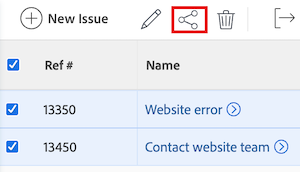

# Partager un problème

Votre administrateur ou administratrice Adobe Workfront accorde aux utilisateurs et utilisatrices l’accès à l’affichage ou à la modification des problèmes lorsque des niveaux d’accès leur sont attribués. Pour plus d’informations sur l’octroi de l’accès aux problèmes, voir [Accorder l’accès aux problèmes](../../administration-and-setup/add-users/configure-and-grant-access/grant-access-issues.md).

En plus du niveau d’accès accordé aux utilisateurs et utilisatrices, vous pouvez également leur accorder des autorisations pour afficher, contribuer ou gérer des problèmes spécifiques que vous pouvez partager. Pour plus d’informations sur les niveaux d’accès et les autorisations, voir [Comment les niveaux d’accès et les autorisations fonctionnent ensemble](../../administration-and-setup/add-users/access-levels-and-object-permissions/how-access-levels-permissions-work-together.md).

Les autorisations sont spécifiques à un élément dans Workfront et définissent les actions que vous pouvez effectuer sur cet élément.

## Conditions d’accès

+++ Développez pour afficher les exigences d’accès aux fonctionnalités de cet article. 

<table style="table-layout:auto"> 
 <col> 
 <col> 
 <tbody> 
  <tr> 
   <td role="rowheader">Package Adobe Workfront</td> 
   <td> 
Tous
 </td> 
  </tr> 
  <tr> 
   <td role="rowheader">Licence Adobe Workfront</td> 
   <td> 
Standard
 
   
Travail ou supérieur
 
   </td> 
  </tr> 
  <tr> 
   <td role="rowheader">Configurations des niveaux d’accès</td> 
   <td> 
Accès Affichage ou supérieur aux objets que vous souhaitez partager.
 </td> 
  </tr> 
  <tr> 
   <td role="rowheader">Autorisations d’objet</td> 
   <td> 
Autorisations d’affichage ou supérieures pour les objets que vous souhaitez partager.
</td> 
  </tr> 
 </tbody> 
</table>

Pour plus de détails sur les informations contenues dans ce tableau, consultez [Conditions d’accès préalables dans la documentation Workfront](/help/quicksilver/administration-and-setup/add-users/access-levels-and-object-permissions/access-level-requirements-in-documentation.md).

+++

## Considérations relatives au partage de problèmes

Outre les considérations ci-dessous, voir également [Vue d’ensemble des autorisations de partage sur les objets](../../workfront-basics/grant-and-request-access-to-objects/sharing-permissions-on-objects-overview.md).

>[!NOTE]
>
>Une équipe d’administration Workfront peut ajouter ou supprimer des autorisations à tous les éléments du système, pour toutes les personnes, sans être la personne propriétaire de ces éléments.

* Le créateur d’un événement dispose par défaut des autorisations de niveau Gérer pour celui-ci.
* Vous pouvez partager un ou plusieurs problèmes à la fois. Le partage des problèmes est identique au partage d’autres éléments dans Workfront. Pour plus d’informations sur le partage d’éléments dans Workfront, voir [Partager un objet](../../workfront-basics/grant-and-request-access-to-objects/share-an-object.md).
* Vous pouvez accorder les autorisations suivantes à un événement :

   * Afficher
   * Contribuer
   * Gérer

* Lorsque vous partagez un problème, tous les documents associés à ce problème héritent des mêmes autorisations.

  L’administrateur ou l’administratrice Workfront peut indiquer si les documents doivent hériter des autorisations des objets supérieurs dans le niveau d’accès de l’utilisateur ou de l’utilisatrice. Pour plus d’informations sur la restriction des autorisations héritées sur les documents, voir [Créer ou modifier des niveaux d’accès personnalisés](../../administration-and-setup/add-users/configure-and-grant-access/create-modify-access-levels.md).

* Vous pouvez supprimer les autorisations héritées d’un problème. Pour plus d’informations, voir [Supprimer les autorisations des objets](../../workfront-basics/grant-and-request-access-to-objects/remove-permissions-from-objects.md).

## Façons de partager un problème

* Manuellement, ce qui est similaire au partage de tout autre objet dans Workfront.
* Automatiquement, en effectuant l’une des opérations suivantes :

   * Spécifier les autorisations sur l’un des objets parents du problème : projet, programme ou portfolio. Les problèmes héritent des autorisations de leurs objets parents. Pour plus d’informations sur l’affichage des autorisations héritées sur les objets, voir [Afficher les autorisations héritées sur les objets](../../workfront-basics/grant-and-request-access-to-objects/view-inherited-permissions-on-objects.md).
   * Ajouter des entités au partage de projet sur un modèle utilisé pour créer le projet sur lequel porte le problème. Pour plus d’informations sur le partage de projets à partir de modèles, voir [Partager un modèle](../../workfront-basics/grant-and-request-access-to-objects/share-a-template.md).

   * Spécifier les autorisations sur tous les problèmes d’un projet lorsque vous modifiez le projet. Pour plus d’informations sur la gestion de l’accès aux problèmes ou aux demandes sur le projet en fonction des autorisations d’un utilisateur ou d’une utilisatrice sur le projet, voir la section  dans l’article [Modifier des projets](../../manage-work/projects/manage-projects/edit-projects.md).

     >[!TIP]
     >
     >Si vous ne spécifiez pas les autorisations de problème que vous souhaitez attribuer aux utilisateurs lorsqu’ils sont affectés aux problèmes du projet, ils reçoivent par défaut les mêmes autorisations que celles dont ils disposent sur le projet.

   * Lors de la création d’une file d’attente des demandes, spécifiez les autorisations que les personnes reçoivent sur les problèmes qu’elles soumettent dans une file d’attente des demandes. Pour plus d’informations, voir [Créer une file d’attente des demandes](../../manage-work/requests/create-and-manage-request-queues/create-request-queue.md).

     >[!IMPORTANT]
     >
     >Les autorisations sont accordées différemment selon que le projet est publié ou non en tant que file d’attente des demandes :
     >
     >   
     >   
     >   * Lorsqu’un utilisateur ou une utilisatrice soumet une demande à un projet publié en tant que file d’attente des demandes, les personnes Contact principal et Entré par se voient accorder l’autorisation spécifiée.
     >   * Lorsqu’une personne soumet une demande pour un projet qui n’est pas publié en tant que file d’attente des demandes, le contact principal (si différent de la personne Entré par) se voit accorder l’autorisation spécifiée, et la personne Entré par se voit accorder les autorisations de gestion du problème.
     >   
     >

<!--

<h2>Automatically share an issue at the project level</h2>

(NOTE: this info duplicates in Edit projects - linked there instead (above).)  

As the Project Owner, you can grant permissions automatically to users as the issues are added to a project.

<ol>
<li value="1">Go to the project whose issues you want to share automatically.</li>
<li value="2"> Click the More menu , then click <strong>Edit</strong>. </li>
<li value="3">In the <strong>Edit Project</strong> box that displays, click <strong>Access</strong>.</li>
<li value="4">In the <strong>When someone is assigned to an ISSUE</strong> field, select from the following permissions levels:
<ul>
<li><strong>View</strong></li>
<li><strong>Contribute</strong></li>
<li><strong>Manage</strong> Now, when someone is assigned to an issue on the selected project, they are granted the specified permissions to the issue.  </li>
</ul></li>
<li value="5">(Optional) Select the <strong>Also grant ... access to the project</strong> field to also grant View, Contribute, or Manage permissions to the projects to the user assigned to the issue</li>
<li value="6">In the <strong>When someone submits a REQUEST ...</strong> field, select from the following permissions levels:
<ul>
<li><strong>View</strong></li>
<li><strong>Contribute</strong></li>
<li>
<strong>Manage</strong>
<note type="important">

Permissions are granted differently depending on whether or not the project is published as a request queue:

<ul>
<li>When a user submits a request to a project published as a request queue, the Primary Contact and Entered By users are granted the permission specified.</li>
<li>When a user submits a request to a project not published as a request queue, the Primary Contact (if different from Entered By user) is granted the permission specified, and the Entered By user is granted Manage permissions to the issue.</li>
</ul>
</note></li>
</ul></li>
<li value="7"> 
(Optional) Select the <strong>People from the same company will inherit the same permissions for all requests</strong> field.
 
People from the same company as the user submitting the request are granted the same permissions on the requests as the user.  
 </li>
<li value="8">Click <strong>Save Changes</strong>.</li>
</ol>

-->

<!--

<h2>Automatically share an issue in request queues</h2>

(NOTE: drafted because it's duplicated from Create a Request Queue which is linked above)  

As the Project Owner, you can grant permissions automatically to users as the issues are submitted to a request queue.

<ol>
<li value="1">Go to the project whose issues you want to share automatically.</li>
<li value="2">Click <strong>Edit Project</strong>.</li>
<li value="3">Click <strong>More</strong> then click <strong>Queue Setup</strong>. </li>
<li value="4"> 
On the <strong>Queue Details</strong> sub-tab, in the drop-down menu under <strong>When someone makes a request, automatically grant</strong>, select from the following permissions levels:

<ul>
<li><strong>View Access</strong> </li>
<li><strong>Contribute Access</strong> </li>
<li> 
<strong>Manage Access</strong> 
 </li>
</ul> 
Now, when someone submits a request to the selected project, they are granted the specified permissions to the request.
 </li>
<li value="5"> 
(Optional) Select the <strong>People from the same company will inherit the same permissions for all requests</strong>.
 
People from the same company as the user submitting the request are granted the same permissions on the requests as the user.  
 </li>
<li value="6">Click <strong>Save</strong>.</li>
</ol>

-->

## Partager un problème

1. Accédez au problème que vous souhaitez partager.

1. À droite du nom du problème, cliquez sur **Partager**. La boîte de dialogue **Partager [Nom de l&#39;événement]** s&#39;ouvre.

   

1. Dans le champ **Accorder l&#39;accès à l&#39;événement**, commencez à saisir le nom de l&#39;utilisateur, de l&#39;équipe, du rôle, du groupe ou de la société avec lesquels vous souhaitez partager l&#39;événement, puis cliquez sur le nom lorsqu&#39;il apparaît dans la liste déroulante.

   >[!TIP]
   >
   >Vous pouvez uniquement partager un problème avec des utilisateurs actifs, des équipes, des rôles ou des entreprises.

1. (Facultatif) Sélectionnez le menu déroulant **Qui a accès** et sélectionnez le niveau d’accès du problème :

   * **Seuls les utilisateurs invités peuvent y accéder :** seuls les utilisateurs invités à l’événement peuvent y accéder (par défaut).
   * **Tout le monde peut afficher dans le système** : tous les utilisateurs du système peuvent afficher le problème sans invitation.

1. Cliquez sur la liste déroulante située à droite du nom de l’utilisateur et sélectionnez son niveau d’autorisation pour ce problème :

   * **Afficher** : l’utilisateur ou l’utilisatrice peut consulter et partager le problème.
   * **Contribuer** : l’utilisateur peut effectuer des mises à jour, consigner des informations, apporter des modifications mineures et partager le problème (inclut également toutes les autorisations d’affichage).
   * **Gérer** : l’utilisateur dispose d’un accès complet à l’événement sans droits d’administration, qui sont accordés au niveau d’accès (inclut également toutes les autorisations Afficher et Contribuer).

1. (Facultatif) Cliquez sur l’icône d’options avancées en regard du niveau d’autorisation que vous avez accordé pour configurer des autorisations spécifiques sur le problème.

   

1. (Facultatif) Pour partager rapidement le problème à l’aide d’un lien, cliquez sur **Copier le lien** puis transférez-le au destinataire.

1. Cliquer sur **Enregistrer**.

## Partage des problèmes en bloc

1. Accédez au projet contenant les événements que vous souhaitez partager.

1. Dans l’onglet **Événements** de la page du projet, sélectionnez la case à gauche de chaque événement à partager, puis cliquez sur l’icône **Partager**  en haut de la page. La boîte de dialogue modale de partage s’ouvre.

   

1. Dans le champ **Accorder l’accès à l’événement**, commencez à saisir le nom de l’utilisateur, de l’équipe, du rôle, du groupe ou de la société avec lequel vous souhaitez partager les événements, puis cliquez sur le nom lorsqu’il apparaît dans la liste déroulante.

   >[!TIP]
   >
   >Vous pouvez uniquement partager des problèmes avec des utilisateurs actifs, des équipes, des rôles ou des entreprises.

1. (Facultatif) Sélectionnez le menu déroulant **Qui a accès** et sélectionnez le niveau d’accès des événements :

   * **Seules les personnes invitées peuvent y accéder :** seuls les utilisateurs invités aux événements peuvent y accéder (par défaut).
   * **Tout le monde peut afficher dans le système** : tous les utilisateurs du système peuvent afficher les événements sans invitation.

1. Cliquez sur la liste déroulante située à droite du nom de l’utilisateur et sélectionnez son niveau d’autorisation pour les problèmes :

   * **Afficher** : l’utilisateur peut consulter et partager les problèmes.
   * **Contribuer** : l’utilisateur peut effectuer des mises à jour, consigner des informations, apporter des modifications mineures et partager les problèmes (inclut également toutes les autorisations d’affichage).
   * **Gérer** : l’utilisateur dispose d’un accès complet aux événements sans droits d’administration, qui sont accordés au niveau d’accès (inclut également toutes les autorisations Afficher et Contribuer).

1. (Facultatif) Cliquez sur l’icône d’options avancées en regard du niveau d’autorisation que vous avez accordé pour configurer des autorisations spécifiques sur les problèmes.

   

1. Cliquer sur **Enregistrer**.

## Autorisations pour les problèmes

Le tableau suivant indique les autorisations que vous pouvez accorder aux personnes lorsqu’elles sont autorisées à afficher, contribuer ou gérer un problème :

<table style="table-layout:auto"> 
 <col> 
 <col> 
 <col> 
 <col> 
 <tbody> 
  <tr> 
   <td><strong>Actions</strong> </td> 
   <td><strong>Gérer</strong> </td> 
   <td><strong>Contribuer</strong> </td> 
   <td><strong>Afficher</strong> </td> 
  </tr> 
  <tr> 
   <td> 
Ajouter des problèmes
 </td> 
   <td>✓</td> 
   <td>  </td> 
   <td>  </td> 
  </tr> 
  <tr> 
   <td>Supprimer  </td> 
   <td>✓</td> 
   <td>  </td> 
   <td>  </td> 
  </tr> 
  <tr> 
   <td>Joindre un formulaire personnalisé</td> 
   <td>✓</td> 
   <td>  </td> 
   <td>  </td> 
  </tr> 
  <tr> 
   <td>Modifier les champs personnalisés</td> 
   <td>✓</td> 
   <td>✓</td> 
   <td>  </td> 
  </tr> 
  <tr> 
   <td>Approuver le problème</td> 
   <td>✓</td> 
   <td>✓</td> 
   <td>✓</td> 
  </tr> 
  <tr> 
   <td>Ajouter un processus d’approbation</td> 
   <td>✓</td> 
   <td>  </td> 
   <td>  </td> 
  </tr> 
  <tr> 
   <td>Ajouter des documents</td> 
   <td>✓</td> 
   <td>✓</td> 
   <td>✓</td> 
  </tr> 
  <tr> 
   <td>Copier le problème*</td> 
   <td>✓</td> 
   <td>✓</td> 
   <td>✓</td> 
  </tr> 
  <tr> 
   <td>Déplacer événement</td> 
   <td>✓</td> 
   <td>  </td> 
   <td>  </td> 
  </tr> 
  <tr> 
   <td>Consigner les heures</td> 
   <td>✓</td> 
   <td>✓</td> 
   <td>  </td> 
  </tr> 
  <tr> 
   <td>Convertir en projet*</td> 
   <td>✓</td> 
   <td>  </td> 
   <td>  </td> 
  </tr> 
  <tr> 
   <td>Accepter l’affectation</td> 
   <td>✓</td> 
   <td>✓</td> 
   <td>  </td> 
  </tr> 
  <tr> 
   <td>Mises à jour / commentaires</td> 
   <td>✓</td> 
   <td>✓</td> 
   <td>✓</td> 
  </tr> 
  <tr> 
   <td>Modifier les dates prévues</td> 
   <td>✓</td> 
   <td>  </td> 
   <td>  </td> 
  </tr> 
  <tr> 
   <td>Créer des affectations</td> 
   <td>✓</td> 
   <td>✓</td> 
   <td>  </td> 
  </tr> 
  <tr> 
   <td>Partager</td> 
   <td>✓</td> 
   <td>✓</td> 
   <td>✓</td> 
  </tr> 
  <tr> 
   <td>Partager sur le système</td> 
   <td>  </td> 
   <td>  </td> 
   <td>✓</td> 
  </tr> 
 </tbody> 
</table>

&#42;Contrôlé par les niveaux d’accès et les autorisations sur le projet.
