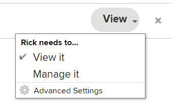
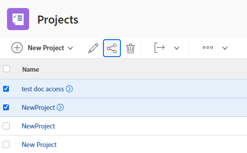

# Partager un objet

<!--Audited: 01/2024-->

Votre personne chargée de l’administration d’Adobe Workfront permet aux utilisateurs et utilisatrices d’afficher ou de modifier des objets lorsqu’elle attribue des niveaux d’accès. Pour plus d’informations sur l’octroi d’accès aux objets, voir [Créer ou modifier les niveaux d’accès personnalisés](../../administration-and-setup/add-users/configure-and-grant-access/create-modify-access-levels.md).

Outre le niveau d’accès accordé aux utilisateurs et utilisatrices, vous pouvez leur accorder des autorisations pour afficher ou modifier des objets spécifiques que vous avez créés ou dont vous avez l’accès en partage. Pour plus d’informations sur les niveaux d’accès et les autorisations, voir [Comment les niveaux d’accès et les autorisations fonctionnent ensemble](../../administration-and-setup/add-users/access-levels-and-object-permissions/how-access-levels-permissions-work-together.md).

Les autorisations sont spécifiques à un élément dans Workfront et définissent les actions que vous pouvez effectuer sur cet élément.

Pour plus d’informations sur le partage des autorisations sur les objets, voir [Vue d’ensemble du partage des autorisations sur les objets](../../workfront-basics/grant-and-request-access-to-objects/sharing-permissions-on-objects-overview.md).

>[!NOTE]
>
>Une équipe d’administration Workfront peut ajouter ou supprimer des autorisations à tous les éléments du système, pour toutes les personnes, sans être la personne propriétaire de ces éléments.

Cet article décrit comment partager les objets suivants :

* Projets, tâches, problèmes
* Portfolios, programmes
* Documents

Pour plus d’informations sur le partage de tous les autres objets dans Workfront, reportez-vous également aux articles suivants :

* Pour les modèles, voir [Partager des modèles de projet](../../manage-work/projects/create-and-manage-templates/share-project-template.md).
* Pour les épreuves, voir [Partager une épreuve dans Workfront Proof](../../workfront-proof/wp-work-proofsfiles/share-proofs-and-files/share-proof.md).
* Pour les rapports, les tableaux de bord et les calendriers, reportez-vous aux articles suivants :

   * [Partager un rapport dans Adobe Workfront](../../reports-and-dashboards/reports/creating-and-managing-reports/share-report.md)
   * [Partager un tableau de bord](../../reports-and-dashboards/dashboards/creating-and-managing-dashboards/share-dashboard.md)
   * [Partager un rapport de calendrier](../../reports-and-dashboards/reports/calendars/share-a-calendar-report.md)

  En outre, voir [Partager des rapports, des tableaux de bord et des calendriers](../../workfront-basics/grant-and-request-access-to-objects/permissions-reports-dashboards-calendars.md) pour obtenir des informations générales sur le partage de rapports, de tableaux de bord et de calendriers.

* Pour les filtres, les vues et les regroupements, voir [Partager un filtre, un affichage ou un regroupement](../../reports-and-dashboards/reports/reporting-elements/share-filter-view-grouping.md).
* Pour les dossiers de documents, voir [Partager un dossier de documents](../../workfront-basics/grant-and-request-access-to-objects/share-a-document-folder.md).
* Pour les plans, voir [Partage d’un plan dans le planificateur de scénarios](../../scenario-planner/share-a-plan.md).

  Workfront Scenario Planner peut nécessiter une licence supplémentaire.

* Pour connaître les objectifs, voir [Partager un objectif dans les objectifs Workfront](../../workfront-goals/workfront-goals-settings/share-a-goal.md).

  Les objectifs Workfront peuvent nécessiter une licence supplémentaire.

* Pour les objets Workfront Planning, reportez-vous aux articles suivants :

   * [Partager des affichages](/help/quicksilver/planning/access/share-views.md)
   * [Partager des espaces de travail](/help/quicksilver/planning/access/share-workspaces.md)

  L’accès à Workfront Planning nécessite une licence supplémentaire.

## Conditions d’accès

+++ Développez pour afficher les exigences d’accès aux fonctionnalités de cet article.

Pour partager des objets, vous devez disposer des éléments suivants :

<table style="table-layout:auto"> 
 <col> 
 <col> 
 <tbody> 
  <tr> 
   <td role="rowheader">Formule Adobe Workfront</td> 
   <td> 
Tous 
 </td> 
  </tr> 
  <tr> 
   <td role="rowheader">Licence Adobe Workfront*</td> 
   <td> 
Nouvelle licence : Standard
 
   Ou
   
Licence actuelle : Travail ou version supérieure

   </td> 
  </tr> 
  <tr> 
   <td role="rowheader">Configurations des niveaux d’accès</td> 
   <td> 
Accès Affichage ou supérieur aux objets que vous souhaitez partager.
 </td> 
  </tr> 
  <tr> 
   <td role="rowheader">Autorisations d’objet</td> 
   <td> 
Autorisations d’affichage ou supérieures pour les objets que vous souhaitez partager.
</td> 
  </tr> 
 </tbody> 
</table>

*Pour plus d’informations, voir [Conditions d’accès requises dans la documentation Workfront](/help/quicksilver/administration-and-setup/add-users/access-levels-and-object-permissions/access-level-requirements-in-documentation.md).

+++

## Partager un projet, une tâche ou un problème à partir de sa page

1. Accédez à la page du projet, de la tâche ou du problème à partager.

   Pour plus d’informations sur les objets qui peuvent être partagés, voir [Vue d’ensemble des autorisations de partage sur les objets](../../workfront-basics/grant-and-request-access-to-objects/sharing-permissions-on-objects-overview.md).

1. Cliquez sur le bouton **Partager** en regard du nom de l’objet.

   

1. Dans la zone **Accorder l’accès à**, commencez à saisir le nom de l’utilisateur, de l’équipe, du rôle, du groupe ou de la société avec lequel vous souhaitez partager l’objet, puis cliquez sur le nom lorsqu’il apparaît dans la liste déroulante.

   {width="350"}

   >[!TIP]
   >
   >Vous pouvez partager un objet uniquement avec des utilisateurs et utilisatrices, des équipes, des rôles ou des entreprises actifs.

   >[!TIP]
   >
   >Si plusieurs entités sont nommées de la même manière, elles sont toutes répertoriées sous leur type. Les noms des entités s’affichent par ordre alphabétique. Cependant, l’ordre dans lequel les types d’entité apparaissent est aléatoire.
   >

1. (Facultatif) Répétez l’étape 3 pour chaque utilisateur ou utilisatrice, équipe, rôle ou groupe pour qui vous souhaitez accorder l’accès à l’objet.

1. Spécifiez les autorisations pour chaque utilisateur ou utilisatrice, équipe, rôle, groupe ou société que vous avez ajouté à l’étape 3 en cliquant sur le menu déroulant à droite de son nom, puis en sélectionnant le niveau d’autorisation à accorder.

   

   Pour supprimer des autorisations d’un objet, voir [Supprimer les autorisations des objets](/help/quicksilver/workfront-basics/grant-and-request-access-to-objects/remove-permissions-from-objects.md).

   Les options disponibles sont les suivantes :

   * **Affichage :** les utilisateurs et utilisatrices peuvent consulter et partager l’élément.
   * **Contribution** : les utilisateurs et utilisatrices peuvent effectuer des mises à jour, consigner des informations, effectuer des modifications mineures et partager, ainsi que toutes les autorisations d’affichage.
   * **Gestion :** les utilisateurs et utilisatrices disposent d’un accès complet à l’objet sans droits d’administration (qui sont accordés au niveau d’accès). En outre, ils disposent de toutes les autorisations d’affichage et de contribution.

     >[!NOTE]
     >
     >L’administrateur ou l’administratrice Workfront ou le créateur ou la créatrice d’objets peut supprimer des autorisations de ces entités.

1. (Facultatif) Cliquez sur l’icône des options avancées située en regard du niveau d’autorisation que vous avez accordé pour configurer des autorisations spécifiques sur l’objet.

   

   Les niveaux d’affichage, de gestion et de contribution ont différentes options avancées selon l’objet sélectionné.

   Pour plus d’informations sur les niveaux d’autorisation, voir [Vue d’ensemble du partage des autorisations sur les objets](../../workfront-basics/grant-and-request-access-to-objects/sharing-permissions-on-objects-overview.md).

1. (Facultatif) Pour mettre cet objet à la disposition de l’ensemble des utilisateurs et utilisatrices du système, cliquez sur le menu déroulant sous **Qui a accès**, puis, dans le menu déroulant, cliquez sur **Visible par toutes et tous dans le système**.

   

   Tous les utilisateurs et utilisatrices peuvent voir l’objet en fonction des autorisations que vous avez définies.

1. (Facultatif et le cas échéant) Lors du partage d’un projet, cliquez sur l’icône **Engrenage** , puis cochez la case en regard de **Définir comme mon modèle d’accès au projet** pour définir les autorisations en tant que modèle.

   Une fois que vous avez défini des autorisations sur un projet, ces mêmes autorisations sont automatiquement appliquées la prochaine fois que vous créez un projet à partir de zéro.

   >[!NOTE]
   >
   >Le modèle d’accès au projet remplace les valeurs par défaut de partage qui vous ont été attribuées par l’administrateur ou l’administratrice Workfront de votre niveau d’accès.\
   >Pour plus d’informations sur la spécification des valeurs par défaut de partage pour les projets dans le niveau d’accès, voir [Accorder l’accès aux projets](../../administration-and-setup/add-users/configure-and-grant-access/grant-access-projects.md)

   <!--
   >this note also appears in Understanding Project Permissions-->

   Vous pouvez spécifier des autorisations sur les projets qui seront créés à partir d’un modèle lorsque vous partagez le modèle. Pour plus d’informations, voir [Partager des modèles de projet](../../manage-work/projects/create-and-manage-templates/share-project-template.md).

1. (Conditionnel) Pour partager rapidement l’objet avec les utilisateurs qui y ont accès, cliquez sur **Copier le lien**.

1. Cliquer sur **Enregistrer**.

## Partager un document, un portfolio ou un programme à partir de sa page

1. Accédez à la page du document, du portfolio ou du programme que vous souhaitez partager.

   Pour plus d’informations sur les objets qui peuvent être partagés, voir [Vue d’ensemble du partage des autorisations sur les objets](../../workfront-basics/grant-and-request-access-to-objects/sharing-permissions-on-objects-overview.md).

1. Pour les portfolios et les programmes, procédez comme suit :

   Cliquez sur le bouton **Partager** en regard du nom de l’objet.

   

   Ou

   Pour les documents, procédez comme suit :

   Cliquez sur l’icône **Plus**  en regard du nom de l’objet, puis sur **Partager**.

   

1. Dans le champ **Accorder l’accès à &lt; Nom de l’objet > à** commencez à saisir le nom de l’utilisateur, de l’équipe, du rôle, du groupe ou de la société avec lequel vous souhaitez partager l’objet, puis cliquez sur le nom lorsqu’il apparaît dans la liste déroulante.

   

   >[!TIP]
   >
   >* Si plusieurs entités sont nommées de la même manière, elles sont toutes répertoriées sous leur type. Les noms des entités s’affichent par ordre alphabétique. Cependant, l’ordre dans lequel les types d’entité apparaissent est aléatoire.
   >
   >* Vous pouvez partager un objet uniquement avec des utilisateurs et utilisatrices, des équipes, des rôles ou des entreprises actifs.

1. (Facultatif) Répétez l’étape 3 pour chaque utilisateur ou utilisatrice, équipe, rôle ou groupe pour qui vous souhaitez accorder l’accès à l’objet.

1. Spécifiez les autorisations pour chaque utilisateur ou utilisatrice, équipe, rôle, groupe ou société que vous avez ajouté(e) à l’étape 3 en cliquant sur le menu déroulant, puis en sélectionnant le niveau d’autorisation à accorder.

   Pour supprimer des autorisations d’un objet, voir [Supprimer les autorisations des objets](/help/quicksilver/workfront-basics/grant-and-request-access-to-objects/remove-permissions-from-objects.md).

   Les options disponibles sont les suivantes :

   * **Affichage :** les utilisateurs et utilisatrices peuvent consulter et partager l’élément.
   * **Gestion :** les utilisateurs et utilisatrices disposent d’un accès complet à l’objet sans droits d’administration (qui sont accordés au niveau d’accès). En outre, ils disposent de toutes les autorisations d’affichage et de contribution.

     >[!NOTE]
     >
     >L’administrateur ou l’administratrice Workfront ou le créateur ou la créatrice d’objets peut supprimer des autorisations de ces entités.

     

1. (Facultatif) Cliquez sur **Paramètres avancés** pour configurer des autorisations spécifiques sur l’objet.

   Les autorisations Afficher et Gérer comportent différentes options avancées en fonction de l’objet sélectionné.\
   Pour plus d’informations sur les niveaux d’autorisation, voir [Vue d’ensemble du partage des autorisations sur les objets](../../workfront-basics/grant-and-request-access-to-objects/sharing-permissions-on-objects-overview.md).

1. (Facultatif) Pour rendre cet objet disponible pour l’ensemble des utilisateurs et utilisatrices du système, cliquez sur l’icône **Engrenage** , puis, dans le menu déroulant, cliquez sur **Rendre ceci visible sur tout le système**.

   Tous les utilisateurs et utilisatrices peuvent voir l’objet en fonction des autorisations que vous avez définies.

1. (Facultatif) Pour rendre l’objet public, cliquez sur **Rendre ceci public pour les utilisateurs et utilisatrices externes**.

   >[!TIP]
   >
   >Cette option n’est pas disponible pour tous les objets.

   {width="350"}

1. (Le cas échéant) Si vous avez rendu l’objet public pour les utilisateurs et utilisatrices externes, cliquez sur **Copier le lien**, puis distribuez le lien.

   Tous les utilisateurs et utilisatrices disposant du lien peuvent afficher l’objet.

   >[!CAUTION]
   >
   >Nous avisons la prudence lors du partage d’un objet contenant des informations confidentielles avec des utilisateurs et utilisatrices externes. Cette fonction leur permet d’afficher des informations sans être un utilisateur ou une utilisatrice Workfront ou une personne membre de votre organisation.

1. Cliquer sur **Enregistrer**.

## Partager des objets uniques ou en masse à partir d’une liste

1. Accédez à la liste contenant les objets que vous souhaitez partager.

   Pour plus d’informations sur les objets qui peuvent être partagés, voir [Vue d’ensemble des autorisations de partage sur les objets](../../workfront-basics/grant-and-request-access-to-objects/sharing-permissions-on-objects-overview.md).

1. Cochez la case en regard du ou des objets que vous souhaitez partager, puis cliquez sur l’**icône Partager**  en haut de la page.

   La boîte de dialogue **&lt; Objet > Accès** s’ouvre.

   {width="350"}

1. Dans la zone **Modifier l&#39;accès &lt; Nom de l&#39;objet > pour**, commencez à saisir le nom de l&#39;utilisateur, de l&#39;équipe, du rôle, du groupe ou de la société avec lequel vous souhaitez partager les objets, puis cliquez sur le nom lorsqu&#39;il apparaît dans la liste déroulante.

   {width="350"}

   >[!TIP]
   >
   >* Vous pouvez partager un objet uniquement avec des utilisateurs et utilisatrices, des équipes, des rôles ou des entreprises actifs.
   >
   >
   >* Si plusieurs entités sont nommées de la même manière, elles sont toutes répertoriées sous leur type. Les noms des entités s’affichent par ordre alphabétique. Cependant, l’ordre dans lequel les types d’entité apparaissent est aléatoire.
   >

1. (Facultatif) Répétez l’étape 3 pour chaque utilisateur ou utilisatrice, équipe, rôle ou groupe pour qui vous souhaitez accorder l’accès aux objets.

1. Spécifiez les autorisations pour chaque utilisateur ou utilisatrice, équipe, rôle, groupe ou société que vous avez ajouté à l’étape 3 en cliquant sur le menu déroulant à droite de son nom, puis en sélectionnant le niveau d’autorisation à accorder.

   Pour supprimer des autorisations d’un objet, voir [Supprimer les autorisations des objets](/help/quicksilver/workfront-basics/grant-and-request-access-to-objects/remove-permissions-from-objects.md).

   

   Les options disponibles sont les suivantes :

   * **Affichage :** les utilisateurs et utilisatrices peuvent consulter et partager l’élément.
   * **Contribution** : les utilisateurs et utilisatrices peuvent effectuer des mises à jour, consigner des informations, effectuer des modifications mineures et partager, ainsi que toutes les autorisations d’affichage.

     >[!TIP]
     >
     >Vous ne pouvez accorder des autorisations de contribution qu’aux objets suivants :
     >
     >* Projets
     >* Tâches
     >* Problèmes
     >

   * **Gestion :** les utilisateurs et utilisatrices disposent d’un accès complet à l’objet sans droits d’administration (qui sont accordés au niveau d’accès). En outre, ils disposent de toutes les autorisations d’affichage et de contribution.

     >[!NOTE]
     >
     >L’administrateur ou l’administratrice Workfront ou le créateur ou la créatrice d’objets peut supprimer des autorisations de ces entités.

1. (Facultatif) Cliquez sur **Paramètres avancés** pour configurer des autorisations spécifiques sur l’objet.

   Les niveaux d’affichage, de gestion et de contribution ont différentes options avancées selon l’objet sélectionné.\
   Pour plus d’informations sur les niveaux d’autorisation, voir [Vue d’ensemble du partage des autorisations sur les objets](../../workfront-basics/grant-and-request-access-to-objects/sharing-permissions-on-objects-overview.md).

   

1. (Facultatif) Pour rendre cet objet disponible pour l’ensemble des utilisateurs et utilisatrices du système, cliquez sur l’icône **Engrenage** , puis, dans le menu déroulant, cliquez sur **Rendre ceci visible sur tout le système**.

   Tous les utilisateurs et utilisatrices peuvent voir les objets en fonction des autorisations que vous avez définies.

1. (Facultatif et le cas échéant) Lors du partage d’un projet, cliquez sur l’icône **Engrenage** , puis, dans le menu déroulant, cliquez sur **Définir comme mon modèle d’accès au projet** pour définir les autorisations en tant que modèle.

   Une fois que vous avez défini des autorisations sur un projet, ces mêmes autorisations sont automatiquement appliquées la prochaine fois que vous créez un projet à partir de zéro.

   >[!NOTE]
   >
   >Le modèle d’accès au projet remplace les valeurs par défaut de partage qui vous ont été attribuées par l’administrateur ou l’administratrice Workfront de votre niveau d’accès.\
   >Pour plus d’informations sur la spécification des valeurs par défaut de partage pour les projets dans le niveau d’accès, voir [Accorder l’accès aux projets](../../administration-and-setup/add-users/configure-and-grant-access/grant-access-projects.md)

   <!--
   >this note also appears in Understanding Project Permissions-->

   Vous pouvez spécifier des autorisations sur les projets qui seront créés à partir d’un modèle lorsque vous partagez le modèle. Pour plus d’informations, voir [Partager des modèles de projet](../../manage-work/projects/create-and-manage-templates/share-project-template.md).

1. (Facultatif) Pour rendre les objets publics, cliquez sur **Rendre ceci public pour les utilisateurs et utilisatrices externes**.

   >[!TIP]
   >
   >Cette option n’est pas disponible pour tous les objets.

   {width="350"}

1. (Le cas échéant) Si vous avez rendu l’objet public pour les utilisateurs et utilisatrices externes, cliquez sur **Copier le lien**, puis distribuez le lien.

   Tous les utilisateurs et utilisatrices disposant du lien peuvent afficher l’objet.

   >[!CAUTION]
   >
   >Nous avisons la prudence lors du partage d’un objet contenant des informations confidentielles avec des utilisateurs et utilisatrices externes. Cette fonction leur permet d’afficher des informations sans être un utilisateur ou une utilisatrice Workfront ou une personne membre de votre organisation.

1. Cliquer sur **Enregistrer**.
