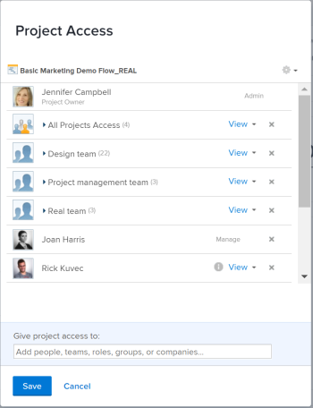

# Partage d’un objet

Votre administrateur Adobe Workfront permet aux utilisateurs d’afficher ou de modifier des objets lorsqu’ils attribuent des niveaux d’accès. Pour plus d’informations sur l’octroi de l’accès aux objets, voir [Création ou modification de niveaux d’accès personnalisés](../../administration-and-setup/add-users/configure-and-grant-access/create-modify-access-levels.md).

Outre le niveau d’accès qui est accordé aux utilisateurs, vous pouvez leur accorder des autorisations pour afficher ou modifier des objets spécifiques que vous avez créés ou que vous avez accès au partage. Pour plus d’informations sur les niveaux d’accès et les autorisations, voir [Fonctionnement des niveaux d’accès et des autorisations](../../administration-and-setup/add-users/access-levels-and-object-permissions/how-access-levels-permissions-work-together.md).

Les autorisations sont spécifiques à un élément dans Workfront et définissent les actions que vous pouvez effectuer sur cet élément.

Pour plus d’informations sur le partage des autorisations sur les objets, voir [Présentation des autorisations de partage sur les objets](../../workfront-basics/grant-and-request-access-to-objects/sharing-permissions-on-objects-overview.md).

>[!NOTE]
>
>Un administrateur Workfront peut ajouter ou supprimer des autorisations à n’importe quel élément du système, pour tous les utilisateurs, sans en être le propriétaire.

Cet article décrit comment partager les objets suivants pour lesquels le partage est identique : 

* Projets, tâches, problèmes
* Portfolios, programmes
* Documents

Pour plus d’informations sur le partage de tous les autres objets dans Workfront, reportez-vous également aux articles suivants :

* Pour les modèles, voir [Partage de modèles de projet](../../manage-work/projects/create-and-manage-templates/share-project-template.md).
* Pour les bons à tirer, voir [Partage d’un bon à tirer dans un bon à tirer Workfront](../../workfront-proof/wp-work-proofsfiles/share-proofs-and-files/share-proof.md).
* Pour les rapports, les tableaux de bord et les calendriers, reportez-vous aux articles suivants :

   * [Partage d’un rapport dans Adobe Workfront](../../reports-and-dashboards/reports/creating-and-managing-reports/share-report.md)
   * [Partage d’un tableau de bord](../../reports-and-dashboards/dashboards/creating-and-managing-dashboards/share-dashboard.md)
   * [Partage d’un rapport de calendrier](../../reports-and-dashboards/reports/calendars/share-a-calendar-report.md)

   En outre, voir [Partage de rapports, de tableaux de bord et de calendriers](../../workfront-basics/grant-and-request-access-to-objects/permissions-reports-dashboards-calendars.md) pour obtenir des informations générales sur le partage de rapports, de tableaux de bord et de calendriers. 

* Pour les filtres, les vues et les regroupements, voir [Partage d’un filtre, d’une vue ou d’un regroupement](../../reports-and-dashboards/reports/reporting-elements/share-filter-view-grouping.md).
* Pour les dossiers de documents, voir [Partage d’un dossier de document](../../workfront-basics/grant-and-request-access-to-objects/share-a-document-folder.md).
* Pour les plans, voir [Partage d’un plan dans le planificateur de scénarios](../../scenario-planner/share-a-plan.md).

   Cela nécessite une licence supplémentaire.

* Pour les objectifs, voir [Partage d’un objectif dans les objectifs Workfront](../../workfront-goals/workfront-goals-settings/share-a-goal.md). Cela nécessite une licence supplémentaire.

## Exigences d’accès

<!--drafted for P&P:

<table style="table-layout:auto"> 
 <col> 
 <col> 
 <tbody> 
  <tr> 
   <td role="rowheader">Adobe Workfront plan*</td> 
   <td> 
Any 
 </td> 
  </tr> 
  <tr> 
   <td role="rowheader">Adobe Workfront license*</td> 
   <td> 
Current license: Standard
 
   Or
   
Legacy license: Work or higher

   </td> 
  </tr> 
  <tr> 
   <td role="rowheader">Access level configurations*</td> 
   <td> 
View access or higher to the objects you want to share
 
<b>NOTE</b>
   
   If you still don't have access, ask your Workfront administrator if they set additional restrictions in your access level. For information on how a Workfront administrator can modify your access level, see <a href="../../administration-and-setup/add-users/configure-and-grant-access/create-modify-access-levels.md" class="MCXref xref">Create or modify custom access levels</a>.
 </td> 
  </tr> 
  <tr> 
   <td role="rowheader">Object permissions</td> 
   <td> 
View permissions or higher to the objects you want to share
 
For information on requesting additional access, see <a href="../../workfront-basics/grant-and-request-access-to-objects/request-access.md" class="MCXref xref">Request access to objects </a>.
 </td> 
  </tr> 
 </tbody> 
</table>
-->

Pour partager des objets, vous devez disposer des éléments suivants :

<table style="table-layout:auto"> 
 <col> 
 <col> 
 <tbody> 
  <tr> 
   <td role="rowheader">Formule Adobe Workfront*</td> 
   <td> 
Tous 
 </td> 
  </tr> 
  <tr> 
   <td role="rowheader">Licence Adobe Workfront*</td> 
   <td> 
Travail ou plus élevé
 </td> 
  </tr> 
  <tr> 
   <td role="rowheader">Paramétrages du niveau d'accès*</td> 
   <td> 
Afficher l’accès ou une version ultérieure aux objets que vous souhaitez partager
 
<b>NOTE</b>

Si vous n’avez toujours pas accès à , demandez à votre administrateur Workfront s’il définit des restrictions supplémentaires à votre niveau d’accès. Pour plus d’informations sur la façon dont un administrateur Workfront peut modifier votre niveau d’accès, voir <a href="../../administration-and-setup/add-users/configure-and-grant-access/create-modify-access-levels.md" class="MCXref xref">Création ou modification de niveaux d’accès personnalisés</a>.
 </td>
</tr> 
  <tr> 
   <td role="rowheader">Autorisations d’objet</td> 
   <td> 
Afficher les autorisations ou plus pour les objets que vous souhaitez partager
 
Pour plus d’informations sur la demande d’accès supplémentaire, voir <a href="../../workfront-basics/grant-and-request-access-to-objects/request-access.md" class="MCXref xref">Demande d’accès aux objets </a>.
 </td> 
  </tr> 
 </tbody> 
</table>

&#42;Pour connaître le plan, le type de licence ou l’accès dont vous disposez, contactez votre administrateur Workfront.

## Partage d’un seul objet {#share-a-single-object}

1. Accédez à l’objet que vous souhaitez partager.

   Pour plus d’informations sur les objets qui peuvent être partagés, voir [Présentation des autorisations de partage sur les objets](../../workfront-basics/grant-and-request-access-to-objects/sharing-permissions-on-objects-overview.md).
1. Cliquez sur le bouton **Plus** icon en regard du nom de l’objet, puis cliquez sur **Partage** ou **Partagez.**

   

1. Dans le **Give `<Object Name>` accès à** , commencez à saisir le nom de l’utilisateur, de l’équipe, du rôle, du groupe ou de la société avec lequel vous souhaitez partager l’objet, puis cliquez sur le nom lorsqu’il apparaît dans la liste déroulante.

   Par exemple, si vous partagez un projet, utilisez la variable **Accorder au projet l’accès à** champ .

   >[!TIP]
   >
   >Vous pouvez partager un objet uniquement avec des utilisateurs, équipes, rôles ou entreprises principaux.

   

   >[!TIP]
   >
   >Si plusieurs entités sont nommées de la même manière, elles sont toutes répertoriées sous leur type. Les noms des entités s&#39;affichent par ordre alphabétique. Cependant, l’ordre dans lequel les types d’entité apparaissent est aléatoire.
   >
   >
   >   >

1. (Facultatif) Répétez l’étape 3 pour chaque utilisateur, équipe, rôle ou groupe auquel vous souhaitez accorder l’accès à l’objet.

   <!--
   <MadCap:conditionalText data-mc-conditions="QuicksilverOrClassic.Draft mode">
   (NOTE: esnure this stays accurate; in the editor it looks like step 4 but one step is conditioned entirely for one version or another)
   </MadCap:conditionalText>
   -->

1. Spécifiez les autorisations pour chaque utilisateur, équipe, rôle, groupe ou société que vous avez ajouté à l’étape 3 en cliquant sur le menu déroulant, puis en sélectionnant le niveau d’autorisation à accorder.

   Les options disponibles sont les suivantes :

   * **Afficher :** Les utilisateurs peuvent réviser et partager l’élément. 
   * **Contribution**** :** les utilisateurs peuvent effectuer des mises à jour, consigner des informations, effectuer des modifications mineures et partager, ainsi que toutes les autorisations d’affichage.

      >[!TIP]
      >
      >Vous ne pouvez accorder des autorisations de contribution qu’aux objets suivants : 
      * Projets
      * Tâches
      * Événements

   * **Gérer :**les utilisateurs disposent d’un accès complet à l’objet sans droits d’administration, qui sont accordés au niveau de l’accès, ainsi que toutes les autorisations d’affichage et de contribution.

      >[!NOTE]
       L’administrateur Workfront ou le créateur d’objets peut supprimer des autorisations de ces entités.

       

      

1. (Facultatif) Cliquez sur **Options avancées** pour configurer des autorisations spécifiques sur l’objet.

   Les options d’affichage, de gestion et de contribution sont différentes selon l’objet sélectionné.\
   Pour plus d’informations sur les niveaux d’autorisation, voir [Présentation des autorisations de partage sur les objets](../../workfront-basics/grant-and-request-access-to-objects/sharing-permissions-on-objects-overview.md).

   

1. (Facultatif) Pour rendre cet objet disponible pour tous les utilisateurs du système, cliquez sur le bouton **Gear** icon  , puis, dans le menu déroulant, cliquez sur **rendre visible à l’échelle du système ;**.

   Tous les utilisateurs peuvent voir l’objet en fonction des autorisations que vous avez définies.

1. (Facultatif et conditionnel) Lors du partage d’un projet, cliquez sur l’icône **Gear** icon , puis, dans le menu déroulant, cliquez sur **Défini comme modèle d’accès à mon projet** pour définir les autorisations en tant que modèle.\
   Une fois que vous avez défini des autorisations sur un projet, ces mêmes autorisations sont automatiquement appliquées la prochaine fois que vous créez un projet à partir de zéro.

   >[!NOTE]
   Le modèle d’accès au projet remplace les valeurs par défaut de partage qui vous ont été attribuées par l’administrateur Workfront de votre niveau d’accès.\
   Pour plus d’informations sur la spécification des valeurs par défaut de partage pour les projets au niveau d’accès, voir [Accorder l’accès aux projets](../../administration-and-setup/add-users/configure-and-grant-access/grant-access-projects.md) . >
   <!--   >
   ><MadCap:conditionalText data-mc-conditions="QuicksilverOrClassic.Draft mode">   >
   >(NOTE: (this note also appears in Understanding Project Permissions.))   >
   ></MadCap:conditionalText>   >
   >-->   >

   Vous pouvez spécifier des autorisations sur les projets qui seront créés à partir d’un modèle lorsque vous partagez le modèle. Pour plus d’informations, voir [Partage de modèles de projet](../../manage-work/projects/create-and-manage-templates/share-project-template.md).

1. (Facultatif) Pour rendre l’objet public, cliquez sur **Rendre ceci public aux utilisateurs externes**.

   >[!TIP]
   Cette option n’est pas disponible pour tous les objets.

   

1. (Conditionnel) Si vous avez rendu l’objet public aux utilisateurs externes, cliquez sur **lien de copie,** distribuez ensuite le lien à des utilisateurs externes.\
   Tous les utilisateurs disposant du lien peuvent afficher l’objet .

   >[!CAUTION]
   Nous vous recommandons d’être prudent lors du partage d’un objet contenant des informations confidentielles avec des utilisateurs externes. Cela leur permet d’afficher des informations sans être un utilisateur Workfront ou un membre de votre entreprise.

1. Cliquer sur **Enregistrer**.

## Partage d’objets en bloc

À partir d’une liste d’objets, vous pouvez partager plusieurs objets à la fois avec d’autres utilisateurs, équipes, groupes, rôles de tâche ou entreprises.

>[!IMPORTANT]
Lorsque vous partagez des objets en bloc, les noms des entités disposant d’autorisations sur les objets individuels ne s’affichent pas. Lors du partage d’objets en bloc, les entités que vous ajoutez à la liste de partage sont ajoutées aux objets sélectionnés. Elles ne remplacent pas les entités associées aux objets individuels. 

Pour partager des objets en bloc :

1. Accédez à une liste d’objets.
1. Sélectionnez plusieurs objets dans la liste.
1. Cliquez sur le bouton **Partager** icon .\
   Les utilisateurs qui ont déjà accès à l’objet ne sont pas répertoriés comme disponibles lors du partage en masse.

   >[!NOTE]
   Si vous ne disposez pas des autorisations nécessaires pour partager un objet sélectionné, la variable **Partager** n’est pas visible.

1. Dans le **Modifier `<Object Name>` access pour** , commencez à saisir le nom d’un utilisateur, d’une équipe, d’un groupe, d’un rôle de tâche ou d’une société auquel vous souhaitez accorder des autorisations.

   Par exemple, si vous partagez un projet, utilisez la variable **Octroi d’un accès au projet pour** champ .

   

1. Continuez à partager les objets sélectionnés comme décrit dans les étapes 4 à 9 de la section . [Partage d’un seul objet](#share-a-single-object) dans cet article.

   <!--
   <MadCap:conditionalText data-mc-conditions="QuicksilverOrClassic.Draft mode">
   (NOTE: ensure these steps stay accurate; always look at them in the viewer; because of condiitoning, the steps numbers in the editor are different!!!!!!*****)
   </MadCap:conditionalText>
   -->

1. Cliquer sur **Enregistrer**.
