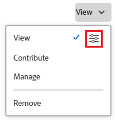

# Partager un objet

<!--Audited: 01/2024-->

Votre administrateur Adobe Workfront permet aux utilisateurs d’afficher ou de modifier des objets lorsqu’ils attribuent des niveaux d’accès. Pour plus d’informations sur l’octroi de l’accès aux objets, voir [Création ou modification de niveaux d’accès personnalisés](../../administration-and-setup/add-users/configure-and-grant-access/create-modify-access-levels.md).

Outre le niveau d’accès qui est accordé aux utilisateurs, vous pouvez leur accorder des autorisations pour afficher ou modifier des objets spécifiques que vous avez créés ou que vous avez accès au partage. Pour plus d’informations sur les niveaux d’accès et les autorisations, voir [Comment les niveaux d’accès et les autorisations fonctionnent ensemble](../../administration-and-setup/add-users/access-levels-and-object-permissions/how-access-levels-permissions-work-together.md).

Les autorisations sont spécifiques à un élément dans Workfront et définissent les actions que vous pouvez effectuer sur cet élément.

Pour plus d’informations sur le partage des autorisations sur les objets, voir [Présentation des droits de partage sur les objets](../../workfront-basics/grant-and-request-access-to-objects/sharing-permissions-on-objects-overview.md).

>[!NOTE]
>
>Un administrateur Workfront peut ajouter ou supprimer des autorisations à n’importe quel élément du système, pour tous les utilisateurs, sans en être le propriétaire.

Cet article décrit comment partager les objets suivants :

* Projets, tâches, problèmes
* Portfolios, programmes
* Documents

Pour plus d’informations sur le partage de tous les autres objets dans Workfront, reportez-vous également aux articles suivants :

* Pour les modèles, voir [Partager des modèles de projet](../../manage-work/projects/create-and-manage-templates/share-project-template.md).
* Pour les bons à tirer, voir [Partage d’un bon à tirer dans Workfront Proof](../../workfront-proof/wp-work-proofsfiles/share-proofs-and-files/share-proof.md).
* Pour les rapports, les tableaux de bord et les calendriers, reportez-vous aux articles suivants :

   * [Partager un rapport dans Adobe Workfront](../../reports-and-dashboards/reports/creating-and-managing-reports/share-report.md)
   * [Partager un tableau de bord](../../reports-and-dashboards/dashboards/creating-and-managing-dashboards/share-dashboard.md)
   * [Partager un rapport de calendrier](../../reports-and-dashboards/reports/calendars/share-a-calendar-report.md)

  Consultez également la section [ Partage de rapports, de tableaux de bord et de calendriers](../../workfront-basics/grant-and-request-access-to-objects/permissions-reports-dashboards-calendars.md) pour obtenir des informations générales sur le partage de rapports, de tableaux de bord et de calendriers.

* Pour les filtres, les vues et les regroupements, voir [Partager un filtre, une vue ou un regroupement](../../reports-and-dashboards/reports/reporting-elements/share-filter-view-grouping.md).
* Pour les dossiers de documents, voir [Partage d’un dossier de document](../../workfront-basics/grant-and-request-access-to-objects/share-a-document-folder.md).
* Pour les plans, voir [Partager un plan dans le planificateur de scénario](../../scenario-planner/share-a-plan.md).

  Cela nécessite une licence supplémentaire.

* Pour les objectifs, voir [Partage d’un objectif dans les objectifs Workfront](../../workfront-goals/workfront-goals-settings/share-a-goal.md). Cela nécessite une licence supplémentaire.

## Conditions d’accès

Pour partager des objets, vous devez disposer des éléments suivants :

<table style="table-layout:auto"> 
 <col> 
 <col> 
 <tbody> 
  <tr> 
   <td role="rowheader">Forfait Adobe Workfront</td> 
   <td> 
N’importe quelle 
 </td> 
  </tr> 
  <tr> 
   <td role="rowheader">Licence Adobe Workfront*</td> 
   <td> 
Nouvelle licence : standard
 
   Ou
   
Licence actuelle : travail ou supérieure

   </td> 
  </tr> 
  <tr> 
   <td role="rowheader">Configurations du niveau d’accès</td> 
   <td> 
Afficher l’accès ou une version ultérieure aux objets que vous souhaitez partager
 </td> 
  </tr> 
  <tr> 
   <td role="rowheader">Autorisations d’objet</td> 
   <td> 
Afficher les autorisations ou plus pour les objets que vous souhaitez partager
</td> 
  </tr> 
 </tbody> 
</table>

* Pour connaître le forfait, le type de licence ou l’accès dont vous disposez, contactez votre administrateur ou administratrice Workfront. Pour plus d’informations, consultez les [Conditions d’accès dans la documentation de Workfront](/help/quicksilver/administration-and-setup/add-users/access-levels-and-object-permissions/access-level-requirements-in-documentation.md).

## Partage d’un projet, d’une tâche ou d’une publication à partir de sa page

1. Accédez à la page du projet, de la tâche ou de la publication que vous souhaitez partager.

   Pour plus d’informations sur les objets qui peuvent être partagés, voir [Présentation des autorisations de partage sur les objets](../../workfront-basics/grant-and-request-access-to-objects/sharing-permissions-on-objects-overview.md).

1. Cliquez sur le bouton **Partager** en regard du nom de l’objet.

   

1. Dans la zone **Accorder l’accès à &lt; nom d’objet >**, commencez à saisir le nom de l’utilisateur, de l’équipe, du rôle, du groupe ou de la société avec lequel vous souhaitez partager l’objet, puis cliquez sur le nom lorsqu’il apparaît dans la liste déroulante.

    {width=&quot;350&quot; }

   >[!TIP]
   >
   >Vous pouvez partager un objet uniquement avec des utilisateurs, des équipes, des rôles ou des entreprises actifs.

   >[!TIP]
   >
   >Si plusieurs entités sont nommées de la même manière, elles sont toutes répertoriées sous leur type. Les noms des entités s&#39;affichent par ordre alphabétique. Cependant, l’ordre dans lequel les types d’entité apparaissent est aléatoire.
   >

1. (Facultatif) Répétez l’étape 3 pour chaque utilisateur, équipe, rôle ou groupe auquel vous souhaitez accorder l’accès à l’objet.

1. Spécifiez les autorisations pour chaque utilisateur, équipe, rôle, groupe ou société que vous avez ajouté à l’étape 3 en cliquant sur le menu déroulant à droite de son nom, puis en sélectionnant le niveau d’autorisation que vous souhaitez accorder.

   

   Pour supprimer des autorisations d’un objet, voir [Suppression des autorisations d’objets](/help/quicksilver/workfront-basics/grant-and-request-access-to-objects/remove-permissions-from-objects.md).

   Les options disponibles sont les suivantes :

   * **Vue :** Les utilisateurs peuvent consulter et partager l’élément.
   * **Contribute** : les utilisateurs peuvent effectuer des mises à jour, consigner des informations, effectuer des modifications mineures et partager, ainsi que toutes les autorisations d’affichage.
   * **Gérer :** Les utilisateurs ont un accès complet à l’objet sans droits d’administration (qui sont accordés au niveau de l’accès). Ils disposent également de toutes les autorisations d’affichage et de Contribute.

     >[!NOTE]
     >
     >L’administrateur Workfront ou le créateur d’objets peut supprimer des autorisations de ces entités.

1. (Facultatif) Cliquez sur l’icône des options avancées située en regard du niveau d’autorisation que vous avez accordé pour configurer des autorisations spécifiques sur l’objet.

   

   Les options d’affichage, de gestion et de Contribute sont différentes selon l’objet sélectionné.\
   Pour plus d’informations sur les niveaux d’autorisation, voir [Présentation des droits de partage sur les objets](../../workfront-basics/grant-and-request-access-to-objects/sharing-permissions-on-objects-overview.md).

1. (Facultatif) Pour rendre cet objet disponible pour tous les utilisateurs du système, cliquez sur le menu déroulant sous **Qui a accès à**, puis, dans le menu déroulant, cliquez sur **Tout le monde dans le système peut afficher**.

   

   Tous les utilisateurs peuvent voir l’objet en fonction des autorisations que vous avez définies.

1. (Facultatif et conditionnel) Lors du partage d’un projet, cliquez sur l’icône **engrenage** , puis cochez la case en regard de **Définir comme modèle d’accès au projet** pour définir les autorisations en tant que modèle.

   Une fois que vous avez défini des autorisations sur un projet, ces mêmes autorisations sont automatiquement appliquées la prochaine fois que vous créez un projet à partir de zéro.

   >[!NOTE]
   >
   >Le modèle d’accès au projet remplace les valeurs par défaut de partage qui vous ont été attribuées par l’administrateur Workfront de votre niveau d’accès.\
   >Pour plus d’informations sur la spécification des valeurs par défaut de partage pour les projets au niveau d’accès, voir [Accorder l’accès aux projets](../../administration-and-setup/add-users/configure-and-grant-access/grant-access-projects.md)

   <!--
   >this note also appears in Understanding Project Permissions-->

   Vous pouvez spécifier des autorisations sur les projets qui seront créés à partir d’un modèle lorsque vous partagez le modèle. Pour plus d’informations, voir [Partage de modèles de projet](../../manage-work/projects/create-and-manage-templates/share-project-template.md).

1. (Conditionnel) Pour partager l’objet avec des utilisateurs externes, cliquez sur **Copier le lien**, puis distribuez le lien aux utilisateurs externes.

   Tous les utilisateurs disposant du lien peuvent afficher l’objet .

   >[!CAUTION]
   >
   >Nous vous recommandons d’être prudent lors du partage d’un objet contenant des informations confidentielles avec des utilisateurs externes. Cela leur permet d’afficher des informations sans être un utilisateur Workfront ou un membre de votre entreprise.

1. Cliquer sur **Enregistrer**.

## Partage d’un document, d’un portfolio ou d’un programme à partir de sa page

1. Accédez à la page du document, du portfolio ou du programme que vous souhaitez partager.

   Pour plus d’informations sur les objets qui peuvent être partagés, voir [Présentation des autorisations de partage sur les objets](../../workfront-basics/grant-and-request-access-to-objects/sharing-permissions-on-objects-overview.md).

1. Pour les portefeuilles et les programmes :

   Cliquez sur le bouton **Partager** en regard du nom de l’objet.

   

   Ou

   Pour les documents :

   Cliquez sur l’icône **Plus**  en regard du nom de l’objet, puis cliquez sur **Partager**.

   

1. Dans la zone **Accorder l’accès à &lt; Nom de l’objet >**, commencez à saisir le nom de l’utilisateur, de l’équipe, du rôle, du groupe ou de la société avec lequel vous souhaitez partager l’objet, puis cliquez sur le nom lorsqu’il apparaît dans la liste déroulante.

    {width=&quot;350&quot; }

   >[!TIP]
   >
   >Vous pouvez partager un objet uniquement avec des utilisateurs, des équipes, des rôles ou des entreprises actifs.

   >[!TIP]
   >
   >Si plusieurs entités sont nommées de la même manière, elles sont toutes répertoriées sous leur type. Les noms des entités s&#39;affichent par ordre alphabétique. Cependant, l’ordre dans lequel les types d’entité apparaissent est aléatoire.
   >

1. (Facultatif) Répétez l’étape 3 pour chaque utilisateur, équipe, rôle ou groupe auquel vous souhaitez accorder l’accès à l’objet.

1. Spécifiez les autorisations pour chaque utilisateur, équipe, rôle, groupe ou société que vous avez ajouté à l’étape 3 en cliquant sur le menu déroulant, puis en sélectionnant le niveau d’autorisation à accorder.

   Pour supprimer des autorisations d’un objet, voir [Suppression des autorisations d’objets](/help/quicksilver/workfront-basics/grant-and-request-access-to-objects/remove-permissions-from-objects.md).

   Les options disponibles sont les suivantes :

   * **Vue :** Les utilisateurs peuvent consulter et partager l’élément.
   * **Gérer :** Les utilisateurs ont un accès complet à l’objet sans droits d’administration (qui sont accordés au niveau de l’accès). Ils disposent également de toutes les autorisations d’affichage et de Contribute.

     >[!NOTE]
     >
     >L’administrateur Workfront ou le créateur d’objets peut supprimer des autorisations de ces entités.

     

1. (Facultatif) Cliquez sur **Paramètres avancés** pour configurer des autorisations spécifiques sur l’objet.

   Les options d’affichage, de gestion et de Contribute sont différentes selon l’objet sélectionné.\
   Pour plus d’informations sur les niveaux d’autorisation, voir [Présentation des autorisations de partage sur les objets](../../workfront-basics/grant-and-request-access-to-objects/sharing-permissions-on-objects-overview.md).

   

1. (Facultatif) Pour rendre cet objet disponible pour tous les utilisateurs du système, cliquez sur l’icône **Gear** , puis, dans le menu déroulant, cliquez sur **Rendre cet objet visible à l’échelle du système**.

   Tous les utilisateurs peuvent voir l’objet en fonction des autorisations que vous avez définies.

1. (Facultatif) Pour rendre l’objet public, cliquez sur **Rendre public aux utilisateurs externes**.

   >[!TIP]
   >
   >Cette option n’est pas disponible pour tous les objets.

    {width=&quot;350&quot; }

1. (Conditionnel) Si vous avez rendu l’objet public aux utilisateurs externes, cliquez sur **Copier le lien**, puis distribuez le lien aux utilisateurs externes.

   Tous les utilisateurs disposant du lien peuvent afficher l’objet .

   >[!CAUTION]
   >
   >Nous vous recommandons d’être prudent lors du partage d’un objet contenant des informations confidentielles avec des utilisateurs externes. Cela leur permet d’afficher des informations sans être un utilisateur Workfront ou un membre de votre entreprise.

1. Cliquer sur **Enregistrer**.

## Partage d’objets uniques ou en bloc d’une liste

1. Accédez à la liste contenant le ou les objets que vous souhaitez partager.

   Pour plus d’informations sur les objets qui peuvent être partagés, voir [Présentation des autorisations de partage sur les objets](../../workfront-basics/grant-and-request-access-to-objects/sharing-permissions-on-objects-overview.md).

1. Cochez la case en regard du ou des objets que vous souhaitez partager, puis cliquez sur l’icône **Partager**  en haut de la page.

    {width=&quot;350&quot; }

1. Dans la fenêtre **&lt; Objet > Accès** , commencez à saisir le nom de l’utilisateur, de l’équipe, du rôle, du groupe ou de la société avec lesquels vous souhaitez partager le ou les objets, dans la zone **Modifier le nom de l’objet > accéder à**, puis cliquez sur le nom lorsqu’il apparaît dans la liste déroulante.

    {width=&quot;350&quot; }

   >[!TIP]
   >
   >Vous pouvez partager un objet uniquement avec des utilisateurs, des équipes, des rôles ou des entreprises actifs.

   >[!TIP]
   >
   >Si plusieurs entités sont nommées de la même manière, elles sont toutes répertoriées sous leur type. Les noms des entités s&#39;affichent par ordre alphabétique. Cependant, l’ordre dans lequel les types d’entité apparaissent est aléatoire.
   >

1. (Facultatif) Répétez l’étape 3 pour chaque utilisateur, équipe, rôle ou groupe auquel vous souhaitez accorder l’accès aux objets.

1. Spécifiez les autorisations pour chaque utilisateur, équipe, rôle, groupe ou société que vous avez ajouté à l’étape 3 en cliquant sur le menu déroulant à droite de son nom, puis en sélectionnant le niveau d’autorisation que vous souhaitez accorder.

   Pour supprimer des autorisations d’un objet, voir [Suppression des autorisations d’objets](/help/quicksilver/workfront-basics/grant-and-request-access-to-objects/remove-permissions-from-objects.md).

   

   Les options disponibles sont les suivantes :

   * **Vue :** Les utilisateurs peuvent consulter et partager l’élément.
   * **Contribute** : les utilisateurs peuvent effectuer des mises à jour, consigner des informations, effectuer des modifications mineures et partager, ainsi que toutes les autorisations d’affichage.

     >[!TIP]
     >
     >Vous ne pouvez accorder des autorisations Contribute qu’aux objets suivants :
     >
     >   * Projets
     >   * Tâches
     >   * Problèmes
     >  

   * **Gérer :** Les utilisateurs ont un accès complet à l’objet sans droits d’administration (qui sont accordés au niveau de l’accès). Ils disposent également de toutes les autorisations d’affichage et de Contribute.

     >[!NOTE]
     >
     >L’administrateur Workfront ou le créateur d’objets peut supprimer des autorisations de ces entités.

1. (Facultatif) Cliquez sur **Paramètres avancés** pour configurer des autorisations spécifiques sur l’objet.

   Les options d’affichage, de gestion et de Contribute sont différentes selon l’objet sélectionné.\
   Pour plus d’informations sur les niveaux d’autorisation, voir [Présentation des autorisations de partage sur les objets](../../workfront-basics/grant-and-request-access-to-objects/sharing-permissions-on-objects-overview.md).

   

1. (Facultatif) Pour rendre cet objet disponible pour tous les utilisateurs du système, cliquez sur l’icône **Gear**  , puis, dans le menu déroulant, cliquez sur **Rendre cet objet visible à l’échelle du système**.

   Tous les utilisateurs peuvent voir le ou les objets en fonction des autorisations que vous avez définies.

1. (Facultatif et conditionnel) Lors du partage d’un projet, cliquez sur l’icône **engrenage** , puis, dans le menu déroulant, cliquez sur **Définir comme modèle d’accès au projet** pour définir les autorisations en tant que modèle.

   Une fois que vous avez défini des autorisations sur un projet, ces mêmes autorisations sont automatiquement appliquées la prochaine fois que vous créez un projet à partir de zéro.

   >[!NOTE]
   >
   >Le modèle d’accès au projet remplace les valeurs par défaut de partage qui vous ont été attribuées par l’administrateur Workfront de votre niveau d’accès.\
   >Pour plus d’informations sur la spécification des valeurs par défaut de partage pour les projets au niveau d’accès, voir [Accorder l’accès aux projets](../../administration-and-setup/add-users/configure-and-grant-access/grant-access-projects.md)

   <!--
   >this note also appears in Understanding Project Permissions-->

   Vous pouvez spécifier des autorisations sur les projets qui seront créés à partir d’un modèle lorsque vous partagez le modèle. Pour plus d’informations, voir [Partage de modèles de projet](../../manage-work/projects/create-and-manage-templates/share-project-template.md).

1. (Facultatif) Pour rendre le ou les objets publics, cliquez sur **Rendre public aux utilisateurs externes**.

   >[!TIP]
   >
   >Cette option n’est pas disponible pour tous les objets.

    {width=&quot;350&quot; }

1. (Conditionnel) Si vous avez rendu public le ou les objets aux utilisateurs externes, cliquez sur **Copier le lien**, puis distribuez le lien aux utilisateurs externes.

   Tous les utilisateurs disposant du lien peuvent afficher l’objet .

   >[!CAUTION]
   >
   >Nous vous recommandons d’être prudent lors du partage d’un objet contenant des informations confidentielles avec des utilisateurs externes. Cela leur permet d’afficher des informations sans être un utilisateur Workfront ou un membre de votre entreprise.

1. Cliquer sur **Enregistrer**.
