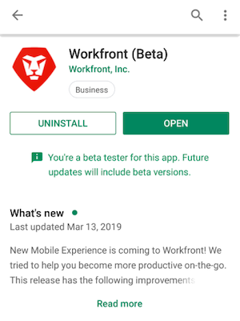

# Devenir bêta-testeur ou bêta-testeuse [!DNL Android]

## Télécharger l’application bêta

Il y a plusieurs façons de devenir bêta-testeur ou bêta-testeuse pour l’application [!DNL Adobe Workfront] :

### [!DNL Google Play] Store

Vous pouvez utiliser le [!DNL Google Play Store] pour rechercher et télécharger l’application :

1. Accédez à l’application [!DNL Play Store] sur votre appareil.
1. Recherchez [!DNL Workfront], puis appuyez dessus lorsqu’il apparaît dans la liste.
Vous devez installer l’application [!DNL Workfront] avant de rejoindre la version bêta.
1. Installez et ouvrez l’application [!DNL Workfront] si vous ne l’avez pas déjà fait.
1. Faites défiler la page vers le milieu, puis appuyez sur **[!UICONTROL S’inscrire maintenant]** dans la section **[!UICONTROL Devenir bêta-testeur ou bêta-testeuse]**.

1. Appuyez sur **[!UICONTROL S’inscrire]** pour confirmer que vous souhaitez devenir bêta-testeur ou bêta-testeuse.\
   Quelques minutes sont nécessaires pour être reconnu en tant qu’utilisateur ou utilisatrice bêta. Vous devrez peut-être rouvrir le [!DNL Play Store] pour afficher les modifications.

1. Une fois la progression terminée, vous recevez la confirmation que vous êtes désormais un utilisateur ou une utilisatrice bêta.\
   Le mot « [!UICONTROL bêta] » apparaît après le nom de votre application dans le [!DNL Play Store] indiquant que vous utilisez la version bêta de l’application.\
   

### Code QR

Vous pouvez également scanner le code QR ci-dessous pour vous inscrire à la version bêta et télécharger l’application :

## Nous faire part de votre retour d’expérience

Pour fournir des commentaires sur l’application bêta ou signaler un problème :

1. Appuyez sur **[!UICONTROL Plus]** dans la barre de navigation inférieure.
1. Appuyez sur votre nom, puis sur **[!UICONTROL Envoyer un commentaire]**.
1. Choisissez **[!UICONTROL Démarrer l’enquête]** pour fournir des commentaires généraux sur l’application.\
   ou\
   Choisissez **[!UICONTROL Signaler un problème]** pour envoyer un ticket à l’équipe d’assistance clientèle de [!DNL Workfront].

## Se désinscrire des tests bêta

Pour arrêter d’effectuer le bêta-test de l’application [!DNL Workfront] :

1. Accédez à l’application [!DNL Play Store] sur votre appareil.
1. Recherchez [!DNL Workfront], puis appuyez dessus lorsqu’il apparaît dans la liste.
1. Faites défiler l’écran vers le bas jusqu’à la section **[!UICONTROL Vous êtes bêta-testeur ou bêta-testeuse]**, puis appuyez sur **[!UICONTROL Quitter]**.\
   Il faut quelques minutes pour être supprimé en tant que bêta-testeur ou bêta-testeuse. Vous devrez peut-être rouvrir le [!DNL Play Store] pour afficher les modifications.
