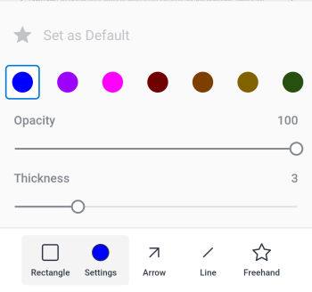

# Commenter sur les épreuves dans [!DNL Android]

Vous pouvez consulter et résoudre des commentaires existants sur une épreuve, ainsi qu’ajouter des commentaires et annotations au document de l’épreuve.

Votre accès pour commenter sur les épreuves est le même que dans [!DNL Adobe Workfront]. Pour plus d’informations sur les fonctionnalités de relecture, voir [Profils d’autorisations d’épreuve dans  [!DNL Workfront Proof]](../../../workfront-proof/wp-acct-admin/account-settings/proof-perm-profiles-in-wp.md).

>[!NOTE]
>
>Si le ou la propriétaire de l’épreuve a verrouillé l’épreuve, vous ne pouvez pas commenter sur celle-ci. Pour plus d’informations, voir [Verrouiller ou déverrouiller une épreuve](../../../workfront-basics/mobile-apps/using-the-workfront-mobile-app/work-with-proofs-in-mobile-app.md#lock) dans l’article [Réviser et prendre des décisions sur les épreuves dans l’application mobile  [!DNL Adobe Workfront] ](../../../workfront-basics/mobile-apps/using-the-workfront-mobile-app/work-with-proofs-in-mobile-app.md).

## Réviser les commentaires existants dans une épreuve

Vous pouvez consulter les commentaires laissés sur un document d’épreuve. Les commentaires sont souvent associés à des dessins pour indiquer la zone du document à laquelle le commentaire fait référence. Les dessins peuvent inclure des flèches, des lignes, des rectangles, une mise en surbrillance et des dessins à main levée.

1. Ouvrez l’épreuve de document. Pour plus d’informations, voir [Examiner les épreuves et prendre des décisions à leur sujet dans l’application mobile  [!DNL Adobe Workfront] ](../../../workfront-basics/mobile-apps/using-the-workfront-mobile-app/work-with-proofs-in-mobile-app.md).
1. Sélectionnez une icône de commentaire sur la page du document  pour ouvrir le commentaire, ainsi que les dessins et pièces jointes associés.

   Si le commentaire comporte plusieurs réponses, vous pouvez sélectionner **[!UICONTROL Afficher les réponses]** pour afficher toutes les réponses, ou faire glisser la feuille de commentaires vers le haut et vers le bas pour afficher davantage de contenu.

1. Pour afficher une pièce jointe sur le commentaire, sélectionnez sa miniature. Suivez les invites pour télécharger le fichier de pièce jointe sur votre appareil.
1. Pour répondre au commentaire, saisissez votre réponse dans la zone de texte située sous le commentaire, puis sélectionnez l’icône **[!UICONTROL Envoyer]** .

### Utiliser la liste des commentaires

1. Pour afficher la liste de tous les commentaires par numéro de page, sélectionnez l’icône de commentaire  dans le coin supérieur droit.

   Le nombre de commentaires non lus est indiqué sur l’icône de commentaire.  Les commentaires non lus dans la liste sont marqués d’un point bleu. Les commentaires accompagnés de pièces jointes comportent une icône de trombone ![[!UICONTROL Pièce jointe] ](assets/mobile-paper-clip-icon.png).

1. Dans la liste, sélectionnez un commentaire individuel pour afficher le commentaire et les dessins associés sur la page du document.
1. Sélectionnez le X pour fermer la liste de commentaires et revenir à l’épreuve.

### Agir sur les commentaires dans la vue de sélection

>[!NOTE]
>
>Les options disponibles dans le menu de la vue de sélection **[!UICONTROL Plus]** peuvent varier en fonction des configurations de votre administration de [!DNL Workfront] ou [!DNL Workfront Proof].

1. Pour afficher d’autres options de commentaire, sélectionnez l’icône ![[!UICONTROL Liste des commentaires] ](assets/mobile-listofcommentsicon-30x27.png) dans le coin supérieur droit de la liste des commentaires.

   Une case à cocher s’affiche en regard de chaque commentaire.

   >[!NOTE]
   >
   >Dans la vue de sélection, vous ne pouvez pas accéder aux commentaires dans le document. Sélectionnez la flèche dans le coin supérieur gauche pour revenir à la liste de commentaires.

1. Pour sélectionner un commentaire individuel, appuyez sur la case à cocher.

   Pour sélectionner tous les commentaires, sélectionnez le menu **[!UICONTROL Plus]** dans le coin supérieur droit  et choisissez **[!UICONTROL Tout sélectionner]**.

1. Pour résoudre le commentaire sélectionné, sélectionnez l’icône ![[!UICONTROL Résoudre le commentaire] ](assets/mobile-resolvecomment-icon-30x30.png) dans le coin supérieur droit.

   Vous ne pouvez résoudre qu’un seul commentaire à la fois. Le commentaire est marqué d’une icône verte pour indiquer qu’il a été résolu.

   Le commentaire d’origine reste sur le document. Une résolution de commentaire s’affiche en réponse au commentaire d’origine : « [!UICONTROL Ce thread a été résolu par [nom].] »

   Vous pouvez annuler la résolution en sélectionnant le commentaire résolu et en cliquant sur l’icône **[!UICONTROL Annuler]** dans le coin supérieur droit.

1. Pour marquer les commentaires sélectionnés comme lus, sélectionnez l’icône **[!UICONTROL Marquer comme lu]** .

   Cette option n’est disponible que si vous avez sélectionné des commentaires non lus.

1. Pour supprimer les commentaires sélectionnés, sélectionnez le menu **[!UICONTROL Plus]** dans le coin supérieur droit  et cliquez sur **[!UICONTROL Supprimer]**. Sélectionnez ensuite **[!UICONTROL Supprimer]** sur le message de confirmation pour supprimer définitivement le commentaire.
1. Sélectionnez la flèche en haut à gauche pour quitter la vue de sélection et revenir à la liste de commentaires.

## Commentaire sur une épreuve

Vous pouvez associer vos commentaires d’épreuves à une zone spécifique du document. Utilisez les outils de dessin pour sélectionner une zone à commenter.

1. Ouvrez l’épreuve de document. Pour plus d’informations, voir [Réviser et prendre des décisions sur les épreuves dans l’application mobile  [!DNL Adobe Workfront] ](../../../workfront-basics/mobile-apps/using-the-workfront-mobile-app/work-with-proofs-in-mobile-app.md).
1. Sélectionnez un outil de dessin dans la barre d’outils située au bas de l’écran de l’épreuve.

   

   Si vous ne voyez pas l’outil dont vous avez besoin, faites défiler la barre d’outils vers la droite.

1. Sélectionnez **[!UICONTROL Paramètres]** en regard du nom de l’outil pour définir la couleur, l’opacité et l’épaisseur. Sélectionnez l’icône en forme d’étoile pour que ces choix soient les paramètres par défaut de l’outil.

   

1. Tracez la forme sur le document de l’épreuve. Sélectionnez l’icône **[!UICONTROL Annuler]**  pour annuler le dessin.
1. (Conditionnel) Sélectionnez la forme et choisissez **[!UICONTROL Paramètres]** pour modifier les paramètres de la forme ou **[!UICONTROL Supprimer]** pour supprimer la forme.

   

1. Sélectionnez **[!UICONTROL Ajouter un commentaire]**.
1. Saisissez le commentaire dans la zone de texte.
1. Pour taguer un contact sur le commentaire, saisissez le symbole @ ou sélectionnez ![[!UICONTROL Taguer un contact]](assets/mobile-tag-user-icon.png) pour ajouter le symbole @. Commencez à saisir le nom du contact que vous souhaitez inclure, puis cliquez sur le nom lorsqu’il apparaît dans la liste déroulante.

   Le contact recevra une notification par e-mail lorsque le commentaire sera ajouté à l’épreuve.

1. Pour ajouter une pièce jointe au commentaire, sélectionnez l’icône ![[!UICONTROL Pièce jointe] ](assets/mobile-paper-clip-icon.png). Choisissez **[!UICONTROL Sélectionner un document]** ou **[!UICONTROL Prendre une photo]**, puis suivez les invites pour joindre le fichier ou la photo au commentaire.

   Cliquez sur le X de la miniature pour supprimer la pièce jointe.

1. Sélectionnez l’icône **[!UICONTROL Envoyer]**  pour ajouter le commentaire et le dessin à l’épreuve.
