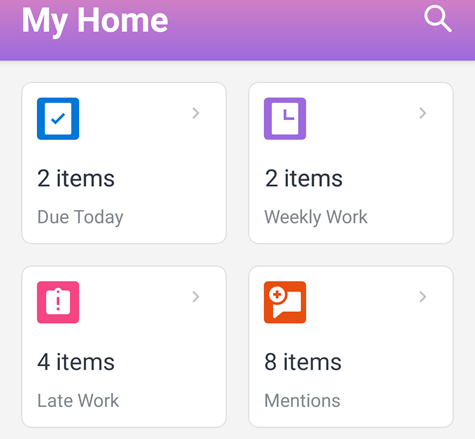

# Widgets de la zone d’[!UICONTROL accueil]

Les widgets de la zone d’accueil pour [!DNL iOS] et [!DNL Android] vous aident à trouver rapidement vos éléments de travail.

**[!UICONTROL Échéance aujourd’hui] :** indique le nombre d’éléments de travail à remettre aujourd’hui. Sélectionnez le widget pour afficher la liste des éléments.

**[!UICONTROL Travail hebdomadaire] :** indique le nombre d’éléments de travail à remettre cette semaine. Sélectionnez le widget pour afficher la liste des éléments.

**[!UICONTROL Travaux en retard] :** indique le nombre d’éléments de travail qui sont en retard (après la date d’achèvement prévue). Sélectionnez le widget pour afficher la liste des éléments.

**[!UICONTROL Mentions] :** indique le nombre de mentions non lues. Une mention est une notification dans laquelle une personne est taguée ou notifiée dans l’onglet [!UICONTROL Mises à jour] pour un objet dans [!DNL Adobe Workfront]. Sélectionnez le widget pour afficher la liste des mentions.
