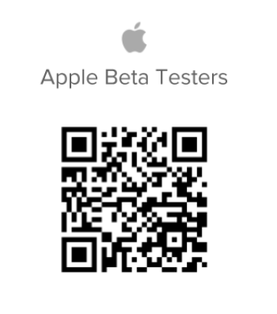

# Devenir Beta-testeur ou Beta-testeuse [!UICONTROL iOS]

## Télécharger l’application Beta

Il existe plusieurs façons de devenir Beta-testeur ou Beta-testeuse pour l’application [!DNL Adobe Workfront] :

### [!DNL App Store]

Vous pouvez utiliser l’[!DNL Apple App Store] pour rechercher et télécharger l’application.

>[!IMPORTANT]
>
>Une fois que vous avez installé l’application [!DNL TestFlight] et que vous êtes Beta-testeur ou Beta-testeuse sur votre appareil [!DNL iOS], vous devez télécharger les versions mises à jour de [!DNL Workfront] à l’aide de l’application [!DNL TestFlight], au lieu de l’[!DNL Apple Store]. Si vous n’êtes pas Beta-testeur ou Beta-testeuse pour [!DNL iOS], vous pouvez continuer à mettre à jour votre application mobile à partir de l’[!DNL Apple Store].

#### &#x200B;1. Installation de l’application [!DNL TestFlight]

Pour installer la version Beta de l’application [!DNL Workfront], vous devez avoir installé l’application [!DNL TestFlight] sur votre appareil. Après avoir installé [!DNL TestFlight], vous devez installer l’application [!DNL Workfront].

1. Installez l’application [!DNL Workfront] si vous ne l’avez pas déjà fait.
1. Ouvrez l’application mobile [!DNL Workfront].
1. Appuyez sur **[!UICONTROL Plus]** dans la barre de navigation inférieure.
1. Appuyez sur votre nom, puis sur **[!UICONTROL Devenir Beta-testeur ou Beta-testeuse]**.
1. Appuyez sur **[!UICONTROL Afficher dans[!DNL App Store]]** pour afficher l’application [!DNL TestFlight].
1. Appuyez sur **[!UICONTROL Obtenir]** pour installer [!DNL TestFlight] sur votre appareil, puis sur **[!UICONTROL Installer]**.
1. Appuyez sur **[!UICONTROL Ouvrir]**, puis sur **[!UICONTROL Continuer]** dans l’application [!DNL TestFlight].
1. Appuyez sur **[!UICONTROL Accepter]** pour accepter les conditions générales de l’application [!DNL TestFlight].\
   L’application [!DNL TestFlight] est installée sur votre appareil. Passez à la section suivante.

#### &#x200B;2. Installation de l’application [!DNL Workfront] Beta dans [!DNL TestFlight]

Vous devez disposer des applications [!DNL Workfront] et [!DNL TestFlight] sur votre appareil iOS avant de pouvoir devenir Beta-testeur ou Beta-testeuse sur un appareil iOS.

1. Ouvrez l’application mobile [!DNL Workfront].
1. Appuyez sur **[!UICONTROL Plus]** dans la barre de navigation inférieure.
1. Appuyez sur votre nom, puis sur **[!UICONTROL Devenir Beta-testeur ou Beta-testeuse]**.\
   L’application [!DNL TestFlight] s’ouvre et [!DNL Workfront] est répertorié en tant qu’application disponible pour le téléchargement.

1. Appuyez sur **[!UICONTROL Accepter]**.
1. Lorsque la mise à jour de l’application est terminée, appuyez sur **[!UICONTROL Ouvrir]**.\
   Votre application [!DNL Workfront] s’ouvre et vous êtes désormais Beta-testeur ou Beta-testeuse pour [!DNL Workfront]. Un point orange s’affiche en regard de l’application mobile Workfront sur votre écran d’accueil pour indiquer que la version Beta est installée sur votre appareil.

### Code QR

Vous pouvez également scanner le code QR ci-dessous pour vous inscrire à la version Beta et télécharger l’application :

## Nous faire part de votre retour d’expérience

Pour fournir des commentaires sur l’application Beta ou signaler un problème :

1. Appuyez sur **[!UICONTROL Plus]** dans la barre de navigation inférieure.
1. Appuyez sur votre nom, puis sur **[!UICONTROL Envoyer un commentaire]**.
1. Choisissez **[!UICONTROL Démarrer l’enquête]** pour fournir des commentaires généraux sur l’application.\
   ou\
   Choisissez **[!UICONTROL Signaler un problème]** pour envoyer un ticket à l’équipe d’assistance clientèle [!DNL Workfront].

## Mettez à jour l’application Beta [!DNL Workfront].

Si votre inscription en tant que Beta-testeur ou Beta-testeuse est effective, vous devez mettre à jour l’application [!DNL Workfront] dans [!DNL TestFlight] pour accéder aux nouvelles fonctionnalités disponibles en version Beta.

1. Ouvrez l’application [!DNL TestFlight].
1. Appuyez sur **[!UICONTROL Mettre à jour]**.

## Se désinscrire des tests Beta

1. Ouvrez l’application [!DNL TestFlight].
1. Appuyez sur l’icône [!DNL Workfront].
1. Au bas de la page, appuyez sur **[!UICONTROL Arrêter le test]**.
