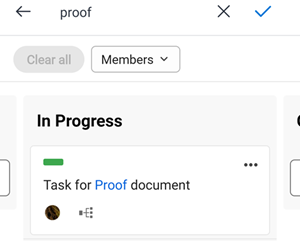

# [!DNL Adobe Workfront] [!UICONTROL Panoramas] pour mobile

[!DNL Adobe Workfront] [!UICONTROL Panoramas] sont des outils flexibles qui permettent la collaboration des équipes en permettant l’accès à un panorama partagé contenant des colonnes et des cartes. Pour plus d’informations sur les panoramas, voir [Présentation des panoramas](/help/quicksilver/agile/boards-overview.md).

Dans le [!DNL Workfront] application mobile, vous pouvez voir tous les panoramas que vous avez créés ou auxquels vous avez été ajouté dans la version pour ordinateur de bureau de [!DNL Workfront]. Vous ne pouvez pas créer de panorama dans l’application mobile.

Toute modification apportée aux colonnes et aux cartes du panorama dans l’application est également répercutée dans la version de bureau du panorama.

Pour fournir des commentaires sur les panoramas mobiles, sélectionnez la variable **[!UICONTROL Envoyer]**  en haut d’un panorama et suivez les invites.

## Affichage et filtrage de la liste des panoramas

1. Sélectionner [!UICONTROL **Panoramas**] sur la page d’accueil pour afficher la liste de tous les panoramas que vous avez créés ou auxquels vous avez été ajouté dans la version pour ordinateur de bureau de [!DNL Workfront].

   

1. Pour trier ou filtrer la liste des panoramas, sélectionnez [!UICONTROL **Plus de filtres**].
1. Sélectionnez l’une des options suivantes :

   * Dans la section Filtre , sélectionnez [!UICONTROL **Archivé**] pour afficher les panoramas archivés dans la liste. Seuls les principaux panoramas sont affichés par défaut.
   * Dans la section Tri , sélectionnez [!UICONTROL **Date de modification**] ou [!UICONTROL **Nom**].
   * Dans la section Ordre, sélectionnez [!UICONTROL **ascendant**] ou [!UICONTROL **Descendant**] pour définir l’ordre de tri.

1. Sélectionner [!UICONTROL **Appliquer**] ou  pour appliquer les filtres et revenir à la liste des panoramas.

   Vous pouvez accéder à ces options à tout moment pour les modifier ou revenir aux paramètres par défaut.

1. Pour ouvrir un panorama, sélectionnez-le dans la liste.

>[!NOTE]
>
>Actuellement, vous pouvez uniquement archiver ou supprimer un panorama à partir de la version de bureau de [!DNL Workfront] [!UICONTROL Panoramas], et non à partir de l’application mobile.

## Affichage du contenu du panorama

Lorsque vous ouvrez un panorama, ses colonnes et ses cartes s’affichent. Faites défiler horizontalement pour afficher toutes les colonnes et faites défiler verticalement pour afficher toutes les cartes d’une colonne.

Sélectionnez une carte et maintenez-la enfoncée pour la déplacer vers une autre colonne.

Si le panorama contient une colonne d’entrée, elle apparaît comme la colonne la plus à gauche. Les cartes de la colonne d’entrée ne peuvent pas être modifiées tant que vous ne les déplacez pas dans d’autres colonnes de la carte. Vous pouvez sélectionner une carte pour ouvrir la tâche ou le problème. Les filtres de colonne d’entrée sont contrôlés dans la version de bureau du panorama. Pour plus d’informations, voir [Ajout d’une colonne d’ingestion à un panorama](/help/quicksilver/agile/use-boards-agile-planning-tools/add-intake-column-to-board.md).

## Utilisation de cartes connectées

Une carte connectée est connectée à une tâche existante ou un problème dans [!DNL Workfront]. Dans l’application mobile, une carte connectée est désignée avec la variable  icône . Dans l’image ci-dessous, la deuxième carte est une carte connectée.

Lorsque l’un des détails suivants est mis à jour pour la carte à un emplacement donné, il est automatiquement mis à jour à l’autre emplacement :

* [!UICONTROL Nom]
* [!UICONTROL Description]
* [!UICONTROL Cessionnaires]
* [!UICONTROL Statut]

Par exemple, si vous mettez à jour le nom d’une carte connectée sur un panorama de l’application mobile, il est également mis à jour sur la tâche ou le problème.

1. Sélectionnez une carte pour afficher son nom, sa description, sa colonne, les personnes désignées, la connexion, l’état, l’échéance, l’estimation, les balises et les éléments de liste de contrôle. Lorsque vous modifiez l’un de ces détails, ils sont enregistrés automatiquement. Sélectionnez le X pour fermer la carte et revenir au panorama.

   >[!NOTE]
   >
   >Vous pouvez sélectionner une autre balise sur la carte, mais vous ne pouvez pas en créer de nouvelles dans l’application mobile.

1. (Facultatif) Pour supprimer une carte, sélectionnez l’option [!UICONTROL **Plus**] menu  sur la carte et choisissez [!UICONTROL **Supprimer**]. Sélectionnez ensuite [!UICONTROL **Supprimer**] sur le message de confirmation.

## Utilisation de cartes ad hoc

Une carte ad hoc n’est pas connectée à une tâche ou à un problème Workfront. Dans l’image ci-dessous, la première carte est une carte ad hoc.

1. Sélectionnez une carte pour afficher son nom, sa description, sa colonne, les personnes désignées, son état, l’échéance, l’estimation, les balises et les éléments de liste de contrôle. Lorsque vous modifiez l’un de ces détails, ils sont enregistrés automatiquement. Sélectionnez le X pour fermer la carte et revenir au panorama.

   >[!NOTE]
   >
   >Vous pouvez sélectionner une autre balise sur la carte, mais vous ne pouvez pas en créer de nouvelles dans l’application mobile.

1. (Facultatif) Pour ajouter une nouvelle carte ad hoc, sélectionnez [!UICONTROL **Nouvelle carte**] dans la colonne où vous souhaitez ajouter la carte, puis saisissez le nom de la carte. Pour ajouter des détails, sélectionnez la carte nouvellement ajoutée.

1. (Facultatif) Pour copier une carte, sélectionnez l’option [!UICONTROL **Plus**] menu  sur la carte et choisissez [!UICONTROL **Copier**].

1. (Facultatif) Pour supprimer une carte, sélectionnez l’option [!UICONTROL **Plus**] menu  sur la carte et choisissez [!UICONTROL **Supprimer**]. Sélectionnez ensuite [!UICONTROL **Supprimer**] sur le message de confirmation.

## Gérer les éléments de liste de contrôle sur les cartes

Les éléments de liste de contrôle sont disponibles sur les cartes ad hoc et connectées.

1. Pour ajouter un élément de liste de contrôle, ouvrez la carte et sélectionnez [!UICONTROL **Nouvel élément de liste de contrôle**]. Saisissez le nom de l’élément de liste de contrôle. Le compteur sur la carte est mis à jour.
1. (Facultatif) Pour copier un élément de liste de contrôle, ouvrez la carte, sélectionnez l’option [!UICONTROL **Plus**] menu  sur l’élément, puis choisissez [!UICONTROL **Copier**]. Une copie de l’élément est ajoutée au bas de la liste.
1. (Facultatif) Pour supprimer un élément de liste de contrôle, ouvrez la carte, sélectionnez l’option [!UICONTROL **Plus**] menu  sur l’élément, puis choisissez [!UICONTROL **Supprimer**].
1. Pour remplir un élément de liste de contrôle, ouvrez la carte et cochez la case en regard du nom de l’élément.
L’élément est marqué comme terminé, le compteur sur la carte se met à jour pour afficher le nombre d’éléments de liste de contrôle terminés.

## Filtrage et recherche dans un panorama

Vous pouvez filtrer un panorama pour afficher les cartes qui lui sont affectées ou rechercher une carte spécifique dans le panorama.

Lorsque des filtres sont appliqués, un indicateur s’affiche sur le panorama. . Sélectionnez l’icône de filtre et choisissez [!UICONTROL **Effacer tout**] pour supprimer tous les filtres du panorama.

### Filtrage d’un panorama par personne désignée

1. Sélectionner l’icône de filtrage et de recherche .
1. Sélectionner [!UICONTROL **Membres**] et choisissez la ou les personnes dont vous souhaitez voir les cartes. Vous pouvez également afficher les cartes non affectées.
1. Sélectionner [!UICONTROL **Terminé**] ou .

### Filtrage d’un panorama par balises ([!DNL iOS] uniquement)

1. Sélectionner l’icône de filtrage et de recherche .
1. Sélectionner [!UICONTROL **Balises**] et sélectionnez les balises à afficher.
1. Sélectionner [!UICONTROL **Terminé**].

### Recherche dans un panorama

1. Sélectionner l’icône de filtrage et de recherche .
1. Saisissez un terme de recherche dans la zone et sélectionnez [!UICONTROL **Terminé**] ou .

   Toutes les cartes qui contiennent le terme recherché dans le titre s’affichent.
Sélectionnez le X pour effacer la recherche.

   
