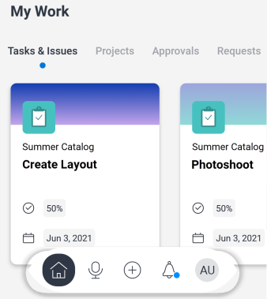

# Section [!UICONTROL Mon travail] dans l’application mobile

La section [!UICONTROL Mon travail] de la zone [!UICONTROL Accueil] affiche vos tâches, problèmes, projets, approbations, demandes et feuilles de temps.

>[!NOTE]
>
>[!UICONTROL Mon travail] dans l’application mobile est distinct de [!UICONTROL Mon travail] sur la version de bureau de [!UICONTROL Adobe Workfront].

## Personnaliser la section [!UICONTROL Mon travail]

Vous pouvez choisir les éléments de menu à afficher dans [!UICONTROL Mon travail] et modifier l’ordre des éléments.

1. Dans le menu flottant, appuyez sur votre photo ou vos initiales pour accéder à votre profil.
1. Faites défiler l’écran jusqu’à la section **[!UICONTROL Configuration]** et appuyez sur **[!UICONTROL Paramètres]**.
1. Sur la page **[!UICONTROL Paramètres]**, sélectionnez et faites glisser les éléments de menu dans l’ordre approprié pour la zone [!UICONTROL Accueil].
1. Appuyez sur l’icône de bouton bleu pour masquer les éléments de menu que vous ne souhaitez pas afficher. Appuyez sur l’icône de basculement gris pour afficher à nouveau l’élément.

   >[!NOTE]
   >
   >L’option de menu [!UICONTROL Tâches et problèmes] est toujours affichée et vous ne pouvez pas la masquer.

   
