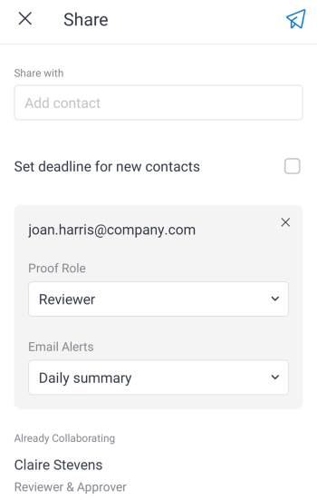

# Partager et télécharger des épreuves dans l’application mobile [!DNL Adobe Workfront]

Vous pouvez partager un document d’épreuve avec des destinataires internes et externes directement à partir de l’application mobile. Vous pouvez également télécharger un document d’épreuve sur votre appareil mobile.

>[!NOTE]
>
>Tous les destinataires doivent avoir accès à [!DNL Workfront] pour réviser les épreuves. Pour plus d’informations sur les licences et les niveaux d’accès, voir [Profils d’autorisations d’épreuves dans  [!DNL Workfront Proof]](../../../workfront-proof/wp-acct-admin/account-settings/proof-perm-profiles-in-wp.md).

## Partager l’épreuve

Cette option envoie un e-mail contenant un lien d’épreuve unique à un contact depuis [!DNL Workfront Proof]. Vous pouvez également ajouter un nouveau contact enregistré dans vos contacts d’épreuve.

1. Ouvrez l’épreuve de document et sélectionnez le menu **[!UICONTROL Plus]**  dans le coin supérieur droit du document. Sélectionnez ensuite **[!UICONTROL Plus]**.
1. Sélectionnez **[!UICONTROL Partager]**.
1. Commencez à saisir le nom du contact dans la zone **[!UICONTROL Partager avec]**, puis sélectionnez le contact dans la liste.

   Ou

   Si la personne n’est pas répertoriée, saisissez son adresse e-mail dans la zone **[!UICONTROL Partager avec]** et sélectionnez **[!UICONTROL Ajouter une personne destinataire]** pour l’ajouter.

1. Sélectionnez le **[!UICONTROL rôle de l’épreuve]** pour la personne destinataire.\
   Pour plus d’informations sur les rôles d’épreuve, voir [Vue d’ensemble des rôles d’épreuve](../../../review-and-approve-work/proofing/proofing-overview/proof-roles.md).
1. Sélectionnez les **[!UICONTROL alertes par e-mail]** que la personne destinataire doit recevoir.\
   Pour plus d’informations sur les alertes par email pour les épreuves, voir [Modifier les paramètres d’alerte par e-mail pour une épreuve dans  [!DNL Workfront Proof]](../../../workfront-proof/wp-emailsntfctns/email-alerts/change-email-alert-settings-wp.md) et [Configurer les paramètres de notification par e-mail dans  [!DNL Workfront Proof]](../../../workfront-proof/wp-emailsntfctns/email-alerts/config-email-notification-settings-wp.md).

   

1. Pour ajouter une autre personne destinataire, répétez les étapes 3 à 5.
1. Pour choisir une date d’échéance pour toutes les personnes destinataires afin de réviser l’épreuve, sélectionnez **[!UICONTROL Définir la date limite pour les nouveaux contacts]**. Sélectionnez ensuite une date sur le calendrier.
1. Sélectionnez l’icône **[!UICONTROL Envoyer]**  pour envoyer l’e-mail aux personnes destinataires.

## Envoyer un lien vers l’épreuve

Cette option copie dans le presse-papiers un lien que vous pouvez coller dans un e-mail. Vous pouvez ensuite envoyer l’e-mail avec le lien de l’épreuve à une personne destinataire interne ou externe.

1. Ouvrez l’épreuve de document et sélectionnez le menu **[!UICONTROL Plus]**  dans le coin supérieur droit du document. Sélectionnez ensuite **[!UICONTROL Plus]**.
1. Sélectionnez **[!UICONTROL Envoyer une copie]**.
1. Sélectionnez **[!UICONTROL Copier dans le presse-papiers]**.
1. Ouvrez votre messagerie et collez le lien de l’épreuve dans le corps de l’e-mail.
1. Envoyez l’e-mail aux personnes destinataires avec lesquelles vous souhaitez partager l’épreuve.

## Partager l’épreuve avec une URL publique

Cette option envoie un e-mail avec un lien d’épreuve public à un contact depuis [!DNL Workfront Proof]. Si nécessaire, vous pouvez ajouter un nouveau contact. Vous pouvez choisir d’envoyer une URL publique, un lien téléchargeable ou les deux.

1. Ouvrez l’épreuve de document et sélectionnez le menu **[!UICONTROL Plus]**  dans le coin supérieur droit du document. Sélectionnez ensuite **[!UICONTROL Plus]**.
1. Sélectionnez **[!UICONTROL Partager avec l’URL publique]**.
1. Commencez à saisir le nom du contact dans la zone **[!UICONTROL Partager avec]**, puis sélectionnez le contact dans la liste.

   Ou

   Si la personne n’est pas répertoriée, saisissez son adresse e-mail dans la zone **[!UICONTROL Partager avec]** et sélectionnez **[!UICONTROL Ajouter une personne destinataire]** pour l’ajouter.

   Répétez cette étape pour ajouter une autre personne destinataire.

1. Sélectionnez **[!UICONTROL Envoyer un lien public]** pour permettre aux personnes destinataires d’ouvrir le document d’épreuve dans [!DNL Workfront Proof].
1. Sélectionnez **[!UICONTROL Envoyer un lien téléchargeable]** pour permettre aux personnes destinataires de télécharger le document d’épreuve.

   ![[!UICONTROL Écran Partager avec l’URL publique]](assets/mobile-sharepublicurl-proof-350x296.png)

1. Sélectionnez l’icône **[!UICONTROL Envoyer]**  pour envoyer l’e-mail aux personnes destinataires.

## Télécharger l’épreuve

Vous pouvez télécharger une copie du document de BAT sur votre appareil mobile. Notez que même si vous ne pouvez pas prévisualiser les fichiers vidéo, vous pouvez toujours les télécharger.

1. Ouvrez l’épreuve de document et sélectionnez le menu **[!UICONTROL Plus]**  dans le coin supérieur droit du document. Sélectionnez ensuite **[!UICONTROL Plus]**.
1. Sélectionnez **[!UICONTROL Télécharger]**.
1. Suivez les instructions de votre appareil pour terminer le téléchargement et ouvrir le fichier du document.
