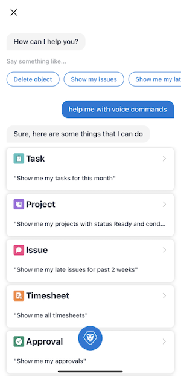

# Assistant virtuel de l’application mobile [!DNL Adobe Workfront]

Utilisez l’assistant virtuel de l’application mobile [!DNL Adobe Workfront] pour localiser, supprimer et rechercher des informations dans [!DNL Workfront]. En outre, vous pouvez épingler des commandes et des requêtes d’assistant virtuel pour accéder aux résultats à tout moment.

## Commandes disponibles

Utilisez les commandes vocales suivantes pour gérer le travail dans l’application mobile :

* [[!UICONTROL Me montrer], [!UICONTROL Trouver], [!UICONTROL Rechercher]](#show-me-find-search-for)
* [[!UICONTROL Supprimer]](#delete)
* [[!UICONTROL Aide sur les commandes]](#help-me-with-commands)

### [!UICONTROL Me montrer], [!UICONTROL Trouver], [!UICONTROL Rechercher]

Utilisez la commande [!UICONTROL Me montrer] pour afficher des informations sur les objets suivants :

<table style="table-layout:auto"> 
 <col> 
 <col> 
 <col> 
 <col> 
 <tbody> 
  <tr> 
   <td> </td> 
   <td>Date</td> 
   <td>[!UICONTROL Status]</td> 
   <td>[!UICONTROL Condition]</td> 
  </tr> 
  <tr> 
   <td> 
Tâche
 </td> 
   <td>Oui</td> 
   <td>Oui</td> 
   <td>Oui</td> 
  </tr> 
  <tr> 
   <td>Problème</td> 
   <td>Oui</td> 
   <td>Oui</td> 
   <td>Oui</td> 
  </tr> 
  <tr> 
   <td>Projet</td> 
   <td>Oui</td> 
   <td>Oui</td> 
   <td>Oui</td> 
  </tr> 
  <tr> 
   <td>Feuille de temps</td> 
   <td>Oui</td> 
   <td>Oui</td> 
   <td>Non</td> 
  </tr> 
  <tr> 
   <td>Equipe</td> 
   <td>Non</td> 
   <td>Non</td> 
   <td>Non</td> 
  </tr> 
  <tr> 
   <td>Approbation</td> 
   <td>Oui</td> 
   <td>Non</td> 
   <td>Non</td> 
  </tr> 
  <tr> 
   <td>Programme</td> 
   <td>Oui</td> 
   <td>Non</td> 
   <td>Non</td> 
  </tr> 
  <tr> 
   <td>Portfolio</td> 
   <td>Oui</td> 
   <td>Non</td> 
   <td>Non</td> 
  </tr> 
  <tr> 
   <td>Rapport</td> 
   <td>Oui</td> 
   <td>Non</td> 
   <td>Non</td> 
  </tr> 
  <tr> 
   <td>Tableau de bord</td> 
   <td>Oui</td> 
   <td>Non</td> 
   <td>Non</td> 
  </tr> 
 </tbody> 
</table>

#### Exemples

<table style="table-layout:auto"> 
 <col> 
 <col> 
 <tbody> 
  <tr> 
   <td colspan="2"><strong>Rechercher dans mes objets</strong> </td> 
  </tr> 
  <tr> 
   <td> 
    <ul> 
     <li>Me montrer mes tâches</li> 
     <li> Me montrer mes problèmes </li> 
     <li>Me montrer mes équipes </li> 
     <li>Me montrer mes tâches pour les deux dernières semaines </li> 
     <li>Me montrer mes projets pour 2020</li> 
     <li> Me montrer mes problèmes pour le 1er avril </li> 
     <li>Me montrer mes feuilles de temps pour le mois d’août </li> 
    </ul> </td> 
   <td> 
    <ul> 
     <li>Me montrer mes tâches avec le statut [!UICONTROL In Progress] </li> 
     <li>Me montrer mes problèmes avec le statut [!UICONTROL Some Concerns] </li> 
     <li>Me montrer mes projets avec le statut [!UICONTROL Planning] et le statut [!UICONTROL On Target] </li> 
     <li>Me montrer mes problèmes avec le statut [!UICONTROL New] et [!UICONTROL In Progress] </li> 
     <li>Me montrer mes feuilles de temps avec le statut [!UICONTROL Open] pour 2019 </li> 
     <li>Me montrer mes projets avec le statut [!UICONTROL On Hold] et le statut [!UICONTROL At Risk] pour ce mois-ci. </li> 
    </ul> </td> 
  </tr> 
  <tr> 
   <td colspan="2"><strong>Rechercher des projets dont je suis propriétaire ou sur lesquels je travaille</strong> </td> 
  </tr> 
  <tr> 
   <td> 
    <ul> 
     <li>Me montrer les projets dont je suis propriétaire </li> 
     <li>Me montrer les projets sur lesquels je travaille </li> 
     <li>Me montrer les projets dont je suis propriétaire avec le statut [!UICONTROL Planning] </li> 
    </ul> </td> 
   <td> 
    <ul> 
     <li>Me montrer les projets sur lesquels je travaille avec le statut [!UICONTROL On Target] </li> 
     <li>Me montrer les projets dont je suis propriétaire pour la semaine dernière </li> 
     <li>Me montrer les projets sur lesquels je travaille avec la condition [!UICONTROL On Target] pour le mois de mars dernier </li> 
    </ul> </td> 
  </tr> 
  <tr> 
   <td colspan="2"><strong>Rechercher mes tâches personnelles</strong></td> 
  </tr> 
  <tr> 
   <td> 
    <ul> 
     <li>Me montrer mes tâches personnelles </li> 
     <li>Me montrer mes tâches personnelles avec le statut [!UICONTROL In Progress] </li> 
    </ul> </td> 
   <td> 
    <ul> 
     <li>Me montrer mes tâches personnelles avec le statut [!UICONTROL Going Smoothly] </li> 
     <li>Me montrer mes tâches personnelles avec le statut [!UICONTROL In Progress] le 26 avril </li> 
    </ul> </td> 
  </tr> 
  <tr> 
   <td colspan="2"><strong>Rechercher mes éléments en retard</strong></td> 
  </tr> 
  <tr> 
   <td> 
    <ul> 
     <li>Afficher mes éléments en retard </li> 
     <li>Me montrer mes éléments en retard pour août 2020 </li> 
     <li>Me montrer mes tâches en retard </li>
     <li>Me montrer mes problèmes en retard </li> 
    </ul> </td> 
   <td> 
    <ul> 
     <li>Me montrer mes tâches en retard avec le statut [!UICONTROL New] </li> 
     <li>Me montrer mes problèmes en retard avec le statut [!UICONTROL In Progress] </li> 
     <li>Me montrer mes problèmes en retard avec le statut [!UICONTROL Going Smoothly] pour les deux derniers jours </li> 
     <li>Me montrer mes tâches en retard avec le statut [!UICONTROL Complete] pour le 26 mars </li> 
    </ul> </td> 
  </tr> 
  <tr> 
   <td colspan="2"><strong>Recherchez des objets par cessionnaire (Personne/Équipe). Disponible uniquement sur les appareils [!DNL iOS].</strong></td> 
  </tr> 
  <tr> 
   <td> 
    <ul> 
     <li>Me montrer les problèmes qui me sont affectés </li> 
     <li>Me montrer les problèmes affectés à Helen </li> 
     <li>Me montrer les problèmes affectés à l’équipe [!UICONTROL Android] </li> 
     <li>Me montrer les tâches affectées à « Helen » </li> 
     <li>Me montrer les tâches affectées à l’équipe « [!DNL Android] » </li> 
    </ul> </td> 
   <td> 
    <ul> 
     <li>Me montrer les projets affectés à Helen </li> 
     <li>Me montrer les projets affectés à l’équipe [!DNL Android] </li> 
     <li>Me montrer l’élément (projet, tâche ou problème) sur lequel travaille actuellement l’équipe [!DNL Android] </li> 
     <li>Me montrer le programme/le portfolio affecté à/détenu par Helen </li> 
     <li>Me montrer les utilisateurs et utilisatrices/personnes/personnes membres de l’équipe [!DNL Android] </li> 
    </ul> </td> 
  </tr> 
 </tbody> 
</table>

### [!UICONTROL Supprimer]

Utilisez la commande delete pour supprimer les types d’objets suivants :

* Tâche
* Problème
* Document
* Feuille de temps

#### Exemples

<table style="table-layout:auto"> 
 <col> 
 <col> 
 <tbody> 
  <tr> 
   <td colspan="2"><strong>Supprimer un objet</strong></td> 
  </tr> 
  <tr> 
   <td> 
    <ul> 
     <li>Supprimer un objet</li> 
     <li>Supprimer tâche</li> 
     <li>Supprimer l’objet actif* * disponible uniquement à partir de l’écran [!UICONTROL Details]</li> 
    </ul> </td> 
   <td> 
    <ul> 
     <li>Supprimer l’objet nommé Marketing</li> 
     <li>Supprimer la tâche nommée design review (révision de la conception)</li> 
    </ul> </td> 
  </tr> 
 </tbody> 
</table>

### Aide sur les commandes

Utilisez la commande d’aide pour afficher une liste des commandes disponibles directement dans l’application mobile.

## Commandes épinglées

Utilisez la fonctionnalité épingle pour accéder aux commandes enregistrées de l’assistant virtuel, ainsi qu’aux épingles de votre navigateur web. Une fois que vous avez épinglé une commande, vous pouvez y accéder à tout moment à partir de la zone [!UICONTROL Épingle].

### Assistant virtuel (VA)

La section VA de la page [!UICONTROL Épingle] vous permet d’enregistrer les commandes vocales pour y accéder ultérieurement.

Pour épingler une commande, procédez comme suit :

1. Saisissez votre commande, puis appuyez sur l’icône **[!UICONTROL Épingle]** sur la page Résultats.

### Navigateur web

La section [!UICONTROL Web] de la page [!UICONTROL Épingle] vous permet d’accéder aux objets que vous avez épinglés dans votre navigateur web. Si l’objet épinglé est pris en charge dans l’application mobile, il s’y ouvre en premier. S’il n’est pas pris en charge, il lance un navigateur web.
