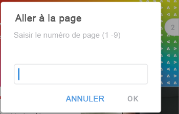

# Réviser et prendre des décisions sur les épreuves dans l’application mobile [!DNL Adobe Workfront]

Lorsqu’une épreuve vous est assignée pour approbation, elle apparaît dans votre liste d’approbations dans l’application mobile. Vous pouvez réviser l’épreuve directement dans l’application et prendre une décision dessus. Pour plus d’informations sur la révision et la validation des épreuves dans [!DNL Adobe Workfront], voir [Réviser des épreuves dans  [!DNL Adobe Workfront]](../../../review-and-approve-work/proofing/reviewing-proofs-within-workfront/review-proofs-in-wf.md).

Vous pouvez ajouter des commentaires à l’épreuve et passer par un processus de révision avant de prendre une décision finale. Pour plus d’informations sur les commentaires, voir [Commenter des épreuves dans  [!DNL iOS]](../../../workfront-basics/mobile-apps/using-the-workfront-mobile-app/comment-on-proofs-ios.md) ou [Commenter des épreuves dans  [!DNL Android]](../../../workfront-basics/mobile-apps/using-the-workfront-mobile-app/comment-on-proofs-android.md).

Votre accès à la révision et à l’approbation des épreuves est le même que dans [!DNL Adobe Workfront]. Pour plus d’informations sur les fonctionnalités de relecture, voir [Profils d’autorisation pour l’épreuve dans  [!DNL Workfront Proof]](../../../workfront-proof/wp-acct-admin/account-settings/proof-perm-profiles-in-wp.md).

## Ouvrir et réviser une épreuve

1. Ouvrez la tâche d’approbation de l’épreuve :

   * Sélectionnez la tâche d’approbation de l’épreuve dans la zone [!UICONTROL Approbations] de [!UICONTROL Mon travail].

     \
      Ou

   * Sélectionnez **[!UICONTROL Afficher toutes les approbations]** dans la zone [!UICONTROL Approbations] de [!UICONTROL Mon travail]. Sélectionnez ensuite la tâche d’approbation de l’épreuve dans la liste de toutes les approbations.

     Pour plus d’informations sur [!UICONTROL Mon travail] dans l’application mobile, voir la section [[!UICONTROL Mon travail] dans l’application mobile](../../../workfront-basics/mobile-apps/using-the-workfront-mobile-app/my-work-section-mobile.md).

1. Sur la page Détails, sélectionnez **[!UICONTROL Accéder à l’épreuve]**.

   

   >[!NOTE]
   >
   >Les épreuves vidéo ne peuvent être ouvertes que dans l’application mobile iOS. Cette fonctionnalité n’est pas encore disponible pour Android.

1. Révisez l’épreuve de document.
1. (Facultatif) Sélectionnez l’![[!UICONTROL icône Une seule page]](assets/mobile-proofpagingicon1-25x36.png) en haut à droite du document pour basculer de la vue sur une seule page à la vue continue. Sélectionnez l’![[!UICONTROL icône Page continue]](assets/mobile-proofpagingicon2-25x25.png) pour revenir à la vue sur une seule page.

   Dans la vue sur une seule page, faites défiler vers la droite et la gauche pour parcourir les pages du document. Dans la vue continue, faites défiler vers le haut et vers le bas pour parcourir les pages.

1. (Facultatif) Accédez à une page spécifique à l’aide de l’indicateur de défilement situé à droite :

   1. Appuyez sur l’indicateur de défilement.
   1. Saisissez le numéro de page dans la zone [!UICONTROL Aller à la page] et sélectionnez **[!UICONTROL OK]**.
   1. 

1. Sélectionnez la flèche en haut à gauche du document pour revenir à la page [!UICONTROL Détails].
1. (Facultatif) Sur la page [!UICONTROL Détails], sélectionnez **[!UICONTROL Mises à jour]** pour afficher toutes les mises à jour de l’épreuve, telles que le moment où elle a été créée et lorsqu’elle a été envoyée pour approbation.

## Verrouiller et déverrouiller une épreuve

Toute personne affectée en tant que personne propriétaire, autrice, ou modératrice d’une épreuve peut verrouiller une épreuve pour empêcher d’autres personnes de la commenter ou de prendre des décisions sur celle-ci.

### Verrouiller une épreuve

1. Ouvrez l’épreuve de document et sélectionnez le menu **[!UICONTROL Plus]**  dans le coin supérieur droit du document. Sélectionnez ensuite **[!UICONTROL Plus]**.
1. Sélectionnez **[!UICONTROL Verrouiller le document]**.\
   Un indicateur « [!UICONTROL Verrouillé] » s’affiche en haut du document.

### Déverrouiller une épreuve

1. Ouvrez l’épreuve de document et sélectionnez le menu **[!UICONTROL Plus]**  dans le coin supérieur droit du document. Sélectionnez ensuite **[!UICONTROL Plus]**.
1. Sélectionnez **[!UICONTROL Déverrouiller le document]**.
1. Sélectionnez **[!UICONTROL Déverrouiller]** dans le message de confirmation.

## Prendre des décisions sur une épreuve

Après avoir révisé l’épreuve de document, vous pouvez prendre une décision dans l’épreuve elle-même. Si la personne propriétaire de l’épreuve a verrouillé l’épreuve, vous ne pouvez pas prendre de décision.

### Prendre une décision dans l’épreuve

1. Ouvrez l’épreuve de document.
1. Sélectionnez l’icône de décision ![[!UICONTROL Icône de décision] ](assets/mobile-proofcheckmarkdecisionicon-30x30.png) en haut à droite du document.
1. Sélectionnez une décision dans la zone [!UICONTROL Prendre une décision].

   Quelques options de décision courantes sont présentées ci-dessous. L’administrateur ou l’administratrice [!DNL Adobe Workfront] ou l’administrateur ou l’administratrice [!UICONTROL Workfront Proof] peut configurer la liste des options de décision. Pour plus d’informations sur la manière dont les administrateurs et les administratrices peuvent configurer les décisions, voir [Configurer les options de décision d’approbation dans Workfront Proof](../../../workfront-proof/wp-acct-admin/account-settings/configure-approval-decision-in-wp.md).

   <table style="table-layout:auto"> 
    <col> 
    <col> 
    <tbody> 
     <tr> 
      <td role="rowheader"><strong>[!UICONTROL Approved]</strong></td> 
      <td>L’épreuve est prête à passer à l’étape suivante du workflow.</td> 
     </tr> 
     <tr> 
      <td role="rowheader"><strong>[!UICONTROL Approved with changes]</strong></td> 
      <td> 
L’épreuve nécessite quelques modifications, mais vous n’avez pas besoin de voir la révision avant qu’elle ne passe à l’étape suivante du workflow.
 </td> 
     </tr> 
     <tr> 
      <td role="rowheader"><strong>[!UICONTROL Rejected]</strong></td> 
      <td>L’épreuve est refusée et n’avancera pas dans le workflow.</td> 
     </tr> 
    </tbody> 
   </table>

1. (Le cas échéant) Si l’administrateur ou l’administratrice [!DNL Adobe Workfront] ou [!DNL Workfront Proof] a ajouté une liste de [!UICONTROL Motifs], sélectionnez les motifs applicables à votre décision.

   Certains motifs peuvent également nécessiter des commentaires afin d’expliquer pourquoi vous les avez choisis.

   Pour plus d’informations sur la manière dont les administrateurs et les administratrices peuvent configurer les motifs, voir [Configurer les options de décision d’approbation dans  [!DNL Workfront Proof]](../../../workfront-proof/wp-acct-admin/account-settings/configure-approval-decision-in-wp.md).

1. Sélectionnez **[!UICONTROL Soumettre]**.

### Modifier votre décision dans l’épreuve

1. Ouvrez l’épreuve de document.
1. Sélectionnez l’icône de décision ![[!UICONTROL Icône de décision] ](assets/mobile-proofcheckmarkdecisionicon-30x30.png) en haut à droite du document.

   La zone [!UICONTROL Prendre une décision] affiche votre décision actuelle.

1. Sélectionnez une autre décision ou choisissez **[!UICONTROL Effacer la sélection]** pour supprimer la décision.

   Pour les décisions avec des motifs, vous pouvez choisir un autre motif ou supprimer le motif.

1. Sélectionnez **[!UICONTROL Soumettre]**.
