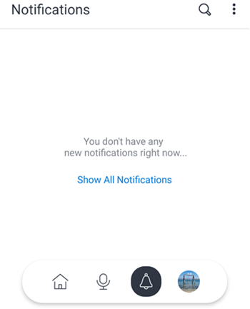

# [!DNL Adobe Workfront] pour [!DNL iOS]

L’application [!DNL Adobe Workfront] vous permet d’accéder à votre travail sur n’importe quel appareil [!DNL iOS]. Vous pouvez installer et utiliser l’application mobile [!DNL Workfront] sur téléphones et tablettes exécutant iOS 10 ou une version ultérieure. Une application mobile [!DNL Workfront] dédiée est disponible pour [!DNL iPhone] et [!DNL iPad].

Pour plus d’informations sur la connexion à l’application mobile, voir la section [Se connecter à l’application mobile [!UICONTROL Workfront]](../../../workfront-basics/manage-your-account-and-profile/managing-your-workfront-account/log-in-to-workfront.md#log) dans l’article [Se connecter à  [!DNL Adobe Workfront]](../../../workfront-basics/manage-your-account-and-profile/managing-your-workfront-account/log-in-to-workfront.md).

## [!UICONTROL Accueil]

La zone [!UICONTROL Accueil] vous permet de travailler directement sur les tâches, les problèmes et les approbations qui vous sont affectés. À partir de la zone [!UICONTROL Accueil] de l’application, vous pouvez effectuer les actions suivantes :

<table style="table-layout:auto"> 
 <col> 
 <col> 
 <tbody> 
  <tr> 
   <td> 
    <ul> 
     <li>Commencer à travailler sur des tâches et des problèmes.</li> 
     <li>Marquer des tâches et problèmes comme [!UICONTROL Done].</li> 
     <li>Réaffecter des tâches et des problèmes.</li> 
     <li>Modifier la [!UICONTROL Commit Date].</li> 
    </ul> </td> 
   <td> 
    <ul> 
     <li>Mettre à jour les statuts des tâches et des problèmes.</li> 
     <li>Publier dans la zone Mises à jour.</li> 
     <li>Afficher des documents.</li> 
     <li>Joindre des photos.</li> 
     <li> 
Créer une demande ou une tâche rapide.
 
Remarque : les tâches rapides créées dans la zone d’accueil sont des tâches personnelles, à moins que vous ne choisissiez d’attribuer un projet.
 </li> 
    </ul> </td> 
  </tr> 
 </tbody> 
</table>

Pour plus d’informations, voir [[!UICONTROL Widgets de la zone d’accueil]](../../../workfront-basics/mobile-apps/using-the-workfront-mobile-app/home-area-widgets-mobile.md) et la section [[!UICONTROL Mon travail] de l’application mobile ](../../../workfront-basics/mobile-apps/using-the-workfront-mobile-app/my-work-section-mobile.md).

## [!UICONTROL Panoramas]

La zone [!UICONTROL Panoramas] vous permet d’accéder à vos panoramas [!DNL Workfront].

Pour plus d’informations, voir [[!DNL Adobe Workfront] [!UICONTROL Panoramas] pour mobile](/help/quicksilver/workfront-basics/mobile-apps/using-the-workfront-mobile-app/mobile-boards.md).

## [!UICONTROL Projets]

La zone [!UICONTROL Projets] vous permet d’interagir avec et de gérer les [!UICONTROL projets] que vous possédez et les projets auxquels vous participez. Depuis la zone des projets de l’application, vous pouvez effectuer les opérations suivantes :

<table style="table-layout:auto"> 
 <col> 
 <col> 
 <tbody> 
  <tr> 
   <td> 
    <ul> 
     <li>Mettre à jour le statut du projet</li> 
     <li>Afficher les détails importants du projet.</li> 
     <li>Publier dans la zone [!UICONTROL Updates].</li> 
     <li>Convertir des tâches, des problèmes et des demandes en projets.</li> 
    </ul> </td> 
   <td> 
    <ul> 
     <li>Interagir avec des tâches et des problèmes de projet.</li> 
     <li>Afficher des documents.</li> 
     <li>Joindre des photos.</li> 
     <li> 
Créer une tâche rapide.
 
Remarque : les tâches créées dans un projet sont automatiquement affectées au projet auquel vous participez. 
 </li> 
    </ul> </td> 
  </tr> 
 </tbody> 
</table>

## Approbations

La zone [!UICONTROL Approbations] vous permet d’afficher et d’approuver les [!UICONTROL approbations] qui vous ont été affectées ou déléguées. À partir de la zone des approbations, vous pouvez approuver ce qui suit :

<table style="table-layout:auto">
 <col>
 <col>
 <tbody>
  <tr>
   <td>
    <ul>
     <li>Travail (tâches et problèmes)</li>
     <li>Documents</li>
     <li>Épreuves </li>
    </ul> </td>
   <td>
    <ul>
     <li>Feuilles de temps</li>
     <li>Demandes d'accès</li>
    </ul> </td>
  </tr>
 </tbody>
</table>

Pour plus d’informations sur les approbations, voir [Approbations dans l’application mobile  [!DNL Adobe Workfront] ](../../../workfront-basics/mobile-apps/using-the-workfront-mobile-app/approvals-in-mobile-app.md).

Pour plus d’informations sur la révision et l’approbation d’épreuves, voir [Réviser et prendre des décisions sur les épreuves dans l’application mobile  [!DNL Adobe Workfront] ](../../../workfront-basics/mobile-apps/using-the-workfront-mobile-app/work-with-proofs-in-mobile-app.md).

## [!UICONTROL Notifications]

La zone [!UICONTROL Notifications] vous permet d’afficher les notifications de votre travail et d’y répondre.

>[!NOTE]
>Les hyperliens ne sont pas disponibles dans les notifications de mise à jour, sauf si le contenu entier d’une note est un hyperlien sans texte d’affichage.

## [!UICONTROL Demandes]

La zone [!UICONTROL Requêtes] vous permet de visualiser les détails des requêtes. Dans la zone [!UICONTROL Requêtes] de l’application, vous pouvez effectuer les actions suivantes :

<table style="table-layout:auto">
 <col>
 <col>
 <tbody>
  <tr>
   <td>
    <ul>
     <li>Réaffecter la requête.</li>
     <li>Mettre à jour le statut.</li>
     <li>Ajuster la priorité.</li>
    </ul> </td>
   <td>
    <ul>
     <li>Publier dans la zone [!UICONTROL Updates].</li>
     <li>Afficher des documents.</li>
     <li>Joindre des photos.</li>
     <li>Enregistrer une requête comme brouillon.</li>
    </ul> </td>
  </tr>
 </tbody>
</table>

## Feuilles de temps

La zone [!UICONTROL Feuilles de temps] vous permet d’afficher les détails de vos feuilles de temps. Dans la zone [!UICONTROL Feuilles de temps] de l’application, vous pouvez effectuer les actions suivantes :

* Publier dans la zone [!UICONTROL Mises à jour]
* Ajuster les types d’heures.
* Modifier le temps consigné.
* Saisir un commentaire sur votre feuille de temps.
* Fermer votre feuille de temps.

## [!UICONTROL Favoris]

Vous pouvez accéder aux éléments existants à partir du menu Favoris et ajouter de nouveaux éléments au menu [!UICONTROL Favoris].

## [!UICONTROL Contacts]

La zone [!UICONTROL Contacts] vous permet d’afficher les informations de contact de tous les utilisateurs et utilisatrices de votre entreprise.

## [!UICONTROL Configuration]

La zone [!UICONTROL Configuration] vous permet d’effectuer les actions suivantes :

* Gérer vos paramètres.
* Afficher les équipes affectées.
* Configurer les préférences de sécurité.
* Envoyer des commentaires
* Accéder au contenu de l’aide.
* Déconnexion

