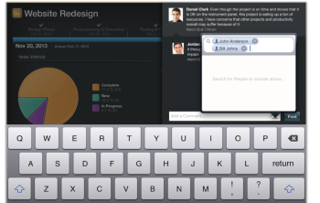

# Ajout de mises à jour dans [!DNL Adobe Workfront View]

Vous pouvez passer en revue et ajouter des mises à jour aux projets que vous êtes en train de réviser dans la [!DNL Adobe Workfront View] application.

Vous ne pouvez pas ajouter de mises à jour à des tâches ou à des problèmes dans [!DNL Workfront View].

## Exigences d’accès

Vous devez disposer de l’accès suivant dans [!DNL Workfront] pour effectuer les étapes de cet article :

<table style="table-layout:auto"> 
 <col> 
 </col> 
 <col> 
 </col> 
 <tbody> 
  <tr> 
   <td role="rowheader"><strong>[!DNL Adobe Workfront] plan*</strong></td> 
   <td> 
Tous
 </td> 
  </tr> 
  <tr> 
   <td role="rowheader"><strong>[!DNL Adobe Workfront] license*</strong></td> 
   <td> 
[!UICONTROL Review] ou version ultérieure
 </td> 
  </tr> 
 </tbody> 
</table>

&#42;Pour connaître le plan, le type de licence ou l’accès dont vous disposez, contactez votre [!DNL Workfront] administrateur.

## Ajout de mises à jour à un projet dans [!DNL Workfront View]

1. Depuis la page d’accueil de [!UICONTROL Vue Workfront], appuyez sur un projet pour y accéder.
1. (Facultatif) Ajoutez la variable **[!UICONTROL Mises à jour]** à votre vue.\
   Pour plus d’informations sur l’ajout de widgets à la vue de votre projet, voir [Mise à jour de widgets dans [!UICONTROL Détails du projet] view](../../../workfront-basics/mobile-apps/using-workfront-view/update-widgets-in-workfront-view.md).

1. Appuyez sur le bouton **[!UICONTROL Mises à jour]** icône (en bas à droite) ou (conditionnelle) la fonction **[+]** lors d’une mise à jour dans le **[!UICONTROL Mises à jour]** widget.\
   ![[!DNL workfront_view_updates_icon].png](assets/workfront-view-updates-icon-315x196.png)

1. Saisissez une mise à jour.
1. (Facultatif) Incluez d’autres personnes dans la mise à jour en appuyant sur le [!UICONTROL personnes] et en spécifiant le nom d’un autre utilisateur.\
   

1. Appuyer **[!UICONTROL Post]**.\
   La mise à jour s’affiche sur le projet, dans la variable **[!UICONTROL Mises à jour]** widget.
