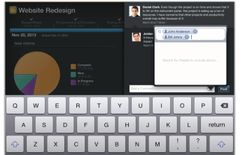

# Ajouter des mises à jour dans [!DNL Adobe Workfront View]

Vous pouvez réviser et ajouter des mises à jour aux projets que vous révisez dans l’application [!DNL Adobe Workfront View].

Vous ne pouvez pas ajouter de mises à jour aux tâches ou aux problèmes sur [!DNL Workfront View].

## Conditions d’accès

+++ Développez pour afficher les exigences d’accès aux fonctionnalités de cet article.

<table style="table-layout:auto"> 
 <col> 
 </col> 
 <col> 
 </col> 
 <tbody> 
  <tr> 
   <td role="rowheader"><strong>Package Adobe Workfront</strong></td> 
   <td> 
Tous
 </td> 
  </tr> 
  <tr> 
   <td role="rowheader"><strong>Licence Adobe Workfront</strong></td> 
   <td> 
   
Contributeur ou supérieur

   
Révision ou supérieur
 </td> 
  </tr> 
 </tbody> 
</table>

Pour plus d’informations, voir [Conditions d’accès requises dans la documentation Workfront](/help/quicksilver/administration-and-setup/add-users/access-levels-and-object-permissions/access-level-requirements-in-documentation.md).

+++

## Ajouter des mises à jour à un projet dans [!DNL Workfront View]

1. Dans la page d’accueil de [!UICONTROL Workfront View], appuyez sur un projet pour y accéder.
1. (Facultatif) Ajoutez le widget **[!UICONTROL Mises à jour]** à votre vue.\
   Pour plus d’informations sur l’ajout de widgets à votre vue de projet, voir [Mettre à jour les widgets dans la vue [!UICONTROL Détails du projet]](../../../workfront-basics/mobile-apps/using-workfront-view/update-widgets-in-workfront-view.md).

1. Appuyez sur l’icône **[!UICONTROL Mises à jour]** (en bas à droite) ou (le cas échéant) sur l’icône **[+]** sur une mise à jour dans le widget **[!UICONTROL Mises à jour]**.\
   ![[!DNL workfront_view_updates_icon].png](assets/workfront-view-updates-icon-315x196.png)

1. Saisissez une mise à jour.
1. (Facultatif) Incluez d’autres personnes dans la mise à jour en appuyant sur l’icône [!UICONTROL personnes] et en spécifiant le nom d’un autre utilisateur ou une autre utilisatrice.\
   

1. Appuyez sur **[!UICONTROL Publier]**.\
   La mise à jour apparaît sur le projet, dans le widget **[!UICONTROL Mises à jour]**.
