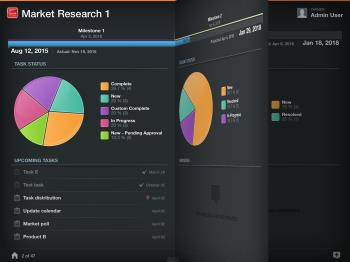

# Afficher les projets dans [!UICONTROL Adobe Workfront View]

Par défaut, la liste des projets affichée dans [!DNL Adobe Workfront View] affiche les 100 projets actifs les plus récents. La liste des projets n’est classée selon aucun critère.

## Conditions d’accès

+++ Développez pour afficher les exigences d’accès aux fonctionnalités de cet article.

<table style="table-layout:auto"> 
 <col> 
 </col> 
 <col> 
 </col> 
 <tbody> 
  <tr> 
   <td role="rowheader"><strong>Package Adobe Workfront</strong></td> 
   <td> 
Tous
 </td> 
  </tr> 
  <tr> 
   <td role="rowheader"><strong>Licence Adobe Workfront</strong></td> 
   <td> 
   
Contributeur ou supérieur

   
Révision ou supérieur
 </td> 
  </tr> 
 </tbody> 
</table>

Pour plus d’informations, voir [Conditions d’accès requises dans la documentation Workfront](/help/quicksilver/administration-and-setup/add-users/access-levels-and-object-permissions/access-level-requirements-in-documentation.md).

+++

## Modifier le regroupement dans votre liste de projets

1. Depuis la page d’accueil de [!DNL Workfront View], faites glisser les graphiques en haut de la liste de droite à gauche pour afficher tous les critères disponibles pour le regroupement de projets.\
   ![[!DNL workfront_view_project_groupings_Adobe].png](assets/workfront-view-project-groupings-adobe-350x255.png)

1. Appuyez sur un graphique en haut de la liste.\
   Sélectionnez parmi :

   * **[!UICONTROL Condition]**
   * **[!UICONTROL Propriétaire]**
   * **[!UICONTROL Groupe]**
   * **[!UICONTROL Portfolio]**
   * **[!UICONTROL Progression]**
   * **[!UICONTROL Statut]**
   * **[!UICONTROL Sponsor]**
Les projets sont désormais répertoriés, regroupés par les valeurs possibles de ces champs.\
      Vous pouvez regrouper les projets selon un critère à la fois. Les critères sont préchargés dans l’application dans les graphiques situés en haut de la liste des projets et ne peuvent pas être modifiés.

## Afficher les détails du projet

Pour afficher les détails d’un projet dans [!DNL Workfront View] :

1. À partir de la page d’accueil de [!DNL Workfront] View, touchez un projet dans la liste pour en afficher les détails.\
   Les informations du projet s’affichent dans les widgets disponibles à l’écran.\
   Vous pouvez afficher jusqu’à quatre widgets simultanément et supprimer et ajouter des widgets dans chaque projet afin d’afficher différentes informations sur le projet.\
   Pour plus d’informations sur l’ajout de widgets à la vue [!UICONTROL Détails du projet], voir [Mettre à jour des widgets dans la vue [!UICONTROL Détails du projet]](../../../workfront-basics/mobile-apps/using-workfront-view/update-widgets-in-workfront-view.md).

## Parcourir les projets dans [!DNL Workfront View]

1. Appuyez sur le nom d’un projet dans la liste des projets de l’application [!DNL Workfront View].\
   Les informations sur le projet s’affichent dans les widgets chargés à l’écran.\
   Pour plus d’informations sur l’ajout de widgets à la vue [!UICONTROL Détails du projet], voir [Mettre à jour des widgets dans la vue [!UICONTROL Détails du projet]](../../../workfront-basics/mobile-apps/using-workfront-view/update-widgets-in-workfront-view.md).

1. Balayez de droite à gauche pour afficher le projet suivant dans la liste.\
   Les mêmes widgets s’affichent pour chaque projet, à mesure que vous les parcourez.\
   
