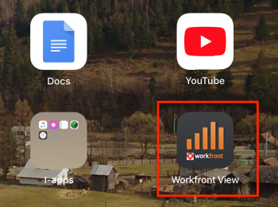

# Prise en main d’ [!DNL Adobe Workfront View]

Vous pouvez effectuer le suivi de la progression de vos projets lorsque vous êtes en déplacement en utilisant la variable [!DNL Adobe Workfront View] application mobile.

[!DNL Workfront View] est un outil de création de rapports. Vous ne pouvez pas apporter de modifications ou terminer le travail à l’aide de la variable [!DNL Workfront View] application. Vous pouvez uniquement afficher l’état de vos projets. Il est destiné aux responsables de projet ou de Portfolio, ainsi qu’aux autres parties prenantes du projet, de se connecter à une interface de haut niveau pour surveiller leurs projets.

Si vous devez terminer le travail, vous devez utiliser la variable [!DNL Workfront] application mobile disponible sur [!DNL iOS] et [!DNL Android] téléphones.

## Périphériques pris en charge et niveaux d’accès

Le [!DNL Workfront View] L’application est prise en charge uniquement pour [!DNL iPads].

Vous devez disposer de l’accès suivant dans [!DNL Workfront] pour accéder aux informations dans [!DNL Workfront View] et suivez les étapes décrites dans cet article :

<table style="table-layout:auto"> 
 <col> 
 </col> 
 <col> 
 </col> 
 <tbody> 
  <tr> 
   <td role="rowheader"><strong>[!DNL Adobe Workfront] plan*</strong></td> 
   <td> 
Tous
 </td> 
  </tr> 
  <tr> 
   <td role="rowheader"><strong>[!DNL Adobe Workfront] license*</strong></td> 
   <td> 
[!UICONTROL Review] ou version ultérieure
 </td> 
  </tr> 
 </tbody> 
</table>

Utilisateurs avec [!UICONTROL Demandeur] et [!UICONTROL Externe] Les licences ne peuvent pas accéder [!DNL Workfront] en utilisant la variable [!DNL Workfront View] application mobile.

&#42;Pour connaître le plan, le type de licence ou l’accès dont vous disposez, contactez votre [!DNL Workfront] administrateur.

## Téléchargez la [!DNL Workfront View] app

Vous devez disposer d’un [!DNL Apple Cloud] afin de pouvoir installer des applications sur un [!DNL iPad].

1. Accédez à App Store sur votre [!DNL iPad].
1. Rechercher **[!UICONTROL Vue Workfront]**, puis appuyez dessus lorsqu’il apparaît dans la liste.
1. Appuyez sur le bouton [!UICONTROL téléchargement depuis le cloud] pour installer l’application, puis suivez les étapes pour terminer l’installation.
1. Appuyer **[!UICONTROL Ouvrir]** pour ouvrir l’application.

## Connectez-vous à [!DNL Workfront View]

1. Accédez au **[!DNL Workfront View]** sur votre [!DNL iPad].\
   

1. (Facultatif) Appuyez sur **[!UICONTROL Essayer la démonstration]** pour faire une brève démonstration de l’application.\
   La démonstration présente des exemples de projets, et non les projets de votre [!DNL Workfront] système.\
   ![[!DNL workfront_view_demo].jpg](assets/workfront-view-demo-350x256.jpg)

1. Spécifiez votre **[!UICONTROL [!DNL Workfront]Nom d’utilisateur]**.
1. Spécifiez votre **[!UICONTROL [!DNL Workfront]Mot de passe]**.
1. Spécifiez la variable **[!UICONTROL [!DNL Workfront]URL]** de votre société.

   L’URL doit être au format suivant : `yourCompanyDomain.my.workfront.com`

1. Appuyer **[!UICONTROL CONNEXION]**.
