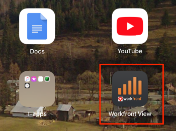

# Commencer avec [!DNL Adobe Workfront View]

Vous pouvez suivre la progression de vos projets lorsque vous êtes en déplacement en utilisant l’application mobile [!DNL Adobe Workfront View].

[!DNL Workfront View] est un outil de reporting. Vous ne pouvez pas apporter de modifications ou terminer le travail à l’aide de l’application [!DNL Workfront View]. Vous pouvez uniquement afficher le statut de vos projets. Elle est destinée aux personnes responsables de projet ou de portfolio, ainsi qu’aux autres parties prenantes du projet, pour leur permettre de se connecter à une interface de haut niveau pour surveiller leurs projets.

Si vous devez terminer le travail, vous devez utiliser l’application mobile [!DNL Workfront] disponible sur téléphones [!DNL iOS] et [!DNL Android].

## Appareils pris en charge et niveaux d’accès

L’application [!DNL Workfront View] est prise en charge uniquement pour [!DNL iPads].

Les utilisateurs et les utilisatrices avec des licences [!UICONTROL Demande] et [!UICONTROL Externe] ne peuvent pas accéder à [!DNL Workfront] en utilisant l’application mobile [!DNL Workfront View].

## Conditions d’accès

+++ Développez pour afficher les exigences d’accès aux fonctionnalités de cet article.

<table style="table-layout:auto"> 
 <col> 
 </col> 
 <col> 
 </col> 
 <tbody> 
  <tr> 
   <td role="rowheader"><strong>Package Adobe Workfront</strong></td> 
   <td> 
Tous
 </td> 
  </tr> 
  <tr> 
   <td role="rowheader"><strong>Licence Adobe Workfront</strong></td> 
   <td> 
   
Contributeur ou supérieur

   
Révision ou supérieur
 </td> 
  </tr> 
 </tbody> 
</table>

Pour plus d’informations, voir [Conditions d’accès requises dans la documentation Workfront](/help/quicksilver/administration-and-setup/add-users/access-levels-and-object-permissions/access-level-requirements-in-documentation.md).

+++

## Télécharger l’application [!DNL Workfront View]

Vous devez disposer d’un compte [!DNL Apple Cloud] pour installer des applications sur un [!DNL iPad].

1. Accédez à l’App Store sur votre [!DNL iPad].
1. Recherchez **[!UICONTROL Workfront View]**, puis appuyez sur l’application lorsqu’elle apparaît dans la liste.
1. Appuyez sur le bouton [!UICONTROL Télécharger à partir du cloud] pour installer l’application, puis suivez les étapes pour terminer l’installation.
1. Appuyez sur **[!UICONTROL Ouvrir]** pour ouvrir l’application.

## Se connecter à [!DNL Workfront View]

1. Accédez à l’application **[!DNL Workfront View]** sur votre [!DNL iPad].\
   

1. (Facultatif) Appuyez sur **[!UICONTROL Essayer la démo]** pour découvrir brièvement l’application.\
   La démonstration présente des exemples de projets, et non les projets de votre système [!DNL Workfront].\
   ![[!DNL workfront_view_demo].jpg](assets/workfront-view-demo-350x256.jpg)

1. Spécifiez votre nom d’utilisateur ou d’utilisatrice **[!UICONTROL [!DNL Workfront]]**.
1. Spécifiez votre mot de passe **[!UICONTROL [!DNL Workfront]]**.
1. Spécifiez l’URL **[!UICONTROL [!DNL Workfront]]** de votre entreprise.

   L’URL doit être au format suivant : `yourCompanyDomain.my.workfront.com`

1. Appuyez sur **[!UICONTROL SE CONNECTER]**.
