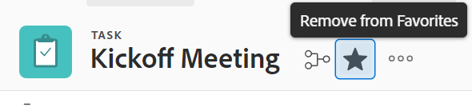

# Afficher et gérer les favoris

<!-- Audited: 5/2025 -->

Le menu [!UICONTROL Favoris] vous permet d’accéder rapidement aux éléments. Les éléments restent sur le menu [!UICONTROL Favoris] jusqu’à ce que vous les supprimiez. Le menu Favoris peut contenir jusqu’à 40 éléments.

## Conditions d’accès

+++ Développez pour afficher les exigences d’accès aux fonctionnalités de cet article.

Vous devez disposer des accès suivants pour effectuer les étapes de cet article :

<table style="table-layout:auto"> 
 <col> 
 </col> 
 <col> 
 </col> 
 <tbody> 
  <tr> 
   <td role="rowheader">[!DNL Adobe Workfront] plan</td> 
   <td> 
Tous
 </td> 
  </tr> 
  <tr> 
   <td role="rowheader">[!DNL Adobe Workfront] licence</td> 
   <td> 

      
Nouvelle : contributeur ou supérieure

      
Ou

      
Actuelle : demande ou niveau supérieur
 </td> 
  </tr> 
 </tbody> 
</table>

Pour plus de détails sur les informations contenues dans ce tableau, consultez [Conditions d’accès préalables dans la documentation Workfront](/help/quicksilver/administration-and-setup/add-users/access-levels-and-object-permissions/access-level-requirements-in-documentation.md).

+++

## Afficher un favori

Pour afficher un élément que vous avez précédemment ajouté comme favori :

1. Cliquez sur l’icône **[!UICONTROL Favoris]**  dans le coin supérieur droit d’une page [!DNL Adobe Workfront].

1. Dans la liste des **Favoris**, cliquez sur l’élément à afficher.

## Ajouter un élément comme favori

Vous pouvez ajouter des éléments récents ou la page active au menu [!UICONTROL Favoris].

* [Ajouter des éléments récents comme favoris](#add-recent-items-as-a-favorite)
* [Ajouter l’élément actif comme favori](#add-the-current-item-as-a-favorite)

### Ajouter des éléments récents comme favoris

1. Cliquez sur l’icône **[!UICONTROL Récents]**  dans le coin supérieur droit d’une page de la nouvelle expérience [!DNL Adobe Workfront].
1. Cliquez sur l’étoile en ligne avec l’élément que vous souhaitez enregistrer en tant que favori. L’élément récent s’affiche dans le menu **Favoris**.

   

### Ajouter l’élément actif comme favori

1. Accédez à la page que vous souhaitez ajouter en tant que favori.
1. Cliquez sur l’icône **[!DNL Favorites]**  dans le coin supérieur droit de la page, puis cliquez sur **[!UICONTROL Ajouter la page active]**.

   

   >[!NOTE]
   >
   >Si vous cliquez sur l’icône **[!UICONTROL Favoris]** sur un objet que vous avez déjà ajouté comme favori, l’objet sera supprimé du menu [!UICONTROL Favoris].\
   >

## Supprimer un élément du menu [!UICONTROL Favoris]

1. Cliquez sur l’icône **[!UICONTROL Favoris]**  dans le coin supérieur droit d’une page [!DNL Workfront].

1. Pointez sur l’élément à supprimer en tant que favori, puis cliquez sur le **X** à côté.

   Ou

   Si vous vous trouvez sur la page à supprimer en tant que favori, cliquez sur l’icône **[!UICONTROL Favoris]**  en regard du nom de l’objet pour le supprimer du menu **Favoris**.
