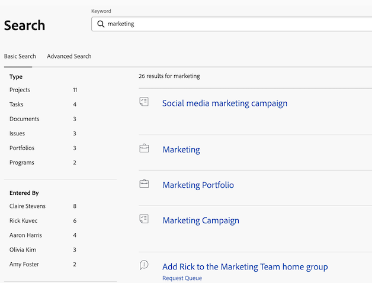

# Rechercher [!DNL Adobe Workfront]

<!-- Audited: 5/2025 -->

Vous pouvez facilement localiser des éléments dans [!DNL Adobe Workfront] en les recherchant lorsque vous ne vous souvenez pas de leur emplacement exact.

Vous pouvez voir la zone [!UICONTROL Recherche] dans le coin supérieur droit d’une page dans [!DNL Workfront].

Vous devez disposer des autorisations nécessaires pour afficher un objet avant de pouvoir le rechercher. Pour cette raison, les résultats de recherche varient d’un utilisateur ou d’une utilisatrice à l’autre.

## Conditions d’accès

+++ Développez cette section pour afficher l’accès nécessaire pour effectuer les étapes décrites dans cet article.

<table style="table-layout:auto"> 
 <col> 
 <col> 
 <tbody> 
  <tr> 
   <td role="rowheader">Package Adobe Workfront</td> 
   <td> 
Tous
 </td> 
  </tr> 
  <tr> 
   <td role="rowheader">Licence Adobe Workfront</td> 
   <td> 
Contributeur ou version ultérieure

   
Requête ou supérieure 

   </td> 
  </tr> 
  <tr> 
   <td role="rowheader">Configurations des niveaux d’accès</td> 
   <td> 
Accès en [!UICONTROL View] au type d’objet 
 
Note : si vous ne disposez toujours pas de l’accès, demandez à votre administrateur ou à votre administratrice [!DNL Workfront] si des restrictions supplémentaires concernant votre niveau d’accès ont été configurées. Pour plus d’informations sur la manière dont l’administration [!DNL Workfront] peut modifier votre niveau d’accès, consultez la section <a href="../../../administration-and-setup/add-users/configure-and-grant-access/create-modify-access-levels.md" class="MCXref xref">Créer ou modifier les niveaux d’accès personnalisés</a>.
</td> 
  </tr> 
  <tr> 
   <td role="rowheader">Autorisations d’objet</td> 
   <td> 
Vous devez disposer des autorisations nécessaires pour afficher un objet avant de pouvoir le rechercher.
 
Pour plus d’informations sur la demande d’accès supplémentaire, consultez la section <a href="../../../workfront-basics/grant-and-request-access-to-objects/request-access.md" class="MCXref xref">Demande d’accès aux objets</a>.
 </td> 
  </tr> 
 </tbody> 
</table>

Pour plus de détails sur les informations contenues dans ce tableau, voir [Conditions d’accès dans la documentation Workfront](/help/quicksilver/administration-and-setup/add-users/access-levels-and-object-permissions/access-level-requirements-in-documentation.md).

+++

## Comprendre le fontionnement de la fonction de recherche

### Objets pouvant être recherchés

Vous pouvez rechercher les objets suivants dans Workfront :

* Projets
* Tâches
* Problèmes
* Rapports
* Utilisateurs
* Modèles
* Documents
* Portefeuilles
* Programmes
* Tableaux de bord
* Entreprises
* Notes

### Champs pouvant être recherchés

Les champs qui peuvent être recherchés dépendent du type de recherche : recherche de base ou [!UICONTROL recherche avancée].

* **Recherche de base** : lors de la recherche d’objets dans une recherche de base, [!DNL Workfront] recherche du texte pouvant contenir vos mots-clés dans les champs suivants :

   * Noms d’objet
   * Descriptions
   * Champs de données personnalisées
   * Mises à jour
   * Noms de documents (dans des recherches de documents spécifiques et dans une recherche de base)

  Pour plus d’informations sur la recherche de base dans [!DNL Workfront], reportez-vous à la section suivante de cet article : [Recherche de base](#basic-search).

* **[!UICONTROL Recherche avancée]** : dans une [!UICONTROL Recherche avancée], vous pouvez configurer des filtres pour rechercher des champs qui ne sont pas disponibles dans la recherche de base. Par conséquent, la [!UICONTROL recherche avancée] vous permet de rechercher n’importe quel champ de l’objet.

  Pour plus d’informations sur la [!UICONTROL Recherche avancée], consultez la section suivante de cet article : [Recherche avancée](#advanced-search).

>[!NOTE]
>
>Pour effectuer une [!UICONTROL recherche avancée], vous devez sélectionner l’option [!UICONTROL Recherche avancée] au début de votre recherche. Vous ne pouvez pas affiner une recherche de base dans une recherche [!UICONTROL avancée].

## Comprendre les limites des recherches [!DNL Workfront]

Lorsque vous utilisez [!UICONTROL Rechercher] dans [!DNL Workfront], tenez compte des restrictions suivantes :

* Les recherches ne respectent pas la casse.
* [!DNL Workfront] ne corrige pas ou ne comprend pas les fautes de frappe.
* La recherche dans [!DNL Workfront] ne prend pas en charge les caractères génériques.
* La recherche dans [!DNL Workfront] prend en charge les recherches de mots partielles, mais pas les recherches de sous-chaînes.\
   Par exemple, le mot-clé de recherche « stand » renvoie des résultats comprenant le mot « standard », mais ne renvoie pas de résultats comprenant le mot « understand ».

## Rechercher plusieurs mots

Lorsque vous recherchez plusieurs mots et que vous voulez trouver des objets correspondant à tous ces mots, vous pouvez les entrer dans n’importe quel ordre.

Par exemple, rechercher « Démo marketing » (sans guillemets) trouve des objets portant les noms suivants :

* Démo marketing
* Marketing Démo
* Démo de l’analyse de marché (Market Analysis) de janvier

Les objets contennant « Marketing » dans le nom et « Démo » dans la description sont également trouvés.

Vous pouvez aussi ajuster les résultats de recherche qui s’affichent dans la zone [!UICONTROL Rechercher] en effectuant les actions suivantes :

<table style="table-layout:auto"> 
 <col> 
 <col> 
 <tbody> 
  <tr> 
   <td>Inclure des guillemets</td> 
   <td> 
Saisir les mots dans l’ordre correct entre guillemets doubles vous permet de ne trouver que les objets correspondant exactement à ces mots. Par exemple, rechercher « Démo marketing » (avec guillemets) trouve des objets portant les noms suivants :
 
    <ul> 
     <li> Démo marketing</li> 
     <li> Démo marketing de janvier</li> 
     <li>Plan de Démo marketing</li> 
    </ul> 
Mais cette recherche ne trouvera pas d’objet nommé « Marketing Démo ».
 </td> 
  </tr> 
  <tr> 
   <td>Inclure OR (OU)</td> 
   <td> 
Connecter des mots avec « OR » (sans guillemets) permet de ne trouver que les objets correspondant à au moins un des mots de la zone de [!UICONTROL Search]. Ces mots peuvent être saisis dans n’importe quel ordre. Par exemple, rechercher « Marketing OR Démo » (sans guillemets), trouve les objets portant les noms suivants :
 
    <ul> 
     <li> Démo de l’analyse du marché</li> 
     <li>Démo de l’analyse de marché (Market Analysis) de janvier</li> 
     <li>Démo</li> 
     <li>Analyse du marché (Market Analysis)</li> 
    </ul> 
Note : « OR » doit être en majuscules. Sinon, il est interprété comme un autre mot de l’expression que vous recherchez.
 </td> 
  </tr> 
  <tr> 
   <td>Inclure AND (ET)</td> 
   <td> 
Connecter des mots avec « AND » (sans guillemets) permet de ne trouver que les objets correspondant à tous les mots de la zone de [!UICONTROL Search]. Ces mots peuvent être saisis dans n’importe quel ordre. Par exemple, rechercher « Marketing AND Démo » (sans guillemets), trouve les objets portant les noms suivants :
 
    <ul> 
     <li>Démo marketing</li> 
     <li>Marketing Démo</li> 
     <li>Démo de l’analyse de marché (Market Analysis) de janvier</li> 
    </ul> 
Note : « AND » doit être en majuscules. Sinon, il est interprété comme un autre mot de l’expression que vous recherchez. Inclure « &amp; » (sans guillemets) ne recherche que les objets contenant l’esperluette.
 </td> 
  </tr> 
 </tbody> 
</table>

## Utiliser « Rechercher » dans [!DNL Workfront]

[!DNL Workfront] propose deux types de recherche : de base et avancée. Utilisez la recherche de base si vous souhaitez trouver des mots-clés dans les champs d&#39;objet communs tels que le nom ou la description. Pour trouver d’autres champs d’objet en utilisant des filtres, effectuez une [!UICONTROL recherche avancée].

* [Recherche simple](#basic-search)
* [Recherche avancée](#advanced-search)

### Recherche simple

Une recherche de base vous permet de rechercher des mots-clés dans tous les objets du système ou sur un seul objet à la fois (comme des projets). Ensuite, [!DNL Workfront] recherche ces mots-clés dans quelques champs spécifiques. Vous pouvez ensuite affiner vos résultats de recherche en fonction d’autres champs spécifiques à l’objet sélectionnés par [!DNL Workfront].

Pour obtenir la liste des champs spécifiques recherchés dans la recherche de base, reportez-vous à la section suivante de cet article : [Champs disponibles pour la recherche](#fields-available-for-search).

>[!NOTE]
>
>Pour effectuer une [!UICONTROL recherche avancée], vous devez sélectionner l’option [!UICONTROL Recherche avancée] au début de votre recherche. Vous ne pouvez pas affiner une recherche de base dans une recherche [!UICONTROL avancée].

* [Exécution d’une recherche de base](#perform-a-basic-search)
* [Affiner une recherche de base](#refine-a-basic-search)

#### Exécution d’une recherche de base

Vous pouvez effectuer une recherche de base de l’une des manières suivantes :

* Sur tous les objets du système (recherche générale).
* Sur un seul objet à la fois (recherche spécifique à un objet).

Pour effectuer une recherche de base, procédez comme suit :

1. Cliquez sur la loupe  dans le coin supérieur droit de la page.

1. (Facultatif) Pour rechercher un objet spécifique, cliquez sur le bouton **[!UICONTROL Tous]** et sélectionnez l’objet à rechercher.

   

1. Dans la zone **[!UICONTROL Rechercher]**, commencez à saisir les informations recherchées.
Pour plus d’informations sur les champs recherchés dans [!DNL Workfront], consultez la section suivante de cet article : [Présentation de la recherche](#understand-search).
   

   Quand vous saisissez du texte dans la barre de recherche, [!DNL Workfront] fait des suggestions basées sur votre historique de consultation et surligne en bleu le mot-clé que vous recherchez.

1. Si l’élément que vous recherchez s’affiche dans le menu de [!UICONTROL saisie semi-automatique], cliquez dessus.

   Ou

   Appuyez sur Entrée (Mac) ou [!UICONTROL Entrée] (Windows) sur votre clavier pour effectuer une recherche complète. Cette recherche interroge l’ensemble de la base de données au lieu des éléments que vous avez consultés le plus récemment et ouvre la page **Search**.

   Si vous avez effectué une recherche générale, [!DNL Workfront] renvoie des résultats pour tout objet qui correspond au terme de recherche dans l’un des champs recherchés, comme décrit dans la section [Comprendre le fonctionnement de la recherche](#understand-search). Les objets correspondant à votre recherche s’affichent dans une liste.

   >[!NOTE]
   >
   >Parfois, plusieurs variations d’un mot s’affichent dans la liste des éléments trouvés.\
   >Par exemple, la recherche de « marketing » affiche les objets qui contiennent « marketing » ou « market » dans le nom.

1. (Facultatif) Si votre recherche a généré trop de résultats, affinez-la comme décrit dans la section [Affiner une recherche de base](#refine-a-basic-search).

#### Affiner une recherche de base

Après avoir effectué une recherche de base, vous pouvez affiner la recherche.

Utilisez la barre d’outils située à gauche des résultats de votre recherche pour affiner les informations que vous recherchez.

Pour affiner une recherche, procédez comme suit :

1. (Le cas échéant) Si vous avez effectué une recherche générale, sélectionnez l’objet que vous recherchiez dans la liste des objets située dans le coin supérieur gauche de vos résultats.
1. Recherchez les champs disponibles pour les objets affichés dans la recherche dans la barre d’outils située à gauche de vos résultats. Les valeurs de chaque champ s’affichent, triées en fonction du nombre, dans la limite de 10 valeurs par champ.
1. Cliquez dans l’un des champs disponibles pour raccourcir la liste des résultats. Les sélections que vous effectuez sont mises en surbrillance en bleu et les valeurs de champ que vous ne sélectionnez pas sont masquées.
Les résultats affichés à droite sont mis à jour de manière dynamique après la sélection de chaque nouvelle valeur.

   

1. (Facultatif) Cliquez sur les valeurs sélectionnées pour les désélectionner et afficher à nouveau toutes les valeurs de chaque champ.

### [!UICONTROL Recherche avancée]

La [!UICONTROL Recherche avancée] vous permet d’effectuer une recherche à l’aide de champs et de filtres non disponibles dans la recherche de base. Par exemple, vous pouvez rechercher des projets avec une priorité spécifique ou un nom de personne propriétaire du document.

>[!NOTE]
>
>Pour effectuer une [!UICONTROL recherche avancée], vous devez sélectionner l’option [!UICONTROL Recherche avancée] quand vous commencez la recherche. Vous ne pouvez pas affiner une recherche de base dans une recherche [!UICONTROL avancée].

* [Utiliser la fonctionnalité [!UICONTROL Recherche avancée]](#use-advanced-search)

#### Utilisez la fonctionnalité [!UICONTROL Recherche avancée].

Vous pouvez utiliser la [!UICONTROL recherche avancée] pour filtrer votre recherche selon des critères spécifiques.\
Ce type de recherche est utile lorsque vous ne vous souvenez pas d&#39;un mot-clé associé à un objet, mais que vous connaissez des informations spécifiques sur cet objet (par exemple : priorité du projet, nom du propriétaire du document, etc.).

Pour effectuer une recherche avancée, procédez comme suit :

1. Dans l’angle supérieur droit d’une page de [!DNL Workfront], cliquez sur l’icône **[!UICONTROL Rechercher]** . Le menu **Rechercher** s’affiche.

1. Au bas du menu **Recherche**, cliquez sur **[!UICONTROL Recherche avancée]**. La page **Recherche** s’ouvre avec l’onglet **Recherche avancée** sélectionné par défaut.
   

1. Sélectionnez le type d’objet que vous recherchez. **[!UICONTROL Tâches]** est sélectionné par défaut.

   

1. (Facultatif) Saisissez un mot-clé dans le champ situé en haut de la liste.
1. (Facultatif) Basculez **[!UICONTROL Filtrer les résultats]** sur **Activé** pour créer un filtre afin d’affiner votre recherche. Cliquez sur **Appliquer** lorsque vous avez terminé.

1. Cliquez sur **[!UICONTROL Rechercher]**. Une liste des éléments correspondant à votre recherche s’affiche à droite de la barre d’outils **[!UICONTROL Recherche avancée]**.
