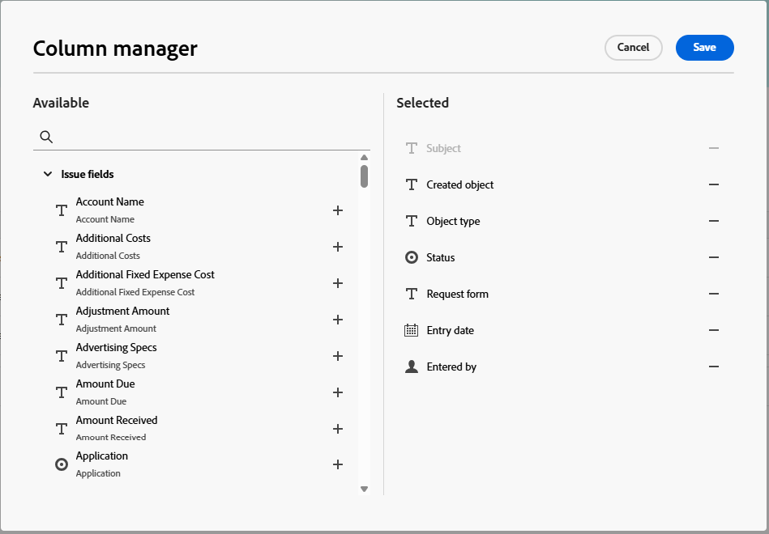
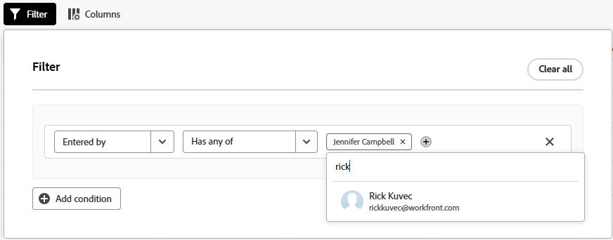
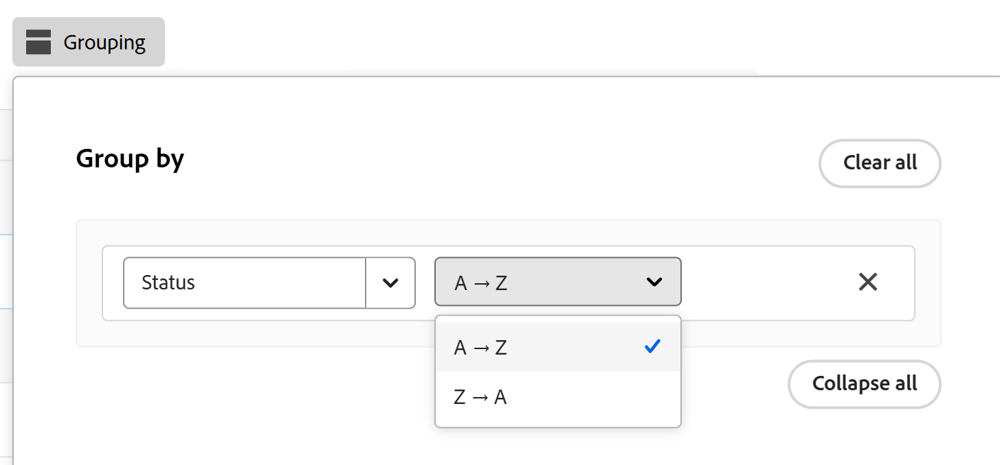

# Utiliser les listes améliorées

{{preview-fast-release-general}}

Des listes améliorées sont disponibles dans certaines parties d’Adobe Workfront. Ces listes utilisent un format de tableau pour afficher les éléments de liste et leur aspect est différent de celui des listes standard. La gestion des vues est également améliorée, notamment le filtrage, le regroupement, la gestion des colonnes et la recherche.

Pour plus d’informations sur les listes standard, voir [Prise en main des listes dans Adobe Workfront](/help/quicksilver/workfront-basics/navigate-workfront/use-lists/view-items-in-a-list.md).

>[!NOTE]
>
>Chaque liste améliorée peut être configurée différemment pour vous aider à afficher les données dont vous avez besoin. Chaque liste n’utilise pas toutes les fonctionnalités décrites dans cet article. En outre, certaines listes peuvent comporter des fonctionnalités spécifiques qui s’appliquent uniquement à cette liste.

## Conditions d’accès

+++ Développez pour afficher les exigences d’accès aux fonctionnalités de cet article.

<table style="table-layout:auto">
 <col> 
 <col>
 <tbody> 
  <tr> 
   <td>Package Adobe Workfront</td> 
   <td>
Tous
</td> 
  </tr> 
  <tr> 
   <td>Licence Adobe Workfront</td> 
   <td>
   
Contributeur ou supérieur

   
Requête ou supérieure
</td>
  </tr>
 </tbody> 
</table>

Pour plus d’informations, voir [Conditions d’accès requises dans la documentation Workfront](/help/quicksilver/administration-and-setup/add-users/access-levels-and-object-permissions/access-level-requirements-in-documentation.md).

+++

## Objets utilisant des listes améliorées

Vous trouverez ci-dessous certains types de listes d’objets Workfront qui utilisent le format de liste amélioré et certaines des zones où elles s’affichent par défaut lorsque vous disposez des droits pour afficher l’objet.

>[!NOTE]
>
>Cette liste n’est pas exhaustive. Chacune de ces listes d’objets peut également apparaître dans un rapport ou un tableau de bord. Par exemple, un rapport de requête ou un tableau de bord contenant un rapport de requête affiche également une liste de requêtes.

| Liste Workfront | Emplacement de la liste d’objets |
| --- | --- |
| Priorités | <ul><li>Accueil > sélectionnez l’icône Priorités dans le menu de gauche</li><li>Menu principal > Priorités</li></ul> |
| Liste des requêtes | <ul><li>Demandes (nouvelle expérience uniquement)</li><li>Widget Mes demandes sur l’Accueil</li></ul> |
| Listes de statuts, priorités, gravités et taux de change dans la configuration | <ul><li>Configuration > Préférences du projet > Statuts</li><li>Configuration > Préférences du projet > Priorités</li><li>Configuration > Préférences du projet > Gravités</li><li>Configuration > Préférences du projet > Taux de change</li></ul> |
| Liste des rapports | Les rapports (**utiliser des dossiers partageables** doivent être activés) |

## Ajouter des éléments à une liste améliorée

Selon la liste améliorée que vous consultez, effectuez l’une des opérations suivantes :

1. Cliquez sur le bouton bleu en haut à droite de la liste. Cette option ouvre une boîte de dialogue dans laquelle vous pouvez saisir des informations. Les données sont enregistrées en tant que nouvelle ligne dans le tableau.

   OU

1. Cliquez sur **Nouvelle ligne** au bas de la liste. Cette option ajoute une nouvelle ligne au tableau. Double-cliquez dans une cellule pour y saisir des informations. Chaque cellule représente un champ pour l’élément de liste. Les champs doivent exister avant de les voir dans la liste.

   Les listes améliorées prennent en charge les types de champs suivants :

   * Texte
   * Nombre
   * Devise
   * Date
   * Date et heure
   * Listes déroulantes à sélection unique/multiple
   * Frappe continue
   * Paragraphe
   * Personne désignée (une ou plusieurs)
   * Sélecteur de couleurs

   >[!NOTE]
   >
   >Chaque type de champ possède ses propres options de modification. Certains champs peuvent être en lecture seule.

## Modifier les éléments à l’aide de la barre d’actions

Vous pouvez utiliser la barre d’actions d’une liste améliorée pour modifier des éléments de la liste. Toutes les barres d’actions n’incluent pas les mêmes options. En outre, certaines listes peuvent ne pas vous permettre de sélectionner des éléments et la barre d’actions n’est pas disponible.

1. Cochez la case en regard d’un élément d’une liste améliorée.

   La barre d’actions s’affiche en bas de l’écran.

   >[!NOTE]
   >
   >Selon la liste que vous modifiez, vous pouvez sélectionner un ou plusieurs éléments pour utiliser la barre d’actions.

1. Cliquez sur une action de la barre pour modifier des éléments. Voici quelques exemples d’actions :

   * Afficher
   * Modifier
   * Supprimer

   Si aucune action n’est disponible pour l’élément sélectionné, la barre d’actions indique « Aucune action disponible ».

   

1. Pointez sur le champ principal d’un élément de liste, puis cliquez sur le menu **Plus**  pour afficher des actions supplémentaires. Certaines actions peuvent être spécifiques à cette liste.

   >[!TIP]
   >
   >Le champ principal s’affiche dans la première colonne de la liste.

   

## Personnaliser les colonnes

Selon les objets que vous consultez dans une liste améliorée, vous pouvez masquer, afficher ou réorganiser les colonnes de la liste.

1. Cliquez sur **Colonnes** au-dessus de la liste.

   

1. Utilisez les boutons pour afficher ou masquer des colonnes dans la liste.
1. Pour réorganiser les colonnes, cliquez sur l’icône **Faire glisser**  et déplacez une colonne vers l’emplacement souhaité. Le déplacement de colonnes modifie automatiquement la liste.

   >[!NOTE]
   >
   >Le champ principal est la première colonne de la liste. Il est fixe en première position et vous ne pouvez pas modifier sa colonne. Si le nombre de colonnes est important, le champ principal est figé à gauche et lorsque vous faites défiler l’écran horizontalement, il est toujours visible.
   >
   >L’icône en regard d’un nom de champ affiche le type de champ, tel que du texte ou un champ de date.

   Un indicateur s’affiche sur le bouton **Colonnes** lorsque des colonnes sont masquées. L’indicateur n’apparaît pas lorsque vous réorganisez les colonnes.

   

### Renommer les colonnes

Certaines colonnes vous permettent d’enregistrer un nom personnalisé pour le titre de la colonne.

1. Pointez sur la colonne, puis cliquez sur la flèche vers le bas et sélectionnez **Renommer**.

   

1. Dans la boîte de dialogue **Renommer**, saisissez le nom de la colonne dans le champ **Libellé personnalisé**, puis cliquez sur **Enregistrer**.

   Le nouveau nom de colonne apparaît dans la liste.

## Ajouter et supprimer des colonnes à l’aide du gestionnaire de colonnes

Vous pouvez utiliser le **Gestionnaire de colonnes** dans certaines listes améliorées pour ajouter et supprimer facilement des colonnes de la liste. Vous pouvez ajouter ou supprimer des champs système et personnalisés qui existent déjà dans Workfront sous forme de colonnes à une liste améliorée.

Pour ajouter et supprimer des colonnes :

1. Cliquez sur l’icône + dans le coin supérieur droit du tableau pour ouvrir la zone **Gestionnaire de colonnes**.
1. Recherchez un champ d’objet existant dans la colonne **Disponible**, puis cliquez sur + à droite du nom du champ pour l’ajouter à la colonne **Sélectionné**.
1. Cliquez sur - à droite d’un champ de la colonne **Sélectionné** pour le supprimer de la liste.

   >[!NOTE]
   >
   >Certains champs peuvent être corrigés et ne peuvent pas être supprimés.

   <!-- Add info about Properties and KPIs when something gets released with those options -->

1. Cliquer sur **Enregistrer**.

   

   La liste met à jour les colonnes en fonction des choix que vous avez effectués.

## Mise à jour des éléments de liste améliorés

Les éléments suivants sont des composants d’une liste améliorée :

* Vue : définit les colonnes, filtres et regroupements de la liste avec des paramètres prédéfinis
* Filtres : limite la quantité d’informations affichées dans la liste.
* Regroupements : organisez les éléments de la liste en fonction de champs communs
* Trier : organise les éléments d’une liste selon l’ordre que vous avez identifié pour un champ donné
* Rechercher : permet de trouver rapidement un élément à l’aide d’un mot-clé de recherche.

### Application et création de vues

>[!NOTE]
>
>Toutes les listes améliorées ne comportent pas tous les éléments décrits dans cette section.

Pour appliquer ou créer une vue :

1. Cliquez sur le menu déroulant **Vues** et sélectionnez une vue existante pour l’appliquer à la liste

   OU

   Cliquez sur **Nouvelle vue** pour en créer une.

1. (Conditionnel) Pour ajouter une nouvelle vue, saisissez un nom pour la vue, puis cliquez sur **Créer**.
1. (Facultatif) Masquez, affichez ou réorganisez les colonnes. Pour plus d’informations, voir [ Personnaliser les colonnes d’une liste améliorée ](#customize-columns-in-an-enhanced-list).
1. (Facultatif) Filtrez la liste. Pour plus d’informations, voir [ Filtrer les éléments dans une liste améliorée ](#filter-items-in-an-enhanced-list).
1. (Facultatif) Regroupez les éléments de la liste. Pour plus d’informations, voir [Regrouper des éléments dans une liste améliorée](#group-items-in-an-enhanced-list).

   Les modifications apportées aux vues sont enregistrées automatiquement. La prochaine fois que vous appliquerez cette vue, les paramètres de colonne et de filtre resteront tels que vous les avez définis.

### Filtrer les éléments dans une liste améliorée

>[!NOTE]
>
>Toutes les listes améliorées ne comportent pas tous les éléments décrits dans cette section.

Les filtres vous aident à réduire la quantité d’informations que vous affichez dans la liste.

1. Cliquez sur **Filtrer** au-dessus de la liste.
1. Dans la zone Filtre, cliquez sur **Ajouter une condition**.
1. Sélectionnez un champ en fonction duquel effectuer le filtrage.
1. Sélectionnez un modificateur de filtre, tel que « A l’un des », « N’a aucun des », « Est avant » ou « Est après ». Les options des modificateurs sont différentes selon le type de champ en fonction duquel vous effectuez le filtrage.
1. Sélectionnez la ou les valeurs du champ. Selon le type de champ en fonction duquel vous effectuez le filtrage, vous pouvez être invité à sélectionner l’élément dans une liste, à le rechercher ou à utiliser un calendrier pour sélectionner une période.

   

   Le filtre est automatiquement appliqué à la liste.

   >[!TIP]
   >
   >Pour appliquer un caractère générique à l’utilisateur actuel, sélectionnez **Moi (utilisateur connecté)** comme valeur du champ. Le filtre s’applique alors à l’utilisateur ou l’utilisatrice qui consulte la liste. Ce caractère générique est disponible dans les champs où la valeur est un utilisateur.

1. Cliquez sur **Ajouter une condition** pour ajouter une autre condition au filtre.

   Vous pouvez joindre plusieurs filtres à l’aide d’un connecteur ET ou OU.

1. Lorsque le filtre est appliqué, vous pouvez ouvrir à nouveau les options **Filtre** pour modifier les options de filtre ou effacer tous les filtres.

   Un indicateur apparaît sur le bouton **Filtrer** lorsqu&#39;un filtre est appliqué à la liste.

   

### Regrouper les éléments dans une liste améliorée

>[!NOTE]
>
>Toutes les listes améliorées ne comportent pas tous les éléments décrits dans cette section.

Les regroupements séparent les objets de la liste en zones selon des critères spécifiques.

Workfront fournit un nombre limité de regroupements prédéfinis que vous ne pouvez pas modifier.

1. Cliquez sur **Grouper** au-dessus de la liste.
1. Sélectionnez un regroupement pour organiser votre liste.

   

1. Cliquez sur **Tout réduire** pour afficher la liste avec tous les regroupements réduits. L’option par défaut consiste à afficher la liste avec tous les regroupements développés.
1. Lorsque le regroupement est appliqué, vous pouvez ouvrir à nouveau les options Regrouper pour réduire ou développer tous les regroupements à la fois, modifier le regroupement pour les regrouper selon un autre champ ou effacer tous les regroupements.

   

   Un indicateur apparaît sur le bouton **Regrouper** lorsqu&#39;un regroupement est appliqué à la liste.

   

### Tri dans une liste améliorée

>[!NOTE]
>
>Toutes les listes améliorées ne comportent pas tous les éléments décrits dans cette section.

Pour trier des colonnes individuelles :

1. Pointez sur la colonne, puis cliquez sur la flèche vers le bas et sélectionnez **Trier**.

   Une icône en regard d’un nom de colonne indique que la liste est triée en fonction des valeurs de cette colonne et du sens du tri.

   >[!NOTE]
   >
   >Selon la liste, certaines colonnes peuvent ne pas être triables.

   

Pour trier votre travail dans un regroupement :

1. Cliquez sur **Grouper**, accédez à la ligne du regroupement appliqué, cliquez sur la liste déroulante de tri, puis sélectionnez un ordre croissant ou décroissant.

   

### Recherche dans une liste améliorée

>[!NOTE]
>
>Toutes les listes améliorées ne comportent pas tous les éléments décrits dans cette section.

1. saisissez un mot-clé à utiliser pour la recherche dans la zone Rechercher située dans le coin supérieur droit de la liste. Les résultats sont mis en surbrillance dans la liste au fur et à mesure que vous saisissez.

   

   >[!NOTE]
   >
   >La recherche examine toutes les colonnes de tous les éléments de liste. Si la liste est longue, la recherche inclut des éléments que vous devrez peut-être faire défiler pour les voir. Lorsque la liste est filtrée, la recherche ne recherche que ce qui est actuellement affiché.

### Partager une vue

>[!NOTE]
>
>Toutes les listes améliorées ne comportent pas tous les éléments décrits dans cette section.

Dans la liste déroulante **Vues**, vous pouvez voir trois catégories de vues :

* **Vues système** : vues que l&#39;administrateur système vous a affectées. Vous ne pouvez pas partager de vues système.
* **Vues partagées** : vues qui ont été partagées avec vous par d&#39;autres utilisateurs.
* **Mes vues** : vues que vous avez créées et que vous pouvez partager avec d’autres utilisateurs. Vous pouvez partager des vues avec d’autres utilisateurs, équipes ou groupes.

Lorsque vous partagez une vue, tous les éléments de vue (colonnes, filtres et regroupements) sont inclus.

Pour partager une vue :

1. Dans la liste déroulante **Vues**, pointez sur la vue de **Mes vues** que vous souhaitez partager, cliquez sur le menu **Plus** , puis sur **Partager**.
1. Dans la boîte de dialogue Partager, saisissez les noms des utilisateurs, des équipes, des groupes, des sociétés ou des fonctions avec lesquels vous souhaitez partager la vue, puis sélectionnez-les dans la liste lorsqu’ils apparaissent.

   Vous pouvez accorder les autorisations suivantes aux destinataires :

   * **Affichage** : les utilisateurs et utilisatrices peuvent appliquer l’affichage à la liste, mais pas le partager.

     Lorsque les utilisateurs disposant d’un accès en lecture seule mettent à jour la vue, ces modifications sont enregistrées dans les préférences personnelles de l’utilisateur. Un point bleu sur le nom de la vue (dans le **Vues partagées** de l’utilisateur) indique que des mises à jour personnelles sont appliquées à la vue.

   * **Gérer** : les utilisateurs et utilisatrices peuvent renommer, partager ou supprimer la vue, et modifier ses éléments.

     Lorsque les utilisateurs disposant d&#39;un accès de niveau Gérer apportent des modifications à la vue, tous les utilisateurs qui ont la vue partagée avec eux verront ces mises à jour lorsque la vue sera appliquée à la liste.

1. Cliquez sur **Enregistrer**.

   Si vous partagez une vue avec un utilisateur et que vous supprimez ensuite cet accès, la vue est supprimée de la **Vues partagées** de l&#39;utilisateur. Si la vue partagée est appliquée à la liste lorsque l’accès de l’utilisateur est supprimé, la vue système par défaut est appliquée.

### Copier une vue

>[!NOTE]
>
>Toutes les listes améliorées ne comportent pas tous les éléments décrits dans cette section.

Lorsqu’une vue est partagée avec vous et que vous n’avez pas l’autorisation de la modifier, vous pouvez la copier et l’enregistrer sous un nouveau nom. Vous devez d&#39;abord apporter des modifications à la vue avant de pouvoir la copier.

1. Dans la liste déroulante Vues, passez le curseur sur la vue dans **Vues partagées** que vous souhaitez copier, cliquez sur le menu **Plus** , puis sur **Copier avec les préférences**.

   Une nouvelle vue est créée automatiquement. Il utilise le nom de la vue d&#39;origine avec (copier) à la fin et il apparaît dans la section **Mes vues** des vues.

   Vous êtes le propriétaire de cette vue et vous pouvez la renommer, la modifier, la partager ou la supprimer. Si le propriétaire de la vue d’origine supprime votre accès partagé à cette vue, vous avez toujours accès à cette vue que vous avez créée.

   >[!NOTE]
   >
   >L’option **Copier avec les préférences** n’est disponible que lorsque vous avez apporté des modifications à une vue qui a été partagée avec vous.

### Réinitialisation d’une vue

>[!NOTE]
>
>Toutes les listes améliorées ne comportent pas tous les éléments décrits dans cette section.

Lorsqu’une vue est partagée avec vous et que vous n’avez pas l’autorisation de la modifier et que vous la mettez à jour, vous pouvez la réinitialiser à la vue d’origine.

1. Dans la liste déroulante **Vues**, passez le curseur sur la vue dans **Vues partagées** à réinitialiser, cliquez sur le menu **Plus** , puis cliquez sur **Réinitialiser aux valeurs par défaut**.

   Les éléments d’affichage (colonnes, filtres et regroupements) sont réinitialisés à leurs paramètres d’origine qui ont été partagés avec vous.

   >[!NOTE]
   >
   >L&#39;option **Réinitialiser aux valeurs par défaut** n&#39;est disponible que lorsque vous avez apporté des modifications à une vue partagée avec vous.

   

